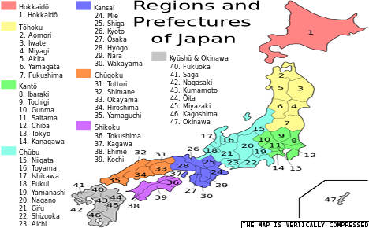
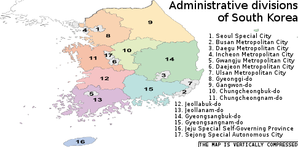

# Cooperation
> 2020.07.17 [🚀](../index/index.md) [despace](index.md) → [Contact](contact.md), [Persons](person.md)

[TOC]

---

 

> And these people forbid us to pick our noses!

   1. [ALPO](zz_alpo.md) — Association of Lunar & Planetary Observers
   1. [CCSDS](ccsds.md) — международный Консультативный Комитет по косм. системам передачи данных.
   1. [IAF](zz_iaf.md) — International astronautical federation, Международная астронавтическая федерация.
   1. [Project Management Institute](project_management_institute.md)
   1. [SEDS](zz_seds.md) — Students for the Exploration & Development of Space.
   1. [Space Generation Advisory Council](zz_sgac.md) (SGAC) represent students & young space professionals to the United Nations, States, & space agencies.
   1. [Synergy Moon](synergy_moon.md)
   1. [Болото](swamp.md)
   1. [Worldview in different countries](wwidc.md)

For the person's info page see **[Persons](person.md)**.

|*Агентство*|*Бюджет, $ млн*|*Год*|*Примечание*|
|:--|:--|:--|:--|
|США, [NASA](zz_nasa.md)|17 700|2013, прогноз| |
|Европа, [ESA](zz_esa.md)|5 500|2012|€ 4 020 100 млн|
|Россия, [Роскосмос](zz_roskosmos.md)|4 700|2014|₽ 165 800 млн|
|Япония, [JAXA](zz_jaxa.md)|2 460|2010|¥ 229 000 млн|
|Китай, [CNSA](zz_cnsa.md)|1 300|2009, оценка| |
|Индия, [ISRO](zz_isro.md)|1 200|2010 ‑ 2011| |
|Канада, [CSA](zz_csa.md)|425|2010 ‑ 2011| |
|Корея Южная, [KARI](zz_kari.md)|366|2007| |
|Алжир, [ASAL](zz_asal.md)|360|2002| |
|Украина, [ГКА](zz_nkau.md)|300| |
|Аргентина, [CONAE](zz_conae.md)|180|2014| |

 

## ± Australia

(**E**)ducation / (**N**)on‑profit・(**L**)aunch services・(**P**)romote・(**R**)&D&Manufacture / (**C**)onsulting・(**D**)ata provider

|*・Organization (AU)・*|*E*|*L*|*P*|*R*|*D*|*Industry*|
|:--|:--|:--|:--|:--|:--|:--|
|【[ASRI](zz_asri.md)】|·|·|·|·|·|Австралийский институт космических исследований|
|【[CSIRO](zz_csiro.md)】|·|·|·|·|·|Government agency responsible for scientific research|
|[ANU](zz_anu.md)|·|·|·|·|·|Australian National University|
|[Arlula](zz_arlula.md)|·|·|·|·|·|Provides a single point of access for a global network of sats imagery|
|[ASL](zz_asl.md)|·|·|·|·|·|Australia Space Launch|
|[AYAA](zz_ayaa.md)|N|·|·|·|·|Promote education, awareness, involvement in the A/S industry to youth|
|[Fleet Space Tech.](zz_fleet_space_tech.md)|·|·|·|·|·|IoT with nanosat constellation|
|[Gilmour Space Tech.](zz_gilmour_st.md)|·|·|·|·|·|Develop/launching low cost hybrid LV for small satellites to LEO|
|[HEO Robotics](zz_heo_robotics.md)|·|·|·|·|·|Acquire imagery of sats, space‑debris, resource‑rich asteroids with nanosats|
|[Myriota](zz_myriota.md)|·|·|·|·|·|IoT with nanosat constellation|
|[Optus](zz_optus.md)|·|·|·|·|·|Mobile, telephony, internet, satellite, entertainment & biz network services|
|[Saber Astronautics](zz_saber_an.md)|·|·|·|·|·|Model the interaction between SC telemetry & the space environment|
|[SERC](zz_serc.md)|·|·|·|·|·|Removal of orbital debris|
|[Southern Launch](zz_southern_launch.md)|·|·|·|·|·|Infrastructure/logistics support for (sub)orbital launches|
|[Space Services AU](zz_space_services_au.md)|·|·|·|C|·|Modelling, simulation, system analysis|

 

## Canada
(**E**)ducation / (**N**)on‑profit・(**L**)aunch services・(**P**)romote・(**R**)&D&Manufacture / (**C**)onsulting・(**D**)ata provider

|*・Organization (CA)・*|*E*|*L*|*P*|*R*|*D*|*Industry*|
|:--|:--|:--|:--|:--|:--|:--|
|【[CSA](zz_csa.md)   (QC)】|·|·|·|·|·|Canadian Space Agency|
|[ADGA](zz_adga.md)   (ON)|·|·|·|C|·|Advanced technology solutions, professional engineering & consultancy|
|[AQST Canada](zz_aqst_ca.md)   (QC)|·|·|·|R|·|GEO sats, electric propulsion, materials solutions, remote sensing, robotics|
|[AIAC](zz_aiac.md)   (ON)|·|·|P|·|·|Aerospace Industries Association of Canada|
|[AlbertaSat](zz_albertasat.md)   (AB)|N|·|·|R|·|(Student community) CubeSats R&D|
|[August IST](zz_august_ist.md)   (ON)|E|·|·|R|·|Space infrastructure, R&D, education, commercialization of innovative solutions|
|[Baryon Dynam.](zz_baryon_dyn.md)   (ON)|·|·|·|R|·|Power & space propulsion, engineering designs & expertise|
|[BRASS](zz_brass.md)   (ON)|E|·|P|C|·|Mission design & analysis & planning, Operations, Project mgmt & consultancy|
|[C-CORE](zz_c_core.md)   (ON)|·|·|·|C|·|Risks mitigation, remote sensing systems, ice/geotechnical engineering|
|[C6 Launch](zz_c6_launch.md)   (ON)|·|L|·|R|·|Launch services, Launcher design for CubeSats|
|[Calian AT](zz_calian_at.md)   (SK,QC)|·|·|·|·|·|R&D & integration of products & services in comms, test & control apps for comm sats|
|[Canadensys](zz_canadensys.md)   (ON)|·|·|·|R|·|Cubesats, rovers, SC systems, avionics, sensors|
|[CASI](zz_casi.md)   (ON)|E|·|P|·|·|Canadian Aeronautics & Space Institute|
|[CCERA](zz_ccera.md)   (ON)|E|·|·|·|·|Canadian Center for Experimental Radio Astronomy|
|[Columbiad](zz_columbiad.md)   (ON)|·|L|·|·|·|Commercial low‑cost space launch|
|[Concordia Univ.](zz_concordia_univ.md)   (QC)|E|·|·|·|·|Higher education|
|[CPSX](zz_cpsx.md)   (ON)|E|·|P|·|·|Planetary science, exploration research, training|
|[CSS](zz_css.md)   (ON)|N|·|P|·|·|Sponsorship & promotion for Canadians in the space sector|
|[Deltion Ltd](zz_deltion.md)   (ON)|·|·|·|R|·|Technology dev./improvement mostly for automation & robotics, Moon mining|
|[DSS](zz_dss.md)   (NS)|N|·|·|R|·|CubeSats development. Student community|
|[EarthDaily](zz_earthdaily.md)   (BC)|·|·|·|R|D|Remote sensing, Geospatial information|
|[Euroconsult](zz_euroconsult.md)   (QC)|·|·|·|C|·|Strategic, research, summits, training programs|
|[Geocentrix Tech.](zz_geocentrix_tech.md)   (BC)|·|·|·|C|·|Satellite/Launch mission design, analysis, operations, management, consulting|
|[GHGSat](zz_ghgsat.md)   (QC)|·|·|·|R|·|Greenhouse gases monitoring, gas sensors & imaging interferometers for Cubesats|
|[Globvision](zz_globvision.md)   (QC)|·|·|·|R|·|Software for spacecraft, support & automate the design|
|[Honeywell A/S](zz_honeywell_as.md)   ()|·|·|·|R|·|Software, signal & data processing, flight & ground operations|
|[Kepler Comms](zz_kepler_comms.md)   (ON)|·|·|·|R|·|CubeSats for global comms & IoT, antennas, data retranslation|
|[Lassonde SoE](zz_lassonde_soe.md)   (ON)|E|·|·|·|·|Higher education|
|[Launch Canada](zz_launch_ca.md)   ()|N|·|·|R|·|(Student community) LV & small sats building|
|[Luna D&I](zz_luna_dni.md)   (ON)|·|L|·|·|·|Launch & support for experiments in space|
|[Macfab](zz_macfab.md)   (ON)|·|·|·|R|·|ADCS, structures, comms/electronics, sensors, propulsion, separation systems|
|[Magellan A/S](zz_magellan_as.md)   (ON)|·|·|·|R|·|Satellite's R&D, small sat bus platform, ground facilities|
|[MCSS Inc](zz_mcss_inc.md)   (ON)|·|·|·|R|·|Software, simulation, mission operations, onboard autonomy, & AI|
|[MDA](zz_mda.md)   (ON,QC)|·|·|·|R|·|Robotics, Space operations, Ground stations, Sat systems, Software|
|[MLS](zz_mls.md)   (NS)|·|L|·|·|·|Launch services using Cyclone-4M LV in Nova Skotia|
|[MSCI](zz_msci.md)   (ON)|·|·|·|R|·|Reaction wheels, rate measurement units, microsats, attitude control systems|
|[NGC A/S](zz_ngc_as.md)   (QC)|·|·|·|R|·|Software for GNC, simulation, data processing|
|[Northstar ESI](zz_northstar_esi.md)   (QC)|·|·|·|R|·|Monitor space (object tracking), from space, via a sat constellation|
|[PolyOrbite](zz_polyorbite.md)   (QC)|N|·|·|R|·|CubeSat's R&D. Student society|
|[Pratt & Whitney](zz_pratt_n_whitney.md)   (QC)|·|·|·|R|·|Engines, gas turbines|
|[Satcan](zz_satcan.md)   (ON)|N|·|·|C|·|Engineering & business consultancy for sat telecom & space tech sectors|
|[SEDS Canada](zz_seds.md)   (ON)|N|·|P|·|·|(Student community) Promoting Exploration & Development of Space|
|[Sinclair I/P](zz_sinclair_ip.md)   (ON)|·|·|·|R|·|Star trackers, reaction wheels, optical comms, software, training & expertise|
|[SpaceRyde](zz_spaceryde.md)   (ON)|·|L|·|R|·|On‑schedule, dedicated launch for CubeSats using balloons|
|[Space Concordia](zz_space_concordia.md)   (QC)|N|·|·|R|·|(Student community) CubeSats, small rockets, robots|
|[Space Engine S.](zz_space_engs.md)   (AL)|·|·|·|R|·|SSTO propulsion, pumps, compressors, gear boxes, Permanent Magnet Motors|
|[SkyWatch](zz_skywatch.md)   (ON)|·|·|·|C|D|Providing commercial satellite imagery|
|[SSCL](zz_sscl.md)   (ON)|·|·|·|C|·|Consulting for space policy, planning, strategy, & technology|
|[Telecan Space](zz_telecan_space.md)   (QC)|·|·|·|C|·|Consulting, Training, Thermal R&D & testing|
|[Telesat](zz_telesat.md)   (ON)|·|·|·|R|D|Satellite communications & integration services, satellite operator|
|[Thales Canada](zz_thales.md)   (All)|·|·|·|R|·|Satellite & LV hardware|
|[Thoth Tech.](zz_thoth_tech.md)   (ON)|·|·|·|R|·|Cameras, In‑rbit objects tracking, thermo‑vac & vibr. tests, mission planning|
|[UTIAS](zz_utias.md)   (ON)|E|·|·|R|·|Research for space mechatronics, robotics, microsats, fluid dynamics|
|[Wyvern Space](zz_wyvern.md)   (AB)|·|·|·|C|D|Providing commercial satellite imagery from small sats|
|[Xiphos](zz_xiphos.md)   (QC)|·|·|·|R|·|CPUs (OBCs), Firmware & Software|
|**・ Not space ・**|•|•|•|•|•|Avant Aerospace, CAE;  *Org. lists:* [spaceq.ca ⎆](http://www.spaceq.ca/canadian-space-companies/), [aiac.ca ⎆](https://aiac.ca/product-categories/space-systems/#satellite-systems-components), [thecanadianencyclopedia.ca ⎆](https://www.thecanadianencyclopedia.ca/en/article/aerospace-industry)|

 

## ✘ China

(**E**)ducation / (**N**)on‑profit・(**L**)aunch services・(**P**)romote・(**R**)&D&Manufacture / (**C**)onsulting・(**D**)ata provider

|*・Organization (CN)・*|*E*|*L*|*P*|*R*|*D*|*Industry*|
|:--|:--|:--|:--|:--|:--|:--|
|【[CNSA](zz_cnsa.md)】|·|·|·|·|·|Китайское национальное космическое управление|
|[LandSpace ](zz_landspace.md)|·|L|·|R|·|·|Design, manufacturing & operations of small & medium LV|

 

## ✘ Europe

(**E**)ducation / (**N**)on‑profit・(**L**)aunch services・(**P**)romote・(**R**)&D&Manufacture / (**C**)onsulting・(**D**)ata provider

|*・Organization (EU)・*|*E*|*L*|*P*|*R*|*D*|*Industry*|
|:--|:--|:--|:--|:--|:--|:--|
|【[CNES](zz_cnes.md)   (FR)】|·|·|·|·|·|Французское космическое агентство|
|【[DLR](zz_dlr.md)   (GR)】|·|·|·|·|·|Германское космическое агентство|
|【[ESA](zz_esa.md)   (EU)】|·|·|·|·|·|Исследование космоса. [Роскосмос](zz_roskosmos.md) и  ГНИО в одном лице|
|【[ESTEC](zz_estec.md)   (NL)】|·|·|·|·|·|Разработка и создание космических технологий и КА|
|【[SSO](zz_sso.md)   (CH)】|·|·|·|·|·|Swiss Space Office, national space program of Switzerland|
|【[UKSA](zz_uksa.md)   (UK)】|E|L|P|R|·|UK Space Agency|
|[AAC CS](zz_aac_cs.md)   (SE)|·|·|·|·|·|Кубсаты, малые КА, СЧ|
|[ADS](zz_ads.md)   (GR)|·|·|·|·|·|Military Aircraft; [SCS](scs.md), Electronics, Comms, Intelligence, Security|
|[Airbus](zz_airbus.md)   (FR)|·|·|·|·|·|…|
|[ARCA Dynamics](zz_arca_dymanics.md)   (IT)|·|·|·|·|·|Cubesats, GNC, space robotics, AI|
|[ASP Equipment](zz_asp_equipment.md)   (DE)|·|·|·|R|·|Power: DC/DC converters, IPU, PCDU, EPC, propulsion power|
|[Astrocast](zz_astrocast.md)   (CH)|·|·|·|·|·|Satellite operator, constellation of nano‑sats on LEO, IoT communications|
|[AvalonSpace](zz_avalonspace.md)   (UK)|·|L|·|·|·|Green & cost‑effective UK launches|
|[B2Space](zz_b2space.md)   (UK)|·|·|·|·|·|Launch services (balloon & LV) for small‑micro sats|
|[Bradford Eng.](zz_bradford_eng.md)   (NL)|·|·|·|·|·|[СУ](cs.md) КА: [ДМ](iu.md), [СД](sensor.md), смесители топлива|
|[ClearSpace SA](zz_clearspace_sa.md)   (CH)|·|·|·|R|·|Space debris remova: technologies & services|
|[Cobham](cobham.md)   (UK)|·|·|·|·|·|СЧ КА, процессоры|
|[CUNI](zz_cuni.md)   (CZ)|·|·|·|·|·|Карлов университет. Один из старейших университетов мира|
|[Disrupt Space](zz_disrupt_space.md)   (DE)|N|·|P|·|·|Startup accelerator, entrepreneurship, & community|
|[Edinburgh Univ.](zz_edinburgh_univ.md)   (UK)|·|·|·|·|·|University of Edinburgh|
|[Effective Space](zz_effective_space.md)   (UK)|·|·|·|·|·|Life‑extension & other in‑orbit services for satellites|
|[ESRIC](zz_esric.md)   (LU)|·|·|·|·|·|…|
|[Euroconsult](zz_euroconsult.md)   (FR)|·|·|·|C|·|Strategic, research, summits, training programs|
|[EU Space Found.](zz_eu_space_foundation.md)   (PL)|·|·|P|·|·|Promote knowledge in science, engineering, technology & mathematics|
|[GAUSS Srl](zz_gauss_srl.md)   (IT)|E|·|·|R|·|Cubesats, GS operations, space debris observation|
|[Hisdesat](zz_hisdesat.md)   (ES)|·|·|·|·|·|…|
|[IA](ia.md)   (PT)|·|·|·|·|·|Instituto de Astrofísica e Ciências do Espaço|
|[Iceye](iceye.md)   (FL)|·|·|·|·|·|Разработка и создание микроспутников и кубсатов|
|[InnovaSpace](zz_innovaspace.md)   (UK)|E|·|P|·|·|Promote/conduct R&D, education, innovations for humanity in space|
|[Int. Space Univ.](zz_int_space_univ.md)   (FR)|E|·|·|·|·|Space education for a changing world|
|[IRAP](zz_irap.md)   (FR)|·|·|·|·|·|Research Institute in Astrophysics & Planetology|
|[IRF](zz_irf.md)   (SE)|·|·|·|·|·|Фундам. исследования косм. физики и физики атмосферы|
|[IRSPS](zz_irsps.md)   (IT)|·|·|·|·|·|…|
|[ISU](zz_isu.md)   (FR)|E|·|·|·|·|…|
|[Karman Project](zz_karman_project.md)   (DE)|N|·|P|·|·|Connecting people|
|[LATMOS](zz_latmos.md)   (FR)|·|·|·|·|·|Фундам. исследования наземных и планетных атмосфер|
|[Leonardo](leonardo.md)   (IT)|·|·|·|·|·|…|
|[Libre space](zz_libre_space_f.md)   (GR)|N|·|P|·|·|To promote, advance, develop libre technologies & knowledge for space|
|[LMD](lmd.md)   (FR)|·|·|·|·|·|…|
|[LuxSpace Sarl](zz_luxspace.md)   (LU)|·|·|·|R|·|Components & technolofy, microsats, apps & services|
|[Moon Village As.](zz_moon_village_a.md)   (AT)|N|·|·|·|·|Global info‑forum for gov./industry/academia, etc. for dev. of the Moon Village|
|[Morpheus Space](zz_morpheus_space.md)   (DE)|·|·|·|R|·|Electric propulsion & Artificial Intelligence|
|[Nammo](nammo.md)   (NO)|·|·|·|·|·|Двигатели|
|[Neutron Star S.](zz_dlr.md)   (GR)|·|·|·|·|·|Electric propulsion (EP) systems & subsystems|
|[OHB SE](zz_ohb_se.md)   (DE)|·|·|·|·|·|Satellites, exploration, human spaceflight|
|[Open Cosmos](zz_open_cosmos.md)   (UK)|·|·|·|·|·|R&D satellites|
|[OPC LAM](zz_opc_lam.md)   (GR)|·|·|·|·|·|Разработка и создание двигателей, ДУ|
|[OQ Technology ](zz_oq_technology.md)   (LU)|·|·|·|R|·|Sats constellation for IoT|
|[Oxford Univ.](oxford_univ.md)   (UK)|·|·|·|·|·|…|
|[Paris Obs.](paris_obs.md)   (FR)|·|·|·|·|·|…|
|[QitetiQ](zz_qitetiq.md)   (UK)|·|·|·|·|·|Communications & security, spacecraft & subsystems, spaceflight training|
|[PLD Space](zz_pld_space.md)   (ES)|·|L|·|R|·|Reusable (sub)orbital LV for small sats ([MIURA](miura.md))|
|[PTScientists](ptscientists.md)|·|·|·|·|·|…|
|[RUAG Space](ruag_space.md)   (SE)|·|·|·|·|·|Разработка/создание электроники, механизмов РН, КА|
|[Saft](zz_saft.md)   (FR)|·|·|·|·|·|Элементы электропитания|
|[SES Satellites](zz_ses_satellites.md)   (LU)|·|·|·|·|·|Deliver video & data solutions, LEO/MEO sats|
|[SGAC](zz_sgac.md)   (AT)|·|·|·|·|·|Represent students & young space professionals to the United Nations|
|[Sodern](zz_sodern.md)   (FR)|·|·|·|·|·|…|
|[Solar MEMS](zz_solarmems.md)   (ES)|·|·|·|·|·|СД|
|[Sorbonne Univ.](sorbonne_univ.md)   (FR)|·|·|·|·|·|…|
|[Space Expl. Inst.](zz_space_explor_inst.md)   (CH)|N|·|·|·|·|Developing space exploration activities, instruments|
|[Space Forge](zz_space_forge.md)   (UK)|·|·|·|R|·|Reusable sats for material manufacturing in space|
|[Space Mining T.](zz_space_mintech.md)   (EU)|·|·|·|·|·|Moon & asteroids mining|
|[Swedish SC](swedish_sc.md)   (SE)|·|·|·|·|·|КА, кубсаты, аэростаты, НС|
|[Tas‑I](zz_tas_i.md)   (FR)|·|·|·|·|·|…|
|[Terma A/S](zz_terma.md)   (DK)|·|·|·|·|·|…|
|[TU Delft](tu_delft.md)   (NL)|·|·|·|·|·|…|
|[UCL](zz_ucl.md)   (UK)|·|·|·|·|·|…|
|[UEF SAV](zz_uef_sav.md)   (SK)|·|·|·|·|·|Ядерная, субатомная физика, физика космоса, биофизика|
|[UFA](zz_ufa.md)   (CZ)|·|·|·|·|·|…|
|[UNIBE](zz_unibe.md)   (CH)|·|·|·|·|·|…|
|[UVSQ](uvsq.md)   (FR)|·|·|·|·|·|…|
|[Waven](zz_waven.md)   (PL)|·|·|·|R|·|Energy harvesting. Alternative to photovoltaics & RTG. Consumption reducing|
|[Zero 2 Infinity](zz_zero_2_infinity.md)   (IT)|·|L|·|R|·|Space transportation, launch small sats|
|[Zielona Univ.](zz_zielona_univ.md)   (PL)|E|·|·|·|·|…|

 

## ✘ India

(**E**)ducation / (**N**)on‑profit・(**L**)aunch services・(**P**)romote・(**R**)&D&Manufacture / (**C**)onsulting・(**D**)ata provider

|*・Organization (IN)・*|*E*|*L*|*P*|*R*|*D*|*Industry*|
|:--|:--|:--|:--|:--|:--|:--|
|【[ISRO](zz_isro.md)】|·|·|·|·|·|Индийское национальное космическое агентство|
|[BSIP](zz_bsip.md)|·|·|·|·|·|Birbal Sahni Institute of Palaeosciences|
|[Skyroot A/S](zz_skyroot_as.md)|·|·|·|·|·|<mark>TBD</mark> Launch vehicles|
|[Space Dev. Network](zz_space_dev_netw.md)|·|·|·|·|·|<mark>TBD</mark> Space Development Network|
|[Space Dev. Nexus](zz_sd_nexus.md)|N|·|P|·|·|Various space developments, integration, colonization|
|[Synergy Moon](zz_synergy_moon.md)|·|·|·|R|·|Lunar rover|
|[Team Indus](team_indus.md)|·|·|·|·|·|<mark>TBD</mark>|
|[Timewarp Space](zz_timewarp_space.md)|·|L|·|R|·|LV for small sats|
|[UPES](zz_upes.md)|·|·|·|·|·|University of Petroleum & Energy Studies|

 

## ± Israel

(**E**)ducation / (**N**)on‑profit・(**L**)aunch services・(**P**)romote・(**R**)&D&Manufacture / (**C**)onsulting・(**D**)ata provider

|*・Organization (IL)・*|*E*|*L*|*P*|*R*|*D*|*Industry*|
|:--|:--|:--|:--|:--|:--|:--|
|【[ISA](zz_isa.md)】|·|·|·|·|·|Координация научных/коммерческих программ исследования КП|
|[AMOS-Spacecom](zz_amos_spacecom.md)|·|·|·|·|·|Fixed‑satellite operator, communication solutions|
|[Asher SRI](zz_asher_sri.md)|E|·|·|·|·|Asher Space Research Institute|
|[D-MARS](zz_d_mars.md)|E|·|P|·|·|Promote the space sector. Simulations, training, tech testing, education|
|[DSO Technologies IL](zz_dso_tech.md)|·|·|·|·|·|…|
|[Herzliya Space Lab](zz_herzliya_space_lab.md)|N|·|·|·|·|Student satellite building lab|
|[IAI](zz_iai.md)|·|·|·|·|·|…|
|[ImageSat Int.](zz_imagesat_int.md)|·|·|·|·|·|Geospatial solutions & services: imagery, data, analytics|
|[Israeli Air Force](zz_israeli_af.md)|·|·|·|·|·|…|
|[NovelSat](zz_novelsat.md)|·|·|·|·|·|Content connectivity solutions for sat comms|
|[NSLComm](zz_nslcomm.md)|·|·|·|R|·|Antenna technologies|
|[Rafael](zz_rafael.md)|·|·|·|·|·|…|
|[Space-Nest](zz_space_nest.md)|·|·|·|·|·|Space tech/applications incubator|
|[Spacecialist](zz_spacecialist.md)|·|·|P|·|·|Nano‑Cubesat projects, promote a prosperous civilian space industry|
|[SpaceIL](spaceil.md)|·|·|·|·|·|…|
|[Technion](zz_technion.md)|E|·|·|·|·|Israel Institute of Technology|
|[WeSpace Tech.](zz_wespace_tech.md)|·|·|·|·|·|Engineering/support the development of sats, GS, mission design, operation|
|**・ Not space ・**|•|•|•|•|·|Meteor Aerospace|

 

## Japan

(**E**)ducation / (**N**)on‑profit・(**L**)aunch services・(**P**)romote・(**R**)&D&Manufacture / (**C**)onsulting・(**D**)ata provider

|*・Organization (JP)・*|*E*|*L*|*P*|*R*|*D*|*Industry*|
|:--|:--|:--|:--|:--|:--|:--|
|【[JAXA](zz_jaxa.md)   13】|E|L|P|R|·|National aerospace & space agency|
|【[JAXA ESCC](zz_isas.md)   14】|·|·|·|R|·|ET materials documentation, preservation, preparation, distribution|
|【[JAXA ISAS](zz_isas.md)   14】|·|·|·|R|·|Astrophysical explorations with rockets, SC|
|【[JAXA Kakuda](zz_kakuda_sc.md)   4】|·|·|·|R|·|R&D, testing engines & propulsion systems|
|【[JAXA Noshiro](zz_noshiro_rtc.md)   5】|·|·|·|R|·|R&D, testing of rockets & engines|
|【[JAXA Tsukuba](zz_tsukuba_sc.md)   8】|E|·|·|R|·|Astronauts training, manufactures satellites & ISS modules|
|【[SCJ](zz_scj.md)   13】|N|·|P|C|·|Major Japanese science organization|
|[3D Printing Corp.](zz_3d_printing_corp.md)   14|·|·|·|R|·|Composite 3D printing|
|[ALE](zz_ale.md)   13|·|·|·|R|·|Space entertainment (sky canvas), data service, small sats|
|[Astrocean](zz_astrocean.md)   13|·|L|·|·|·|Hybrid rocket sea launch, sub‑orbital & orbital rocket sea launch|
|[Astroflash](zz_astroflash.md)   13|·|·|·|R|·|Small satellites|
|[Astroscale](zz_astroscale.md)   13|·|·|·|R|·|Removal of orbital debris, sat life extension services, end‑of‑life services|
|[Axelspace Corp.](zz_axelspace.md)   13|·|L|·|R|·|Ready‑to‑launch space solutions, micro‑satellite technology|
|[Canon El. Space](zz_ce_space.md)   13|·|·|·|R|·|Small Earth satellites, their components|
|[Euroconsult](zz_euroconsult.md)   13|·|·|·|C|·|Strategic, research, summits, training programs|
|[eVanTEC Co Ltd](zz_evantec_co.md)   13|·|·|·|R|·|Software, satellite support|
|[GITAI](zz_gitai.md)   13|·|·|·|R|·|Remotely controlled robots|
|[GS Yuasa](zz_gs_yuasa.md)   26|·|·|·|R|·|Batteries|
|[Hamamatsu Phot.](zz_hamamatsu_phot.md)   22|·|·|·|R|·|Optical sensors, trackers, cameras|
|[Harada Seiki](zz_harada_seiki.md)   22|·|·|·|R|·|Parts for satellites, rovers, small telescopes for observing Earth|
|[HIREC](zz_hirec.md)   14|·|·|·|R|·|Electronic components, Reliability/quality assurance|
|[IHI](zz_ihi.md)   13|·|L|·|R|·|LV, engines & their components R&D|
|[IMV Corp.](zz_imv_corp.md)   27|·|·|·|R|·|Ground vibration test & measurement systems|
|[Infostellar](zz_infostellar.md)   13|·|·|·|R|·|Satellite Ground Segment as a Service provider, cubesat components|
|[Interstellar Tech.](zz_interstellar_tech.md)   1|·|L|·|R|·|LV for small sats (≤ 100 ㎏) development, manufacturing, launch service|
|[iQPS Inc.](zz_iqps.md)   40|E|·|·|R|D|Earth sats for near real‑time SAR data|
|[ispace / Hakuto](zz_ispace.md)   13|·|·|·|R|·|Moon lander & base|
|[J-spacesystems](zz_jspacesys.md)   13|·|·|·|C|·|R&D, HR, promotion activities creating business opportunities in space sector|
|[JAMSS](zz_jamss.md)   13|·|L|·|R|·|Space experiments operations, austronaut training, satellite utilization|
|[JEPICO Corp.](zz_jepico_corp.md)   13|·|·|·|R|·|Electronic components|
|[JpGU](jpgu.md)   13|N|·|P|·|·|Japan geoscience academic union|
|[JSASS](zz_jsass.md)   13|N|·|P|·|·|Journals, conferences, awards, recommendations|
|[JSI Corp](zz_jsi_corp.md)   13|·|·|·|R|D|Satellite remote sensing commercial services, imagery data|
|[Kawasaki HVI](zz_kawasaki_hvi.md)   13|·|·|·|R|·|Satellites, fairings, rocket launch complex, space transport|
|[Kobe Univ.](zz_kobe_univ.md)   28|E|·|·|R|·|A leading Japanese national university|
|[Kratos IS Japan](zz_kratos.md)   13|·|·|·|R|·|Ground antennas, optimizing/managing satelllites, signals|
|[Kyocera](zz_kyocera.md)   26|·|·|·|R|·|Ceramics|
|[Kyutech](zz_kyutech.md)   40|E|·|·|R|·|Scientific & technological institute|
|[Lab Space Syst.](zz_lab_of_space_systems.md)   1|·|·|·|R|·|Engine researches|
|[Magellan SJ](zz_magellan_sj.md)   28|·|·|·|R|·|High precision satellite positioning system|
|[Maxar Japan](zz_maxar.md)   13|·|·|·|R|·|SC platforms, robotics, servicing, geospatial information|
|[Meisei](zz_meisei.md)   10|·|·|·|R|·|Radiosondes, cameras, transceivers, MGMs, power sup., detectors, microsats|
|[Meltin](zz_meltin.md)   13|·|·|·|R|·|Robots, medical equipment|
|[Mitsubishi Electric](zz_mitsubishi.md)   13|·|·|·|R|·|Near‑Earth sats, their components, ground segment|
|[Mitsubishi HVI](zz_mitsubishi.md)   13|·|L|·|R|·|LV, rocket engines manuf. & testing, RCS, temp. sensors|
|[NAOJ](zz_naoj.md)   13|E|·|·|R|·|Observations, astronomy researches, promotes joint research programs|
|[NDK](zz_ndk.md)   13|·|·|·|R|·|Outgas analysis system, crystal devices (oscillators, filters, transducers)|
|[NEC Space Tech.](zz_nec.md)   13|·|·|·|R|·|Payload electrical & bus equipment, antennas/spaceborne radar|
|[NEC Space Sys.](zz_nec.md)   13|·|·|·|R|·|Satellites, ground systems|
|[NGSL](zz_ngsl.md)   13|N|·|·|R|·|Solving global issues utilizing Japanese space technology|
|[Nihom Univ.](zz_nihon_univ.md)   13|E|·|·|·|·|Aerospace engineering|
|[Outsense Inc.](zz_outsense.md)   13|·|·|·|R|·|Space facilities & bases, space residence|
|[Pale Blue Inc.](zz_pale_blue_inc.md)   12|·|·|·|R|·|Propulsion systems for small sats, consulting of SC design & integration|
|[PASCO CORP.](zz_pasco_corp.md)   13|·|·|·|R|D|Geospatial information|
|[PD AeroSpace](zz_pd_aerospace.md)   23|·|L|·|R|·|Suborbital spaceplane, space transportation, space tourism|
|[Polar Star Space](zz_polar_star_space.md)   13|·|L|·|R|·|Launch service that uses small rockets|
|[RESTEC Japan](zz_restec.md)   13|·|·|·|R|D|Earth sat’s data receiving, processing, providing; R&D remote sensing techs|
|[RIKEN](zz_riken.md)   11|E|·|·|R|·|Biology, chemistry, physics, & research|
|[Sat. Biz Network](zz_sat_biz_network.md)   13|E|·|·|C|·|Technology consulting, space policy, strategy; space startups support|
|[SE4](zz_se4.md)   13|·|·|·|R|·|Remote robotics using VR|
|[SKY Perf. JSAT](zz_sky_perfect_jsat.md)   13|·|·|·|R|·|Telecomms, multi‑channel pay TV company|
|[Skygate tech.](zz_skygate_tech.md)   13|·|·|·|R|·|Ground Station as a Service for satellites|
|[SNET](zz_snet.md)   13|·|·|·|R|·|Earth sats comms, Earth observation, ground segment, drones|
|[SPAC](zz_spac.md)   13|N|·|·|R|·|Addition to GPS|
|[Space BD](zz_space_bd.md)   13|E|L|·|C|·|Space for business, sats launch, ISS experiments, education|
|[Space Cubics](zz_spacecubics.md)   1|·|·|·|R|·|CPU, application software, FPGA, consult on space project management|
|[Space One](zz_space_one_co.md)   13|·|L|·|R|·|Launch service that uses small rockets. Small LV and dedicated launch site|
|[Space Port Japan](zz_spaceportjapan.md)   13|E|·|P|·|·|Promote the country’s aerospace & related industries|
|[Space Shift Inc.](zz_space_shift.md)   13|·|·|·|R|·|Software for sat data processing, consulting (marketing, software)|
|[Space Walker](zz_space_walker.md)   13|·|L|·|R|·|Suborbital spaceplane, space transport/tourism, small sats launch|
|[Spacetide](zz_spacetide.md)   13|N|·|P|·|·|Promotes newspace businesses worldwide, annual conference|
|[Sumitomo PP](zz_sumitomo_pp.md)   28|·|·|·|R|·|Heat exchangers & control, semiconductor/MEMS equipment, sensors|
|[Synspective Inc.](zz_synspective.md)   13|·|·|·|R|·|Utilize/integrate data from SAR sat constel., big data, machine learning|
|[Tamagawa Seiki](zz_tamagawa_seiki.md)   20|·|·|·|R|·|Servo components, motor controllers, robots, IMU, autom. control devices|
|[Telexistence, Inc.](zz_telexistence_inc.md)   13|·|·|·|R|·|Remotely controlled robots|
|[Tenchijin](tenchijin.md)|·|·|·|R|·|Business solution using Earth observation data. Startup for big data|
|[Tokyo Univ.](zz_tokyo_univ.md)   13|E|·|·|R|·|Tokyo University|
|[Umitron](zz_umitron.md)   13|·|·|·|R|·|Aquafarmers support: IoT, sat remote sensing, machine learning|
|[TUPLS](zz_tupls.md)   13|E|·|·|·|·|Tokyo University of Pharmacy & Life Sciences|
|[Warpspace Inc.](zz_warpspace.md)   8|·|·|·|R|·|Communication infrastructure for LEO sats; cubesats modules|
|[Yspace LLC](zz_yspace.md)   8|E|·|·|C|·|VR|
|**・ Not space ・**|•|•|•|•|·|Panasonic Avionics Corp.  *Org. lists:* [aerospacebiz.jaxa.jp 1 ⎆](https://aerospacebiz.jaxa.jp/en/spacecompany/), [aerospacebiz.jaxa.jp 2 ⎆](https://aerospacebiz.jaxa.jp/en/partner/), [wikipedia ⎆](https://en.wikipedia.org/wiki/Japanese_space_program)|

 

## Korea South

(**E**)ducation / (**N**)on‑profit・(**L**)aunch services・(**P**)romote・(**R**)&D&Manufacture / (**C**)onsulting・(**D**)ata provider

|*・Organization (KR)・*|*E*|*L*|*P*|*R*|*D*|*Industry*|
|:--|:--|:--|:--|:--|:--|:--|:--|
|【[KARI](zz_kari.md)   6】|E|L|P|R|·|Korea Aerospace Research Institute|
|[Hanwha](zz_hanwha.md)   15|·|·|·|R|·|Engines|
|[INNOSPACE](zz_innospace.md)   17|·|L|·|R|·|·|Hybrid Rocket Propulsion, satellite launch|
|[KAI](zz_kai.md)   15|·|L|·|R|·|·|R&D satellites & LV|
|[KAIST](zz_kaist.md)   6|E|·|·|·|·|·|Higher education|
|[KASI](zz_kasi.md)   6|E|·|·|R|·|Research institute in astronomy & space science|
|[KT SAT](zz_ktsat.md)   1|·|·|·|R|·|Telecommunications|
|[Perigee Aerospace](zz_perigee_as.md)   6|·|L|·|R|·|·|Small/medium orbital & sub‑orbital LV|
|[Satrec Initiative](zz_satreci.md)   6|·|·|·|R|·|Earth observ., sats & their components, ground systems, analytics|
|[SIIS](zz_siis.md)   6|·|·|·|R|·|Sat imagery provider|

 

## ✘ Russia
**Космическая отрасль России** — это около 100 предприятий, в которых занято 250 000 человек. Большинство предприятий российской космической отрасли являются потомками советской государственной космической индустрии, занимавшейся разработкой и производством КА.

Крупнейшим предприятием космической отрасли России является РКК «Энергия», главный подрядчик пилотируемых космических полётов. Ведущими производителями ракет‑носителей являются ГКНПЦ им. М.В. Хруничева и ЦСКБ‑Прогресс. Крупнейшим разработчиком спутников являются «Информационные спутниковые системы» им. академика М.Ф. Решетнёва, а лидером в области межпланетных КА является Научно‑производственное объединение им. С.А. Лавочкина.

См. также: [Научно‑производственное объединение](spo.md)

**Классификатор кооперации РФ**

(**E**)ducation / (**N**)on‑profit・(**L**)aunch services・(**P**)romote・(**R**)&D&Manufacture / (**C**)onsulting・(**D**)ata provider

|*・Organization (RU)・*|*E*|*L*|*P*|*R*|*D*|*Industry*|
|:--|:--|:--|:--|:--|:--|:--|
|【[4116 ВП МО РФ](milro.md)】|·|·|·|·|·|Контролирующие работы на LAV|
|【[ДОГОЗ](zz_dogoz.md)】|·|·|·|·|·|Размещение гособоронзаказа, контроль, учёт выполнения|
|【[ИКИ РАН](zz_iki_ras.md)】|·|·|·|·|·|Исследование космоса, НА, ННК, научные задачи (НРДК)|
|【[Главкосмос](zz_glavkosmos.md)】|·|·|·|·|·|Внешне‑экономическая деятельность РКТ, НИОКР|
|【[Роскосмос](zz_roskosmos.md)】|·|·|·|·|·|Федеральный орган исполн. власти по косм. деятельности|
|【[ЦНИИмаш](zz_tsniimash.md)】|·|·|·|·|·|[ГНИО РФ](hrorsi.md). Проектирование, экспер. и исследования КТ|
|[AvantSpace](zz_avantspace.md)|·|·|·|·|·|Малые спутники, ионные двигатели, радиопередатчики|
|[АВЭКС](zz_aveks.md)|·|·|·|·|·|Проектирование и изготовление систем электроснабжения (МКТН)|
|[Агат](zz_agat.md)|·|·|·|·|·|Технико‑экономическая экспертиза|
|[Аксион‑холдинг](zz_axion_h.md)|·|·|·|·|·|Приборостроение|
|[АКЦ ФИАН](zz_asc_fian.md)|·|·|·|·|·|Астроном. системы изучения космоса в различных спектрах|
|[Андроидная техника](zz_андр_техника.md)|·|·|·|·|·|Робототехника|
|[Астрон Электроника](zz_astron_e.md)|·|·|·|·|·|Разработка и производство аппаратуры для КА|
|[ВКА Можайского](zz_vka_m.md)|E|·|·|·|·|…|
|[ВНИИЭМ](zz_vniiem.md)|·|·|·|·|·|Метеоспутники, ДЗЗ, автоматика для АЭС, электротехника (ТАИК)|
|[ГАИШ МГУ](zz_sai_msu.md)|·|·|·|·|·|…|
|[Геофизика‑Космос](zz_geofizika_s.md)|·|·|·|·|·|Автоматизированные системы управления|
|[ГЕОХИ РАН](zz_geokhi_ras.md)|·|·|·|·|·|…|
|[ГКНПЦ Хруничева](zz_khrunichev.md)|·|·|·|·|·|Разработка и создание [LV](lv.md)|
|[ИНАСАН](zz_inasan.md)|·|·|·|·|·|…|
|[ИПМ Келдыша](zz_keldysh_ipm.md)|·|·|·|·|·|Исследования математики, механики, кибернетики, информатики|
|[ИРЗ](zz_irz.md)|·|·|·|·|·|Группа приборостроительных компаний (ЦВИЯ)|
|[ИРЭ РАН](zz_ire_ras.md)|·|·|·|·|·|…|
|[ИСС](zz_iss_r.md)|·|·|·|·|·|КА связи, телевещания, ретрансляции, навигации, геодезии|
|[ИЦ Келдыша](zz_keldysh_its.md)|·|·|·|·|·|[R&D](rnd.md), производство техники в области РКТ|
|[КБХМ](zz_kbhm.md)|·|·|·|·|·|Разработка и создание [двигателей](ps.md)|
|[Композит](zz_kompozit_mv.md)|·|·|·|·|·|ГНИО РФ в области материаловедения|
|[Концерн Вега](zz_vega_k_1_2.md)|·|·|·|·|·|Разработка и создание приборов радиолокации|
|[КосмоКурс](космокурс.md)|·|·|·|·|·|Суборбитальный космический полёт|
|[Лин Индастриал](zz_spacelin.md)|·|·|·|·|·|…|
|[МАИ](zz_mai.md)|·|·|·|·|·|…|
|[МГТУ Баумана](zz_мгтубаумана.md)|·|·|·|·|·|…|
|[МГУ](zz_msu.md)|·|·|·|·|·|…|
|[МНИИРИП](zz_mniirip.md)|·|·|·|·|·|Исследования в области [ЭКБ](elc.md)|
|[МОКБ Марс](zz_mars_mokb.md)|·|·|·|·|·|Бортовые системы автоматического управления и навигации КА (СИЯМ)|
|[МФТИ](zz_mipt.md)|·|·|·|·|·|…|
|[НГУ](zz_nsu.md)|·|·|·|·|·|… (ЮМП)|
|[НИИ КП](zz_niikp.md)|·|·|·|·|·|Космическое приборостроение|
|[НИИ Гуськова](zz_niimp.md)|·|·|·|·|·|Микроэлектронная аппаратура (ЭКПВЕ)|
|[НИИ МТ](zz_mt_nc.md)|·|·|·|·|·|… (КДИЖ)|
|[НИИ ПМЭ](zz_niipme.md)|·|·|·|·|·|…|
|[НИИ ТП](zz_niitp.md)|·|·|·|·|·|…|
|[НИИКП](zz_niicom.md)|·|·|·|·|·|Разработка и создание [ДМ](iu.md), управляющих приводов|
|[НИИМАШ](zz_niimash.md)|·|·|·|·|·|Создание и производство ДУ|
|[НИИФИ](zz_niifi.md)|·|·|·|·|·|Датчики, преобразователи, с‑мы контроля, управления (СДАИ)|
|[НИИЯФ МГУ](zz_ниияф_мгу.md)|·|·|·|·|·|…|
|[НИЦ Планета](zz_planeta_src.md)|·|·|·|·|·|Гидрометеорология|
|[НИЦ РКП](zz_nic_rkp.md)|·|·|·|·|·|Отработка ДУ и КА|
|[НПК СПП](zz_npk_spp.md)|·|·|·|·|·|Системы прецизионного приборостроения|
|[НПО ИТ](zz_npoit.md)|·|·|·|·|·|…|
|[НПО Лавочкина](zz_lav.md)|·|·|·|·|·|…|
|[НПП Антарес](zz_npp_antares.md)|·|·|·|·|·|Автоматизированные системы управления|
|[НПП Саит](zz_sait_ltd.md)|·|·|·|·|·|Электросвязь (СНГА)|
|[НПЦ Полюс](zz_polus_tomsk.md)|·|·|·|·|·|Бортовая/наземная электротехника, точная механика (ЕИЖА)|
|[НПЦАП](zz_npcap.md)|·|·|·|·|·|Разработка и создание гироскопов и ДМ|
|[НТЦ Модуль](zz_ntc_module.md)|·|·|·|·|·|Обработка изображений, вычислительные комплексы|
|[НСТР](нстр.md)|·|·|·|·|·|…|
|[ОКБ 5](zz_okb5.md)|·|·|·|·|·|Блоки управления и схемы (МКТУ)|
|[ОКБ МЭИ](zz_okbmei.md)|·|·|·|·|·|Радиотехнические системы/комплексы РКТ, испытания ракет/КА (ЯГАИ)|
|[ОКБ Факел](zz_edb_fakel.md)|·|·|·|·|·|Создание и производство эл. двигателей, ДУ|
|[Орион‑ХИТ](орион‑хит.md)|·|·|·|·|·|[ХИТ](eb.md)|
|[РАН](ран.md)|·|·|·|·|·|…|
|[РАДИС](zz_radis.md)|·|·|·|·|·|Оборудование для беспроводной связи|
|[РИРВ](рирв.md)|·|·|·|·|·|…|
|[РКК Энергия](ркк_энергия.md)|·|·|·|·|·|…|
|[РКС](zz_rss.md)|·|·|·|·|·|Космические информационные системы (ИВЯФ)|
|[РКЦ Процесс](zz_progress_rsc.md)|·|·|·|·|·|Разработка, производство и эксплуатация РН среднего класса|
|[РНЦ ПХ](zz_rsc_ac.md)|·|·|·|·|·|Химические вещества, композиционные/полимерные материалы|
|[Росгидромет](zz_roshydromet.md)|·|·|·|·|·|Гидрометеорология, мониторинг природной среды, гос. надзор|
|[РФЯЦ-ВНИИЭФ](zz_vniief.md)|·|·|·|·|·|…|
|[ПАО Сатурн](пао_сатурн.md)|·|·|·|·|·|Солнечные и аккумуляторные батареи (ЖЦПИ)|
|[Сафит](zz_safit.md)|·|·|·|·|·|Трубы, баллоны|
|[СКБ](zz_sdb_ire_ras.md)|·|·|·|·|·|… (ТИДН)|
|[СКБ КП](zz_skbkp.md)|·|·|·|·|·|[OE](oe.md) для фундаментальных космических исследований|
|[Совзонд](zz_sovzond.md)|·|·|·|·|·|Изображения Земли, аналитика|
|[Спутникс](zz_sputnix.md)|·|·|·|·|·|…|
|[Техномаш](zz_tehnomash.md)|·|·|·|·|·|Метрологическая аттестация, сертификация, аудит|
|[ФАНО](фано.md)|·|·|·|·|·|Регулирование, услуги науки, образ., здравоохр., агропрома|
|[ФИАН](zz_fian.md)|·|·|·|·|·|Физический институт|
|[ЦКБ ИУС](zz_ckbius.md)|·|·|·|·|·|Информационно‑управляющие системы, радиоэл. БА (АИТЛ)|
|[ЦНИИХМ](zz_tsniihm.md)|·|·|·|·|·|…|
|[ЦЭНКИ](zz_tsenki.md)|·|·|·|·|·|Предоставление пусковых услуг|
|[Энергомаш](энергомаш.md)|·|·|·|·|·|Разработка и создание ракетных двигателей|

 

## ✘ Saudi Arabia

(**E**)ducation / (**N**)on‑profit・(**L**)aunch services・(**P**)romote・(**R**)&D&Manufacture / (**C**)onsulting・(**D**)ata provider

|*・Organization (SA)・*|*E*|*L*|*P*|*R*|*D*|*Industry*|
|:--|:--|:--|:--|:--|:--|:--|
|【[SSA](zz_ssa.md)】|·|·|·|·|·|Космическое агентство Саудовской Аравии|
|…|·|·|·|·|·|…|

 

## ✘ Singapore

(**E**)ducation / (**N**)on‑profit・(**L**)aunch services・(**P**)romote・(**R**)&D&Manufacture / (**C**)onsulting・(**D**)ata provider

|*・Organization (SG)・*|*E*|*L*|*P*|*R*|*D*|*Industry*|
|:--|:--|:--|:--|:--|:--|:--|
|【[SSTA](zz_ssta.md)】|·|·|·|·|·|Singapore Space & Technology Association|
|[Astroscale](zz_astroscale.md)|·|·|·|R|·|Removal of orbital debris, sat life extension services, end‑of‑life services|

 

## ✘ USA

(**E**)ducation / (**N**)on‑profit・(**L**)aunch services・(**P**)romote・(**R**)&D&Manufacture / (**C**)onsulting・(**D**)ata provider

|*・Organization (US)・*|*E*|*L*|*P*|*R*|*D*|*Industry*|
|:--|:--|:--|:--|:--|:--|:--|
|【[NASA](zz_nasa.md)】|E|L|P|R|·|Нац. управление США по аэронавтике и исследованию КП|
|[Advanced Space](zz_advanced_space.md)|·|·|·|·|·|Mission sheduling, research, design, analysis, support|
|[Aerojet Rocketdyne](aerojet_rocketdyne.md)|·|·|·|·|·|Разработка и эксплуатация двигателей и ДУ|
|[AI SpaceFactory](ai_spacefactory.md)|·|·|·|·|·|Extraplanetary habitats & systems|
|[Ames R/C](zz_arc.md)|·|·|·|·|·|…|
|[AGI](zz_agi.md)|·|·|·|·|·|Analytical Graphics Inc.|
|[Apache Obs.](apache_obs.md)|·|·|·|·|·|…|
|[Arizona Univ.](arizona_univ.md)|·|·|·|·|·|…|
|[Astrobotic](astrobotic.md)|·|·|·|·|·|Разработка и эксплуатация лунных грузовых КА|
|[Ball A&T](zz_ball_at.md)|·|·|·|·|·|Разработка, создание КА и их СЧ|
|[Berkeley Univ.](zz_berkeley_univ.md)|·|·|·|·|·|…|
|[Blue Origin](blue_origin.md)|·|·|·|·|·|Разработка и эксплутация [LV](lv.md), [ПКА](sc.md), двигателей; пусковые услуги|
|[Boeing](zz_boeing.md)|·|·|·|·|·|Разработка, эксплуатация космической техники, [ПКА](sc.md)|
|[Brown Univ.](brown_univ.md)|·|·|·|·|·|…|
|[Bryce S&T](bryce_st.md)|·|·|·|·|·|Systems engineering, data analytics, planning & management|
|[Buffalo Univ.](zz_buffalo_univ.md)|·|·|·|·|·|…|
|[Capella Space](zz_capella_space.md)|·|·|·|·|·|On‑demand sub 0.5 m SAR Earth observation through a small sats constellation|
|[CPP](zz_cpp.md)|·|·|·|·|·|California State Polytechnic University, Pomona|
|[Chicago Univ.](chicago_univ.md)|·|·|·|·|·|…|
|[Collins A/S](zz_collins_aerospace.md)|·|·|·|·|·|…|
|[Cornell Univ.](cornell_univ.md)|·|·|·|·|·|…|
|[Deep Space Ecology](zz_deep_space_ecology.md)|·|·|·|R|·|Closed ecological systems, space farming|
|[Draper lab](zz_draper_lab.md)|·|·|·|·|·|GNC, space systems, technology solutions|
|[Dynetics](zz_dynetics.md)|·|·|·|·|·|…|
|[Elysium Space, Inc.](zz_elysium_space.md)|·|·|·|·|·|Celestial memorials|
|[Euroconsult](zz_euroconsult.md)|·|·|·|C|·|Strategic, research, summits, training programs|
|[EXOS AS&T](zz_exos_ast.md)|·|·|·|·|·|Developer of reusable LV|
|[FAA](faa.md)|·|·|·|·|·|…|
|[Firefly A/S](firefly_as.md)|·|·|·|·|·|Разработка и эксплутация [LV](lv.md); пусковые услуги|
|[For All Moonkind](zz_for_all_moonkind.md)|N|·|·|·|·|Saving lunar & aouter space memorials|
|[Frontier A/S](zz_frontier_as.md)|·|·|·|·|·|<mark>TBD</mark> Rocket propulsion|
|[GFSC](zz_gfsc.md)|·|·|·|·|·|Goddard Space Flight Center|
|[GISS](zz_giss.md)|·|·|·|·|·|…|
|[Global Aerosp. Corp.](zz_gac.md)|·|·|·|·|·|R&D. Engineering work, assembly, integration, & testing|
|[GRC](zz_grc.md)|·|·|·|·|·|Научные исследования, разработка аэрокосмических технологий|
|[Hampton Univ.](hampton_univ.md)|·|·|·|·|·|…|
|[Honeywell A/S](zz_honeywell_as.md)|·|·|·|·|·|…|
|[Icarus Interstellar](zz_icarus_interstellar.md)|N|·|·|R|·|R&D technology that will assist the development of interstellar flight|
|[ImageSat Int.](zz_imagesat_int.md)|·|·|·|·|·|Geospatial solutions & services: imagery, data, analytics|
|[Int. Moonbase Allia.](zz_i18n_moonbase_alc.md)|·|·|·|·|·|Advancing the development/implementation of base on the Moon|
|[Intuitive Machines](zz_intt_machines.md)|·|·|·|·|·|Automatics for industrial systems, drones, SC & spacesuit model./sim. services|
|[Jacobs](zz_jacobs.md)|·|·|·|C|·|Civil engineering & solutions|
|[J.Hopkins Univ.](zz_jhu.md)|·|·|·|·|·|…|
|[Jena‑Optronik](zz_jenaoptronik.md)|·|·|·|·|·|…|
|[JHUAPL](zz_jhuapl.md)|·|·|·|·|·|Applied Physics Laboratory|
|[JPL](zz_jpl.md)|·|·|·|·|·|Создание и обслуживание беспилотных [КА](sc.md) для NASA|
|[Keck Inst. SS](zz_keck_inst_ss.md)|·|·|·|·|·|Policy, research & advocacy for space mission concepts & technology|
|[Kepler Space Institute](zz_kepler_spin.md)|·|·|·|·|·|Education, research, publications in space exploration, commerc., colonization|
|[KinetX A/S](zz_kinetx_as.md)|·|·|·|·|·|Deep space missions' nav.services, innovative R&D of SC & telecom systems|
|[LASP](zz_lasp.md)|·|·|·|·|·|Laboratory for Atmospheric & Space Physics|
|[Lockheed Martin](lockheed_martin.md)|·|·|·|·|·|Разработка и эксплутация [LV](lv.md), [КА](sc.md), [ПКА](sc.md); пусковые услуги|
|[Loft Orbital](zz_loft_orb.md)|·|·|·|·|·|End‑to‑end service provider, satellites|
|[LPI](zz_lpi.md)|·|·|·|·|·|Lunar & Planetary Institute|
|[Lunar Station Corp](zz_lunar_station_corp.md)|·|·|·|·|·|Consulting products/services for navigating, prospecting, surveying the Moon|
|[Made In Space](zz_made_in_space.md)|·|·|·|R|·|Space settlement, technology investigations, off-Earth manufacturing|
|[Mars Generation](zz_mars_generation.md)|E|·|P|·|·|Space education for youth, STEM|
|[Mars Society](zz_mars_society.md)|E|·|P|·|·|Establishing a permanent human presence on Mars|
|[Maxar Tech.](zz_maxar.md)|·|·|·|·|·|Спутники, механизмы|
|[Michigan Univ.](zz_michigan_univ.md)|E|·|·|·|·|…|
|[MILO SSI](zz_milo_ssi.md)|N|·|·|·|·|Education, technology development, cost optimization|
|[Moog inc](zz_moog_inc.md)|·|·|·|·|·|Авиа‑ и космические системы управления, [ракетные двигатели](ps.md)|
|[Moon Express](moon_express.md)|·|·|·|·|·|Разработка и эксплуатация лунных грузовых [КА](sc.md)|
|[Mount Holyoke Coll.](mtholyoke_college.md)|·|·|·|·|·|…|
|[Nanoracks](zz_nanoracks.md)|·|·|L|R|·|…|
|[National Space Soc.](zz_nspace_society.md)|N|·|·|·|·|Creation of a spacefaring civilization|
|[NCSU](zz_ncsu.md)|·|·|·|·|·|NC State University|
|[Northrop Grumman](zz_northrop_grumman.md)|·|·|·|·|·|Разработка/эксплуат. [КА](sc.md), лазерных систем, микроэлектроники|
|[Open Univ.](zz_open_univ.md)|·|·|·|·|·|The Open University (OU)|
|[Orbital ATK](orbital_atk.md)|·|·|·|·|·|Разработка и эксплуатация РН, КА|
|[Planet](zz_planet.md)|·|·|·|·|·|To image all of Earth’s landmass every day|
|[Planetary Society](zz_planetary_society.md)|N|·|·|·|·|Астрономия, планетология, иссл. космоса, популяризации науки|
|[Pratt & Whitney](zz_pratt_n_whitney.md)|·|·|·|R|·|Rocket engines|
|[Princeton Univ.](princeton_univ.md)|E|·|·|·|·|…|
|[PSI](zz_psi.md)|·|·|·|·|·|Planetary Science Institute|
|[Rocket Lab](zz_rocket_lab.md)|·|·|·|·|·|Разработка и эксплутация [LV](lv.md); пусковые услуги|
|[Ryman Sat](zz_ryman_sat.md)|·|·|P|R|·|Space exploration, cubesats by ordinary people|
|[Apache Obs.](apache_obs.md)|·|·|·|·|·|…|
|[Spaceship Company](zz_spaceship_co.md)|·|·|·|R|·|Aerospace‑system manufacturing|
|[SpaceQuest](zz_spacequest.md)|·|·|·|·|·|Кубсаты и их СЧ|
|[SpaceX](zz_spacex.md)|·|·|·|·|·|Разработка и эксплутация [LV](lv.md), [ПКА](sc.md), двигателей; пусковые услуги|
|[Space Foundation](zz_space_foundation.md)|N|·|P|·|·|Inspire, educate, connect & advocate on behalf of the global space community|
|[Spire](zz_spire.md)|·|·|·|·|·|Space‑to‑cloud analytics, sats constel., maritime, aviation, weather tracking|
|[SWRI](zz_swri.md)|·|·|·|·|·|Southwest Research Institute|
|[Tau Zero](zz_tau_zero.md)|N|·|·|·|·|Pioneering advancements toward interstellar flight|
|[TransDigm](zz_transdigm.md)|·|·|·|·|·|Космическая электроника и механизмы|
|[ULA](ula.md)|·|·|·|·|·|Эксплутация [LV](lv.md); пусковые услуги|
|[Ursa Major Tech.](zz_ursa_major_tech.md)|·|·|·|R|·|Rocket engines|
|[Utilis Corp.](zz_utilis_corp.md)|·|·|·|R|·|Earth observation, water leaks detection|
|[Venturi Astrolab Inc.](zz_venturi_astrolab.md)|·|·|·|·|·|…|
|[Wisconsin Univ.](zz_wisconsin_univ.md)|·|·|·|·|·|…|
|[WUSTL](zz_wustl.md)|·|·|·|·|·|Washington University in St. Louis|
|[XISP-Inc](zz_xisp_inc.md)|·|·|·|·|·|Mission/product R&D, sales, support|
|[Xplore](zz_xplore.md)|·|·|·|·|·|Космические аппараты|

 

## ✘ UAE

(**E**)ducation / (**N**)on‑profit・(**L**)aunch services・(**P**)romote・(**R**)&D&Manufacture / (**C**)onsulting・(**D**)ata provider

|*・Organization (AE)・*|*E*|*L*|*P*|*R*|*D*|*Industry*|
|:--|:--|:--|:--|:--|:--|:--|
|【[UAESA](zz_uaesa.md)】|·|·|·|·|·|Космическое агентство Объединённых Арабских Эмиратов|
|[MBRSC](zz_mbrsc.md)|·|·|·|·|·|Разработка и создание КА|

 

## ± Vietnam

(**E**)ducation / (**N**)on‑profit・(**L**)aunch services・(**P**)romote・(**R**)&D&Manufacture / (**C**)onsulting・(**D**)ata provider

|*・Organization (JP)・*|*E*|*L*|*P*|*R*|*D*|*Industry*|
|:--|:--|:--|:--|:--|:--|:--|
|【[VNSC](zz_vnsc.md)】|E|·|·|R|·|Vietnam National Space Center|
|…|·|·|·|·|·|…|

 

## Docs & links (TRANSLATEME ALREADY)
|Navigation|
|:--|
|**[FAQ](faq.md)**, **[Cable](cable.md)**·БКС, **[Camera](cam.md)**·Камера, **[Comms](comms.md)**·Радио, **[CON](contact.md)·[Pers](person.md)**·Контакт, **[Control](control.md)**·Упр., **[Doc](doc.md)**·Док., **[Doppler](doppler.md)**·ИСР, **[DS](ds.md)**·ЗУ, **[EB](eb.md)**·ХИТ, **[ECO](ecology.md)**·Экол., **[EF](ef.md)**·ВВФ, **[ElC](elc.md)**·ЭКБ, **[EMC](emc.md)**·ЭМС, **[Error](error.md)**·Ошибки, **[Event](event.md)**·События, **[FS](fs.md)**·ТЭО, **[Fuel](fuel.md)**·Топливо, **[GNC](gnc.md)**·БКУ, **[GS](scs.md)**·НС, **[HF&E](hfe.md)**·Эрго., **[IU](iu.md)**·Гиро., **[KT](kt.md)**·КТЕХ, **[LAG](lag.md)**·ПУC, **[LES](les.md)**·САСП, **[LS](ls.md)**·СЖО, **[LV](lv.md)**·РН, **[MCC](mcc.md)**·ЦУП, **[Model](model.md)**·Модель, **[MSC](sc.md)**·ПКА, **[N&B](nnb.md)**·БНО, **[NR](nr.md)**·ЯР, **[OBC](obc.md)**·ЦВМ, **[OE](oe.md)**·БА, **[Pat.](патент.md)**·Патент, **[Proj.](project.md)**·Проект, **[PS](ps.md)**·ДУ, **[QM](qm.md)**·БКНР, **[R&D](rnd.md)**·НИОКР, **[Robot](robotics.md)**·Робот, **[Rover](rover.md)**·Ровер, **[RTG](rtg.md)**·РИТЭГ, **[SARC](sarc.md)**·ПСК, **[SE](se.md)**·СЭ, **[Sens.](sensor.md)**·Датч., **[SC](sc.md)**·КА, **[SCS](scs.md)**·КК, **[SGM](sgm.md)**·КММ, **[SI](si.md)**·СИ, **[Soft](soft.md)**·ПО, **[SP](sp.md)**·БС, **[Spaceport](spaceport.md)**·Космодр., **[SPS](sps.md)**·СЭС, **[SSS](sss.md)**·ГЗУ, **[TCS](tcs.md)**·СОТР, **[Test](test.md)**·ЭО, **[Timeline](timeline.md)**·ЦГМ, **[TMS](tms.md)**·ТМС, **[TOR](tor.md)**·ТЗ, **[TRL](trl.md)**·УГТ|
|*Sections & pages*|
|**··•  •··**  <mark>NOCAT</mark>|

   1. Docs: …
   1. Notable interwikies — [Skunk works](skunk_works.md)
   1. <http://mentallandscape.com/V_Biographies.htm>
   1. <https://en.wikipedia.org/wiki/List_of_government_space_agencies>
   1. <https://ru.wikipedia.org/wiki/Список_космических_агентств>