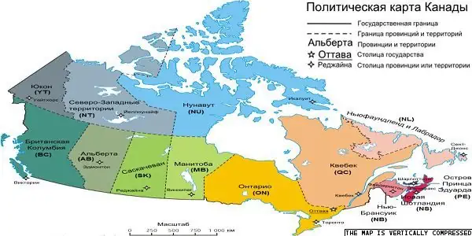
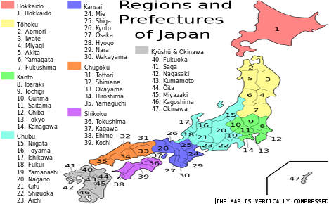
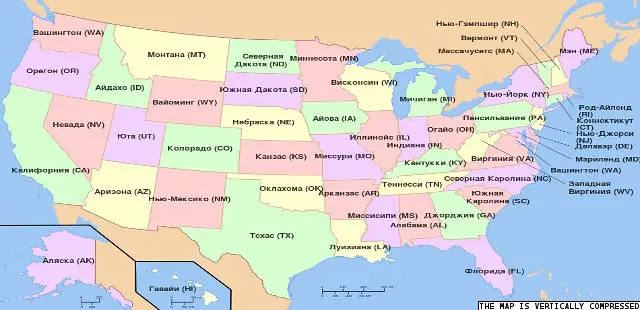

# Cooperation
> 2022.01.08 [🚀](../index/index.md) [despace](index.md) → [Contact](contact.md), [Persons](person.md)

[TOC]

---

> And these people forbid us to pick our noses!

|*Агентство*|*Бюджет, $ млн (%)*|*Год*|*Примечание*|
|:--|:--|:--|:--|
|США, [NASA](contact/nasa.md)|17 700 (100 %)|2013, прогноз| |
|Европа, [ESA](contact/esa.md)|5 500 (31 %)|2012|€ 4 020 100 млн|
|Россия, [Роскосмос](contact/roskosmos.md)|4 700 (27 %)|2014|₽ 165 800 млн|
|Япония, [JAXA](contact/jaxa.md)|2 460 (14 %)|2010|¥ 229 000 млн|
|Китай, [CNSA](contact/cnsa.md)|1 300 (7.3 %)|2009, оценка| |
|Индия, [ISRO](contact/isro.md)|1 200 (6.8 %)|2010 ‑ 2011| |
|Канада, [CSA](contact/csa.md)|425 (2.4 %)|2010 ‑ 2011| |
|Корея Южная, [KARI](contact/kari.md)|366 (2 %)|2007| |
|Алжир, [ASAL](contact/asal.md)|360 (2 %)|2002| |
|Украина, [ГКА](contact/nkau.md)|300 (1.7 %)| |
|Аргентина, [CONAE](contact/conae.md)|180 (1 %)|2014| |

   1. [ALPO](contact/alpo.md) — Association of Lunar & Planetary Observers
   1. [CCSDS](ccsds.md) — международный Консультативный Комитет по косм. системам передачи данных
   1. [IAF](contact/iaf.md) — International astronautical federation — Международная астронавтическая федерация
   1. [INCOSE](contact/incose.md)
   1. [Project Management Institute](project_management_institute.md)
   1. [SEDS](contact/seds.md) — Students for the Exploration & Development of Space
   1. [SGAC](contact/sgac.md) represent students & young space professionals to the United Nations, States, & space agencies
   1. [Synergy Moon](synergy_moon.md)
   1. [Болото](swamp.md)
   1. [Worldview in different countries](wwidc.md)
   1. For the person’s info page see **[Persons](person.md)**

 

## ± Australia

(**E**)ducation / (**N**)on‑profit・(**L**)aunch services・(**P**)romote・(**R**)&D&Manufacture / (**C**)onsulting・(**D**)ata provider

|*［Organization (AU)］*|*E*|*L*|*P*|*R*|*D*|*Industry*|
|:--|:--|:--|:--|:--|:--|:--|
|【[ASRI](contact/asri.md)】|·|·|·|·|·|Австралийский институт космических исследований|
|【[CSIRO](contact/csiro.md)】|·|·|·|·|·|Government agency responsible for scientific research|
|[ANU](contact/anu.md)|·|·|·|·|·|Australian National University|
|[Arlula](contact/arlula.md)|·|·|·|·|·|Provides a single point of access for a global network of sats imagery|
|[ASL](contact/asl.md)|·|·|·|·|·|Australia Space Launch|
|[AYAA](contact/ayaa.md)|N|·|·|·|·|Promote education, awareness, involvement in the A/S industry to youth|
|[Fleet Space Tech.](contact/fleet_space_tech.md)|·|·|·|·|·|IoT with nanosat constellation|
|[Gilmour Space Tech.](contact/gilmour_st.md)|·|·|·|·|·|Develop/launching low cost hybrid LV for small sats to LEO|
|[HEO Robotics](contact/heo_robotics.md)|·|·|·|R|D|Acquire imagery of sats, space‑debris, resource‑rich asteroids with sats|
|[Myriota](contact/myriota.md)|·|·|·|·|·|IoT with nanosat constellation|
|[Optus](contact/optus.md)|·|·|·|C|D|Mobile, telephony, internet, sat, entertainment & biz network services|
|[Saber Astronautics](contact/saber_an.md)|·|·|·|·|·|Model the interaction between SC telemetry & the space environment|
|[SERC](contact/serc.md)|·|·|·|·|·|Space debris removal|
|[Shoal](contact/shoal.md)|·|·|·|C|·|Systems engineering consulting|
|[Southern Launch](contact/southern_launch.md)|·|·|·|·|·|Infrastructure/logistics support for (sub)orbital launches|
|[Space Services AU](contact/space_services_au.md)|·|·|·|C|·|Modelling, simulation, system analysis|
|[Spiral Blue](contact/spiral_blue.md)|·|·|·|R|·|OBC|
|**・ Not space ・**|•|•|•|•|•|…|
|**・ Org. lists ・**|•|•|•|•|•|…|

 

## Canada
(**E**)ducation / (**N**)on‑profit・(**L**)aunch services・(**P**)romote・(**R**)&D&Manufacture / (**C**)onsulting・(**D**)ata provider

|*［Organization (CA)］*|*E*|*L*|*P*|*R*|*D*|*Industry*|
|:--|:--|:--|:--|:--|:--|:--|
|【[CSA](contact/csa.md)   (QC)】|·|·|·|·|·|Canadian Space Agency|
|[ADGA](contact/adga.md)   (ON)|·|·|·|C|·|Advanced technology solutions, professional engineering & consultancy|
|[AIAC](contact/aiac.md)   (ON)|·|·|P|·|·|Aerospace Industries Association of Canada|
|[AlbertaSat](contact/albertasat.md)   (AB)|N|·|·|R|·|(Student community) CubeSats R&D|
|[August IST](contact/august_ist.md)   (ON)|E|·|·|R|·|Space infrastructure, R&D, education, commercialization of innovative solutions|
|[Baryon Dynam.](contact/baryon_dyn.md)   (ON)|·|·|·|R|·|Power & space propulsion, engineering designs & expertise|
|[BRASS](contact/brass.md)   (ON)|E|·|P|C|·|Mission design & analysis & planning, Operations, Project mgmt & consultancy|
|[C-CORE](contact/c_core.md)   (ON)|·|·|·|C|·|Risks mitigation, remote sensing systems, ice/geotechnical engineering|
|[C6 Launch](contact/c6_launch.md)   (ON)|·|L|·|R|·|Launch services, Launcher design for CubeSats|
|[Calian AT](contact/calian_at.md)   (SK,QC)|·|·|·|·|·|R&D & integration of products & services in comms, test & control apps for comm sats|
|[Canadensys](contact/canadensys.md)   (ON)|·|·|·|R|·|Cubesats, rovers, SC systems, avionics, sensors|
|[CASI](contact/casi.md)   (ON)|E|·|P|·|·|Canadian Aeronautics & Space Institute|
|[CCERA](contact/ccera.md)   (ON)|E|·|·|·|·|Canadian Center for Experimental Radio Astronomy|
|[Columbiad](contact/columbiad.md)   (ON)|·|L|·|·|·|Commercial low‑cost space launch|
|[Concordia Univ.](contact/concordia_univ.md)   (QC)|E|·|·|·|·|Higher education|
|[CPSX](contact/cpsx.md)   (ON)|E|·|P|·|·|Planetary science, exploration research, training|
|[CSMC](contact/csmc.md)   (ON)|·|·|·|R|·|Space mining, resource extraction & exploration|
|[CSS](contact/css.md)   (ON)|N|·|P|·|·|Sponsorship & promotion for Canadians in the space sector|
|[Deltion Ltd](contact/deltion.md)   (ON)|·|·|·|R|·|Technology dev./improvement mostly for automation & robotics, Moon mining|
|[DSS](contact/dss.md)   (NS)|N|·|·|R|·|CubeSats development. Student community|
|[EarthDaily](contact/earthdaily.md)   (BC)|·|·|·|R|D|Remote sensing, Geospatial info|
|[Euroconsult](contact/euroconsult.md)   (QC)|·|·|·|C|·|Strategic, research, summits, training programs|
|[Geocentrix Tech.](contact/geocentrix_tech.md)   (BC)|·|·|·|C|·|Sat/Launch mission design, analysis, operations, management, consulting|
|[GHGSat](contact/ghgsat.md)   (QC)|·|·|·|R|·|Greenhouse gases monitoring, gas sensors & imaging interferometers for Cubesats|
|[Globvision](contact/globvision.md)   (QC)|·|·|·|R|·|Software for spacecraft, support & automate the design|
|[Honeywell A/S](contact/honeywell_as.md)   ()|·|·|·|R|·|Software, signal & data processing, flight & ground operations|
|[Kepler Comms](contact/kepler_comms.md)   (ON)|·|·|·|R|·|CubeSats for global comms & IoT, antennas, data retranslation|
|[Lassonde SoE](contact/lassonde_soe.md)   (ON)|E|·|·|·|·|Higher education|
|[Launch Canada](contact/launch_ca.md)   ()|N|·|·|R|·|(Student community) LV & small sats building|
|[Luna D&I](contact/luna_dni.md)   (ON)|·|L|·|·|·|Launch & support for experiments in space|
|[Macfab](contact/macfab.md)   (ON)|·|·|·|R|·|ADCS, structures, comms/electronics, sensors, propulsion, separation systems|
|[Magellan A/S](contact/magellan_as.md)   (ON)|·|·|·|R|·|Sats R&D, small sat bus platform, ground facilities|
|[MCSS Inc](contact/mcss_inc.md)   (ON)|·|·|·|R|·|Software, simulation, mission operations, onboard autonomy, & AI|
|[MDA](contact/mda.md)   (ON,QC)|·|·|·|R|·|Robotics, Space operations, Ground stations, Sat systems, Software|
|[MLS](contact/mls.md)   (NS)|·|L|·|·|·|Launch services using Cyclone-4M LV in Nova Skotia|
|[MSCI](contact/msci.md)   (ON)|·|·|·|R|·|Reaction wheels, rate measurement units, microsats, attitude control systems|
|[NGC A/S](contact/ngc_as.md)   (QC)|·|·|·|R|·|Software for GNC, simulation, data processing|
|[Northstar ESI](contact/northstar_esi.md)   (QC)|·|·|·|R|·|Monitor space (object tracking), from space, via a sat constellation|
|[PolyOrbite](contact/polyorbite.md)   (QC)|N|·|·|R|·|CubeSat’s R&D. Student society|
|[Pratt & Whitney](contact/pratt_n_whitney.md)   (QC)|·|·|·|R|·|Engines, gas turbines|
|[QSTC](contact/qstc.md)   (QC)|·|·|·|R|·|GEO sats, electric propulsion, materials solutions, remote sensing, robotics|
|[Satcan](contact/satcan.md)   (ON)|N|·|·|C|·|Engineering & business consultancy for sat telecom & space tech sectors|
|[SEDS Canada](contact/seds.md)   (ON)|N|·|P|·|·|(Student community) Promoting Exploration & Development of Space|
|[Sinclair I/P](contact/sinclair_ip.md)   (ON)|·|·|·|R|·|Star trackers, reaction wheels, optical comms, software, training & expertise|
|[SpaceBridge Inc.](contact/spacebridge.md)   (QC)|·|·|·|R|·|Sat network equip. & services|
|[SpaceRyde](contact/spaceryde.md)   (ON)|·|L|·|R|·|On‑schedule, dedicated launch for CubeSats using balloons|
|[Space Concordia](contact/space_concordia.md)   (QC)|N|·|·|R|·|(Student community) CubeSats, small rockets, robots|
|[Space Engine S.](contact/space_engs.md)   (AL)|·|·|·|R|·|SSTO propulsion, pumps, compressors, gear boxes, Permanent Magnet Motors|
|[SkyWatch](contact/skywatch.md)   (ON)|·|·|·|C|D|Providing commercial sat imagery|
|[SSCL](contact/sscl.md)   (ON)|·|·|·|C|·|Consulting for space policy, planning, strategy, & technology|
|[Telecan Space](contact/telecan_space.md)   (QC)|·|·|·|C|·|Consulting, Training, Thermal R&D & testing|
|[Telesat](contact/telesat.md)   (ON)|·|·|·|R|D|Sat comms & integration services, sat operator|
|[Thales Canada](contact/thales.md)   (All)|·|·|·|R|·|Sat & LV hardware|
|[Thoth Tech.](contact/thoth_tech.md)   (ON)|·|·|·|R|·|Cameras, In‑rbit objects tracking, thermo‑vac & vibr. tests, mission planning|
|[UTIAS](contact/utias.md)   (ON)|E|·|·|R|·|Research for space mechatronics, robotics, microsats, fluid dynamics|
|[Wyvern Space](contact/wyvern.md)   (AB)|·|·|·|C|D|Providing commercial sat imagery from small sats|
|[Xiphos](contact/xiphos.md)   (QC)|·|·|·|R|·|CPUs (OBCs), Firmware & Software|
|**・ Not space ・**|•|•|•|•|•|Avant Aerospace・ CAE|
|**・ Org. lists ・**|•|•|•|•|•|[spaceq.ca ⎆](http://www.spaceq.ca/canadian-space-companies/)・ [aiac.ca ⎆](https://aiac.ca/product-categories/space-systems/#sat-systems-components)・ [thecanadianencyclopedia.ca ⎆](https://www.thecanadianencyclopedia.ca/en/article/aerospace-industry)|

 

## ✘ China

(**E**)ducation / (**N**)on‑profit・(**L**)aunch services・(**P**)romote・(**R**)&D&Manufacture / (**C**)onsulting・(**D**)ata provider

|*［Organization (CN)］*|*E*|*L*|*P*|*R*|*D*|*Industry*|
|:--|:--|:--|:--|:--|:--|:--|
|【[CNSA](contact/cnsa.md)】|·|·|·|·|·|Китайское национальное космическое управление|
|[LandSpace ](contact/landspace.md)|·|L|·|R|·|·|Design, manufacturing & operations of small & medium LV|
|**・ Not space ・**|•|•|•|•|•|…|
|**・ Org. lists ・**|•|•|•|•|•|…|

 

## ✘ Europe

(**E**)ducation / (**N**)on‑profit・(**L**)aunch services・(**P**)romote・(**R**)&D&Manufacture / (**C**)onsulting・(**D**)ata provider

|*［Organization (EU)］*|*E*|*L*|*P*|*R*|*D*|*Industry*|
|:--|:--|:--|:--|:--|:--|:--|
|【[CNES](contact/cnes.md)   (FR)】|·|·|·|·|·|Французское космическое агентство|
|【[DLR](contact/dlr.md)   (GR)】|·|·|·|·|·|Германское космическое агентство|
|【[ESA](contact/esa.md)   (EU)】|·|·|·|·|·|Исследование космоса. [Роскосмос](contact/roskosmos.md) и  ГНИО в одном лице|
|【[ESTEC](contact/estec.md)   (NL)】|·|·|·|·|·|Разработка и создание космических технологий и КА|
|【[SSO](contact/sso.md)   (CH)】|·|·|·|·|·|Swiss Space Office, national space program of Switzerland|
|【[UKSA](contact/uksa.md)   (UK)】|E|L|P|R|·|UK Space Agency|
|[AAC CS](contact/aac_cs.md)   (SE)|·|·|·|·|·|Кубсаты, малые КА, СЧ|
|[ADS](contact/ads.md)   (GR)|·|·|·|·|·|Military Aircraft; SCS, Electronics, Comms, Intelligence, Security|
|[Airbus](contact/airbus.md)   (FR)|·|·|·|·|·|…|
|[ARCA Dynamics](contact/arca_dymanics.md)   (IT)|·|·|·|·|·|Cubesats, GNC, space robotics, AI|
|[ASP Equipment](contact/asp_equip..md)   (DE)|·|·|·|R|·|Power: DC/DC converters, IPU, PCDU, EPC, propulsion power|
|[Asteroid MC](contact/asteroid_mc.md)   (UK)|·|·|·|R|·|Robotic & satellite platforms for asteroid mining|
|[Astrocast](contact/astrocast.md)   (CH)|·|·|·|·|·|Sat operator, constellation of nano‑sats on LEO, IoT comms|
|[AvalonSpace](contact/avalonspace.md)   (UK)|·|L|·|·|·|Green & cost‑effective UK launches|
|[B2Space](contact/b2space.md)   (UK)|·|·|·|·|·|Launch services (balloon & LV) for small‑micro sats|
|[Bradford Eng.](contact/bradford_eng.md)   (NL)|·|·|·|·|·|СУ КА: ДМ, СД, смесители топлива|
|[ClearSpace SA](contact/clearspace_sa.md)   (CH)|·|·|·|R|·|Space debris removal: technologies & services|
|[Cobham](cobham.md)   (UK)|·|·|·|·|·|СЧ КА, процессоры|
|[CUNI](contact/cuni.md)   (CZ)|·|·|·|·|·|Карлов университет. Один из старейших университетов мира|
|[Disrupt Space](contact/disrupt_space.md)   (DE)|N|·|P|·|·|Startup accelerator, entrepreneurship, & community|
|[Edinburgh Univ.](contact/edinburgh_univ.md)   (UK)|·|·|·|·|·|University of Edinburgh|
|[Effective Space](contact/effective_space.md)   (UK)|·|·|·|·|·|Life‑extension & other in‑orbit services for sats|
|[Endurosat](contact/endurosat.md)   (BG)|·|·|·|R|·|CubeSat R&D|
|[ESRIC](contact/esric.md)   (LU)|·|·|·|·|·|…|
|[Euroconsult](contact/euroconsult.md)   (FR)|·|·|·|C|·|Strategic, research, summits, training programs|
|[EU Space Found.](contact/eu_space_foundation.md)   (PL)|·|·|P|·|·|Promote knowledge in science, engineering, technology & mathematics|
|[GAUSS Srl](contact/gauss_srl.md)   (IT)|E|·|·|R|·|Cubesats, GS operations, space debris observation|
|[Hisdesat](contact/hisdesat.md)   (ES)|·|·|·|·|·|…|
|[IA](ia.md)   (PT)|·|·|·|·|·|Instituto de Astrofísica e Ciências do Espaço|
|[ICEYE](iceye.md)   (FL)|·|·|·|·|·|Разработка и создание микроспутников и кубсатов|
|[InnovaSpace](contact/innovaspace.md)   (UK)|E|·|P|·|·|Promote/conduct R&D, education, innovations for humanity in space|
|[Int. Space Univ.](contact/int_space_univ.md)   (FR)|E|·|·|·|·|Space education for a changing world|
|[IRAP](contact/irap.md)   (FR)|·|·|·|·|·|Research Institute in Astrophysics & Planetology|
|[IRF](contact/irf.md)   (SE)|·|·|·|·|·|Фундам. исследования косм. физики и физики атмосферы|
|[IRSPS](contact/irsps.md)   (IT)|·|·|·|·|·|…|
|[ISU](contact/isu.md)   (FR)|E|·|·|·|·|…|
|[Karman Project](contact/karman_project.md)   (DE)|N|·|P|·|·|Connecting people|
|[LATMOS](contact/latmos.md)   (FR)|·|·|·|·|·|Фундам. исследования наземных и планетных атмосфер|
|[Leonardo](leonardo.md)   (IT)|·|·|·|·|·|…|
|[Libre space](contact/libre_space_f.md)   (GR)|N|·|P|·|·|To promote, advance, develop libre technologies & knowledge for space|
|[LMD](lmd.md)   (FR)|·|·|·|·|·|…|
|[LuxSpace Sarl](contact/luxspace.md)   (LU)|·|·|·|R|·|Components & technolofy, microsats, apps & services|
|[Moon Village As.](contact/moon_village_a.md)   (AT)|N|·|·|·|·|Global info‑forum for gov./industry/academia/etc. for dev. of the Moon Village|
|[Morpheus Space](contact/morpheus_space.md)   (DE)|·|·|·|R|·|Electric propulsion & AI|
|[Nammo](nammo.md)   (NO)|·|·|·|·|·|Двигатели|
|[Neutron Star S.](contact/dlr.md)   (GR)|·|·|·|·|·|Electric propulsion (EP) systems & subsystems|
|[OHB SE](contact/ohb_se.md)   (DE)|·|·|·|·|·|Sats, exploration, human spaceflight|
|[Open Cosmos](contact/open_cosmos.md)   (UK)|·|·|·|·|·|Sats R&D|
|[OPC LAM](contact/opc_lam.md)   (GR)|·|·|·|·|·|Разработка и создание двигателей, ДУ|
|[OQ Technology ](contact/oq_technology.md)   (LU)|·|·|·|R|·|Sats constellation for IoT|
|[Oxford Univ.](oxford_univ.md)   (UK)|·|·|·|·|·|…|
|[Paris Obs.](paris_obs.md)   (FR)|·|·|·|·|·|…|
|[PLD Space](contact/pld_space.md)   (ES)|·|L|·|R|·|Reusable (sub)orbital LV for small sats|
|[Plus Ultra](contact/plus_ultra.md)   (ES)|·|·|·|R|·|Off‑Earth infrastructure, Lunar satellites|
|[PTScientists](ptscientists.md)|·|·|·|·|·|…|
|[QitetiQ](contact/qitetiq.md)   (UK)|·|·|·|·|·|Comms & security, spacecraft & subsystems, spaceflight training|
|[RUAG Space](ruag_space.md)   (SE)|·|·|·|·|·|Разработка/создание электроники, механизмов РН, КА|
|[SAGA SA](contact/saga_sa.md)   (DK)|·|·|·|R|·|Space architectures|
|[Saft](contact/saft.md)   (FR)|·|·|·|·|·|Элементы электропитания|
|[SES Satellites](contact/ses_sats.md)   (LU)|·|·|·|·|·|Deliver video & data solutions, LEO/MEO sats|
|[SGAC](contact/sgac.md)   (AT)|·|·|·|·|·|Represent students & young space professionals to the United Nations|
|[Sodern](contact/sodern.md)   (FR)|·|·|·|·|·|…|
|[Solar MEMS](contact/solarmems.md)   (ES)|·|·|·|·|·|СД|
|[Sorbonne Univ.](sorbonne_univ.md)   (FR)|·|·|·|·|·|…|
|[Space Expl. Inst.](contact/space_explor_inst.md)   (CH)|N|·|·|·|·|Developing space exploration activities, instruments|
|[Space Forge](contact/space_forge.md)   (UK)|·|·|·|R|·|Reusable sats for material manufacturing in space|
|[Space Mining T.](contact/space_mintech.md)   (EU)|·|·|·|·|·|Moon & asteroids mining|
|[Space Talos](contact/space_talos.md)   (UK)|·|·|·|R|·|Radiation shielding technologies, testing|
|[Swedish SC](swedish_sc.md)   (SE)|·|·|·|·|·|КА, кубсаты, аэростаты, НС|
|[Tas‑I](contact/tas_i.md)   (FR)|·|L|·|R|·|R&D of SC, launch services, comms, sat control, Earth observation services|
|[Telespazio](contact/telespazio.md)   (UK)|·|·|·|·|·|…|
|[Terma A/S](contact/terma.md)   (DK)|·|·|·|·|·|…|
|[TU Delft](tu_delft.md)   (NL)|·|·|·|·|·|…|
|[UCL](contact/ucl.md)   (UK)|·|·|·|·|·|…|
|[UEF SAV](contact/uef_sav.md)   (SK)|·|·|·|·|·|Ядерная, субатомная физика, физика космоса, биофизика|
|[UFA](contact/ufa.md)   (CZ)|·|·|·|·|·|…|
|[UNIBE](contact/unibe.md)   (CH)|·|·|·|·|·|…|
|[UVSQ](uvsq.md)   (FR)|·|·|·|·|·|…|
|[Waven](contact/waven.md)   (PL)|·|·|·|R|·|Energy harvesting. Alternative to photovoltaics & RTG. Consumption reducing|
|[Zero 2 Infinity](contact/zero_2_infinity.md)   (IT)|·|L|·|R|·|Space transportation, launch small sats|
|[Zielona Univ.](contact/zielona_univ.md)   (PL)|E|·|·|·|·|…|
|**・ Not space ・**|•|•|•|•|•|…|
|**・ Org. lists ・**|•|•|•|•|•|[LSA SD ⎆](https://space-agency.public.lu/en/expertise/space-directory.html)|

 

## ✘ India

(**E**)ducation / (**N**)on‑profit・(**L**)aunch services・(**P**)romote・(**R**)&D&Manufacture / (**C**)onsulting・(**D**)ata provider

|*［Organization (IN)］*|*E*|*L*|*P*|*R*|*D*|*Industry*|
|:--|:--|:--|:--|:--|:--|:--|
|【[ISRO](contact/isro.md)】|·|·|·|·|·|Индийское национальное космическое агентство|
|[BSIP](contact/bsip.md)|·|·|·|·|·|Birbal Sahni Institute of Palaeosciences|
|[Skyroot A/S](contact/skyroot_as.md)|·|·|·|·|·|<mark>TBD</mark> LVs|
|[Space Dev. Network](contact/space_dev_netw.md)|·|·|·|·|·|<mark>TBD</mark> Space Development Network|
|[Space Dev. Nexus](contact/sd_nexus.md)|N|·|P|·|·|Various space developments, integration, colonization|
|[Synergy Moon](contact/synergy_moon.md)|·|·|·|R|·|Lunar rover|
|[Team Indus](team_indus.md)|·|·|·|·|·|<mark>TBD</mark>|
|[Timewarp Space](contact/timewarp_space.md)|·|L|·|R|·|LV for small sats|
|[UPES](contact/upes.md)|·|·|·|·|·|University of Petroleum & Energy Studies|
|**・ Not space ・**|•|•|•|•|•|…|
|**・ Org. lists ・**|•|•|•|•|•|…|

 

## ± Israel

(**E**)ducation / (**N**)on‑profit・(**L**)aunch services・(**P**)romote・(**R**)&D&Manufacture / (**C**)onsulting・(**D**)ata provider

|*［Organization (IL)］*|*E*|*L*|*P*|*R*|*D*|*Industry*|
|:--|:--|:--|:--|:--|:--|:--|
|【[ISA](contact/isa.md)】|·|·|·|·|·|Координация научных/коммерческих программ исследования КП|
|[AMOS-Spacecom](contact/amos_spacecom.md)|·|·|·|·|·|Fixed‑sat operator, comms solutions|
|[Asher SRI](contact/asher_sri.md)|E|·|·|·|·|Asher Space Research Institute|
|[D-MARS](contact/d_mars.md)|E|·|P|·|·|Promote the space sector. Simulations, training, tech testing, education|
|[DSO Technologies IL](contact/dso_tech.md)|·|·|·|·|·|…|
|[Herzliya Space Lab](contact/herzliya_space_lab.md)|N|·|·|·|·|Student sat building lab|
|[IAI](contact/iai.md)|·|·|·|·|·|…|
|[ImageSat Int.](contact/imagesat_int.md)|·|·|·|·|·|Geospatial solutions & services: imagery, data, analytics|
|[Israeli Air Force](contact/israeli_af.md)|·|·|·|·|·|…|
|[NovelSat](contact/novelsat.md)|·|·|·|·|·|Content connectivity solutions for sat comms|
|[NSLComm](contact/nslcomm.md)|·|·|·|R|·|Antenna technologies|
|[Rafael](contact/rafael.md)|·|·|·|·|·|…|
|[Space-Nest](contact/space_nest.md)|·|·|·|·|·|Space tech/applications incubator|
|[Spacecialist](contact/spacecialist.md)|·|·|P|·|·|Nano‑Cubesat projects, promote a prosperous civilian space industry|
|[SpaceIL](spaceil.md)|·|·|·|·|·|…|
|[Technion](contact/technion.md)|E|·|·|·|·|Israel Institute of Technology|
|[WeSpace Tech.](contact/wespace_tech.md)|·|·|·|R|D|R&D robots, operation, data|
|**・ Not space ・**|•|•|•|•|•|Meteor Aerospace|
|**・ Org. lists ・**|•|•|•|•|•|…|

 

## Japan

(**E**)ducation / (**N**)on‑profit・(**L**)aunch services・(**P**)romote・(**R**)&D&Manufacture / (**C**)onsulting・(**D**)ata provider

|*［Organization (JP)］*|*E*|*L*|*P*|*R*|*D*|*Industry*|
|:--|:--|:--|:--|:--|:--|:--|
|【[JAXA](contact/jaxa.md)   13】|E|L|P|R|·|National aerospace & space agency|
|【[JAXA ESCC](contact/isas.md)   14】|·|·|·|R|·|ET materials documentation, preservation, preparation, distribution|
|【[JAXA ISAS](contact/isas.md)   14】|·|·|·|R|·|Astrophysical explorations with rockets, SC|
|【[JAXA Kakuda](contact/kakuda_sc.md)   4】|·|·|·|R|·|R&D, testing engines & propulsion systems|
|【[JAXA Noshiro](contact/noshiro_rtc.md)   5】|·|·|·|R|·|R&D, testing of rockets & engines|
|【[JAXA Tsukuba](contact/tsukuba_sc.md)   8】|E|·|·|R|·|Astronauts training, manufactures sats & ISS modules|
|【[SCJ](contact/scj.md)   13】|N|·|P|C|·|Major Japanese science organization|
|[3D Printing Corp.](contact/3d_printing_corp.md)   14|·|·|·|R|·|Composite 3D printing|
|[ALE](contact/ale.md)   13|·|·|·|R|·|Space entertainment (sky canvas), data service, small sats|
|[Amanogi](contact/amanogi.md)   13|E|·|·|R|·|Sensors & advanced sat data analysis solutions|
|[Amulapo](contact/amulapo.md)   13|E|·|·|C|·|Creation of space experience content using ICT technology such as xR, robots, & AI|
|[Astrocean](contact/astrocean.md)   13|·|L|·|·|·|Hybrid rocket sea launch, sub‑orbital & orbital rocket sea launch|
|[Astroflash](contact/astroflash.md)   13|·|·|·|R|·|Small sats|
|[Astroscale](contact/astroscale.md)   13|·|·|·|R|·|Space debris removal, sat life extension services, end‑of‑life services|
|[Axelspace Corp.](contact/axelspace.md)   13|·|L|·|R|·|Ready‑to‑launch space solutions, micro‑sat technology|
|[Bascule](contact/bascule.md)   13|E|·|P|·|·|Advertising, media, products, sports, education, mobility, urban development, space|
|[Canon El. Space](contact/ce_space.md)   13|·|·|·|R|·|Small Earth sats, their components|
|[CTST](contact/ctst.md)   13|E|·|·|C|·|Space tourism, consulting, education|
|[DATAFLUCT](contact/datafluct.md)   13|·|·|·|·|D|Software for sat data analysis|
|[Digital Blast](contact/digital_blast.md)   13|·|·|·|C|·|Business & technology consulting|
|[Dymon](contact/dymon.md)   13|·|·|·|R|·|Robots, rovers, antennas|
|[ElevationSpace](contact/elevationspace.md)   4|·|·|·|R|·|Space constructions, bases, transportations, experiments|
|[Euroconsult](contact/euroconsult.md)   13|·|·|·|C|·|Strategic, research, summits, training programs|
|[eVanTEC Co Ltd](contact/evantec_co.md)   13|·|·|·|R|·|Software, sat support|
|[GITAI](contact/gitai.md)   13|·|·|·|R|·|Remotely controlled robots|
|[GS Yuasa](contact/gs_yuasa.md)   26|·|·|·|R|·|Batteries|
|[Hamamatsu Phot.](contact/hamamatsu_phot.md)   22|·|·|·|R|·|Optical sensors, trackers, cameras|
|[Harada Seiki](contact/harada_seiki.md)   22|·|·|·|R|·|Parts for sats, rovers, small telescopes for observing Earth|
|[HIREC](contact/hirec.md)   14|·|·|·|R|·|Electronic components, Reliability/quality assurance|
|[Hokkaido Satellite](contact/hokkaido_sat.md)   1|·|·|·|R|·|Cameras|
|[IHI](contact/ihi.md)   13|·|L|·|R|·|LV, engines & their components R&D|
|[IMV Corp.](contact/imv_corp.md)   27|·|·|·|R|·|Ground vibration test & measurement systems|
|[Infostellar](contact/infostellar.md)   13|·|·|·|R|·|Sat Ground Segment as a Service provider, cubesat components|
|[Interstellar Tech.](contact/interstellar_tech.md)   1|·|L|·|R|·|LV for small sats (≤ 100 ㎏) development, manufacturing, launch service|
|[iQPS Inc.](contact/iqps.md)   40|E|·|·|R|D|Earth sats for near real‑time SAR data|
|[ispace / Hakuto](contact/ispace.md)   13|·|·|·|R|·|Moon lander & base|
|[J-spacesystems](contact/jspacesys.md)   13|·|·|·|C|·|R&D, HR, promotion activities creating business opportunities in space sector|
|[JAMSS](contact/jamss.md)   13|·|L|·|R|·|Space experiments operations, austronaut training, sat utilization|
|[JEPICO Corp.](contact/jepico_corp.md)   13|·|·|·|R|·|Electronic components|
|[JpGU](jpgu.md)   13|N|·|P|·|·|Japan geoscience academic union|
|[JSASS](contact/jsass.md)   13|N|·|P|·|·|Journals, conferences, awards, recommendations|
|[JSI Corp](contact/jsi_corp.md)   13|·|·|·|R|D|Sat remote sensing commercial services, imagery data|
|[Kawasaki HVI](contact/kawasaki_hvi.md)   13|·|·|·|R|·|Sats, fairings, rocket launch complex, space transport|
|[Kobe Univ.](contact/kobe_univ.md)   28|E|·|·|R|·|A leading Japanese national university|
|[Kratos IS Japan](contact/kratos.md)   13|·|·|·|R|·|Ground antennas, optimizing/managing satellites, signals|
|[Kyocera](contact/kyocera.md)   26|·|·|·|R|·|Ceramics|
|[Kyutech](contact/kyutech.md)   40|E|·|·|R|·|Scientific & technological institute|
|[Lab Space Syst.](contact/lab_of_space_systems.md)   1|·|·|·|R|·|Engine researches|
|[Magellan SJ](contact/magellan_sj.md)   28|·|·|·|R|·|High precision sat positioning system|
|[Maxar Japan](contact/maxar.md)   13|·|·|·|R|·|SC platforms, robotics, servicing, geospatial info|
|[Meisei](contact/meisei.md)   10|·|·|·|R|·|Radiosondes, cameras, transceivers, MGMs, power sup., detectors, microsats|
|[Meltin](contact/meltin.md)   13|·|·|·|R|·|Robots, medical equip.|
|[Mitsubishi Electric](contact/mitsubishi.md)   13|·|·|·|R|·|Near‑Earth sats, their components, ground segment|
|[Mitsubishi HVI](contact/mitsubishi.md)   13|·|L|·|R|·|LV, rocket engines manuf. & testing, RCS, temp. sensors|
|[Mitsui Bussan AS](contact/mitsui_bas.md)   1|·|L|·|R|·|Sat R&D, launch, deployment, operation|
|[NAOJ](contact/naoj.md)   13|E|·|·|R|·|Observations, astronomy researches, promotes joint research programs|
|[NDK](contact/ndk.md)   13|·|·|·|R|·|Outgas analysis system, crystal devices (oscillators, filters, transducers)|
|[NEC Space Tech.](contact/nec.md)   13|·|·|·|R|·|Payload electrical & bus equip., antennas/spaceborne radar|
|[NEC Space Sys.](contact/nec.md)   13|·|·|·|R|·|Sats, ground systems|
|[NGSL](contact/ngsl.md)   13|N|·|·|R|·|Solving global issues utilizing Japanese space technology|
|[Nihom Univ.](contact/nihon_univ.md)   13|E|·|·|·|·|Aerospace engineering|
|[Orbspace](contact/orbspace.md)   8|·|·|·|R|·|Space tourism using small reusable rocket|
|[Outsense Inc.](contact/outsense.md)   13|·|·|·|R|·|Space facilities & bases, space residence|
|[Pale Blue Inc.](contact/pale_blue_inc.md)   12|·|·|·|R|·|Propulsion systems for small sats, consulting of SC design & integration|
|[PASCO CORP.](contact/pasco_corp.md)   13|·|·|·|R|D|Geospatial info|
|[PD AeroSpace](contact/pd_aerospace.md)   23|·|L|·|R|·|Suborbital spaceplane, space transportation, space tourism|
|[Polar Star Space](contact/polar_star_space.md)   13|·|L|·|R|·|Launch service that uses small rockets|
|[RESTEC Japan](contact/restec.md)   13|·|·|·|R|D|Earth sat’s data receiving, processing, providing; R&D remote sensing techs|
|[RIKEN](contact/riken.md)   11|E|·|·|R|·|Biology, chemistry, physics, & research|
|[Robotic Mining](contact/rom.md)   13|·|·|·|R|·|R&D devices for space mineral exploration & mining|
|[Sagri](contact/sagri.md)   28|·|·|·|·|D|Space data utilization, machine learning, software|
|[Sat. Biz Network](contact/sat_biz_network.md)   13|E|·|·|C|·|Technology consulting, space policy, strategy; space startups support|
|[SE4](contact/se4.md)   13|·|·|·|R|·|Remote robotics using VR|
|[SEESE](contact/seese.md)   8|·|·|·|R|·|Environmental testing (one stop service), space development services|
|[SKY Perf. JSAT](contact/sky_perfect_jsat.md)   13|·|·|·|R|·|Telecomms, multi‑channel pay TV company|
|[Skygate tech.](contact/skygate_tech.md)   13|·|·|·|R|·|Ground Station as a Service for sats|
|[SNET](contact/snet.md)   13|·|·|·|R|·|Earth sats comms, Earth observation, ground segment, drones|
|[Solafune](contact/solafune.md)   47|·|·|·|R|D|Sat data analysis, software development, related services|
|[SPAC](contact/spac.md)   13|N|·|·|R|·|Addition to GPS|
|[Space Balloon](contact/space_balloon.md)   8|·|·|·|R|·|Earth observation using high altitude balloons|
|[Space Basil](contact/space_basil.md)   13|·|·|P|C|·|Outer space advertising & entertainment|
|[Space BD](contact/space_bd.md)   13|E|L|·|C|·|Space for business, sats launch, ISS experiments, education|
|[SPACE COTAN](contact/space_cotan.md)   1|·|L|·|·|·|Sales & PR for Hokkaido Spaceport|
|[Space Cubics](contact/spacecubics.md)   1|·|·|·|R|·|CPU, application software, FPGA, consult on space project management|
|[Space Entertainment](contact/space_e11t.md)   13|E|·|P|·|·|Space entertainment activities|
|[Space Entert. Lab](contact/space_entlab.md)   13|·|·|·|R|·|UAV, drones, high altitude (stratosphere) balloons, monitoring|
|[Space NTK](contact/space_ntk.md)   13|·|·|·|R|·|Space burial|
|[Space One](contact/space_one_co.md)   13|·|L|·|R|·|Launch service that uses small rockets. Small LV & dedicated launch site|
|[Space Port Japan](contact/spaceportjapan.md)   13|E|·|P|·|·|Promote the country’s aerospace & related industries|
|[Space Shift Inc.](contact/space_shift.md)   13|·|·|·|R|·|Software for sat data processing, consulting (marketing, software)|
|[Space Walker](contact/space_walker.md)   13|·|L|·|R|·|Suborbital spaceplane, space transport/tourism, small sats launch|
|[Spacetide](contact/spacetide.md)   13|N|·|P|·|·|Promotes newspace businesses worldwide, annual conference|
|[STARS SS](contact/stars_ss.md)   22|·|·|·|R|·|Debris removal & recycling|
|[Sumitomo PP](contact/sumitomo_pp.md)   28|·|·|·|R|·|Heat exchangers & control, semiconductor/MEMS equip., sensors|
|[Synspective Inc.](contact/synspective.md)   13|·|·|·|R|·|Utilize/integrate data from SAR sat constel., big data, machine learning|
|[Tamagawa Seiki](contact/tamagawa_seiki.md)   20|·|·|·|R|·|Servo components, motor controllers, robots, IMU, autom. control devices|
|[Telexistence Inc.](contact/telexistence_inc.md)   13|·|·|·|R|·|Remotely controlled robots|
|[Tenchijin](tenchijin.md)|·|·|·|R|·|Business solution using Earth observation data. Startup for big data|
|[Terra Space](contact/terra_space.md)   26|·|·|·|R|·|CubeSats|
|[Tokyo Univ.](contact/tokyo_univ.md)   13|E|·|·|R|·|Tokyo University|
|[TOWING](contact/towing.md)   23|·|·|·|R|·|Space food, soil & cultivation|
|[Umitron](contact/umitron.md)   13|·|·|·|R|·|Aquafarmers support: IoT, sat remote sensing, machine learning|
|[TUPLS](contact/tupls.md)   13|E|·|·|·|·|Tokyo University of Pharmacy & Life Sciences|
|[Warpspace Inc.](contact/warpspace.md)   8|·|·|·|R|·|Comms infrastructure for LEO sats; cubesats modules|
|[Yspace LLC](contact/yspace.md)   8|E|·|·|C|·|VR|
|**・ Not space ・**|•|•|•|•|•|Avatarin・ Dynamic Map Platform・ [Euglena](contact/euglena.md)・ Global Positioning Augmentation Service・ Integriculture・ ONETABLE・ Panasonic Avionics Corp.・ Ridge-i・ Sakura Internet・ SIGNATE・ Space Bio-Laboratories|
|**・ Org. lists ・**|•|•|•|•|•|[aerospacebiz.jaxa.jp 1 ⎆](https://aerospacebiz.jaxa.jp/en/spacecompany/)・ [aerospacebiz.jaxa.jp 2 ⎆](https://aerospacebiz.jaxa.jp/en/partner/)・ [J-Startup ⎆](https://www.j-startup.go.jp/en/)・ [spacebizguide.com ⎆](https://www.spacebizguide.com/country-japan)・ [wikipedia ⎆](https://en.wikipedia.org/wiki/Japanese_space_program)|
|<mark>TBD</mark>|•|•|•|•|•|Our stars (2021)・ soranemo (2019)・ Space Art and design (2018)|

 

## Korea South

(**E**)ducation / (**N**)on‑profit・(**L**)aunch services・(**P**)romote・(**R**)&D&Manufacture / (**C**)onsulting・(**D**)ata provider

|*［Organization (KR)］*|*E*|*L*|*P*|*R*|*D*|*Industry*|
|:--|:--|:--|:--|:--|:--|:--|:--|
|【[KARI](contact/kari.md)   6】|E|L|P|R|·|Korea Aerospace Research Institute|
|[APSI](contact/apsi.md)   1|·|·|·|R|·|CubeSats R&D, EPS, space electronics, testing|
|[CONTEC](contact/contec.md)   6|·|·|·|R|·|GS Services, Sat image processing & application services|
|[Hanwha](contact/hanwha.md)   15|·|·|·|R|·|Engines|
|[INNOSPACE](contact/innospace.md)   17|·|L|·|R|·|LV development, PS test & evaluation, engineering services|
|[KAI](contact/kai.md)   15|·|L|·|R|·|R&D sats & LV|
|[KAIST](contact/kaist.md)   6|E|·|·|·|·|Higher education|
|[KASI](contact/kasi.md)   6|E|·|·|R|·|Research institute in astronomy & space science|
|[KT SAT](contact/ktsat.md)   1|·|·|·|R|·|Telecomms|
|[NARA Space Tech.](contact/nara_st.md)   2|·|·|·|R|·|CubeSat & components R&D, Testing, Consulting, Training|
|[Perigee Aerospace](contact/perigee_as.md)   6|·|L|·|R|·|Small/medium orbital & sub‑orbital LV|
|[Satrec Initiative](contact/satreci.md)   6|·|·|·|R|·|Earth observ., sats & their components, ground systems, analytics|
|[SIIS](contact/siis.md)   6|·|·|·|R|D|Sat imagery provider|
|[SOLETOP](contact/soletop.md)   6|·|·|·|R|D|CubeSat R&D, geospatial info, unmanned system, instruments, software|
|**・ Not space ・**|•|•|•|•|•|…|
|**・ Org. lists ・**|•|•|•|•|•|…|

 

## ✘ Russia
**Космическая отрасль России** — это около 100 предприятий, в которых занято 250 000 человек. Большинство предприятий российской космической отрасли являются потомками советской государственной космической индустрии, занимавшейся разработкой и производством КА.

Крупнейшим предприятием является РКК «Энергия», главный подрядчик пилотируемых космических полётов. Ведущими производителями ракет‑носителей являются ГКНПЦ им. М.В. Хруничева и ЦСКБ‑Прогресс. Крупнейшим разработчиком спутников являются «Информационные спутниковые системы» им. академика М.Ф. Решетнёва, а лидером в области межпланетных КА является Научно‑производственное объединение им. С.А. Лавочкина.

См. также: [Научно‑производственное объединение](spo.md)

**Классификатор кооперации РФ**

(**E**)ducation / (**N**)on‑profit・(**L**)aunch services・(**P**)romote・(**R**)&D&Manufacture / (**C**)onsulting・(**D**)ata provider

|*［Organization (RU)］*|*E*|*L*|*P*|*R*|*D*|*Industry*|
|:--|:--|:--|:--|:--|:--|:--|
|【[4116 ВП МО РФ](contact/milro.md)】|·|·|·|·|·|Контролирующие работы на LAV|
|【[ДОГОЗ](contact/dogoz.md)】|·|·|·|·|·|Размещение гособоронзаказа, контроль, учёт выполнения|
|【[ИКИ РАН](contact/iki_ras.md)】|·|·|·|·|·|Исследование космоса, НА, ННК, научные задачи (НРДК)|
|【[Главкосмос](contact/glavkosmos.md)】|·|·|·|·|·|Внешне‑экономическая деятельность РКТ, НИОКР|
|【[Роскосмос](contact/roskosmos.md)】|·|·|·|·|·|Федеральный орган исполн. власти по косм. деятельности|
|【[ЦНИИмаш](contact/tsniimash.md)】|·|·|·|·|·|[ГНИО РФ](hrorsi.md). Проектирование, экспер. и исследования КТ|
|[AvantSpace](contact/avantspace.md)|·|·|·|·|·|Малые спутники, ионные двигатели, радиопередатчики|
|[АВЭКС](contact/aveks.md)|·|·|·|·|·|Проектирование и изготовление систем электроснабжения (МКТН)|
|[Агат](contact/agat.md)|·|·|·|·|·|Технико‑экономическая экспертиза|
|[Аксион‑холдинг](contact/axion_h.md)|·|·|·|·|·|Приборостроение|
|[АКЦ ФИАН](contact/asc_fian.md)|·|·|·|·|·|Астроном. системы изучения космоса в различных спектрах|
|[Андроидная техника](contact/андр_техника.md)|·|·|·|·|·|Робототехника|
|[Астрон Электроника](contact/astron_e.md)|·|·|·|·|·|Разработка и производство аппаратуры для КА|
|[ВКА Можайского](contact/vka_m.md)|E|·|·|·|·|…|
|[ВНИИЭМ](contact/vniiem.md)|·|·|·|·|·|Метеоспутники, ДЗЗ, автоматика для АЭС, электротехника (ТАИК)|
|[ГАИШ МГУ](contact/sai_msu.md)|·|·|·|·|·|…|
|[Геофизика‑Космос](contact/geofizika_s.md)|·|·|·|·|·|Автоматизированные системы управления|
|[ГЕОХИ РАН](contact/geokhi_ras.md)|·|·|·|·|·|…|
|[ГКНПЦ Хруничева](contact/khrunichev.md)|·|·|·|·|·|Разработка и создание LV|
|[ИНАСАН](contact/inasan.md)|·|·|·|·|·|…|
|[ИПМ Келдыша](contact/keldysh_ipm.md)|·|·|·|·|·|Исследования математики, механики, кибернетики, информатики|
|[ИРЗ](contact/irz.md)|·|·|·|·|·|Группа приборостроительных компаний (ЦВИЯ)|
|[ИРЭ РАН](contact/ire_ras.md)|·|·|·|·|·|…|
|[ИСС](contact/iss_r.md)|·|·|·|·|·|КА связи, телевещания, ретрансляции, навигации, геодезии|
|[ИЦ Келдыша](contact/keldysh_its.md)|·|·|·|·|·|R&D, производство техники в области РКТ|
|[КБХМ](contact/kbhm.md)|·|·|·|·|·|Разработка и создание двигателей|
|[Композит](contact/kompozit_mv.md)|·|·|·|·|·|ГНИО РФ в области материаловедения|
|[Концерн Вега](contact/vega_k_1_2.md)|·|·|·|·|·|Разработка и создание приборов радиолокации|
|[КосмоКурс](космокурс.md)|·|·|·|·|·|Суборбитальный космический полёт|
|[Лин Индастриал](contact/spacelin.md)|·|·|·|·|·|…|
|[МАИ](contact/mai.md)|·|·|·|·|·|…|
|[МГТУ Баумана](contact/мгтубаумана.md)|·|·|·|·|·|…|
|[МГУ](contact/msu.md)|·|·|·|·|·|…|
|[МНИИРИП](contact/mniirip.md)|·|·|·|·|·|Исследования в области ЭКБ|
|[МОКБ Марс](contact/mars_mokb.md)|·|·|·|·|·|Бортовые системы автоматического управления и навигации КА (СИЯМ)|
|[МФТИ](contact/mipt.md)|·|·|·|·|·|…|
|[НГУ](contact/nsu.md)|·|·|·|·|·|… (ЮМП)|
|[НИИ КП](contact/niikp.md)|·|·|·|·|·|Космическое приборостроение|
|[НИИ Гуськова](contact/niimp.md)|·|·|·|·|·|Микроэлектронная аппаратура (ЭКПВЕ)|
|[НИИ МТ](contact/mt_nc.md)|·|·|·|·|·|… (КДИЖ)|
|[НИИ ПМЭ](contact/niipme.md)|·|·|·|·|·|…|
|[НИИ ТП](contact/niitp.md)|·|·|·|·|·|…|
|[НИИКП](contact/niicom.md)|·|·|·|·|·|Разработка и создание ДМ, управляющих приводов|
|[НИИМАШ](contact/niimash.md)|·|·|·|·|·|Создание и производство ДУ|
|[НИИФИ](contact/niifi.md)|·|·|·|·|·|Датчики, преобразователи, с‑мы контроля, управления (СДАИ)|
|[НИИЯФ МГУ](contact/ниияф_мгу.md)|·|·|·|·|·|…|
|[НИЦ Планета](contact/planeta_src.md)|·|·|·|·|·|Гидрометеорология|
|[НИЦ РКП](contact/nic_rkp.md)|·|·|·|·|·|Отработка ДУ и КА|
|[НПК СПП](contact/npk_spp.md)|·|·|·|·|·|Системы прецизионного приборостроения|
|[НПО ИТ](contact/npoit.md)|·|·|·|·|·|…|
|[НПО Лавочкина](contact/lav.md)|·|·|·|·|·|…|
|[НПП Антарес](contact/npp_antares.md)|·|·|·|·|·|Автоматизированные системы управления|
|[НПП Саит](contact/sait_ltd.md)|·|·|·|·|·|Электросвязь (СНГА)|
|[НПЦ Полюс](contact/polus_tomsk.md)|·|·|·|·|·|Бортовая/наземная электротехника, точная механика (ЕИЖА)|
|[НПЦАП](contact/npcap.md)|·|·|·|·|·|Разработка и создание гироскопов и ДМ|
|[НТЦ Модуль](contact/ntc_module.md)|·|·|·|·|·|Обработка изображений, вычислительные комплексы|
|[НСТР](нстр.md)|·|·|·|·|·|…|
|[ОКБ 5](contact/okb5.md)|·|·|·|·|·|Блоки управления и схемы (МКТУ)|
|[ОКБ МЭИ](contact/okbmei.md)|·|·|·|·|·|Радиотехнические системы/комплексы РКТ, испытания ракет/КА (ЯГАИ)|
|[ОКБ Факел](contact/edb_fakel.md)|·|·|·|·|·|Создание и производство эл. двигателей, ДУ|
|[Орион‑ХИТ](орион‑хит.md)|·|·|·|·|·|ХИТ|
|[РАН](ран.md)|·|·|·|·|·|…|
|[РАДИС](contact/radis.md)|·|·|·|·|·|Оборудование для беспроводной связи|
|[РИРВ](рирв.md)|·|·|·|·|·|…|
|[РКК Энергия](ркк_энергия.md)|·|·|·|·|·|…|
|[РКС](contact/rss.md)|·|·|·|·|·|Космические информационные системы (ИВЯФ)|
|[РКЦ Процесс](contact/progress_rsc.md)|·|·|·|·|·|Разработка, производство и эксплуатация РН среднего класса|
|[РНЦ ПХ](contact/rsc_ac.md)|·|·|·|·|·|Химические вещества, композиционные/полимерные материалы|
|[Росгидромет](contact/roshydromet.md)|·|·|·|·|·|Гидрометеорология, мониторинг природной среды, гос. надзор|
|[РФЯЦ-ВНИИЭФ](contact/vniief.md)|·|·|·|·|·|…|
|[ПАО Сатурн](пао_сатурн.md)|·|·|·|·|·|Солнечные и аккумуляторные батареи (ЖЦПИ)|
|[Сафит](contact/safit.md)|·|·|·|·|·|Трубы, баллоны|
|[СКБ](contact/sdb_ire_ras.md)|·|·|·|·|·|… (ТИДН)|
|[СКБ КП](contact/skbkp.md)|·|·|·|·|·|OE для фундаментальных космических исследований|
|[Совзонд](contact/sovzond.md)|·|·|·|·|·|Изображения Земли, аналитика|
|[Спутникс](contact/sputnix.md)|·|·|·|·|·|…|
|[Техномаш](contact/tehnomash.md)|·|·|·|·|·|Метрологическая аттестация, сертификация, аудит|
|[ФАНО](фано.md)|·|·|·|·|·|Регулирование, услуги науки, образ., здравоохр., агропрома|
|[ФИАН](contact/fian.md)|·|·|·|·|·|Физический институт|
|[ЦКБ ИУС](contact/ckbius.md)|·|·|·|·|·|Информационно‑управляющие системы, радиоэл. БА (АИТЛ)|
|[ЦНИИХМ](contact/tsniihm.md)|·|·|·|·|·|…|
|[ЦЭНКИ](contact/tsenki.md)|·|·|·|·|·|Предоставление пусковых услуг|
|[Энергомаш](энергомаш.md)|·|·|·|·|·|Разработка и создание ракетных двигателей|
|**・ Not space ・**|•|•|•|•|•|…|
|**・ Org. lists ・**|•|•|•|•|•|…|

 

## ✘ Saudi Arabia

(**E**)ducation / (**N**)on‑profit・(**L**)aunch services・(**P**)romote・(**R**)&D&Manufacture / (**C**)onsulting・(**D**)ata provider

|*［Organization (SA)］*|*E*|*L*|*P*|*R*|*D*|*Industry*|
|:--|:--|:--|:--|:--|:--|:--|
|【[SSA](contact/ssa.md)】|·|·|·|·|·|Космическое агентство Саудовской Аравии|
|…|·|·|·|·|·|…|
|**・ Not space ・**|•|•|•|•|•|…|
|**・ Org. lists ・**|•|•|•|•|•|…|

 

## ✘ Singapore

(**E**)ducation / (**N**)on‑profit・(**L**)aunch services・(**P**)romote・(**R**)&D&Manufacture / (**C**)onsulting・(**D**)ata provider

|*［Organization (SG)］*|*E*|*L*|*P*|*R*|*D*|*Industry*|
|:--|:--|:--|:--|:--|:--|:--|
|【[SSTA](contact/ssta.md)】|·|·|·|·|·|Singapore Space & Technology Association|
|[Astroscale](contact/astroscale.md)|·|·|·|R|·|Removal of orbital debris, sat life extension services, end‑of‑life services|
|**・ Not space ・**|•|•|•|•|•|…|
|**・ Org. lists ・**|•|•|•|•|•|[spacebizguide.com ⎆](https://www.spacebizguide.com/country-singapore)|

 

## ✘ USA

(**E**)ducation / (**N**)on‑profit・(**L**)aunch services・(**P**)romote・(**R**)&D&Manufacture / (**C**)onsulting・(**D**)ata provider

|*［Organization (US)］*|*E*|*L*|*P*|*R*|*D*|*Industry*|
|:--|:--|:--|:--|:--|:--|:--|
|【[NASA](contact/nasa.md)】|E|L|P|R|·|Нац. управление США по аэронавтике и исследованию КП|
|[Advanced Space](contact/advanced_space.md)|·|·|·|·|·|Mission sheduling, research, design, analysis, support|
|[Aerojet Rocketdyne](aerojet_rocketdyne.md)|·|·|·|·|·|Разработка и эксплуатация двигателей и ДУ|
|[AI SpaceFactory](ai_spacefactory.md)|·|·|·|·|·|Extraplanetary habitats & systems|
|[Ames R/C](contact/arc.md)|·|·|·|·|·|…|
|[AGI](contact/agi.md)|·|·|·|·|·|Analytical Graphics Inc.|
|[Apache Obs.](apache_obs.md)|·|·|·|·|·|…|
|[Arizona Univ.](arizona_univ.md)|·|·|·|·|·|…|
|[Astrobotic](astrobotic.md)|·|·|·|·|·|Разработка и эксплуатация лунных грузовых КА|
|[Ball A&T](contact/ball_at.md)|·|·|·|·|·|Разработка, создание КА и их СЧ|
|[Berkeley Univ.](contact/berkeley_univ.md)|·|·|·|·|·|…|
|[Blue Origin](blue_origin.md)|·|·|·|·|·|Разработка и эксплутация LV, ПКА, двигателей; пусковые услуги|
|[Boeing](contact/boeing.md)|·|·|·|·|·|Разработка, эксплуатация космической техники, ПКА|
|[Brown Univ.](brown_univ.md)|·|·|·|·|·|…|
|[Bryce S&T](bryce_st.md)|·|·|·|·|·|Systems engineering, data analytics, planning & management|
|[Buffalo Univ.](contact/buffalo_univ.md)|·|·|·|·|·|…|
|[Capella Space](contact/capella_space.md)|·|·|·|·|·|On‑demand sub 0.5 m SAR Earth observation through a small sats constellation|
|[CPP](contact/cpp.md)|·|·|·|·|·|California State Polytechnic University, Pomona|
|[Chicago Univ.](chicago_univ.md)|·|·|·|·|·|…|
|[Collins A/S](contact/collins_aerospace.md)|·|·|·|·|·|…|
|[Cornell Univ.](cornell_univ.md)|·|·|·|·|·|…|
|[DDC](contact/ddc.md)|·|·|·|R|·|OBC, memory modules, microelectronics, radiation shielding|
|[Deep Space Ecology](contact/deep_space_ecology.md)|·|·|·|R|·|Closed ecological systems, space farming|
|[Draper lab](contact/draper_lab.md)|·|·|·|·|·|GNC, space systems, technology solutions|
|[Dynetics](contact/dynetics.md)|·|·|·|·|·|…|
|[Elysium Space, Inc.](contact/elysium_space.md)|·|·|·|·|·|Celestial memorials|
|[Euroconsult](contact/euroconsult.md)|·|·|·|C|·|Strategic, research, summits, training programs|
|[EXOS AS&T](contact/exos_ast.md)|·|·|·|·|·|Developer of reusable LV|
|[FAA](faa.md)|·|·|·|·|·|…|
|[Firefly A/S](firefly_as.md)|·|·|·|·|·|Разработка и эксплутация LV; пусковые услуги|
|[For All Moonkind](contact/for_all_moonkind.md)|N|·|·|·|·|Saving lunar & aouter space memorials|
|[Frontier A/S](contact/frontier_as.md)|·|·|·|·|·|<mark>TBD</mark> Rocket propulsion|
|[GFSC](contact/gfsc.md)|·|·|·|·|·|Goddard Space Flight Center|
|[GISS](contact/giss.md)|·|·|·|·|·|…|
|[Global Aerosp. Corp.](contact/gac.md)|·|·|·|·|·|R&D. Engineering work, assembly, integration, & testing|
|[GRC](contact/grc.md)|·|·|·|·|·|Научные исследования, разработка аэрокосмических технологий|
|[Hampton Univ.](hampton_univ.md)|·|·|·|·|·|…|
|[Honeywell A/S](contact/honeywell_as.md)|·|·|·|·|·|…|
|[Icarus Interstellar](contact/icarus_interstellar.md)|N|·|·|R|·|R&D technology that will assist the development of interstellar flight|
|[ImageSat Int.](contact/imagesat_int.md)|·|·|·|·|·|Geospatial solutions & services: imagery, data, analytics|
|[Int. Moonbase Allia.](contact/i18n_moonbase_alc.md)|·|·|·|·|·|Advancing the development/implementation of base on the Moon|
|[Intuitive Machines](contact/intt_machines.md)|·|·|·|·|·|Automatics for industrial systems, drones, SC & spacesuit model./sim. services|
|[Jacobs](contact/jacobs.md)|·|·|·|C|·|Civil engineering & solutions|
|[J.Hopkins Univ.](contact/jhu.md)|·|·|·|·|·|…|
|[Jena‑Optronik](contact/jenaoptronik.md)|·|·|·|·|·|…|
|[JHUAPL](contact/jhuapl.md)|·|·|·|·|·|Applied Physics Laboratory|
|[JPL](contact/jpl.md)|·|·|·|·|·|Создание и обслуживание беспилотных КА для NASA|
|[Keck Inst. SS](contact/keck_inst_ss.md)|·|·|·|·|·|Policy, research & advocacy for space mission concepts & technology|
|[Kepler Space Institute](contact/kepler_spin.md)|·|·|·|·|·|Education, research, publications in space exploration, commerc., colonization|
|[KinetX A/S](contact/kinetx_as.md)|·|·|·|·|·|Deep space missions’ nav.services, innovative R&D of SC & telecom systems|
|[LASP](contact/lasp.md)|·|·|·|·|·|Laboratory for Atmospheric & Space Physics|
|[Lockheed Martin](lockheed_martin.md)|·|·|·|·|·|Разработка и эксплутация LV, КА, ПКА; пусковые услуги|
|[Loft Orbital](contact/loft_orb.md)|·|·|·|·|·|End‑to‑end service provider, sats|
|[LPI](contact/lpi.md)|·|·|·|·|·|Lunar & Planetary Institute|
|[Lunar Station Corp](contact/lunar_station_corp.md)|·|·|·|·|·|Consulting products/services for navigating, prospecting, surveying the Moon|
|[Made In Space](contact/made_in_space.md)|·|·|·|R|·|Space settlement, technology investigations, off‑Earth manufacturing|
|[Mars Generation](contact/mars_generation.md)|E|·|P|·|·|Space education for youth, STEM|
|[Mars Society](contact/mars_society.md)|E|·|P|·|·|Establishing a permanent human presence on Mars|
|[Maxar Tech.](contact/maxar.md)|·|·|·|·|·|Спутники, механизмы|
|[Michigan Univ.](contact/michigan_univ.md)|E|·|·|·|·|…|
|[MILO SSI](contact/milo_ssi.md)|N|·|·|·|·|Education, technology development, cost optimization|
|[Moog inc](contact/moog_inc.md)|·|·|·|·|·|Авиа‑ и космические системы управления, ракетные двигатели|
|[Moon Express](moon_express.md)|·|·|·|·|·|Разработка и эксплуатация лунных грузовых КА|
|[Mount Holyoke Coll.](mtholyoke_college.md)|·|·|·|·|·|…|
|[Nanoracks](contact/nanoracks.md)|·|·|L|R|·|…|
|[National Space Soc.](contact/nspace_society.md)|N|·|·|·|·|Creation of a spacefaring civilization|
|[NCSU](contact/ncsu.md)|·|·|·|·|·|NC State University|
|[Northrop Grumman](contact/northrop_grumman.md)|·|·|·|·|·|Разработка/эксплуат. КА, лазерных систем, микроэлектроники|
|[Open Univ.](contact/open_univ.md)|·|·|·|·|·|The Open University (OU)|
|[Orbital ATK](orbital_atk.md)|·|·|·|·|·|Разработка и эксплуатация РН, КА|
|[Planet](contact/planet.md)|·|·|·|·|·|To image all of Earth’s landmass every day|
|[Planetary Society](contact/planetary_society.md)|N|·|·|·|·|Астрономия, планетология, иссл. космоса, популяризации науки|
|[Pratt & Whitney](contact/pratt_n_whitney.md)|·|·|·|R|·|Rocket engines|
|[Princeton Univ.](princeton_univ.md)|E|·|·|·|·|…|
|[PSI](contact/psi.md)|·|·|·|·|·|Planetary Science Institute|
|[Rocket Lab](contact/rocket_lab.md)|·|·|·|·|·|Разработка и эксплутация LV; пусковые услуги|
|[Ryman Sat](contact/ryman_sat.md)|·|·|P|R|·|Space exploration, cubesats by ordinary people|
|[Apache Obs.](apache_obs.md)|·|·|·|·|·|…|
|[Spaceship Company](contact/spaceship_co.md)|·|·|·|R|·|Aerospace‑system manufacturing|
|[SpaceQuest](contact/spacequest.md)|·|·|·|·|·|Кубсаты и их СЧ|
|[SpaceX](contact/spacex.md)|·|·|·|·|·|Разработка и эксплутация LV, ПКА, двигателей; пусковые услуги|
|[Space Foundation](contact/space_foundation.md)|N|·|P|·|·|Inspire, educate, connect & advocate on behalf of the global space community|
|[Spire](contact/spire.md)|·|·|·|·|·|Space‑to‑cloud analytics, sats constel., maritime, aviation, weather tracking|
|[SWRI](contact/swri.md)|·|·|·|·|·|Southwest Research Institute|
|[Tau Zero](contact/tau_zero.md)|N|·|·|·|·|Pioneering advancements toward interstellar flight|
|[TransDigm](contact/transdigm.md)|·|·|·|·|·|Космическая электроника и механизмы|
|[ULA](ula.md)|·|·|·|·|·|Эксплутация LV; пусковые услуги|
|[Ursa Major Tech.](contact/ursa_major_tech.md)|·|·|·|R|·|Rocket engines|
|[Utilis Corp.](contact/utilis_corp.md)|·|·|·|R|·|Earth observation, water leaks detection|
|[Venturi Astrolab Inc.](contact/venturi_astrolab.md)|·|·|·|·|·|…|
|[Wisconsin Univ.](contact/wisconsin_univ.md)|·|·|·|·|·|…|
|[WUSTL](contact/wustl.md)|·|·|·|·|·|Washington University in St. Louis|
|[XISP-Inc](contact/xisp_inc.md)|·|·|·|·|·|Mission/product R&D, sales, support|
|[Xplore](contact/xplore.md)|·|·|·|·|·|Космические аппараты|
|**・ Not space ・**|•|•|•|•|•|…|
|**・ Org. lists ・**|•|•|•|•|•|…|

 

## ✘ UAE

(**E**)ducation / (**N**)on‑profit・(**L**)aunch services・(**P**)romote・(**R**)&D&Manufacture / (**C**)onsulting・(**D**)ata provider

|*［Organization (AE)］*|*E*|*L*|*P*|*R*|*D*|*Industry*|
|:--|:--|:--|:--|:--|:--|:--|
|【[UAESA](contact/uaesa.md)】|·|·|·|·|·|Космическое агентство Объединённых Арабских Эмиратов|
|[MBRSC](contact/mbrsc.md)|·|·|·|·|·|Разработка и создание КА|
|**・ Not space ・**|•|•|•|•|•|…|
|**・ Org. lists ・**|•|•|•|•|•|…|

 

## ± Vietnam

(**E**)ducation / (**N**)on‑profit・(**L**)aunch services・(**P**)romote・(**R**)&D&Manufacture / (**C**)onsulting・(**D**)ata provider

|*［Organization (JP)］*|*E*|*L*|*P*|*R*|*D*|*Industry*|
|:--|:--|:--|:--|:--|:--|:--|
|【[VNSC](contact/vnsc.md)】|E|·|·|R|·|Vietnam National Space Center|
|…|·|·|·|·|·|…|
|**・ Not space ・**|•|•|•|•|•|…|
|**・ Org. lists ・**|•|•|•|•|•|…|

 

## Docs & links (TRANSLATEME ALREADY)
|Navigation|
|:--|
|**[FAQ](faq.md)**【**[SCS](scs.md)**·КК, **[SC (OE+SGM)](sc.md)**·КА】**[CON](contact.md)·[Pers](person.md)**·Контакт, **[Ctrl](control.md)**·Упр., **[Doc](doc.md)**·Док., **[Drawing](drawing.md)**·Чертёж, **[EF](ef.md)**·ВВФ, **[Error](error.md)**·Ошибки, **[Event](event.md)**·События, **[FS](fs.md)**·ТЭО, **[HF&E](hfe.md)**·Эрго., **[KT](kt.md)**·КТ, **[N&B](nnb.md)**·БНО, **[Project](project.md)**·Проект, **[QM](qm.md)**·БКНР, **[R&D](rnd.md)**·НИОКР, **[SI](si.md)**·СИ, **[Test](test.md)**·ЭО, **[TRL](trl.md)**·УГТ, **[Way](way.md)**·Пути|
|*Sections & pages*|
|**【】**  <mark>NOCAT</mark>|

   1. Docs: …
   1. <http://mentallandscape.com/V_Biographies.htm>
   1. <https://en.wikipedia.org/wiki/List_of_government_space_agencies>
   1. <https://ru.wikipedia.org/wiki/Список_космических_агентств>
