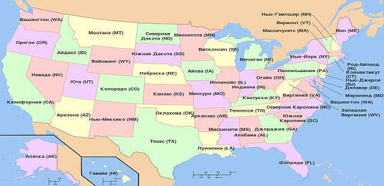

# Контакты
> 2019.07.06 ┊ **🚀 [despace](index.md)** → **[Contact](contact.md)**

[TOC]

---

## Persons

<small>

|*#*|*Person*|*Agencies*|*Etc*|
|:--|:--|:--|:--|
|**A**| [Adler, Mark](zz_adler1.md) | JPL |—|
|| ~~[Allen, Mark Andrew](zz_allen1.md)~~ |—||
|| [Ansari, Arif Husain](zz_ansari2.md) |—| BSIP |
|| [Ansari, R. Rafat](zz_ansari1.md) | GRC |—|
|| [Ansan, Veronique](zz_ansan1.md) |—| LPG |
|| [Arney, Giada](zz_arney1.md) | GSFC |—|
|| [Алексашкин, Сергей Николаевич](zz_alexashkin1.md) | LAV |—|
|| [Ануфрейчик, Константин Владимирович](zz_anufreychik1.md) | IKI RAS |—|
|| Асмус Василий Валентинович |—| Planeta |
|**B**| [Baines, Kevin](zz_baines1.md) | JPL |—|
|| [Baker, Charles L.](zz_baker1.md) | GSFC |—|
|| [Balint, Tibor](zz_balint1.md) | JPL |—|
|| [Beauchamp, Patricia](zz_beauchamp1.md) | JPL |—|
|| [Benz, Alexis C.](zz_benz1.md) |—| Lockheed Martin |
|| [Berger, Gilles](zz_berger1.md) |—| IRAP |
|| [Blamont, Jacques](zz_blamont1.md) | CNES |—|
|| [Bovolo, Francesca](zz_bovolo1.md) |—| FBK-irst |
|| [Bradburne, Chris](zz_bradburne1.md) |—| JHU APL |
|| [Breuer, Doris](zz_breuer1.md) | DLR |—|
|| [Bristow, Thomas F.](zz_bristow1.md) | NASA |—|
|| [Bruzzone, Lorenzo](zz_bruzzone1.md) |—| Trento Univ |
|| [Bullock, Mark](zz_bullock1.md) |—| SWRI |
|| [Byrne, Paul K.](zz_byrne1.md) |—| NCSU |
|| ~~[Бабакин, Георгий Николаевич](zz_babakin1.md)~~ | LAV |—|
|| [Бабакин, Николай Георгиевич](zz_babakin2.md) |—| ASC |
|| ~~[Бармин, Владимир Павлович](zz_barmin1.md)~~ |—| BMSTU |
|| [Буров, Алексей Анатольевич](zz_burov1.md) | LAV |—|
|| [Бурданов, Антон Владимирович](zz_burdanov1.md) | TSNIImash |—|
|**C**| [Campbell, Bruce A.](zz_campbell1.md) |—| SI NASM |
|| [Caro, Tristan](zz_caro1.md) |—| Berkeley Univ |
|| [Carter, Lynn](zz_carter1.md) |—| Arizona Univ |
|| [Chalex, Remy](zz_chalex1.md) | ESA |—|
|| [Chassefiere, Eric](zz_chassefiere1.md) |—| Université Paris-Saclay |
|| [Colaprete, Anthony](zz_colaprete1.md) |—| ARC |
|| [Cordova, Jaime A.](zz_cordova1.md) |—| Wisconsin Univ |
|| [Cottini, Valeria](zz_cottini1.md) |—| Maryland Univ |
|| [Cutts, James Alfred](zz_cutts1.md) | JPL |—|
|| ~~[Челомей, Владимир Николаевич](zz_chelomei1.md)~~ |—| CIAM |
|| [Чулков, Илья Владиленович](zz_chulkov1.md) | IKI RAS |—|
|**D**| [D'Incecco, Piero](zz_dincecco1.md) |—| IRSPS |
|| [Domagal-Goldman, Shawn](zz_domagalgoldman1.md) | GSFC |—|
|| [Dong, Chuanfei](zz_dong1.md) |—| Princeton Univ |
|| [Dumoulin, Caroline](zz_dumoulin1.md) |—| LPG |
|| [Dyar, Darby](zz_dyar1.md) |—| Mount Holyoke College |
|| [Долгополов, Владимир Павлович](zz_dolgopolov1.md) | LAV |—|
|**E**| [Economou, Thanasis](zz_economou1.md) |—| Chicago Univ |
|| [Ernst, Richard E.](zz_ernst1.md) |—| Carleton Univ., Tomsk SU |
|| [Esposito, Larry W.](zz_esposito1.md) |—| LASP |
|| [Ewan, Shannon](zz_ewan1.md) | NASA |—|
|| [Евдокимова, Дарья Геннадьевна](zz_evdokimova1.md) | IKI RAS |—|
|| [Елшанский, Леонид Борисович](zz_елшанский1.md) | Roscosmos |—|
|| Ефанов Владимир Владимирович | LAV |—|
|| [Ёлкин, Константин Сергеевич](zz_elkin1.md) | TSNIImash |—|
|| [Эйсмонт, Натан Андреевич](zz_eismont1.md) | IKI RAS |—|
|**G**| [Gentry, Diana M.](zz_gentry1.md) |—| ARC |
|| [Ghail, Richard](zz_ghail1.md) |—| Royal Holloway |
|| [Glaze, Lori S.](zz_glaze1.md) | GSFC |—|
|| [Cockell, Charles Seaton](zz_cockell1.md) |—| Edinburgh Univ |
|| [Gonçalves, Ruben](zz_gonzalves1.md) |—| IA |
|| [Gorevan, Stephen Paul](zz_gorevan1.md) |—| Honeybee |
|| [Gray, Candice](zz_gray1.md) |—| New Mexico Univ |
|| [Green, James Lauer](zz_green1.md) | NASA |—|
|| [Gregg, Tracy](zz_gregg1.md) |—| UB |
|| [Grimm, Robert E.](zz_grimm1.md) |—| SWRI |
|| [Grinspoon, David](zz_grinspoon1.md) |—| PSI |
|| [Гаврик, Анатолий Леонидович](zz_gavrik1.md) |—| IRE RAS |
|| [Гаврилин, Сергей Иванович](zz_gavrilin1.md) | LAV |—|
|| [Герасимов, Михаил Владимирович](zz_gerasimov1.md) | IKI RAS |—|
|| [Горинов, Дмитрий Алексеевич](zz_gorinov1.md) | IKI RAS |—|
|| [Губайдуллин Валерий Шарифьянович](zz_gubaydullin1.md) | TSNIImash |—|
|**H**| [Hashimoto, George L.](zz_hashimoto1.md) |—| Okayama Univ |
|| [Hayashi, Yoshi-Yuki](zz_hayashi1.md) |—| Kobe Univ |
|| [Hall, Jeffery L.](zz_hall1.md) | JPL |—|
|| [Head, James W.](zz_head1.md) |—| Brown Univ |
|| [Helbert, Jörn](zz_helbert1.md) | DLR |—|
|| [Hino, Takafumi](zz_hino1.md) |—| Matsue Coll |
|| [Hunter, Gary W.](zz_hunter1.md) | GRC |—|
|| [Хайлов, Михаил Николаевич](zz_hailov1.md) | Roscosmos |—|
|| [Хатунцев, Игорь Валерьевич](zz_hatuntsev1.md) | IKI RAS |—|
|**I**| [Imamura, Takeshi](zz_imamura1.md) |—| Tokyo Univ |
|| [Ishii, Nobuaki](zz_ishii1.md) | ISAS/JAXA |—|
|| [Iwagami, Naomoto](zz_iwagami1.md) |—| Tokyo Univ |
|| [Izenberg, Noam](zz_izenberg1.md) |—| JHUAPL |
|| [Иванов, Михаил Арсеньевич](zz_ivanov4.md) |—| GEOKHI |
|| [Иванов, Сергей Вениаминович](zz_ivanov6.md) | LAV |—|
|| [Игнатьев, Николай Игоревич](zz_ignatiev1.md) | IKI RAS |—|
|**J**| [Jessup, Kandis Lea](zz_jessup1.md) | NASA |—|
|| [Jindal, Abhinav](zz_jindal1.md) |—| Cornell Univ |
|| [Johnson, Natasha M.](zz_johnson1.md) | GSFC |—|
|**K**| [Kerzhanovich, Viktor V.](zz_kerzhanovich1.md) | JPL |—|
|| [Kiefer, Walter S.](zz_kiefer1.md) |—| LPI |
|| [Kleinboehl, Armin](zz_kleinboehl1.md) | JPL |—|
|| [Kohler, Erika](zz_kohler1.md) | GSFC |—|
|| [Kolawa, Elizabeth A.](zz_kolawa1.md) | JPL |—|
|| [Komatsu, Goro](zz_komatsu1.md) |—| IRSPS |
|| [Kremic, Tibor](zz_kremic1.md) | GRC |—|
|| [Kwok, John H.](zz_kwok1.md) | JPL |—|
|| [Казмерчук, Павел Владимирович](zz_kazmerchuk1.md) | LAV |—|
|| ~~[Кардашёв, Николай Семёнович](zz_kardashev1.md)~~ |—| ASC |
|| ~~[Келдыш, Мстислав Всеволодович](zz_keldysh1.md)~~ |—| AS USSR |
|| [Коваленко, Ирина Дмитриевна](zz_kovalenko1.md) | IKI RAS |—|
|| [Комаров, Александр Юрьевич](zz_komarov1.md) | LAV |—|
|| [Комбаев, Тимур Шикурович](zz_kombaev1.md) | LAV |—|
|| [Компаниченко, Владимир Николаевич](zz_kompanichenko1.md) |—| IKARP |
|| [Коптев, Юрий Николаевич](zz_koptev1.md) |—| Rostec |
|| [Кораблёв, Олег Игоревич](zz_korablev1.md) | IKI RAS |—|
|| ~~[Королёв, Сергей Павлович](zz_korolev1.md)~~ |—| OKB-1 |
|| Косенкова Анастасия Владимировна | LAV |—|
|| [Косов, Александр Сергеевич](zz_kosov1.md) | IKI RAS |—|
|| [Костицын, Юрий Александрович](zz_kostitsyn1.md) |—| GEOKHI |
|| [Котляров, Евгений Юрьевич](zz_kotlyarov1.md) | LAV |—|
|| [Коцюрбенко, Олег Ролландович](zz_kotsurbenko1.md) |—| UGRA |
|| ~~[Ксанфомалити, Леонид Васильевич](zz_ksanfomaliti1.md)~~ | IKI RAS |—|
|| Кусь Олег Николаевич |—| OKB 5 |
|**L**| [Le Gall, Alice Anne](zz_legall1.md) |—| LATMOS |
|| [Lebonnois, Sebastien](zz_lebonnois1.md) |—| Sorbonne Univ., LMD |
|| [Lee, Yeon Joo](zz_lee1.md) |—| Berlin Tech.Univ |
|| [Lefevre, Maxence](zz_lefevre1.md) |—| Oxford Univ |
|| [Lefort, Jayne](zz_lefort1.md) | ESA |—|
|| [Lewis, Neil Tamas](zz_lewis1.md) |—| Oxford Univ |
|| [Limaye, Sanjay Shridhar](zz_limaye1.md) |—| Wisconsin Univ |
|| [Lopes, Rosaly M.C.](zz_lopes1.md) | JPL |—|
|| [Lorenz, Ralph](zz_lorenz1.md) |—| JHUAPL |
|| [Luhmann, Janet G.](zz_luhmann1.md) |—| NASA, Berkley |
|| ~~[Лавочкин, Семён Алексеевич](zz_lavochkin1.md)~~ | OKB-301 |—|
|| [Литвак, Максим Леонидович](zz_litvak1.md) | IKI RAS |—|
|| [Лукьянчиков, Александр Владимирович](zz_lukianchikov1.md) | LAV |—|
|**M**| [Mackwell, Stephen J.](zz_mackwell1.md) |—| AIP |
|| [Mahapatra, Gourav](zz_mahapatra1.md) |—| TU Delft |
|| [Mankins, John C.](zz_mankins1.md) |—| Mankins Space Tech |
|| [Marcq, Emmanuel](zz_marcq1.md) |—| LATMOS, UVSQ |
|| [Maroko, Elena](zz_maroko1.md) | NASA |—|
|| [Martino, Paolo](zz_martino1.md) | ESA |—|
|| [Mason, Philippa J.](zz_mason1.md) |—| Imperial College |
|| [McCabe, Ryan](zz_mccabe1.md) |—| Hampton Univ |
|| [McGouldrick, Kevin](zz_mcgouldrick1.md) |—| LASP |
|| [McGovern, Patrick J.](zz_mcgovern1.md) |—| LPI |
|| [McKaig, Jordan](zz_mckaig1.md) |—| Michigan Univ |
|| [Millour, Ehouarn](zz_millour1.md) |—| LMD |
|| [Mills, Franklin](zz_mills1.md) |—| ANU |
|| [Mogul, Rakesh](zz_mogul1.md) |—| CPP |
|| [Murakami, Shin-ya](zz_murakami1.md) | ISAS/JAXA |—|
|| [Мальцев, Михаил Владимирович](zz_maltsev1.md) |—| KBHM |
|| [Маров, Михаил Яковлевич](zz_marov1.md) |—| IPM Keldysh |
|| Мартынов, Алексей Борисович | LAV |—|
|| [Митрофанов, Игорь Георгиевич](zz_mitrofanov1.md) | IKI RAS |—|
|| ~~[Мороз, Василий Иванович](zz_moroz1.md)~~ |—| GAISh |
|| [Морозов, Владимир Иванович](zz_morozov1.md) |—| KBHM |
|**N**| [Nakamura, Masato](zz_nakamura1.md) |—| JAXA |
|| [Neduncheran, Adhithiyan](zz_neduncheran1.md) |—| UPES |
|| [Nock, Kerry T.](zz_nock1.md) | GAC |—|
|| [Намсараев, Зоригто Баирович](zz_namsaraev1.md) |—| Kurchatov Inst. |
|**O**| [Ocampo, Adriana Christian](zz_ocampo1.md) | JPL |—|
|| [Ogawa, Masaki](zz_ogawa1.md) |—| Tokyo Univ |
|| [O'Rourke, Joseph](zz_orourke1.md) |—| Arizona Univ |
|**P**| [Patel, Manish](zz_patel1.md) |—| Open Univ |
|| [Parkinson, Christopher Dennis](zz_parkinson1.md) |—| Michigan Univ |
|| [Peralta, Javier Calvillo](zz_peralta1.md) | ISAS/JAXA |—|
|| [Peterson, Craig E.](zz_peterson1.md) |—||
|| [Pickering, Andrew](zz_pickering1.md) | ESA |—|
|| Павлинский, Михаил Николаевич | IKI RAS |—|
|| [Павлов, Анатолий Константинович](zz_pavlov1.md) |—| Ioffe Inst. |
|| [Петров, Максим Евгеньевич](zz_petrov1.md) | LAV |—|
|| [Петрукович, Анатолий Алексеевич](zz_petrukovich1.md) | IKI RAS |—|
|| [Писаренко, Павел Дмитриевич](zz_pisarenko1.md) | LAV |—|
|**R**| [Rabinovitch, Jason](zz_rabinovitch1.md) | JPL |—|
|| [Radke, Michael J.](zz_radke1.md) |—| J.Hopkins Univ |
|| [Read, Peter](zz_read1.md) |—| Oxford Univ |
|| [Rebuffat, Denis](zz_rebuffat1.md) | ESA |—|
|| [Rodriguez, Aaron Garduño](zz_rodriguez1.md) |—| MAI |
|| [Romstedt, Jens](zz_romstedt1.md) |—| ESTEC |
|| [Rosenblatt, Pascal](zz_rosenblatt1.md) |—| Geoazur |
|| [Royer, Emilie](zz_royer1.md) |—| LASP |
|| [Rugina, Ana](zz_rugina1.md) |—| ESTEC |
|| [Russell, Christopher Thomas](zz_russell1.md) |—| UCLA |
|| [Родионов, Даниил Станиславович](zz_rodionov1.md) | IKI RAS |—|
|**S**| [Sasaki, Satoshi](zz_sasaki1.md) |—| Tokyo Univ |
|| [Satoh, Takehiko](zz_satoh1.md) | ISAS/JAXA |—|
|| [Sayanagi, Kunio](zz_sayanagi1.md) |—| Hampton Univ |
|| [Senske, David](zz_senske1.md) | JPL |—|
|| [Schubert, Gerald](zz_schubert1.md) |—| UCLA |
|| [Slowik, Grzegorz](zz_slowik1.md) |—| Zielona Univ |
|| [Smith, David Joseph](zz_smith1.md) |—| ARC |
|| [Smrekar, Suzanne](zz_smrekar1.md) | JPL |—|
|| [Spiga, Aymeric](zz_spiga1.md) |—| Sorbonne Univ., LMD |
|| [Spilker, Tom](zz_spilker1.md) |—||
|| [Stofan, Ellen R.](zz_stofan1.md) |—| National Air & Space Museum |
|| [Sugiyama, Koichiro](zz_sugiyama1.md) |—| Matsue Coll |
|| [Svedhem, Håkan](zz_svedhem1.md) |—| ESTEC |
|| [Сагдеев, Роальд Зиннурович](zz_sagdeev1.md) |—| UMD |
|| [Симонов, Александр Владимирович](zz_simonov1.md) | LAV |—|
|| [Сысоев, Валентин Константинович](zz_sysoev1.md) | LAV |—|
|| [Щеглов, Георгий Александрович](zz_scheglov1.md) |—| BMSTU |
|**T**| [Taguchi, Makoto](zz_taguchi1.md) |—| Rikkyo Univ |
|| [Takahashi, Yukihiro](zz_takahashi1.md) |—| Hokkaido Univ |
|| [Tenishev, Valeriy](zz_tenishev1.md) |—| Michigan Univ |
|| [Thompson, Thomas W.](zz_thompson1.md) | JPL |—|
|| [Tilman, Justin Eugene](zz_tilman1.md) | NASA |—|
|| [Titov, Dmitri](zz_titov1.md) |—| ESTEC |
|| [Treiman, Allan](zz_treiman1.md) |—| LPI |
|| [Твердислов, Всеволод Александрович](zz_tverdislov1.md) |—| MSU |
|| [Третьяков, Владислав Иванович](zz_tretiakov1.md) | IKI RAS |—|
|| [Тучин, Андрей Георгиевич](zz_tuchin1.md) |—| IPM Keldysh |
|| Тучин, Денис Андреевич |—| IPM Keldysh |
|**U**| Устинов Святослав Николаевич | LAV |—|
|**V**| [Vandaele, Ann Carine](zz_vandaele1.md) |—| BIRA |
|| [Voirin, Thomas](zz_voirin1.md) | ESA |—|
|| [Vonstad, Frida Klæbo](zz_vonstad1.md) |—| UCL |
|| [Voytek, Mary](zz_voytek1.md) | NASA |—|
|| [Вайсберг, Олег Леонидович](zz_vaysberg1.md) | IKI RAS |—|
|| [Ворон, Виктор Владимирович](zz_voron1.md) | Roscosmos |—|
|| [Воронцов, Виктор Александрович](zz_voronцов1.md) |—| MAI |
|**W**| [Wang, Alian](zz_wang1.md) |—| WUSTL |
|| [Watanabe, Shigeto](zz_watanabe1.md) |—| Hokkaido Information Univ |
|| [Way, Michael Joseph](zz_way1.md) | NASA/GISS |—|
|| [Widemann, Thomas](zz_widemann1.md) |—| Paris Obs |
|| [Wielders, Arno](zz_wielders1.md) | ESA |—|
|| [Wilson, Colin F.](zz_wilson1.md) |—| Oxford Univ |
|**Y**| [Yamagishi, Akihiko](zz_yamagishi1.md) |—| TUPLS |
|**Z**| [Занин, Кирилл Анатольевич](zz_zanin1.md) | LAV |—|
|| [Засова, Людмила Вениаминовна](zz_zasova1.md) | IKI RAS |—|
|| [Застенкер, Георгий Наумович](zz_zastenker1.md) | IKI RAS |—|
|| [Захаров, Александр Валентинович](zz_zaharov1.md) | IKI RAS |—|
|| [Зелёный, Лев Матвеевич](zz_zelenyi1.md) | IKI RAS |—|

</small>

 

## Cooperation
> И эти люди запрещают нам ковыряться в носу!

Здесь представлена информация о кооперации НПОЛ (ИКИ, ЦНИИмаш, ИСС и пр). Краткое описание, область работ кооперации, опыт работы с ними. Заодно приведены некоторые иностранные фирмы, работающие в космической промышленности и сочувствующие ей.

   1. [ALPO](zz_alpo.md) — Association of Lunar and Planetary Observers
   1. [CCSDS](ccsds.md) — международный Консультативный Комитет по косм. системам передачи данных.
   1. [IAF](zz_iaf.md) — International astronautical federation, Международная астронавтическая федерация.
   1. [Project Management Institute](project_management_institute.md)
   1. [SEDS](zz_seds.md) — Students for the Exploration and Development of Space.
   1. [Space Generation Advisory Council](zz_space_gac.md) represent students and young space professionals to the United Nations, States, and space agencies.
   1. [Synergy Moon](synergy_moon.md)
   1. [Болото](swamp.md)
   1. [Менталитет в странах](менталитет_в_странах.md)

|*Агентство*|*Бюджет, $ млн*|*Год*|*Примечание*|
|:--|:--|:--|:--|
| США, [NASA](zz_nasa.md) | 17 700 | 2013, прогноз | |
| Европа, [ESA](zz_esa.md) | 5 500 | 2012 | € 4 020 100 млн |
| Россия, [Роскосмос](zz_roskosmos.md) | 4 700 | 2014 | ₽ 165 800 млн |
| Япония, [JAXA](zz_jaxa.md) | 2 460 | 2010 | ¥ 229 000 млн |
| Китай, [CNSA](zz_cnsa.md) | 1 300 | 2009, оценка | |
| Индия, [ISRO](zz_isro.md) | 1 200 | 2010‑2011 | |
| Канада, [CSA](zz_csa.md) | 425 | 2010‑2011 | |
| Корея Южная, [KARI](zz_kari.md) | 366 | 2007 | |
| Алжир, [ASAL](zz_asal.md) | 360 | 2002 | |
| Украина, [ГКА](zz_nkau.md) | 300 | |
| Аргентина, [CONAE](zz_conae.md) | 180 | 2014 | |

 

### ± Australia
<small>

(**E**)ducation / (**N**)on‑profit, (**L**)aunch services, (**P**)romote, (**R**)&D&Manufacture / (**C**)onsulting

|*• Organization (AU) •*|*E*|*L*|*P*|*R*|*Industry*|
|:--|:--|:--|:--|:--|:--|
|**··· Head ···**|•|•|•|•|• • •|
| [ASRI](zz_asri.md) ||||| Австралийский институт космических исследований |
|**··· Contractors ···**|•|•|•|•|• • •|
| [ANU](zz_anu.md) ||||| Australian National University |
| [Arlula](zz_arlula.md) ||||| Provides a single point of access for a global network of sats imagery |
| [ASL](zz_asl.md) ||||| Australia Space Launch |
| [AYAA](zz_ayaa.md) |N|||| Promote education, awareness, involvement in the A/S industry to young Australians |
| [Fleet Space Tech.](zz_fleet_space_tech.md) ||||| IoT with nanosat constellation |
| [Gilmour Space Tech.](zz_gilmour_st.md) ||||| Develop/launching low cost hybrid LV for small satellites to LEO |
| [HEO Robotics](zz_heo_robotics.md) ||||| Acquire imagery of sats, space‑debris, resource‑rich asteroids with nanosats |
| [Myriota](zz_myriota.md) ||||| IoT with nanosat constellation |
| [Optus](zz_optus.md) ||||| Mobile, telephony, internet, satellite, entertainment and business network services |
| [Saber Astronautics](zz_saber_an.md) ||||| Model the interaction between SC telemetry and the space environment |
| [SERC](zz_serc.md) ||||| Removal of orbital debris |
| [Southern Launch](zz_southern_launch.md) ||||| Infrastructure/logistics support for (sub)orbital launches |
| [Space Services Australia](zz_space_services_au.md) ||||C| Modelling, simulation, system analysis |

</small>

 

### ± Canada

   - *Org. lists:* [spaceq.ca ⎆](http://www.spaceq.ca/canadian-space-companies/), [aiac.ca ⎆](https://aiac.ca/product-categories/space-systems/#satellite-systems-components), [thecanadianencyclopedia.ca ⎆](https://www.thecanadianencyclopedia.ca/en/article/aerospace-industry)

<small>

(**E**)ducation / (**N**)on‑profit, (**L**)aunch services, (**P**)romote, (**R**)&D&Manufacture / (**C**)onsulting

|*• Organization (CA) •*|*E*|*L*|*P*|*R*|*Industry*|
|:--|:--|:--|:--|:--|:--|
|**··· Head ···**|•|•|•|•|• • •|
| [CSA](zz_csa.md)   (QC) ||||| Канадское правительственное космическое агентство |
|**··· Contractors ···**|•|•|•|•|• • •|
| [ADGA](zz_adga.md)   (ON) ||||C| Advanced technology solutions, professional engineering & consultancy |
| [AIAC](zz_aiac.md)   (ON) ||||| Aerospace Industries Association of Canada |
| [AlbertaSat](zz_albertasat.md)   (AB) |N|||| Cubesats |
| [August IS Tech](zz_august_is_tech.md)   (ON) |E|||R| Space infrastructure, R&D, education, commercialization of innovative solutions |
| [Baryon Dynam.](zz_baryon_dyn.md)   (ON) ||||| Power & space propulsion, engineering designs & expertise |
| [BRASS](zz_brass.md)   (ON) ||||| Разработка новых космических технологий |
| [C6 Launch](zz_c6_launch.md)   (ON) ||||| Пуск кубсатов |
| [Canadensys](zz_canadensys.md)   (ON) ||||| Cubesats, rovers, SC systems |
| [CASI](zz_casi.md)   (ON) |E|||| Canadian Aeronautics & Space Institute |
| [CCERA](zz_ccera.md)   (ON) ||||| Canadian Center for Experimental Radio Astronomy |
| [Columbiad](zz_columbiad.md)   (ON) ||L||| Commercial low‑cost space launch |
| [Concordia Univ.](zz_concordia_univ.md)   (QC) |E|||| … |
| [CPSX](zz_cpsx.md)   (ON) ||||| Planetary science, exploration research, training |
| [CSS](zz_css.md)   (ON) |N|||| Канада в космосе |
| [Deltion Ltd](zz_deltion.md)   (ON) ||||| Добыча ресурсов, роботизация, разработка астероидов |
| [DSS](zz_dsslabs.md)   (NS) |N|||| Кубсаты. Студенческое общество |
| [Euroconsult](zz_euroconsult.md)   (QC) ||||C| Strategic, research, summits, training programs |
| [Geocentrix Tech.](zz_geocentrix_tech.md)   (BC) ||||| Satellite/Launch mission design, analysis, operations, management, consulting |
| [GHGSat](zz_ghgsat.md)   (QC) ||||| Съёмка Земли |
| [Globvision Inc](zz_globvision.md)   (QC) ||||| Software |
| [Honeywell A/S](zz_honeywell_as.md)   () ||||| … |
| [Kepler Comms](zz_kepler_comms.md)   (ON) ||||| Съёмка Земли, IoT, Cubesats |
| [Lassonde SoE](zz_lassonde_soe.md)   (ON) |E|||| … |
| [Launch Canada](zz_launch_canada.md)   () |N|||R| Student community, LV and small sats building |
| [Luna D&I](zz_luna_dni.md)   (ON) ||||| Поддержка биоэкспериментов в космосе |
| [Macfab](zz_macfab.md)   (ON) ||||| ADCS, structures, comms/electronics, sensors, propulsion, separation systems |
| [Magellan A/S](zz_magellan_as.md)   (ON) ||||| СЧ КА и системы |
| [MCSS inc](zz_mcss_inc.md)   (ON) ||||| Роботы, планетоходы |
| [MDA](zz_mda.md)   (ON,QC) ||||| СЧ КА и системы |
| [Microsat Sys.C.](zz_microsat_sys.md)   (ON) ||||R| Reaction wheels, rate measurement units, microsats |
| [MLS](zz_mls.md)   (NS) ||L||| Космодром в Новой Шотландии |
| [MSCI](zz_msci.md)   (ON) ||||| Микроспутники, ДМ |
| [NGC A/S](zz_ngc_as.md)   (QC) ||||| ПО, алгоритмы, симуляция |
| [Northstar ESI](zz_northstar_esi.md)   (QC) ||||| Track orbital objects |
| [Pale Blue Dot](zz_pale_blue_dot.md)   (ON) |N||P|| … |
| [PolyOrbite](zz_polyorbite.md)   (QC) |N|||| Кубсаты. Студенческое общество |
| [Pratt & Whitney](zz_pratt_n_whitney.md)   (QC) ||||R| Rocket engines |
| [Satcan](zz_satcan.md)   (ON) |N|||| Engineering & business services for satellite sector |
| [SED Systems](zz_sed_systems.md)   (SK,QC) ||||| БРК, тестовое оборудование, наблюдение, управление |
| [SEDS Canada](zz_seds.md)   (ON) |N|||| Students for the Exploration & Development of Space |
| [Sinclair I/P](zz_sinclair_ip.md)   (ON) ||||| Star trackers, reaction wheels, optical comms, software, training & expertise |
| [SpaceRyde](zz_spaceryde.md)   (ON) ||||| Affordable, on‑schedule, dedicated launch for CubeSats |
| [Space Concordia](zz_space_concordia.md)   (QC) |N|||| Кубсаты, лёгкие РН |
| [Space Eng. Sys.](zz_space_engs.md)   (AL) ||||R| Next gen. reusable propulsion technologies |
| [SkyWatch](zz_skywatch.md)   (ON) ||||| Открытая информация от съёмки Земли |
| [SSCL](zz_sscl.md)   (ON) ||||| Consulting, innovative solutions |
| [Telecan Space](zz_telecan_space.md)   (QC) ||||| Engineering, thermal testing, R&D, consulting & training services |
| [Telesat](zz_telesat.md)   (ON) ||||| Спутники Земли и телекоммуникации |
| [Thales Canada](zz_thales.md)   (All) ||||| Satellite and LV hardware |
| [Thoth Tech.](zz_thoth_tech.md)   (ON) ||||| Instruments for microsats & UAV platforms, space qualification services & tracking |
| [UrtheCast](zz_urthecast.md)   (BC) ||||| Съёмка Земли |
| [UTIAS](zz_utias.md)   (ON) ||||| Исследования и прикладная механика. Институт |
| [UTIAS SFL](zz_utias_sfl.md)   (ON) ||||| Разработка, создание спутников |
| [Wyvern Space](zz_wyvern.md)   (AB) ||||| Съёмка Земли |
| [Xiphos](zz_xiphos.md)   (QC) ||||| ЦВМ, ПО |
|**··· Not space ···**|•|•|•|•| Avant Aerospace, CAE |

</small>

 

### ✘ China
<small>

(**E**)ducation / (**N**)on‑profit, (**L**)aunch services, (**P**)romote, (**R**)&D&Manufacture / (**C**)onsulting

|*• Organization (CN) •*|*E*|*L*|*P*|*R*|*Industry*|
|:--|:--|:--|:--|:--|:--|
|**··· Head ···**|•|•|•|•|• • •|
| [CNSA](zz_cnsa.md) ||||| Китайское национальное космическое управление |
|**··· Contractors ···**|•|•|•|•|• • •|
| [LandSpace ](zz_landspace.md) ||L||R| Design, manufacturing & operations of small and medium LV |

</small>

 

### ✘ Europe
<small>

(**E**)ducation / (**N**)on‑profit, (**L**)aunch services, (**P**)romote, (**R**)&D&Manufacture / (**C**)onsulting

|*• Organization (EU) •*|*E*|*L*|*P*|*R*|*Industry*|
|:--|:--|:--|:--|:--|:--|
|**··· Head ···**|•|•|•|•|• • •|
| [CNES](zz_cnes.md)   (FR) ||||| Французское космическое агентство |
| [DLR](zz_dlr.md)   (GR) ||||| Германское космическое агентство |
| [ESA](zz_esa.md)   (EU) ||||| Исследование космоса. [Роскосмос](zz_roskosmos.md) и  ГНИО в одном лице |
| [ESTEC](zz_estec.md)   (NL) ||||| Разработка и создание космических технологий и КА |
| [SSO](zz_sso.md)   (CH) ||||| Swiss Space Office, national space program of Switzerland |
| [UKSA](zz_uksa.md)   (UK) |E|L|P|R| UK Space Agency |
|**··· Contractors ···**|•|•|•|•|• • •|
| [AAC CS](zz_aac_cs.md)   (SE) ||||| Кубсаты, малые КА, СЧ |
| [ADS](zz_ads.md)   (GR) ||||| Military Aircraft; [SCS](scs.md), Electronics, Comms, Intelligence, Security |
| [ARCA Dynamics](zz_arca_dymanics.md)   (IT) ||||| Cubesats, GNC, space robotics, AI |
| [ASP Equipment](zz_asp_equipment.md)   (DE) ||||R| Power: DC/DC converters, IPU, PCDU, EPC, propulsion power |
| [Astrocast](zz_astrocast.md)   (CH) ||||| Satellite operator, constellation of nano‑sats on LEO, IoT communications |
| [B2Space](zz_b2space.md)   (UK) ||||| Launch services (balloon and LV) for small‑micro sats |
| [Bradford Eng.](zz_bradford_eng.md)   (NL) ||||| [СУ](cs.md) КА: [ДМ](rw.md), [СД](sensor.md), смесители топлива |
| [ClearSpace SA](zz_clearspace_sa.md)   (CH) ||||R| Space debris remova: technologies and services |
| [Cobham](cobham.md)   (UK) ||||| СЧ КА, процессоры |
| [CUNI](zz_cuni.md)   (CZ) ||||| Карлов университет. Один из старейших университетов мира |
| [Disrupt Space](zz_disrupt_space.md)   (DE) |N||P|| Startup accelerator, entrepreneurship, and community|
| [Edinburgh Univ.](zz_edinburgh_univ.md)   (UK) ||||| University of Edinburgh |
| [Effective Space](zz_effective_space.md)   (UK) ||||| Life‑extension & other in‑orbit services for satellites |
| [Euroconsult](zz_euroconsult.md)   (FR) ||||C| Strategic, research, summits, training programs |
| [EU Space Found.](zz_eu_space_foundation.md)   (PL) |||P|| Promote knowledge in science, engineering, technology & mathematics |
| [GAUSS Srl](zz_gauss_srl.md)   (IT) |E|||R| Cubesats, GS operations, space debris observation |
| [Hisdesat](zz_hisdesat.md)   (ES) ||||| … |
| [IA](ia.md)   (PT) ||||| Instituto de Astrofísica e Ciências do Espaço |
| [Iceye](iceye.md)   (FL) ||||| Разработка и создание микроспутников и кубсатов |
| [InnovaSpace](zz_innovaspace.md)   (UK) |E||P|| Promote/conduct R&D, education, innovations for humanity in space |
| [Int. Space Univ.](zz_int_space_univ.md)   (FR) |E|||| Space education for a changing world |
| [IRAP](zz_irap.md)   (FR) ||||| Research Institute in Astrophysics and Planetology |
| [IRF](zz_irf.md)   (SE) ||||| Фундам. исследования косм. физики и физики атмосферы |
| [IRSPS](zz_irsps.md)   (IT) ||||| … |
| [ISU](zz_isu.md)   (FR) |E|||| … |
| [Karman Project](zz_karman_project.md)   (DE) |N||P|| Connecting people |
| [LATMOS](zz_latmos.md)   (FR) ||||| Фундам. исследования наземных и планетных атмосфер |
| [Leonardo](leonardo.md)   (IT) ||||| … |
| [Libre space](zz_libre_space_f.md)   (GR) |N||P|| To promote, advance, develop libre technologies & knowledge for space |
| [LMD](lmd.md)   (FR) ||||| … |
| [Moon Village As.](zz_moon_village_a.md)   (AT) |N|||| Global info‑forum for gov./industry/academia, etc. for dev. of the Moon Village |
| [Morpheus Space](zz_morpheus_space.md)   (DE) ||||R| Electric propulsion and Artificial Intelligence |
| [Nammo](nammo.md)   (NO) ||||| Двигатели |
| [Neutron Star Sys.](zz_dlr.md)   (GR) ||||| Electric propulsion (EP) systems and subsystems |
| [OHB SE](zz_ohb_se.md)   (DE) ||||| Satellites, exploration, human spaceflight |
| [Open Cosmos](zz_open_cosmos.md)   (UK) ||||| R&D satellites |
| [OPC LAM](zz_opc_lam.md)   (GR) ||||| Разработка и создание двигателей, ДУ |
| [OQ Technology ](zz_oq_technology.md)   (LU) ||||R| Sats constellation for IoT |
| [Oxford Univ.](oxford_univ.md)   (UK) ||||| … |
| [Paris Obs.](paris_obs.md)   (FR) ||||| … |
| [QitetiQ](zz_qitetiq.md)   (UK) ||||| Communications & security, spacecraft & subsystems, spaceflight training |
| [PLD Space](zz_pld_space.md)   (ES) ||L||R| Reusable (sub)orbital LV for small sats ([MIURA](miura.md)) |
| [PTScientists](ptscientists.md) ||||| … |
| [RUAG Space](ruag_space.md)   (SE) ||||| Разработка/создание электроники, механизмов РН, КА |
| [Saft](zz_saft.md)   (FR) ||||| Элементы электропитания |
| [SES Satellites](zz_ses_satellites.md)   (LU) ||||| Deliver video and data solutions, LEO/MEO sats |
| [SGAC](zz_sgac.md)   (AT) ||||| Represent students & young space professionals to the United Nations |
| [Sodern](zz_sodern.md)   (FR) ||||| … |
| [Solar MEMS](zz_solarmems.md)   (ES) ||||| СД |
| [Sorbonne Univ.](sorbonne_univ.md)   (FR) ||||| … |
| [Space Expl. Inst.](zz_space_explor_inst.md)   (CH) |N|||| Developing space exploration activities, instruments |
| [Space Forge](zz_space_forge.md)   (UK) ||||R| Reusable sats for material manufacturing in space  |
| [Space Mining T.](zz_space_mintech.md)   (EU) ||||| Moon & asteroids mining |
| [Swedish SC](swedish_sc.md)   (SE) ||||| КА, кубсаты, аэростаты, НС |
| [TAS-I](zz_tas_i.md)   (FR) ||||| … |
| [Terma A/S](zz_terma.md)   (DK) ||||| … |
| [TU Delft](tu_delft.md)   (NL) ||||| … |
| [UCL](zz_ucl.md)   (UK) ||||| … |
| [UEF SAV](zz_uef_sav.md)   (SK) ||||| Ядерная, субатомная физика, физика космоса, биофизика |
| [UFA](zz_ufa.md)   (CZ) ||||| … |
| [UNIBE](zz_unibe.md)   (CH) ||||| … |
| [UVSQ](uvsq.md)   (FR) ||||| … |
| [Waven](zz_waven.md)   (PL) ||||R| Energy harvesting. Alternative to photovoltaics and RTG. Consumption reducing |
| [Zero 2 Infinity](zz_zero_2_infinity.md)   (IT) ||L||R| Space transportation, launch small sats |
| [Zielona Univ.](zz_zielona_univ.md)   (PL) |E|||| … |

</small>

 

### ✘ India
<small>

(**E**)ducation / (**N**)on‑profit, (**L**)aunch services, (**P**)romote, (**R**)&D&Manufacture / (**C**)onsulting

|*• Organization (IN) •*|*E*|*L*|*P*|*R*|*Industry*|
|:--|:--|:--|:--|:--|:--|
|**··· Head ···**|•|•|•|•|• • •|
| [ISRO](zz_isro.md) ||||| Индийское национальное космическое агентство |
|**··· Contractors ···**|•|•|•|•|• • •|
| [BSIP](zz_bsip.md) ||||| Birbal Sahni Institute of Palaeosciences |
| [Skyroot A/S](zz_skyroot_as.md) ||||| <mark>TBD</mark> Launch vehicles |
| [Space Dev. Network](zz_space_dev_netw.md) ||||| <mark>TBD</mark> Space Development Network |
| [Synergy Moon](zz_synergy_moon.md) ||||R| Lunar rover |
| [Team Indus](team_indus.md) ||||| <mark>TBD</mark> |
| [Timewarp Space](zz_timewarp_space.md) ||L||R| LV for small sats |
| [UPES](zz_upes.md) ||||| University of Petroleum & Energy Studies |

</small>

 

### ± Israel
<small>

(**E**)ducation / (**N**)on‑profit, (**L**)aunch services, (**P**)romote, (**R**)&D&Manufacture / (**C**)onsulting

|*• Organization (IL) •*|*E*|*L*|*P*|*R*|*Industry*|
|:--|:--|:--|:--|:--|:--|
|**··· Head ···**|•|•|•|•|• • •|
| [ISA](zz_isa.md) ||||| Координация научных/коммерческих программ исследования КП |
|**··· Contractors ···**|•|•|•|•|• • •|
| [AMOS-Spacecom](zz_amos_spacecom.md) ||||| Fixed‑satellite operator, communication solutions |
| [Asher SRI](zz_asher_sri.md) |E|||| Asher Space Research Institute |
| [D-MARS](zz_d_mars.md) |E||P|| Promote the space sector. Simulations, training, tech testing, education |
| [DSO Technologies IL](zz_dso_tech.md) ||||| … |
| [Herzliya Space Lab](zz_herzliya_space_lab.md) |N|||| Student satellite building lab |
| [IAI](zz_iai.md) ||||| … |
| [ImageSat Int.](zz_imagesat_int.md) ||||| Geospatial solutions & services: imagery, data, analytics |
| [Israeli Air Force](zz_israeli_af.md) ||||| … |
| [NovelSat](zz_novelsat.md) ||||| Content connectivity solutions for sat comms |
| [NSLComm](zz_nslcomm.md) ||||R| Antenna technologies |
| [Rafael](zz_rafael.md) ||||| … |
| [Space-Nest](zz_space_nest.md) ||||| Space tech/applications incubator |
| [Spacecialist](zz_spacecialist.md) |||P|| Nano‑Cubesat projects, promote a prosperous civilian space industry |
| [SpaceIL](spaceil.md) ||||| … |
| [Technion](zz_technion.md) |E|||| Israel Institute of Technology |
| [WeSpace Tech.](zz_wespace_tech.md) ||||| Engineering/support the development of sats, GS, mission design, operation |
|**··· Not space ···**|•|•|•|•| Meteor Aerospace |

</small>

 

### ± Japan
<small>

(**E**)ducation / (**N**)on‑profit, (**L**)aunch services, (**P**)romote, (**R**)&D&Manufacture / (**C**)onsulting

|*• Organization (JP) •*|*E*|*L*|*P*|*R*|*Industry*|
|:--|:--|:--|:--|:--|:--|
|**··· Head ···**|•|•|•|•|• • •|
| [JAXA](zz_jaxa.md) |E|L|P|R| Гос. агентство, космическая и авиационная программа Японии |
| [ISAS](zz_isas.md) ||||R| Астрофизические исследования ракетами, ДЗЗ и КА. Часть JAXA |
| [SCJ](zz_scj.md) |N||P|C| Major Japanese science organization |
|**··· Contractors ···**|•|•|•|•|• • •|
| [3D Printing Corp.](zz_3d_printing_corp.md) ||||R| Composite 3D printing |
| [Astroscale](zz_astroscale.md) ||||| Removal of orbital debris |
| [Axelspace Corp.](zz_axelspace_corp.md) ||||| Ready‑to‑launch space solutions, micro‑satellite technology |
| [Canon Electronics](zz_canon.md) ||||R| Small Earth satellites |
| [Euroconsult](zz_euroconsult.md) ||||C| Strategic, research, summits, training programs |
| [eVanTEC Co Ltd](zz_evantec_co_ltd.md) ||||| Software, satellite support |
| [Hakuto](hakuto.md) ||||| … |
| [GITAI](zz_gitai.md) ||||| Remotely controlled robots |
| [IHI](ihi.md) ||||| Разработка и создание двигателей, ТНА |
| [Infostellar](zz_infostellar.md) ||||| Satellite 'Ground Segment as a Service' (GSaaS) provider |
| [Interstellar Tech.](zz_interstellar_tech.md) ||L||| LV for small sats (≤ 100 kg) |
| [ispace](zz_ispace.md) ||||| … |
| [JAMSS](zz_jamss.md) ||||| Japan Manned Space Systems Corporation |
| [Japan Sat. Comms](zz_japan_sat_comms.md) ||||| … |
| [Japan Space Imaging](zz_jspace_imaging.md) ||||| Satellite remote sensing commercial services |
| [Japan Space Systems](zz_jspace_sys.md) ||||| R&D, HR, promotion activities creating business opportunities in space sector |
| [JEPICO Corp.](zz_jepico_corp.md) ||||R| Electronic components |
| [JpGU](jpgu.md) |N||P|| Japan geoscience academic union |
| [JSASS](zz_jsass.md) |N||P|| Journals, conferences, awards, recommendations |
| [Kawasaki HVI](zz_kawasaki_hwi.md) ||||R| Satellites, fairings |
| [Kobe Univ.](kobe_univ.md) |E|||| … |
| [Kratos IS Japan](zz_kratos.md) ||||| … |
| [Kyushu Inst. of Tech.](zz_kyushu_inst_tech.md) ||||| … |
| [Lab of Space Systems](zz_tokyo_univ.md) ||||| Engine researches |
| [Maxar Japan](zz_maxar.md) ||||| … |
| [Mitsubishi Electric](zz_mitsubishi.md) ||||| … |
| [Mitsubishi HVI](zz_mitsubishi.md) ||||| … |
| [NAOJ](zz_naoj.md) ||||| National Astronomical Observatory of Japan, astronomical research |
| [NEC Space Tech.](zz_nec.md) ||||| … |
| [Nihom Univ.](zz_nihon_univ.md) |E|||| … |
| [Pale Blue Inc.](zz_pale_blue_inc.md) ||||| Propulsion systems for small sats |
| [PASCO CORPORATION](zz_pasco_corp.md) ||||| Geospatial information |
| [PD AeroSpace](zz_pd_as.md) ||||| Space transportation |
| [RESTEC Japan](zz_restec.md) ||||| … |
| [RIKEN](zz_riken.md) |E|||| Biology, Chemistry, Physics, and Research |
| [Satellite Network, Inc.](zz_sat_network.md) ||||| Earth sats comms, Earth observation, ground segment, drones |
| [SE4](zz_se4.md) ||||| Remote robotics using VR |
| [SKY Perfect JSAT](zz_sky_perfect_jsat.md) ||||| Telecomms |
| [SPAC](zz_spac.md) |N|||R| Addition to GPS |
| [Space BD](zz_space_bd.md) ||||| Space for business, sats launch, ISS experiments, education |
| [Space Cubics](zz_space_cubics.md) ||||R| CPU R&D |
| [Space One Co Ltd](zz_space_one_co.md) ||||| Launch service that uses small rockets |
| [Space Port Japan](zz_space_pj.md) ||||| Promote the country’s aerospace and related industries |
| [Space Shift](zz_space_shift.md) ||||| Space consulting |
| [Spacetide](zz_spacetide.md) |N||P|| Promotes newspace businesses worldwide, annual conference |
| [Synspective Inc.](zz_synspective_inc.md) ||||| Utilize/integrate data from SAR sat const., big data, machine learning |
| [Tokyo Univ.](zz_tokyo_univ.md) |E|||| … |
| [TUPLS](zz_tupls.md) |E|||| Tokyo University of Pharmacy & Life Sciences |
| [Yspace LLC](zz_yspace.md) |E|||C| VR |
|**··· Not space ···**|•|•|•|•| Panasonic Avionics Corp. |

</small>

 

### ± Korea South
<small>

(**E**)ducation / (**N**)on‑profit, (**L**)aunch services, (**P**)romote, (**R**)&D&Manufacture / (**C**)onsulting

|*• Organization (KR) •*|*E*|*L*|*P*|*R*|*Industry*|
|:--|:--|:--|:--|:--|:--|
|**··· Head ···**|•|•|•|•|• • •|
| [KARI](zz_kari.md) |E|L|P|R| Korea Aerospace Research Institute |
|**··· Contractors ···**|•|•|•|•|• • •|
| [INNOSPACE](zz_innospace.md) ||L||R| Hybrid Rocket Propulsion, satellite launch |
| [KAI](zz_kai.md) ||L||R| R&D [satellites](sc.md) & [LV](lv.md) |
| [KAIST](zz_kaist.md) |E|||| Higher education |
| [KASI](zz_kasi.md) |E|||R| Research institute in astronomy & space science |
| [Perigee Aerospace](zz_perigee_as.md) ||L||R| Small/medium orbital & sub‑orbital LV |
| [Satrec Initiative](zz_satrec_initiative.md) ||||R| Earth observation, satellites, ground systems, analytics |
| [SI Imaging Serv.](zz_si_img_serv.md) ||||R| Satellite Imagery Provider for Remote Sensing & Earth Observation |
|**··· Not space ···**|•|•|•|•| Hanwha |

</small>

 

### ✘ Russia
**Космическая отрасль России** — это около 100 предприятий, в которых занято 250 000 человек. Большинство предприятий российской космической отрасли являются потомками советской государственной космической индустрии, занимавшейся разработкой и производством КА.

Крупнейшим предприятием космической отрасли России является РКК «Энергия», главный подрядчик пилотируемых космических полётов. Ведущими производителями ракет‑носителей являются ГКНПЦ им. М.В. Хруничева и ЦСКБ‑Прогресс. Крупнейшим разработчиком спутников являются «Информационные спутниковые системы» им. академика М.Ф. Решетнёва, а лидером в области межпланетных КА является Научно‑производственное объединение им. С.А. Лавочкина.

См. также: [Научно‑производственное объединение](spo.md)

**Классификатор кооперации РФ**

<small>

(**E**)ducation / (**N**)on‑profit, (**L**)aunch services, (**P**)romote, (**R**)&D&Manufacture / (**C**)onsulting

|*• Organization (RU) •*|*E*|*L*|*P*|*R*|*Industry*|
|:--|:--|:--|:--|:--|:--|
|**··· Head ···**|•|•|•|•|• • •|
| [4116 ВП МО РФ](milro.md) ||||| Контролирующие работы на LAV |
| [ДОГОЗ](zz_dogoz.md) ||||| Размещение гособоронзаказа, контроль, учёт выполнения |
| [ИКИ РАН](zz_iki_ras.md) (НРДК) ||||| Исследование космоса, НА, ННК, научные задачи |
| [Главкосмос](zz_glavkosmos.md) ||||| Внешне‑экономическая деятельность РКТ, НИОКР |
| [Роскосмос](zz_roskosmos.md) ||||| Федеральный орган исполн. власти по косм. деятельности |
| [ЦНИИмаш](zz_tsniimash.md) ||||| ГНИО РФ. Проектирование, экспер. и исследования КТ |
|**··· Contractors ···**|•|•|•|•|• • •|
| [AvantSpace](zz_avantspace.md) ||||| Малые спутники, ионные двигатели, радиопередатчики |
| [АВЭКС](zz_aveks.md) (МКТН) ||||| Проектирование и изготовление систем электроснабжения |
| [Агат](zz_agat.md) ||||| Технико‑экономическая экспертиза |
| [Аксион‑холдинг](zz_axion_h.md) ||||| Приборостроение |
| [АКЦ ФИАН](zz_asc_fian.md) ||||| Астроном. системы изучения космоса в различных спектрах |
| [Андроидная техника](zz_андр_техника.md) ||||| Робототехника |
| [Астрон Электроника](zz_astron_e.md) ||||| Разработка и производство аппаратуры для КА |
| [ВНИИЭМ](zz_vniiem.md) (ТАИК) ||||| Метеоспутники, ДЗЗ, автоматика для АЭС, электротехника |
| [ГАИШ МГУ](zz_sai_msu.md) ||||| … |
| [Геофизика‑Космос](zz_geofizika_s.md) ||||| Автоматизированные системы управления |
| [ГЕОХИ РАН](zz_geokhi_ras.md) ||||| … |
| [ГКНПЦ Хруничева](zz_khrunichev.md) ||||| Разработка и создание [LV](lv.md) |
| [ИНАСАН](zz_inasan.md) ||||| … |
| [ИПМ Келдыша](zz_keldysh_ipm.md) ||||| Исследования математики, механики, кибернетики, информатики |
| [ИРЗ](zz_irz.md) (ЦВИЯ) ||||| Группа приборостроительных компаний |
| [ИРЭ РАН](zz_ire_ras.md) ||||| … |
| [ИСС](zz_iss_r.md) ||||| КА связи, телевещания, ретрансляции, навигации, геодезии |
| [ИЦ Келдыша](zz_keldysh_its.md) |||||  [R&D](rnd.md), производство техники в области РКТ |
| [КБХМ](zz_kbhm.md) ||||| Разработка и создание [двигателей](ps.md) |
| [Композит](zz_kompozit_mv.md) ||||| ГНИО РФ в области материаловедения |
| [Концерн Вега](zz_vega_k_1_2.md) ||||| Разработка и создание приборов радиолокации |
| [КосмоКурс](космокурс.md) ||||| Суборбитальный космический полёт |
| [Лин Индастриал](zz_spacelin.md) ||||| … |
| [МАИ](zz_mai.md) ||||| … |
| [МГТУ Баумана](zz_мгтубаумана.md) ||||| … |
| [МГУ](zz_msu.md) ||||| … |
| [МНИИРИП](zz_mniirip.md) ||||| Исследования в области [ЭКБ](elc.md) |
| [МОКБ Марс](zz_mars_mokb.md) (СИЯМ) ||||| Бортовые системы автоматического управления и навигации КА |
| [МФТИ](zz_mipt.md) ||||| … |
| [НГУ](zz_nsu.md) (ЮМП) ||||| … |
| [НИИ КП](zz_niikp.md) ||||| Космическое приборостроение |
| [НИИ Гуськова](zz_niimp.md) (ЭКПВЕ) ||||| Микроэлектронная аппаратура |
| [НИИ МТ](zz_mt_nc.md) (КДИЖ) ||||| … |
| [НИИ ПМЭ](zz_niipme.md) ||||| … |
| [НИИ ТП](zz_niitp.md) ||||| … |
| [НИИКП](zz_niicom.md) ||||| Разработка и создание [ДМ](rw.md), управляющих приводов |
| [НИИМАШ](zz_niimash.md) ||||| Создание и производство ДУ |
| [НИИФИ](zz_niifi.md) (СДАИ) ||||| Датчики, преобразователи, с‑мы контроля, управления |
| [НИИЯФ МГУ](zz_ниияф_мгу.md) ||||| … |
| [НИЦ Планета](zz_planeta_src.md) ||||| Гидрометеорология |
| [НИЦ РКП](zz_nic_rkp.md) ||||| Отработка ДУ и КА |
| [НПК СПП](zz_npk_spp.md) ||||| Системы прецизионного приборостроения |
| [НПО ИТ](zz_npoit.md) ||||| … |
| [НПО Лавочкина](zz_lav.md) ||||| … |
| [НПП Антарес](zz_npp_antares.md) ||||| Автоматизированные системы управления |
| [НПП Саит](zz_sait_ltd.md) (СНГА) ||||| Электросвязь |
| [НПЦ Полюс](zz_polus_tomsk.md) (ЕИЖА) ||||| Бортовая/наземная электротехника, точная механика |
| [НПЦАП](zz_npcap.md) ||||| Разработка и создание гироскопов и ДМ |
| [НТЦ Модуль](zz_ntc_module.md) ||||| Обработка изображений, вычислительные комплексы |
| [НСТР](нстр.md) ||||| … |
| [ОКБ 5](zz_okb5.md) (МКТУ) ||||| Блоки управления и схемы |
| [ОКБ МЭИ](zz_okbmei.md) (ЯГАИ) ||||| Радиотехнические системы/комплексы РКТ, испытания ракет/КА |
| [ОКБ Факел](zz_edb_fakel.md) ||||| Создание и производство эл. двигателей, ДУ |
| [Орион‑ХИТ](орион‑хит.md) ||||| [ХИТ](eb.md) |
| [РАН](ран.md) ||||| … |
| [РАДИС](zz_radis.md) ||||| Оборудование для беспроводной связи |
| [РИРВ](рирв.md) ||||| … |
| [РКК Энергия](ркк_энергия.md) ||||| … |
| [РКС](zz_rss.md) (ИВЯФ) ||||| Космические информационные системы |
| [РКЦ Процесс](zz_progress_rsc.md) ||||| Разработка, производство и эксплуатация РН среднего класса |
| [РНЦ ПХ](zz_rsc_ac.md) ||||| Химические вещества, композиционные/полимерные материалы |
| [Росгидромет](zz_roshydromet.md) ||||| Гидрометеорология, мониторинг природной среды, гос. надзор |
| [РФЯЦ-ВНИИЭФ](zz_vniief.md) ||||| … |
| [ПАО Сатурн](пао_сатурн.md) (ЖЦПИ) ||||| Солнечные и аккумуляторные батареи |
| [Сафит](zz_safit.md) ||||| Трубы, баллоны |
| [СКБ](zz_sdb_ire_ras.md) (ТИДН) ||||| … |
| [СКБ КП](zz_skbkp.md) ||||| [OE](oe.md) для фундаментальных космических исследований |
| [Спутникс](zz_sputnix.md) ||||| … |
| [Техномаш](zz_tehnomash.md) ||||| Метрологическая аттестация, сертификация, аудит |
| [ФАНО](фано.md) ||||| Регулирование, услуги науки, образ., здравоохр., агропрома |
| [ФИАН](zz_fian.md) ||||| Физический институт |
| [ЦКБ ИУС](zz_ckbius.md) (АИТЛ) ||||| Информационно‑управляющие системы, радиоэл. БА |
| [ЦНИИХМ](zz_tsniihm.md) ||||| … |
| [ЦЭНКИ](zz_tsenki.md) ||||| Предоставление пусковых услуг |
| [Энергомаш](энергомаш.md) ||||| Разработка и создание ракетных двигателей |
|**Non-profit**|•|•|•|•|• • •|
| [ВКА Можайского](zz_vka_m.md) ||||| … |

</small>

 

### ✘ Saudi Arabia
<small>

(**E**)ducation / (**N**)on‑profit, (**L**)aunch services, (**P**)romote, (**R**)&D&Manufacture / (**C**)onsulting

|*• Organization (SA) •*|*E*|*L*|*P*|*R*|*Industry*|
|:--|:--|:--|:--|:--|:--|
|**··· Head ···**|•|•|•|•|• • •|
| [SSA](zz_ssa.md) ||||| Космическое агентство Саудовской Аравии |
|**··· Contractors ···**|•|•|•|•|• • •|
| … ||||| … |

</small>

 

### ✘ Singapore
<small>

(**E**)ducation / (**N**)on‑profit, (**L**)aunch services, (**P**)romote, (**R**)&D&Manufacture / (**C**)onsulting

|*• Organization (SG) •*|*E*|*L*|*P*|*R*|*Industry*|
|:--|:--|:--|:--|:--|:--|
|**··· Head ···**|•|•|•|•|• • •|
| [SSTA](zz_ssta.md) ||||| Singapore Space and Technology Association |
|**··· Contractors ···**|•|•|•|•|• • •|
| … ||||| … |

</small>

 

### ✘ USA

<small>

(**E**)ducation / (**N**)on‑profit, (**L**)aunch services, (**P**)romote, (**R**)&D&Manufacture / (**C**)onsulting

|*• Organization (US) •*|*E*|*L*|*P*|*R*|*Industry*|
|:--|:--|:--|:--|:--|:--|
|**··· Head ···**|•|•|•|•|• • •|
| [NASA](zz_nasa.md) |E|L|P|R| Нац. управление США по аэронавтике и исследованию КП |
|**··· Contractors ···**|•|•|•|•|• • •|
| [Advanced Space](zz_advanced_space.md) ||||| Mission sheduling, research, design, analysis, support |
| [Aerojet Rocketdyne](aerojet_rocketdyne.md) ||||| Разработка и эксплуатация двигателей и ДУ |
| [AI SpaceFactory](ai_spacefactory.md) ||||| Extraplanetary habitats & systems |
| [Ames R/C](zz_arc.md) ||||| … |
| [AGI](zz_agi.md) ||||| Analytical Graphics Inc. |
| [Apache Obs.](apache_obs.md) ||||| … |
| [Arizona Univ.](arizona_univ.md) ||||| … |
| [Astrobotic](astrobotic.md) ||||| Разработка и эксплуатация лунных грузовых КА |
| [Ball A&T](zz_ball_at.md) ||||| Разработка, создание КА и их СЧ |
| [Berkeley Univ.](zz_berkeley_univ.md) ||||| … |
| [Blue Origin](blue_origin.md) ||||| Разработка и эксплутация [LV](lv.md), [ПКА](sc.md), двигателей; пусковые услуги |
| [Boeing](zz_boeing.md) ||||| Разработка, эксплуатация космической техники, [ПКА](sc.md) |
| [Brown Univ.](brown_univ.md) ||||| … |
| [Bryce S&T](bryce_st.md) ||||| Systems engineering, data analytics, planning & management |
| [Buffalo Univ.](zz_buffalo_univ.md) ||||| … |
| [Capella Space](zz_capella_space.md) ||||| On‑demand sub 0.5 m SAR Earth observation through a small sats constellation |
| [CPP](zz_cpp.md) ||||| California State Polytechnic University, Pomona |
| [Chicago Univ.](chicago_univ.md) ||||| … |
| [Collins A/S](zz_collins_aerospace.md) ||||| … |
| [Cornell Univ.](cornell_univ.md) ||||| … |
| [Deep Space Ecology](zz_deep_space_ecology.md) ||||R| Closed ecological systems, space farming |
| [Draper lab](zz_draper_lab.md) ||||| GNC, space systems, technology solutions |
| [Dynetics](zz_dynetics.md) ||||| … |
| [Elysium Space, Inc.](zz_elysium_space.md) ||||| Celestial memorials |
| [Euroconsult](zz_euroconsult.md) ||||C| Strategic, research, summits, training programs |
| [EXOS AS&T](zz_exos_ast.md) ||||| Developer of reusable LV |
| [FAA](faa.md) ||||| … |
| [Firefly A/S](firefly_as.md) ||||| Разработка и эксплутация [LV](lv.md); пусковые услуги |
| [For All Moonkind](zz_for_all_moonkind.md) |N|||| Saving lunar & aouter space memorials |
| [Frontier A/S](zz_frontier_as.md) ||||| <mark>TBD</mark> Rocket propulsion |
| [GFSC](zz_gfsc.md) ||||| Goddard Space Flight Center |
| [GISS](zz_giss.md) ||||| … |
| [Global Aerospace Corp.](zz_gac.md) ||||| R&D. Engineering work, assembly, integration, and testing |
| [GRC](zz_grc.md) ||||| Научные исследования, разработка аэрокосмических технологий |
| [Hampton Univ.](hampton_univ.md) ||||| … |
| [Honeywell A/S](zz_honeywell_as.md) ||||| … |
| [Icarus Interstellar](zz_icarus_interstellar.md) |N||P|R| R&D technology that will assist the development of interstellar flight |
| [ImageSat Int.](zz_imagesat_int.md) ||||| Geospatial solutions & services: imagery, data, analytics |
| [Int. Moonbase Alliance](zz_i18n_moonbase_alc.md) ||||| Advancing the development/implementation of base on the Moon |
| [Intuitive Machines](zz_intt_machines.md) ||||| Auto systems for industrial systems, drones, SC & spacesuit modeling/sim. services |
| [Jacobs](zz_jacobs.md) ||||C| Civil engineering & solutions |
| [J.Hopkins Univ.](zz_jhu.md) ||||| … |
| [Jena‑Optronik](zz_jenaoptronik.md) ||||| … |
| [JHUAPL](zz_jhuapl.md) ||||| Applied Physics Laboratory |
| [JPL](zz_jpl.md) ||||| Создание и обслуживание беспилотных [КА](sc.md) для NASA |
| [Keck Inst. SS](zz_keck_inst_ss.md) ||||| Policy, research & advocacy for space mission concepts and technology |
| [Kepler Space Institute](zz_kepler_spin.md) ||||| Education, research, publications in Space Exploration, Commerc., Colonization |
| [KinetX A/S](zz_kinetx_as.md) ||||| Deep space missions' nav.services, innovative R&D of SC & telecom systems |
| [LASP](zz_lasp.md) ||||| Laboratory for Atmospheric and Space Physics |
| [Lockheed Martin](lockheed_martin.md) ||||| Разработка и эксплутация [LV](lv.md), [КА](sc.md), [ПКА](sc.md); пусковые услуги |
| [Loft Orbital](zz_loft_orb.md) ||||| end-to-end service provider, satellites |
| [LPI](zz_lpi.md) ||||| Lunar and Planetary Institute |
| [Lunar Station Corp](zz_lunar_station_corp.md) ||||| Consulting products/services for navigating, prospecting, surveying the Moon |
| [Made In Space](zz_made_in_space.md) ||||R| Space settlement, technology investigations, off-Earth manufacturing |
| [Mars Generation](zz_mars_generation.md) |E||P|| Space education for youth, STEM |
| [Mars Society](zz_mars_society.md) |E||P|| Establishing a permanent human presence on Mars |
| [Maxar Tech.](zz_maxar.md) ||||| Спутники, механизмы |
| [Michigan Univ.](zz_michigan_univ.md) |E|||| … |
| [MILO SSI](zz_milo_ssi.md) |N|||| Education, technology development, cost optimization |
| [Moog inc](zz_moog_inc.md) ||||| Авиа‑ и космические системы управления, [ракетные двигатели](ps.md) |
| [Moon Express](moon_express.md) ||||| Разработка и эксплуатация лунных грузовых [КА](sc.md) |
| [Mount Holyoke Coll.](mtholyoke_college.md) ||||| … |
| [Nanoracks](zz_nanoracks.md) |||L|R| … |
| [National Space Society](zz_nspace_society.md) |N|||| Creation of a spacefaring civilization |
| [NCSU](zz_ncsu.md) ||||| NC State University |
| [Northrop Grumman](zz_northrop_grumman.md) ||||| Разработка/эксплуат. [КА](sc.md), лазерных систем, микроэлектроники |
| [Open Univ.](zz_open_univ.md) ||||| The Open University (OU) |
| [Orbital ATK](orbital_atk.md) ||||| Разработка и эксплуатация РН, КА |
| [Planet](zz_planet.md) ||||| To image all of Earth’s landmass every day |
| [Planetary Society](zz_planetary_society.md) |N|||| Астрономия, планетология, иссл. космоса, популяризации науки |
| [Pratt & Whitney](zz_pratt_n_whitney.md) ||||R| Rocket engines |
| [Princeton Univ.](princeton_univ.md) |E|||| … |
| [PSI](zz_psi.md) ||||| Planetary Science Institute |
| [Rocket Lab](zz_rocket_lab.md) ||||| Разработка и эксплутация [LV](lv.md); пусковые услуги |
| [Ryman Sat](zz_ryman_sat.md) |||P|R| Space exploration, cubesats by ordinary people |
| [Apache Obs.](apache_obs.md) ||||| … |
| [Spaceship Company](zz_spaceship_co.md) ||||R| Aerospace-system manufacturing |
| [SpaceQuest](zz_spacequest.md) ||||| Кубсаты и их СЧ |
| [SpaceX](zz_spacex.md) ||||| Разработка и эксплутация [LV](lv.md), [ПКА](sc.md), двигателей; пусковые услуги |
| [Space Foundation](zz_space_foundation.md) |N||P|| Inspire, educate, connect & advocate on behalf of the global space community |
| [Spire](zz_spire.md) ||||| Space-to-cloud analytics, sats constellation, maritime, aviation, weather tracking |
| [SWRI](zz_swri.md) ||||| Southwest Research Institute |
| [Tau Zero](zz_tau_zero.md) |N|||| Pioneering advancements toward interstellar flight |
| [TransDigm](zz_transdigm.md) ||||| Космическая электроника и механизмы |
| [ULA](ula.md) ||||| Эксплутация [LV](lv.md); пусковые услуги |
| [Ursa Major Tech.](zz_ursa_major_tech.md) ||||R| Rocket engines |
| [Utilis Corp.](zz_utilis_corp.md) ||||R| Earth observation, water leaks detection |
| [Venturi Astrolab Inc.](zz_venturi_astrolab.md) ||||| … |
| [Wisconsin Univ.](zz_wisconsin_univ.md) ||||| … |
| [WUSTL](zz_wustl.md) ||||| Washington University in St. Louis |
| [XISP-Inc](zz_xisp_inc.md) ||||| Mission/product R&D, sales, support |
| [Xplore](zz_xplore.md) ||||| Космические аппараты |

</small>

 

### ✘ UAE
<small>

(**E**)ducation / (**N**)on‑profit, (**L**)aunch services, (**P**)romote, (**R**)&D&Manufacture / (**C**)onsulting

|*• Organization (AE) •*|*E*|*L*|*P*|*R*|*Industry*|
|:--|:--|:--|:--|:--|:--|
|**··· Head ···**|•|•|•|•|• • •|
| [UAESA](zz_uaesa.md) ||||| Космическое агентство Объединённых Арабских Эмиратов |
|**··· Contractors ···**|•|•|•|•|• • •|
| [MBRSC](zz_mbrsc.md) ||||| Разработка и создание КА |

</small>

 

### ± Vietnam
<small>

(**E**)ducation / (**N**)on‑profit, (**L**)aunch services, (**P**)romote, (**R**)&D&Manufacture / (**C**)onsulting

|*• Organization (JP) •*|*E*|*L*|*P*|*R*|*Industry*|
|:--|:--|:--|:--|:--|:--|
|**··· Head ···**|•|•|•|•|• • •|
| [VNSC](zz_vnsc.md) |E||P|R| Vietnam National Space Center |
|**··· Contractors ···**|•|•|•|•|• • •|

</small>

 

## Docs & links (TRANSLATEME ALREADY)
|…°·•¹²³±×÷≤≥≈≠ ‑ −— ⎆✉ ❐“”’«»✔→✘☐☑├┕┆ 1 lb = 0.453592 kg; 1 g = 9.80665 m/s²|
|:--|
|<small>**[FAQ](faq.md)**, **[Cable](cable.md)**·БКС, **[Camera](camera.md)**·Камера, **[Comms](comms.md)**·Радиосв., **[Contact](contact.md)**·Контакт, **[Control](control.md)**·Управ., **[Doc](doc.md)**·Док., **[Doppler](doppler.md)**·ИСР, **[DS](ds.md)**·ЗУ, **[EB](eb.md)**·ХИТ, **[ECO](ecology.md)**·Экол., **[EF](ef.md)**·ВВФ, **[ElC](elc.md)**·ЭКБ, **[EMC](emc.md)**·ЭМС, **[Errors](error.md)**·Ошибки, **[Events](event.md)**·События, **[FS](fs.md)**·ТЭО, **[Fuel](fuel.md)**·Топливо, **[GNC](gnc.md)**·БКУ, **[GS](scs.md)**·НС, **[HF&E](hfe.md)**·Эргоном., **[IMU](imu.md)**·Гироскоп, **[Incubator](incubator.md)**·Инкуб., **[KT](kt.md)**·КТЕХ, **[LAG](lag.md)**·ПУC, **[LES](les.md)**·САСП, **[LS](ls.md)**·СЖО, **[LV](lv.md)**·РН, **[MAG](mag.md)**·Магнитом., **[MCC](mcc.md)**·ЦУП, **[Model](model.md)**·Модель, **[MSC](sc.md)**·ПКА, **[N&B](nnb.md)**·БНО, **[NR](nr.md)**·ЯР, **[OBC](obc.md)**·ЦВМ, **[OE](oe.md)**·БА, **[Patent](патент.md)**·Патент, **[Project](project.md)**·Проект, **[PS](ps.md)**·ДУ, **[QA](quality.md)**·QA, **[R&D](rnd.md)**·НИОКР, **[RAMS](rams.md)**·НиБ, **[Risk](risk.md)**·Риск, **[Robot](robotics.md)**·Робот, **[Rover](rover.md)**·Планетоход, **[RTG](rtg.md)**·РИТЭГ, **[RW](rw.md)**·ДМ, **[SARC](sarc.md)**·ПСК, **[Sensor](sensor.md)**·Датчик, **[SC](sc.md)**·КА, **[SCS](scs.md)**·КК, **[SGM](sgm.md)**·КММ, **[SI](si.md)**·СИ, **[Soft](soft.md)**·ПО, **[SP](sp.md)**·БС, **[Spaceport](spaceport.md)**·Космодром, **[SPS](sps.md)**·СЭС, **[SSS](sss.md)**·ГЗУ, **[TCS](tcs.md)**·СОТР, **[Test](test.md)**·ЭО, **[Timeline](timeline.md)**·Циклограмма, **[TMS](tms.md)**·ТМС, **[TOR](tor.md)**·ТЗ, **[TRL](trl.md)**·УГТ</small>|
|*Sections & pages*|
|**··•  •··**  <mark>NOCAT</mark> |

**Docs:**

   1. …

**Links:**

   1. Notable interwikies — [Skunk works](skunk_works.md)
   1. <http://mentallandscape.com/V_Biographies.htm>
   1. <https://en.wikipedia.org/wiki/List_of_government_space_agencies>
   1. <https://ru.wikipedia.org/wiki/Список_космических_агентств>
