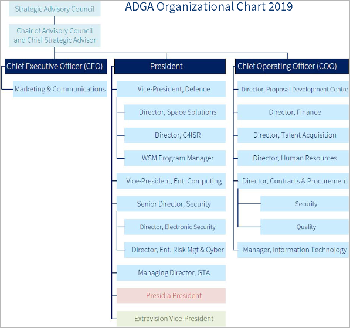

# ADGA
> 2019.08.29 [🚀](../../index/index.md) [despace](../index.md) → [Contact](../contact.md)

||<mark>noemail</mark>, +1(613)237-30-22, Fax: …;  *110 Argyle Avenue, Ottawa, ON, K2P 1B4, Canada*  【<http://www.adga.ca/> ・ [Facebook ⎆](https://www.facebook.com/ADGAGroup/)・ [LinkedIn ⎆](https://www.linkedin.com/company/adga-group/)・ [Twitter ⎆](https://twitter.com/adgagroup)】|
|:-|:-|
|**Mission**|To provide client centric, value‑added, end‑to‑end engineering & consulting services, including systems analysis, technology‑based solution development & implementation support.|
|**Vision**|…|
|**Values**|…|
|**Business**|Advanced technology solutions, professional engineering & consultancy|
|**[MGMT](../mgmt.md)**|・CEO — Françoise Gagnon  ・President — Shaun McEwan|

**ADGA** is a privately owned Canadian company, who is a leading provider of technology solutions in defence, security & enterprise computing. ADGA’s headquarters are in Ottawa, with offices in Gatineau, Montreal & Toronto. ADGA is dedicated to Defence, Aerospace Engineering & Technical Services.

We offer project management, space engineering, space specialty services provision & systems for space‑based data delivery in near real‑time. With every project, we provide subject matter experts armed with the competencies & technology to develop & deploy space‑based solutions & associated support services. Our first responder solution uses Earth Observation (OE) data to support all phases of emergency management: prevention, preparation, detection, response, & recovery. We use real‑time space‑derived data to support disaster recovery & first responders.

   - **Project Management & Engineering Support Services:**
      - Earth Observation
      - [Ground Segment](../scs.md) Engineering
      - [Ground Systems](../scs.md) Software Engineering
      - Independent Review & Oversight
      - Management of Space Programs & Projects
      - Military satCOM Engineering
      - Requirements Management
      - Satellite Navigation Systems Engineering
      - Space Data Acquisition, Processing, Archiving & Distribution
      - Space Data Standardization
      - Space Project Management Standards
      - [Space Systems Engineering](../sc.md)
   - **Capability Development:**
      - Earth Observation data exploitation
      - Requirements Analysis
      - Satellite Testing & Operations Preparation
      - Sensor‑to‑User Earth Observation Subject Matter Experts
      - Space Mission Planning & Evaluation
      - Space Mission/Systems Definition & Architecture
      - Space weather services: definition & implementation
      - Strategic Framework Development

**Offices:**

   - ADGA Ottawa Office. 110 Argyle Ave. Ottawa, ON, Canada K2P 1B4. +1(613)237‑30‑22
   - ADGA Gatineau Office. 70 Crémazie Street, Suite 100, Gatineau, QC, Canada J8Y 3P2. +1(819)772‑85‑22
   - ADGA Greater Toronto Area Office. 300 Campbell Ave, Suite 200, Toronto, ON, Canada M6P 3V6. +1(647)943‑76‑90
   - ADGA Calgary Office. 237 Springmere Way, Chestermere, AB, Canada T1X 1T1. +1(613)237‑30‑22
   - ADGA Kingston Office. 490 – 7 Discovery Ave., Kingston, ON, Canada K7K 7E9. +1(613)237‑30‑22
   - ADGA Montreal Office. 4180 rue Sere, Ville St-Laurent, Quebec, Canada H4T 1A6. +1(613)237‑30‑22

 

