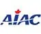

# AIAC
> 2019.08.16 [🚀](../../index/index.md) [despace](../index.md) → [Contact](../contact.md)

||<mark>noemail</mark>, +1(613)232-42-97, Fax: …;  *255 Albert Street, Suite 703, Ottawa, Ontario, K1P 6A9, Canada*  【<https://aiac.ca/>】|
|:--|:--|
|**Mission**|AIAC is the voice of Canada’s aerospace industry. Our mission is to understand, build consensus & provide leadership on policy issues of interest to the industry. We also work to increase Canada’s profile on the world stage by communicating our air & space accomplishments & by promoting Canadian aerospace companies in foreign markets.|
|**Vision**|To be a leading national association that provides outstanding value to members & is the partner of choice for governments, resulting in a Canadian industry that is at the forefront of global aviation, space & defence advances & achievements.|
|**Values**|・*Collaboration*: In a complex industry with stakeholders & decision-makers crossing multiple sectors, regions & jurisdictions, a commitment to collaboration is essential to ensuring the long-term success of aerospace in Canada. Industry members, governments at all levels, regional & provincial associations, researchers & academics, & other stakeholders all play an important role in Canadian aerospace achievements. AIAC is committed to promoting policies & partnerships that foster this spirit of collaboration in order to ensure that Canadian aerospace companies of all sizes have the resources that they need to grow & enhance their competitiveness.  ・*Excellence*: Canada’s aerospace industry is distinguished by its long history of competing & succeeding at the highest levels. Our members strive for excellence in everything that they do, & AIAC is committed to the same standards in the products & services that we offer, the way we serve our members, & the results that we deliver.  ・*Innovation*: The hallmark of the aerospace industry is its constant innovation, pushing the boundaries of technology & engineering to new heights. That same commitment drives AIAC’s approach to policy development, partnership with government & support for our members. We work to develop creative solutions to industry needs & priorities & are constantly improving our processes & products in order to serve & lead as effectively as possible.|
|**Business**|…|
|**[MGMT](../mgmt.md)**|…|

For over fifty years, the **Aerospace Industries Association of Canada (AIAC)** has worked with its members to develop what is today the fifth-largest national aerospace industry in the world. By collaborating with industry & with government to develop products, services, programs & policies that enhance Canadian aerospace companies, AIAC helps the industry to invest, innovate, & develop best-in-class capabilities in the civil, defence & space sectors.

AIAC represents a broad, diverse membership from all aerospace sectors & fields. As the voice of Canada’s aerospace industry, we make sure that our members have the tools, resources & representation that you need to grow your business in Canada & around the world.  
From hosting events that fuel business development & networking opportunities, to leading international trade shows & missions, to working with government to foster a strong policy & program environment that supports aerospace growth, AIAC is here to work for you.

 

…