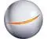

# Astrium
> 2019.08.05 [🚀](../../index/index.md) [despace](../index.md) → **[Archive](faq.md)**, [Contact](../contact.md)

||…, …;  *…*  【[Wikipedia(EN) ⎆](https://en.wikipedia.org/wiki/Astrium)|

**Astrium** — бывшая дочерняя компания ADS, крупнейший производитель космических аппаратов. Основана в декабре 2006. В 2009 имела оборот €4.8 млрд, и 15 000 работников во Франции, Германии, Великобритании, Испании и Нидерландах.  Штаб‑квартира. Франция: Париж. Германия: Оттобрунн.

**В 2013 году была расформирована и вошла в состав [ADS](ads.md).**

 

…
