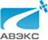

# АВЭКС
> 2019.08.05 [🚀](../../index/index.md) [despace](../index.md) → [Contact](../contact.md)

||<avecs@avecs.ru>, +7(499)551-55-88, Fax: +7(499)257-04-59;  *Россия, 125124, Москва, 1‑я улица Ямского поля, д. 17, с. 12*  【<http://avecs.ru/>】|
|:--|:--|
|**Mission**|…|
|**Vision**|…|
|**Values**|…|
|**Business**|…|
|**[MGMT](../mgmt.md)**|…|

**Акционерное общество «Авиационная электроника и коммуникационные системы» (АО «АВЭКС»)** — российское предприятие, занимающееся полным циклом работ от проектирования до изготовления систем электроснабжения ([СЭС](sps.md)) для космических аппаратов и систем управления электро‑реактивными двигательными установками, а также созданием систем электропитания на базе литий‑ионных аккумуляторных батарей, преобразователей и электроприводов для подводных лодок и другими программами. Входит в Концерн «Радиоэлектронные технологии».

 

В 1937 году при заводе № 230 было создано опытное конструкторское бюро по авиационному приборостроению ОКБ‑230, которое впоследствии было переименовано в ОКБ‑2. После перебазирования из г. Раменское Московской области в Москву в 1947 году ОКБ‑2 получило название ОКБ‑12. В этом же году коллектив бюро по инициативе академика И. В. Курчатова приступил к созданию системы регулирования и защиты атомных реакторов. Через год эта задача была выполнена: система регулирования и защиты промышленного атомного реактора была разработана, смонтирована и отлажена. В 1964 году на базе ОКБ‑12 был создан НИИ‑25, переименнованный в 1967 году в НИИ Приборостроения.

В 1992 году НИИ был переименован в Московское опытно‑контрукторское бюро «Система», позже преобразованное в акционерное общество открытого типа ОАО «АВЭКС» с контрольным пакетом акций, находящимся в настоящее время в собственности Концерна «Радиоэлектронные технологии».

Участвуя в выполнении госзаказов в интересах науки и народного хозяйства, предприятие выполнило ряд НИОКР. В частности, по разработке и изготовлению аппаратуры регулирования и контроля (АРК) и аппаратуры питания и управления (АПУ) для космических аппаратов «Ямал‑100», «Ямал‑200», «E‑Star» (заказчик РКК «Энергия»). Предприятием также разработана конструкторская документация и изготовлена АРК для космического аппарата «БелКа» (заказчик РКК «Энергия»), АРК и АПУ для КА «Монитор‑Э», «KazSat‑1», «KazSat‑2», «Экспресс МД1», «Экспресс‑МД2» (заказчик — ФГУП ГКНПЦ им. М. В. Хруничева), «Кондор», «Кондор‑Э» (заказчик — ОАО ВПК «НПО машиностроение»).

В настоящее время АО «АВЭКС» располагает необходимым технологическим оборудованием, опытными, квалифицированными кадрами, достаточными производственными площадями, позволяющими выпускать в требуемом заказчику количестве аппаратуру регулирования контроля энергообеспечения авиационной и космической техники с обеспечением необходимого качества. Особое внимание компания уделяет инновационным материалам и покрытиям. Ученые предприятия создали уникальный светодиодный модуль для печатных плат с париленовым покрытием, который может применяться в авиации, космонавтике и ВМФ и обладает выгодными характеристиками.
