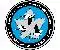

# CASI
> 2019.08.14 [🚀](../../index/index.md) [despace](../index.md) → [Contact](../contact.md)

||<casi@casi.ca>, +1(613)591-87-87, Fax: +1(613)591-72-91;  *350 Terry Fox Dr., Suite 104 Kanata, ON, K2K 2W5, Canada*  【<https://www.casi.ca/>・ [LinkedIn ⎆](https://www.linkedin.com/company/canadian-aeronautics-and-space-institute/)・ [Twitter ⎆](https://twitter.com/CASInstitute)・ [Wikipedia ⎆](https://en.wikipedia.org/wiki/Canadian_Aeronautics_and_Space_Institute)】|
|:-|:-|
|**Mission**|・To advance the art, science, engineering & applications relating to aeronautics, space & related technologies in Canada  ・To assist Members in developing skills, exchanging information, & sharing talents in their areas of interest  ・To foster national pride & international esteem for Canada’s accomplishments in aeronautics, space & related technologies  ・To promote Canadian competence & international competitiveness in aeronautics, space & related technologies & their applications  ・To provide a focus for communications & networking for aeronautics & space communities in Canada|
|**Vision**|…|
|**Values**|…|
|**Business**|Promotion & business communication in the fields of space, aeronautics, & remote sensing|
|**[MGMT](../mgmt.md)**|…|

**Canadian Aeronautics & Space Institute (CASI)** is a [nonprofit organization](../nonprof_org.md) for Canadians that are interested in the fields of space, aeronautics, & remote sensing. It seeks to further the cause of science & engineering among the population, & provides for networking opportunities within the aeronautics & space community in Canada. The institute is composed of 15 branches that serve around 1 600 members in major cities across the nation, with some being partially or fully sponsored by Canadian universities & colleges.

The Canadians Aeronautics & Space Institute was formed in 1954 when the Montreal based Institute of Aircraft Technicians, the Ottawa Aeronautical Society, & the Canadian sections of the U.S. Institute of Aeronautical Sciences amalgamated to form the Canadian Aeronautical Institute (CAI).

 

…
