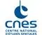

# CNES
> 2019.08.13 [🚀](../../index/index.md) [despace](../index.md) → [Contact](../contact.md)

||<mark>noemail</mark>, +33(561)27-31-31, Fax: …;  *18 Avenue Edouard Belin, 31400 Toulouse, France*  【<https://cnes.fr/>・ [Wikipedia(EN) ⎆](https://en.wikipedia.org/wiki/CNES)】|
|:--|:--|
|**Mission**|…|
|**Vision**|…|
|**Values**|…|
|**Business**|…|
|**[MGMT](../mgmt.md)**|…|

**Национальный центр космических исследований (фр. Centre National d'Études Spatiales, CNES)** — французское космическое агентство. Основано при Шарле де Голле в 1961 году. Штаб‑квартира находится в Париже. В прошлом CNES также отвечало за подготовку французских космонавтов, однако в 2001 году эти обязанности перешли [ЕКА](esa.md). CNES также использует [Куру](../spaceport.md) в Французской Гвиане как основной космодром, который был построен в 1969 году. As of April 2018, CNES has the second largest national budget — €2.438 billion — of all the world’s civilian space programs, after only NASA.

CNES concentrates on five areas:

   - Access to space
   - Civil applications of space
   - Sustainable development
   - Science & technology research
   - Security & defence

 

…
