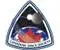

# CSS
> 2019.08.13 [🚀](../../index/index.md) [despace](../index.md) → [Contact](../contact.md)

||<general@css.ca>, +1(416)836-320-54, Fax: …;  *P.O. Box 19015, 360-A Bloor Street West, Toronto, Ontario, M5S 1X0, Canada*  【<https://css.ca/> ・ [Facebook ⎆](https://www.facebook.com/CanadianSpaceSociety/)・ [LinkedIn ⎆](https://www.linkedin.com/company/canadian-space-society)・ [Twitter ⎆](https://twitter.com/cdnspacesociety)】|
|:--|:--|
|**Mission**|・**Inform.** We inform our membership & the public about Canada’s activities in space within the context of the broader international community.  ・**Educate.** We educate on space exploration, discovery, innovation & its values.  ・**Engage.** We engage our members through space related projects, activities, & networking opportunities.  ・**Shape.** We shape space policy, representing our membership & the public through activities that bring together members of government, academia, & business.|
|**Vision**|To lead Canada in the effective cooperation between industry, government, academia, advocacy groups, & the public for the advancement of space endeavours.|
|**Values**|…|
|**Business**|Sponsorship & promotion for Canadians in the space sector|
|**[MGMT](../mgmt.md)**|…|

**Canadian Space Society (CSS)**. Founded in 1983, the Canadian Space Society (CSS) has been a federally‑incorporated [non‑profit organization](../nonprof_org.md) & charity. With many of Canada’s top space professionals on board, the CSS is made up of enthusiasts of all backgrounds pursuing the exploration & development of the Solar System & beyond.

Inspired by the old L5 Society & other space‑activist groups, its principal objective is to sponsor & promote the involvement of Canadians in the space sector, through its technical & outreach projects including regular chapter meetings, the annual Canadian Space Summit & more. The CSS wishes to grow in cooperation, rather than in competition, with other space development organizations (such as the National Space Society & the British Interplanetary Society), while meeting a real need for an effective Canadian space advocacy group.

**Canada’s Annual Space Industry Conference**  
The Canadian Space Society’s Annual Space Summit is Canada’s leading conference devoted to space science, research & technology. With an annual attendance of approximately 150 attendees (& growing), the Summit brings together space professionals from industry, academia, government & the military as well as enthusiasts from all walks of life. The Canadian Space Summit is THE place to learn about the latest trends, technologies & political issues taking place in the space industry. With technical sessions on everything from astronomy to Earth orbit, from life sciences to law & policy, the Canadian Space Summit touches upon every facet affecting Canada’s space industry!

 

…
