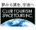

# Club Tourism Space Tours
> 2021.12.08 [🚀](../../index/index.md) [despace](../index.md) → [Contact](../contact.md)

||<mark>noemail</mark>, +81(3)4335-1800, Fax: +81(3)5323-3992;  *Shinjuku Island Wing, 6-3-1 Nishi-Shinjuku, Shinjuku-ku, Tokyo 160-8308, Japan*  【<https://www.club-t.com/space/>】|
|:-|:-|
|**Mission**|…|
|**Vision**|…|
|**Values**|…|
|**Business**|Space tourism, consulting, education|
|**[MGMT](../mgmt.md)**|・President & CEO — Keiji Asakawa|

**Club Tourism Space Tours Co., Ltd.** is a Japanese space tourism company. Virgin Galactic Japan Official Distributor. Founded 2014.01.06.

Main business contents:

   1. Travel agency based on the Travel Agency Law
   1. Agency business of domestic & foreign transportation companies & air transportation business
   1. Management & travel / space consulting business
   1. Providing information on travel & space
   1. Planning, production, publishing & sales of books, magazines & printed matter
   1. Various lectures & lectures
   1. Planning, production & implementation of various events
   1. Market research, advertising, advertising & advertising agency business
   1. Travel & space goods sales business

 

…
