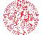

# CUNI
> 2019.08.05 [🚀](../../index/index.md) [despace](../index.md) → [Contact](../contact.md)

||<mark>noemail</mark>, <mark>noworkphone</mark>, Fax: …;  *…*  【<http://www.cuni.cz/>・ [Wikipedia(EN) ⎆](https://en.wikipedia.org/wiki/Charles_University)】|
|:--|:--|
|**Mission**|…|
|**Vision**|…|
|**Values**|…|
|**Business**|…|
|**[MGMT](../mgmt.md)**|…|

**Ка́рлов университе́т** в Праге (чеш. **Univerzita Karlova v Praze**, междунар. **Charles University in Prague (CUNI)** — главный университет Чехии, старейший университет Центральной Европы и один из старейших университетов мира. Был основан императором Карлом IV в 1348 году.

 

…
