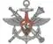

# ДОГОЗ
> 2019.08.07 [🚀](../../index/index.md) [despace](../index.md) → [Contact](../contact.md)

||<mark>noemail</mark>, +7(495)696-34-31, Fax: +7(495)696-34-31;  *Россия, 119160, г. Москва, ул. Знаменка, д. 19*  【<http://structure.mil.ru/structure/ministry_of_defence/details.htm?:id=11389@egOrganization>】|
|:--|:--|
|**Mission**|…|
|**Vision**|…|
|**Values**|…|
|**Business**|…|
|**[MGMT](../mgmt.md)**|…|

**Департамент Министерства обороны Российской Федерации по обеспечению государственного оборонного заказа** (ДОГОЗ) предназначен для осуществления МО РФ функций гос. заказчика гос. оборонного заказа в части подготовки к размещению заданий гос. оборонного заказа, контроля и учета выполнения гос. контрактов на разработку, поставку, сервисное обслуживание, модернизацию, ремонт по закрепленной номенклатуре вооружения, военной, специальной техники и материальных средств.

Основными задачами Департамента являются:

   - подготовка к размещению заданий гособоронзаказа для федеральных государственных нужд в рамках и вне рамок государственной программы вооружения, федеральных и иных целевых программ по закреплённой номенклатуре ВВСТ и МС;
   - контроль и учёт выполнения государственных контрактов по закреплённой номенклатуре ВВСТ и МС;
   - обеспечение осуществления Министерством обороны отдельных полномочий в качестве органа военного управления в области обороны по закреплённой номенклатуре ВВСТ и МС, в пределах [компетенции](../competence.md) Департамента;
   - обеспечение мероприятий международного военного сотрудничества и военно‑технического сотрудничества, находящихся в компетенции Департамента.

 

…
