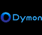

# Dymon Co., Ltd.
> 2021.12.02 [🚀](../../index/index.md) [despace](../index.md) → [Contact](../contact.md)

||<mark>noemail</mark>, <mark>noworkphone</mark>, Fax: … ;  *4-10-20 Omori-minami, Ota-ku, Tokyo, 143-0013, Japan*  【<http://dymon.co.jp/>・ [Facebook ⎆](https://www.facebook.com/dymon.co.jp/)・ [Instagram ⎆](https://www.instagram.com/yaoki_space/)・ [Twitter ⎆](https://twitter.com/yaoki_space)】|
|:--|:--|
|**Mission**|…|
|**Vision**|…|
|**Values**|**Principal & Will** — leading the world with a strong will. **Sustainable & Symbiosis** — aiming for a sustainable symbiotic society. **Challenge & Respect** — big challenge & respect for the individual.|
|**Business**|Robots, rovers, antennas|
|**[MGMT](../mgmt.md)**|・Founder & CEO — Shinichiro Nakajima|

**Dymon Co., Ltd.** is a Japanese company aimed to design & manufacture space robots, rovers, antennas, etc. Founded 2012.02.

Products:

   - YAOKI — the small (0.5 ㎏) lunar rover.

 

…
