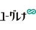

# Euglena Co., Ltd.
> 2021.12.08 [🚀](../../index/index.md) [despace](../index.md) → [Contact](../contact.md)

||<mark>noemail</mark>, <mark>noworkphone</mark>, Fax: …;  *Minato-ku, Tokyo*  【<https://www.euglena.jp/>・ [Facebook ⎆](https://www.facebook.com/euglena.co.jp)・ [Twitter ⎆](https://twitter.com/euglena_jp)】|
|:-|:-|
|**Mission**|…|
|**Vision**|Make people & the Earth healthy|
|**Values**|…|
|**Business**|Fuel & food production based on euglena|
|**[MGMT](../mgmt.md)**|・CEO — Mitsuru Izumo|

**Euglena Co., Ltd.** is a Japanese company that succeeded in outdoor mass cultivation of microalgae “Euglena” in 2005. We currently operate a health care business for marketing “Euglena” functional foods/cosmetics & an energy & environment business promoting R&D for biofuel production.

 

…
