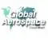

# Global Aerospace Corporation
> 2019.01.18 [🚀](../../index/index.md) [despace](../index.md) → [Contact](../contact.md)

||<info@gaerospace.com>, +1(626)960-83-00, Fax: +1(626)960-83-37;  *12981 Ramona Blvd, Suite E, Irwindale, CA 91706-3750, US.*  【<http://www.gaerospace.com/>・ [Facebook ⎆](https://www.facebook.com/pages/Global-Aerospace-Corporation/1649147128674779)・ [LinkedIn ⎆](https://www.linkedin.com/company/global-aerospace-corp/)・ [Twitter ⎆](https://twitter.com/gaerospacecorp)】|
|:--|:--|
|**Mission**|・We’re made up of creative engineers/scientists that have a passion for aerospace research.  ・We enjoy circumventing challenges that most people treat as insurmountable.  ・We produce honest, data‑driven research & engineering analysis for Government & commercial customers.|
|**Vision**|…|
|**Values**|…|
|**Business**|…|
|**[MGMT](../mgmt.md)**|…|

**Global Aerospace Corporation (GAC)** is a small, innovative aerospace research & development company with its main corporate office in Irwindale, CA (near the foothills northeast of Los Angeles). Global Aerospace Corporation does cutting edge aerospace R&D in the areas of space, undersea, lighter‑than‑air, re‑entry, defense, & power technologies; new concepts development; & software.

   - **Core Competencies:**
      - Solutions for harsh/extreme environments w/ emphasis on buoyant & hypersonic systems
      - Modeling & simulation of complex systems
   - **Areas of Expertise:**
      - Aeroelasticity
      - Aerothermodynamics
      - Buoyancy
      - Mechanical design & engineering
      - Orbital mechanics
      - Systems engineering & modeling

 

…
