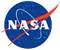

# GSFC
> 2019.08.11 [🚀](../../index/index.md) [despace](../index.md) → [Contact](../contact.md)

||<mark>noemail</mark>, +1(301)286-2000, Fax: …;  *8800 Greenbelt Rd, Greenbelt, MD 20771, USA*  【<https://www.nasa.gov/goddard>・ <https://www.nasa.gov/centers/goddard/about/index.html>・ [Wikipedia(EN) ⎆](https://en.wikipedia.org/wiki/Goddard_Space_Flight_Center)|
|:--|:--|
|**Mission**|…|
|**Vision**|…|
|**Values**|…|
|**Business**|…|
|**[MGMT](../mgmt.md)**|…|

**Goddard Space Flight Center (GSFC, Центр космических полетов имени Годдарда)** — крупная исследовательская лаборатория NASA, основанная 1 мая 1959 года. В GSFC занято около 10 000 гражданских служащих и работников подрядчиков NASA. Центр расположен в 10 ㎞ к северо‑востоку от Washington, D.C. в Гринбелт (Мэриленд), США. GSFC — один из десяти основных центров NASA. Назван в честь доктора Роберта Годдарда (1882—1945), пионера ракетной техники.

Центр Годдарда — крупнейшая организация ученых и инженеров в США, изучающая Землю, Солнечную систему и Вселенную с помощью космических инструментов. В GSFC разработаны многие научные космические спутники, отсюда ведётся их управление. Также GSFC управляет работой двух систем отслеживания траекторий спутников и получения данных (Space Network и Near Earth Network).

Среди программ, проводящихся под координацией GSFC: телескоп Hubble, программа Explorer, программа Discovery, Earth Observing System (EOS), INTEGRAL, MAVEN, OSIRIS-REx, обсерватория SOHO, Solar Dynamics Observatory (SDO), Rossi X‑ray Timing Explorer (RXTE), Swift. Typically, unmanned earth observation missions & observatories in Earth orbit are managed by GSFC, while unmanned planetary missions are managed by the [JPL](jpl.md).

The **Goddard Space Flight Center (GSFC)** is a major [NASA](nasa.md) space research laboratory located approximately 6.5 miles (10.5 ㎞) northeast of Washington, D.C. in Greenbelt, Maryland, United States. Established on May 1, 1959 as NASA’s first space flight center, GSFC employs approximately 10 000 civil servants & contractors. It is one of ten major NASA field centers, named in recognition of American rocket propulsion pioneer Dr. Robert H. Goddard.

GSFC is the largest combined organization of scientists & engineers in the United States dedicated to increasing knowledge of the Earth, the Solar System, & the Universe via observations from space. GSFC is a major US laboratory for developing & operating unmanned scientific spacecraft. GSFC conducts scientific investigation, development & operation of space systems, & development of related technologies. Goddard scientists can develop & support a mission, & Goddard engineers & technicians can design & build the spacecraft for that mission. Goddard scientist John C. Mather shared the 2006 Nobel Prize in Physics for his work on COBE.

GSFC also operates two spaceflight tracking & data acquisition networks (the Space Network & the Near Earth Network), develops & maintains advanced space & Earth science data information systems, & develops satellite systems for the National Oceanic & Atmospheric Administration (NOAA).

GSFC manages operations for many NASA & international missions including the Hubble Space Telescope (HST), the Explorers Program, the Discovery Program, the Earth Observing System (EOS), INTEGRAL, MAVEN, OSIRIS-REx, the Solar & Heliospheric Observatory (SOHO), the Solar Dynamics Observatory (SDO), Fermi, & Swift. Past missions managed by GSFC include the Rossi X‑ray Timing Explorer (RXTE), Compton Gamma Ray Observatory, SMM, COBE, IUE, & ROSAT. Typically, unmanned Earth observation missions & observatories in Earth orbit are managed by GSFC, while unmanned planetary missions are managed by the [JPL](jpl.md).

**Child agencies:**

   - Goddard Institute for Space Studies
   - Katherine Johnson Independent Verification & Validation Facility
   - Wallops Flight Facility

**Known departments:**

   - Architecture Design Lab

 

…