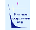

# ИНАСАН
> 2019.04.01 [🚀](../../index/index.md) [despace](../index.md) → [Contact](../contact.md)

||<admin@inasan.ru>, +7(495)951-54-61, Fax: +7(495)951-55-57;  *Россия, 119017, Москва, ул. Пятницкая, д. 48*  【<http://www.inasan.ru/>・ [Wikipedia(RU) ⎆](https://ru.wikipedia.org/wiki/Институт_астрономии_РАН)】|
|:--|:--|
|**Mission**|…|
|**Vision**|…|
|**Values**|…|
|**Business**|…|
|**[MGMT](../mgmt.md)**|…|

**Институт астрономии РАН** *(ИНАСАН)* — один из институтов Отделения физических наук Российской академии наук. В настоящее время расположен в Москве на ул. Пятницкая, д. 48.   В советское время учреждение носило название Астрономический совет АН СССР (Астросовет). Основные направления исследований:

   - Переменные звёзды
   - Наблюдения ИСЗ: визуальные, фотографические и лазерные
   - Изучение верхних слоёв атмосферы Земли
   - Солнечная активность
   - Физика Луны
   - Физика солнечно‑земных связей
   - Физика и эволюция звёзд
   - Эволюция тесных двойных звёздных систем
   - Эволюция звёздных пульсаций
   - Звёздная спектроскопия и нестационарные звёзды
   - Закономерности процесса звёздообразования на различных пространственно‑временных масштабах
   - Динамика звёздных и планетных систем

 

С предложением о создании Астрономического совета при АН СССР в 1936 году выступили академики А.Е. Ферсман и В.Г. Фесенков. Данный проект был утверждён Президиумом Академии наук СССР 20 декабря 1936 года — эту дату и принято считать днём создания Астрономического совета АН СССР — в будущем Института астрономии Российской академии наук. В первые года работы перед Астросоветом была поставлена задача координирования всех исследовательских работ в области наземной оптической астрономии. Затем в рамки задач вошли такие мероприятия как: поставка в обсерватории фотоматериалов и светоприемников, представление астрономов СССР в МАС, готовил научные экспозиции в СССР и за рубежом. Большую часть советской бытности Астросовет представлял из себя две совершенно различные по функциям структуры — научный совет и научно‑исследовательское учреждение.

Первой собственной исследовательской работой в Астросовете стал «Общий каталог переменных звёзд» (ОКПЗ), который МАС поручил составить в 1946 году советским астрономам. С наступлением космической эры, важнейшим направлением в работе Астросовета стала тематика наблюдений Искусственных спутников Земли (ИСЗ). В середине 60‑х годов ХХ века Астросовет приступил к созданию международной сети наблюдений ИСЗ. К 1975 году в Евразии, Африке и Южной Америке было уже 28 специализированных наблюдательные пунктов, созданных при участии советских ученных. Астросоветом были созданы две экспериментальные станции: Звенигородскую (1958 г) и Симеизскую (1975 г).

В декабре 1990 года, в связи с широким спектром научных задач, что решались на базе учреждения, Президиум АН СССР распорядился о преобразовании Астросовета в Институт астрономии АН СССР. А в 1991 году институт получил своё современное название: Институт астрономии Российской академии наук (ИНАСАН). Но параллельно существует и координационный совет, именуемый Астрономический совет РАН.
