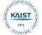

# KAIST
> 2020.07.24 [🚀](../../index/index.md) [despace](../index.md) → [Contact](../contact.md)

||<kaistpr@kaist.ac.kr>, +82-42-350-2114, Fax: +82-42-350-2210(2220);  *291 Daehak-ro, Eoeun-dong, Yuseong-gu, Daejeon, Korea*  【[WEBSITE ⎆](https://www.kaist.ac.kr/)・ [Facebook ⎆](https://www.facebook.com/KAIST.official)・ [Instagram ⎆](https://www.instagram.com/official_kaist/)・ [LinkedIn 1 ⎆](https://www.linkedin.com/school/한국과학기술원-kaist-/) & [2 ⎆](https://www.linkedin.com/company/korea-advanced-institute-of-science-and-technology/)・ [Twitter ⎆](https://twitter.com/kaistpr)・ [Wikipedia ⎆](https://en.wikipedia.org/wiki/KAIST)】|
|:-|:-|
|**Mission**|…|
|**Vision**|…|
|**Values**|…|
|**Business**|Higher education|
|**[MGMT](../mgmt.md)**|…|

**KAIST** (formally the **Korea Advanced Institute of Science & Technology**) is a national research university located in Daedeok Innopolis, Daejeon, South Korea.

KAIST was established by the Korean government in 1971 as the nation’s first research‑oriented science & engineering institution. KAIST also has been internationally accredited in business education, & hosting the Secretariat of AAPBS. KAIST has approximately 10 200 full‑time students & 1 140 faculty researchers & had a total budget of $ 765 million in 2013, of which $ 459 million was from research contracts.

Including College of Engineering:

   - School of Mechanical & Aerospace Engineering
      - Department of Mechanical Engineering
      - [Department of Aerospace Engineering ⎆](https://ae.kaist.ac.kr/)

 

…

