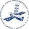

# ГКНПЦ Хруничева
> 2019.08.07 [🚀](../../index/index.md) [despace](../index.md) → [Contact](../contact.md)

||<proton@khrunichev.com>, +7(499)749-99-34, Fax: +7(499)142-59-00;  *Россия, 121087, Москва, ул. Новозаводская, д. 18*  【<http://www.khrunichev.ru>・ <http://www.tsenki.com> — ЦЭНКИ・  [Wikipedia(RU) ⎆](https://ru.wikipedia.org/wiki/Государственный_космический_научно‑производственный_центр_имени_М._В._Хруничева)】|
|:--|:--|
|**Mission**|…|
|**Vision**|…|
|**Values**|…|
|**Business**|…|
|**[MGMT](../mgmt.md)**|…|

**Федеральное государственное унитарное предприятие «Государственный космический научно‑производственный центр имени М.В. Хруничева»** — одно из ведущих предприятий российской ракетно‑космической промышленности. Нынешняя продукция: РН семейства «Протон» и РБ к ним; РН семейства «Ангара» (разработка). Член [IAF](iaf.md) с 1998 г.

**Проезд.**  
ст. метро "Фили", 1‑й вагон из Центра, автобус 109, 116, 3‑я остановка;  
ст. метро "Багратионовская", последний вагон из Центра, троллейбус 2, 39, 2‑я остановка (конечная) "Фили".

2017.05.23 [Последний шанс ЦиХа? ⎆](http://alien3.livejournal.com/2126033.html)

**Подразделения и филиалы:**

| |•   •   •   •   •   •   •   •   •   •   •   •   •   •   •   •   •   •   •   •   •   •|
|:--|:--|
|[Ракетно‑космический завод ⎆](http://www.khrunichev.ru/main.php?:id=77)|Тел.: 8 (499) 749-86-68, (499) 749-99-69   8 (499) 749-87-02, 749-87-98|
|[Конструкторское Бюро "Салют" ⎆](http://www.khrunichev.ru/main.php?:id=74)|Тел.: 8 (499) 749-91-11, 749-50-30   Факс: 8 (499) 148-07-32, 8 (495) 797-33-94|
|[Хруничев‑Телеком ⎆](http://www.khrunichev.ru/main.php?:id=80)|Тел./факс: 8 (499) 749-93-11, (495) 797-95-48   8 (495) 797-33-50, 797-33-10|
|[Завод по эксплуатации ракетно‑космической техники ⎆](http://www.khrunichev.ru/main.php?:id=78)|Тел.: 8 (499) 749-96-64, (499) 749-9263(факс)   8 (499) 749-92-42, 749-96-88|
|[Завод медицинской техники и товаров народного потребления ⎆](http://www.zavodmt.ru/ru/index.php)|Тел.: (499) 749-84-36, (499) 749-96-16 (факс)|
|Научно‑исследовательский институт космических систем имени М.В.Максимова ([НИИ КС ⎆](http://www.khrunichev.ru/main.php?:id=81))|Тел: 8 (495) 502-83-43, (498) 300-29-01|
|[КБ "Арматура" ⎆](http://www.khrunichev.ru/main.php?:id=79)|Тeл: +(49232) 9-56-11,3-10-68,5-56-54|
|[Воронежский механический завод ⎆](http://www.khrunichev.ru/main.php?:id=121)|Тел.:(473) 234-82-32, Fax:(473) 272-62-67|
|[КБхиммаш им. А.М. Исаева](kbhm.md)|Тел.:(499) 678-8384, Fax:(499) 678-83-01|
|[ПО "Полет" ⎆](http://www.khrunichev.ru/main.php?:id=122)|Тел.: (3812) 39-74-87,39-72-01,39-09-72|
|[Пансионат "Заря" ⎆](http://www.hotelzarya.ru/)|Тел.: (49664) 7-96-39, 7-96-45|
|[Пансионат "Планета" ⎆](http://www.khrunichev.ru/main.php?:id=181)|Тел.: 8 гудок 10 (380) (6569) 2-83-84   факс: 8 гудок 10 (380) (6569) 6-03-20|
|[Бизнес‑отель "Протон" ⎆](http://www.protonhotel.ru/)|Тел.: 8 (495) 797-33-00, 797-33-70   Факс:8 (495) 797-33-14|
|[Комбинат питания "Космос" ⎆](http://www.khrunichev.ru/main.php?:id=34)|Тел./факс: 8 (499) 749-82-41, 749-94-44|
|Дворец культуры имени С.П.Горбунова|Тел.: 8 (499) 749-85-31, 148-24-83|
|Музей истории ГКНПЦ имени М.В.Хруничева|Тел./факс: (499) 749-83-39|
|Дворец водного спорта "Фили"|Тел.: (499) 148-30-46, 148-57-73|
|Центр физической культуры и спорта:   Спорткомплекс "Фили"   СОК "Звезда"|Тел.: (499) 749-80-24, 749-80-94,749-81-56       Тел.: (499) 148-28-91|

 

…
