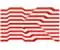

# Композит
> 2019.04.01 [🚀](../../index/index.md) [despace](../index.md) → [Contact](../contact.md)

||<info@kompozit-mv.ru>, +7(495)513-20-28 — приёмная, +7(495)513-22-56 — канцелярия, Fax: +7(495)516-06-17;  *Россия, 141070, г. Королёв, Московская обл., Пионерская ул., 4*  【<http://kompozit-mv.ru/>・ <http://www.federalspace.ru/1532/>】|
|:--|:--|
|**Mission**|…|
|**Vision**|…|
|**Values**|…|
|**Business**|…|
|**[MGMT](../mgmt.md)**|…|

**Композит** — головная организация России в области материаловедения по ракетно‑космической технике.

Организовано в 1975 г. как акционерное общество — с июля 1993 г. ОАО «Композит» отвечает за анализ, определение перспектив и применимость материалов в изделиях ракетно‑космической техники, выполняет научно‑исследовательские и опытно‑технологические работы по разработке новых материалов в интересах создания ракет‑носителей, пилотируемых и автоматизированных космических объектов, проводит экспертизу проектов, даёт заключения на допуск к лётно‑конструкторским испытаниям, изготавливает изделия из композиционных материалов, бериллия, гранулируемых сплавов, покрытия специального и общего назначения.

**Разработка и экспериментальные исследования:**

   - металлических материалов на основе алюминия, титана, никеля, бериллия;
   - интерметаллидов, конструкционных сталей, углерод‑углеродных и углерод‑керамических композиционных материалов, металлических композиционных материалов, армированных борными и углеродными волокнами;
   - высокотемпературной керамики, конструкционных стекло‑, органо‑ и углепластиков, покрытий, клеёв, пенопластов, компаундов, эмалей и других материалов специального и общего назначения.

**Внедрение новых материалов и технологий:**

   - горячее изостатическое прессование деталей из гранулируемых сплавов на основе титана, никеля, интерметаллидов;
   - углерод‑углеродный материал «Арголон» для авиационных тормозов;
   - негорючий до +1 200 ℃ материал «Минеплен»;
   - антифрикционный неметаллический самосмазывающийся материал «Синтек‑УМ»;
   - технология получения материала C‑SiC методом газофазного осаждения без использования хлорсодержащих реагентов;
   - изготовление высокоточных отливок деталей космических аппаратов из бериллиевых сплавов;
   - высокомодульные детали и конструкции — зеркала космических телескопов, приводы движения, стабилизаторы температуры, рентгенопрозрачные окна, радиационно‑прозрачные ионопроводы ускорительной техники, элементы ферменных конструкций из бериллия и бериллиевых сплавов;
   - получение неохлаждаемых камер сгорания для двигателей систем ориентации космических аппаратов;
   - биметаллические переходники титан‑сталь, медь‑сталь, алюминий‑сталь, другие разнородные материалы;
   - изотермическая штамповка деталей сложной формы из алюминиевых, титановых, никелевых сплавов, в том числе в режиме сверхпластичности.

Сертификация материалов ракетно‑космической техники и продукции народнохозяйственного и медицинского назначения.

 

…
