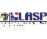

# LASP
> 2019.08.08 [🚀](../../index/index.md) [despace](../index.md) → [Contact](../contact.md)

||<mark>noemail</mark>, +1(303)492-64-12, Fax: …;  *1234 Innovation Drive, Boulder, CO  80303-7814, 303-492-6412, USA*  【<http://lasp.colorado.edu/home/>・ [Facebook ⎆](https://www.facebook.com/pages/Boulder-CO/Laboratory-for-Atmospheric-and-Space-Physics/21163648557)・ [Twitter ⎆](https://twitter.com/LASPatCU)・ [Wikipedia ⎆](https://en.wikipedia.org/wiki/Laboratory_for_Atmospheric_and_Space_Physics)】|
|:-|:-|
|**Mission**|…|
|**Vision**|…|
|**Values**|…|
|**Business**|…|
|**[MGMT](../mgmt.md)**|…|

The **Laboratory for Atmospheric & Space Physics (LASP)** is a research organization at the University of Colorado Boulder. LASP is a research institute with over one hundred research scientists ranging in fields from solar influences, to Earth’s & other planetary atmospherics processes, space weather, space plasma & dusty plasma physics. LASP has advanced technical capabilities specializing in designing, building, & operating spacecraft & spacecraft  instruments.  
Founded after World War II in 1948, a decade before NASA, the first scientific instruments built at LASP were launched into space using captured German V-2 rockets. To this day LASP continues a suborbital rocket program through periodic calibration instrument flights from White Sands Missile Range. It was originally called the Upper Air Laboratory, but changed to its current name in 1965. LASP has historical ties to Ball Aerospace Corporation & the Center for Astrophysics & Space Astronomy (CASA).

LASP has two facilities: offices on the main CU-Boulder campus, & the “Space Technology Building” in the University’s research park.

LASP’s new facilities allow it to handle almost every aspect of space missions, itself. Hardware facilities allow for the construction of single instruments or entire spacecraft. A Mission Operations Center allows for the control of spacecraft data collection, & a large research staff analyzes the data.

Being part of the University, LASP has heavy student involvement in every aspect of its operations, including science, hardware design / construction & mission operations.

LASP supports the following spacecraft & instruments:

   - Aeronomy of Ice in the Mesosphere (AIM)
   - Cassini-Huygens Ultraviolet Imaging Spectrograph (UVIS)
   - Colorado Student Space Weather Experiment (CSSWE) CubeSat with REPT integrated little experiment (REPTile)
   - Ice, Cloud & Land Elevation Satellite (ICESat)
   - Galileo ultraviolet spectrometer
   - Global-scale Observations of Limb & Disk (GOLD), a hosted payload on the SES-14 TV satellite.
   - Glory Total Irradiance Monitor (TIM)
   - GOES-R Extreme Ultra Violet & X‑ray Irradiance Sensors
   - Kepler Space Observatory
   - Lunar Atmosphere & Dust Environment Explorer (LADEE) Lunar Dust Experiment (LDEX)
   - Magnetospheric Multiscale Mission — MMS
   - MAVEN — Mars Atmosphere & Volatile EvolutioN Mission
   - MESSENGER (Mercury: Surface, Space Environment, Geochemistry, Ranging) Mercury Atmospheric & Surface Composition Spectrometer (MASCS)
   - Miniature X‑ray Solar Spectrometer (MinXSS) CubeSat
   - New Horizons Student Dust Counter (SDC)
   - Quick Scatterometer Mission (QuikSCAT)
   - Radiation Belt Storm Probes (RBSP) Relativistic Electron Proton Telescope (REPT)
   - Solar Dynamics Observatory (SDO) EUV Variability Experiment (EVE)
   - Solar Radiation & Climate Experiment (SORCE)
   - Student Nitric Oxide Explorer (SNOE)
   - TIMED (Thermosphere Ionosphere Mesosphere Energetics & Dynamics) Solar EUV Experiment (SEE)
   - Total Solar Irradiance Calibration Transfer Experiment (TCTE)
   - Upper Atmosphere Research Satellite (UARS) Solar/Stellar Irradiance Comparison Experiment (SOLSTICE)

 

…
