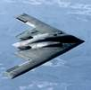

# Northrop Grumman
> 2019.08.05 [🚀](../../index/index.md) [despace](../index.md) → [Contact](../contact.md)

||<mark>noemail</mark>, <mark>noworkphone</mark>, Fax: +1(703)280-29-00;  *2980 Fairview ㎩rk Drive, West Falls Church, Virginia, United States*  【<http://www.northropgrumman.com/>・ [Wikipedia(EN) 1 ⎆](https://en.wikipedia.org/wiki/Northrop_Grumman)・ [Wikipedia(EN) 2 ⎆](https://en.wikipedia.org/wiki/Grumman_LLV)】|
|:--|:--|
|**Mission**|…|
|**Vision**|…|
|**Values**|…|
|**Business**|…|
|**[MGMT](../mgmt.md)**|…|

**Northrop Grumman Corporation** — американская военно‑промышленная компания, работающая в области электроники и информационных технологий, авиакосмической отрасли, судостроении. Образована в 1994 году в результате слияния компаний «Northrop Corporation» и «Grumman Corporation». Деятельность компании сведена в основные группы:

   1. Information & Services, с производственными секторами:
      - Информационные технологии
      - Mission Systems
      - Technical Services
   1. Электроника
   1. Авиация и космос
   1. Судостроение

| | |
|:--|:--|
|||
|Northrop Grumman manufactured  the B-2 Spirit strategic bomber.|Grumman Long Life Vehicle (LLV)|

 

…
