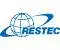

# RESTEC
> 2020.07.20 [🚀](../../index/index.md) [despace](../index.md) → [Contact](../contact.md)

||<mark>noemail</mark>, +81-3-6435-6700, Fax: …;  *3 Chome-17-1 Toranomon, Minato City, Tokyo 105-0001, Japan*  【<https://www.restec.or.jp/>】|
|:-|:-|
|**Mission**|…|
|**Vision**|…|
|**Values**|…|
|**Business**|…|
|**[MGMT](../mgmt.md)**|…|

The **Remote Sensing Technology Center of Japan (RESTEC)** founded in August 1975. For the last 35 years since its foundation, RESTEC has been receiving & processing data acquired by both domestic & foreign Earth‑observation satellites & providing those data to researchers & operational users under the contract with [JAXA](jaxa.md) & other related organizations. In parallel with those activities RESTEC has been conducting R&D of remote sensing technologies under the contract with pertinent agencies as well as independently & endeavoring to disseminate the achievement of those R&D.

RESTEC, as the core organization of satellite remote sensing in Japan, aspires to build remote sensing technologies as a social infrastructure, through providing policy makers, researchers & other satellite data users with remote sensing solutions by collecting, archiving, processing & analyzing remote sensing data required by the users.

   1. Capacity Building
      - Capacity building for developing countries including technology transfer
      - Providing both domestic & international personnel with remote sensing training
   1. Earth Observation
      - Development & Operations of [ground stations](../scs.md)
      - Reception, Processing & Provision of data acquired both by domestic & foreign satellites
   1. Research & Development
      - Developing processor & observation platform
      - Conducting calibration & validation of remote sensing data, development of algorithm & software in remote sensing
   1. Solution Businesses
      - Monitoring agricultural crop production related to food security
      - Monitoring natural disasters
      - Offering value added services including consultation in remote sensing technologies
      - Providing forest information related to REDD+
      - Providing geospatial information for establishing national land resources management
      - Providing information & developing systems for sustainable management of water resource
      - Providing information for selecting sites for renewable energy facilities
   1. Think tank/Consulting
      - Assessment & analysis of remote sensing needs in emerging & developing countries
      - Conducting consulting & research works related to the earth observation & remote sensing

 

…
