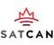

# SatCan
> 2019.08.15 [🚀](../../index/index.md) [despace](../index.md) → [Contact](../contact.md)

||<info@satcan.ca>, +1(613)265-46-31, Fax: …;  *227 Centrepointe Drive, Ottawa, ON, K2G 5L5, Canada*  【<https://www.satellitecanada.org/> ・ [Twitter ⎆](https://twitter.com/SatelliteCanada)・ [LinkedIn ⎆](https://www.linkedin.com/company/satellite-canada-innovation-network/)】|
|:--|:--|
|**Mission**|…|
|**Vision**|…|
|**Values**|…|
|**Business**|Engineering & business consultancy for [sat telecom & space tech](../sc.md) sectors|
|**[MGMT](../mgmt.md)**|…|

**Satellite Canada Innovation Network (SatCan)** is a member-based, [non-for-profit organization](nonprof_org.md) dedicated to driving the global competitiveness of the Canadian space industry by facilitating the development of new companies, revolutionary products, & disruptive services with the speed & success of industry.

SatCan is an engineering & business services organization offering extensive support to companies in the satellite telecom & space technology sectors. Through our extensive network of contacts & consultants, & our depth of experience across multiple business & engineering disciplines, SatCan can help you gain access to space technology programs, complement your program efforts with key skills & resources, or lead & staff a complete project. SatCan is a visionary initiative launched to grow Canada’s leadership position in the global space industry, & advance the government’s Innovation Agenda. Leveraging proven international business models for Space Technology Accelerators, SatCan is a registered, non-for-profit, member-based corporation, in the role of a catalyst dedicated to driving significant growth for the Canadian space industry.

**How we can help?** Services range from providing engineering skills & strategy, introductions to key industry players or financing organizations, to practical support like writing technical proposal responses or product plans.

| | |
|:--|:--|
|**Leadership,  networking,  collaboration**|・Project Leadership & facilitation  ・Collaboration with Government, Academia, & Industry programs  ・Establishment of Partnerships for Growth  ・Alignment of Upstream & Downstream Technologies, Products, Services & Applications|
|**Access to  global  markets**|・International Partnerships & Supply Chains  ・Participation in Global Space Agency Programs  ・Export Services & Financing  ・Participation in International Trade Shows & Conferences|
|**Commercial  development**|・Financing (Venture, Private, Government)  ・Business Start-up Modeling & Scaling  ・Management, Recruiting, Contracting  ・Market & Sales Planning & Development  ・Communications Strategy (Social Media, Web, Press)  ・Conferences, Trade Delegations  ・Regulatory, IP/Patent, Legal, Incorporation|
|**Technology**|・Facilities (Lab, AIT, Software Development/Test)  ・Access to IP (Government, Patent)  ・Industry Expertise & Consulting  ・Certification, Qualification support  ・Product R&D Resources  ・Application Development Environments  ・Operations (Satellite Control/Mission Support)  ・Targeted Proposal Development|
|**Skills  development**|・Space Technology, Business Courses, Workshops  ・University Competitions  ・Internships, Mentoring  ・Space Curriculum Development  ・Scholarships  ・Services  ・Events  ・OSC  ・CDN Space Directory  ・Contact  ・News|

 

…
