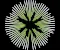

# Saudi Space Commission
> 2020.03.20 [🚀](../../index/index.md) [despace](../index.md) → [Contact](../contact.md)

||<info@ssc.gov.sa>, +966-11-2443999, Fax: +966-11-2443888;  *8461 Ushba – Al Shohda Dist., Unit Number: 1, RIYADH 13241 – 3512*  【[WEBSITE ⎆](https://saudispace.gov.sa/)・ [LinkedIn ⎆](https://www.linkedin.com/company/saudi-space-commission)・ [Twitter ⎆](https://twitter.com/saudispace)・ [Wikipedia ⎆](https://en.wikipedia.org/wiki/Saudi_Space_Commission)】|
|:-|:-|
|**Mission**|To lead the space sector to realize the Saudi Vision 2030 by developing and organizing the sector and providing enablers to realize ground-breaking achievements|
|**Vision**|…|
|**Values**|…|
|**Business**|Saudi Space Agency|
|**[MGMT](../mgmt.md)**|・CEO — Mohammed Saud ALTamaimi|

**Saudi Space Commission (SSC)** (Arabic: الهيئة السعودية للفضاء) is an Saudi independent government entity established by a royal order on 2018.12.27. The commission is chaired by HRH Prince Sultan bin Salman, who flew aboard the U.S. Space Shuttle Discovery in the 1980s as the first Arab in space.

 

…

