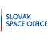

# Slovak Space Office
> 2022.03.21 [🚀](../../index/index.md) [despace](../index.md) → [Contact](../contact.md)

||<spaceoffice@sario.sk>, <mark>noworkphone</mark>, Fax: … ;  *SARIO, Mlynské nivy 44/B, 82109 , Bratislava, Slovakia*  【<https://spaceoffice.sk/>・ [LinkedIn ⎆](https://www.linkedin.com/company/slovak-space-office/)】|
|:--|:--|
|**Mission**|…|
|**Vision**|…|
|**Values**|…|
|**Business**|Support space activities in Slovakia|
|**[MGMT](../mgmt.md)**|…|

The **Slovak Space Office** consists of two components. The Ministry of Education, Science, Research & Sport of the Slovak Republic is responsible for inter‑ministerial political coordination & multilateral international cooperation (European Space Agency, European Union, United Nations). Slovak Investment & Trade Development Agency — SARIO covers the implementation part of the agenda, especially developing the space ecosystem, local & international partnerships.

The Industrial Branch of the Slovak Space Office is an official national contact point for international cooperation for the space agencies, offices, associations, businesses, & research entities. We aim to support Slovak entrepreneurs & researchers in integrating into European industrial structures & participating in international projects. Our objective is to actively develop international professional cooperation of Slovakia with relevant actors in the space industry field.

**Our services:**

   - For Slovak entities:
      - **Supporting entry to the sector.** Comprehensive tailor‑made sector entry consultancy for companies & researchers interested in joining the sector.
      - **Connecting local ecosystem.** Creating cooperation opportunities in the sector through matchmaking events with potential partners & clients.
      - **Developing international partnerships.** Supporting internationalization of the Slovak space companies & research institutions.
   - For foreign partners:
      - **Identification of partners.** Tailor‑made search for potential cooperation partners among Slovak companies & researchers.
      - **Support with expansion to Slovakia.** Assistance with establishing your local branch in Slovakia including product facility & R&D partnerships.
      - **Event partnership.** Cooperation on space industry events, provision of content, or identification of suitable speakers.

 

…
