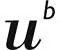

# UNIBE
> 2019.08.05 [🚀](../../index/index.md) [despace](../index.md) → [Contact](../contact.md)

||<mark>noemail</mark>, <mark>noworkphone</mark>, Fax: …;  *…*  【<http://www.unibe.ch/>・ [Wikipedia(EN) ⎆](https://en.wikipedia.org/wiki/University_of_Bern)】|
|:--|:--|
|**Mission**|…|
|**Vision**|…|
|**Values**|…|
|**Business**|…|
|**[MGMT](../mgmt.md)**|…|

**Бернский университет** (нем. **Universität Bern (UNIBE)**) — учебное заведение в столице Швейцарии Берне. Основан в 1834 году на базе Бернской Академии, которая, в свою очередь, была создана в 1805 году на базе богословской высшей школы (*Hohe Schule*, существует с 1500 года).

Прибор «НГМС» на ОКР [Luna‑27](../luna_27.md).

 

…
