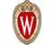

# Wisconsin University
> 2019.08.08 [🚀](../../index/index.md) [despace](../index.md) → [Contact](../contact.md)

||<guide-help@lists.wisc.edu>, +1(608)263-24-00, Fax: …;  *3HGQ+J2 Madisone, Wisconsin, USA*  【<https://www.wisc.edu/>・ [Wikipedia(EN) ⎆](https://en.wikipedia.org/wiki/University_of_Wisconsin–Madison)】|
|:--|:--|
|**Mission**|…|
|**Vision**|…|
|**Values**|…|
|**Business**|…|
|**[MGMT](../mgmt.md)**|…|

**Висконсинский университет в Мадисоне (англ. University of Wisconsin–Madison)** — государственный исследовательский университет, расположенный в Мадисоне, штат Висконсин, США. Ведущий кампус Висконсинского университета (англ.)русск., а также член‑основатель Ассоциации американских университетов. Основан в 1848 году.

The University maintains almost 100 research centers & programs, ranging from agriculture to arts, from education to engineering. It has been considered a major academic center for embryonic stem cell research ever since UW–Madison professor James Thomson became the first scientist to isolate human embryonic stem cells. This has brought significant attention & respect for the University’s research programs from around the world. The University continues to be a leader in stem cell research, helped in part by the funding of the Wisconsin Alumni Research Foundation & promotion of WiCell.

 

…
