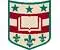

# WUSTL
> 2019.08.11 [🚀](../../index/index.md) [despace](../index.md) → [Contact](../contact.md)

||<mark>noemail</mark>, +1(314)935-5000, Fax: …;  *1 Brookings Dr, St. Louis, MO 63130, USA*  【<https://wustl.edu/>・ [Wikipedia(EN) ⎆](https://en.wikipedia.org/wiki/Washington_University_in_St._Louis)】|
|:--|:--|
|**Mission**|…|
|**Vision**|…|
|**Values**|…|
|**Business**|…|
|**[MGMT](../mgmt.md)**|…|

**Университет Вашингтона в Сент‑Луисе (англ. Washington University in St. Louis)** — частный исследовательский университет США, расположенный в Сент‑Луисе, штат Миссури. Основан в 1853 году и назван в честь первого президента США Джорджа Вашингтона.

 

…

