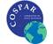

# COSPAR
> 2020.07.02 [🚀](../index/index.md) [despace](index.md) → [Contact](contact.md), [COSPAR](cospar.md), **[Events](event.md)**

[TOC]

---
> <small>**Committee on Space Research (COSPAR)** — EN term. **Комитет по космическим исследованиям (КОСПАР)** — literal RU translation.</small>

||*…*|
|:--|:--|
|E‑mail|<mark>noemail</mark>|
|Link|<https://cosparhq.cnes.fr/>  <https://www.facebook.com/CommitteeOnSpaceResearch/>  <https://twitter.com/cosparhq?:lang=fr>|
|Tel|<mark>noworkphone</mark>, ?: …|

The **Committee on Space Research (COSPAR)** was established by the International Council for Science (ICSU) in 1958. The Principles that COSPAR adheres to in pursuit of its Mission are:

   - COSPAR promotes scientific research in space at an international level, with emphasis on the exchange of results, information, & opinions, & provides a forum, open to all scientists.
   - COSPAR endeavors to ensure that a vibrant international space research effort can be conducted without impediment from geopolitical tensions or differences.
   - COSPAR requires that presentations at its meetings & publications in its journals are the result of scientific research that was conducted with the highest ethical standards.
   - COSPAR discloses any financial support that might be perceived as influencing its activities or positions it might advocate.
   - COSPAR promotes diversity & gender equality in all of its activities, & will not tolerate any form of discrimination or harassment.
   - COSPAR encourages meaningful roles in all activities for younger scientists, who are the future of international space research.

Among COSPAR’s objectives are the promotion of scientific research in space on an international level, with emphasis on the free exchange of results, information, & opinions, & providing a forum, open to all scientists, for the discussion of problems that may affect space research. These objectives are achieved through the organization of symposia, publication, & other means. COSPAR has created a number of research programmes on different topics, a few in cooperation with other scientific Unions. The long‑term project COSPAR international reference atmosphere started in 1960; since then it has produced several editions of the high‑atmosphere code CIRA. The code “IRI” of the URSI‑COSPAR working group on the International Reference Ionosphere was first edited in 1978 & is yearly updated.

Every second year, COSPAR calls for a **General Assembly** (also called Scientific Assembly). These are conferences currently gathering more than a thousand participating space researchers. The most recent assemblies are listed in the table below.

<small>

|*№*|*Year*|*Place*|
|:--|:--|:--|
|44th|2022|Athens, Greece|
|43rd|2020|Sydney, Australia|
|42nd|2018|Pasadena, United States|
|41st|2016|Istanbul (cancelled), Turkey|
|40th|2014|Moscow, Russia|
|39th|2012|Mysore, India|
|38th|2010|Bremen, Germany|
|37th|2008|Montreal, Canada|
|36th|2006|Beijing, China|
|35th|2004|Paris, France|
|34th|2002|Houston, United States|
|33rd|2000|Warsaw, Poland|
|32nd|1998|Nagoya, Japan|
|31st|1996|Birmingham, Great Britain|
|30th|1994|Hamburg, Germany|
|29th|1992|Washington, DC, United States|
|28th|1990|The Hague, Netherlands|
|27th|1988|Espoo, Finland|
|26th|1986|Toulouse, France|
|25th|1984|Graz, Austria|
|24th|1982|Ottawa, Canada|
|23rd|1980|Budapest, Hungary|
|22nd|1979|Bangalore, India|
|21st|1978|Innsbruck, Austria|
|20th|1977|Tel-Aviv, Israel|
|19th|1976|Philadelphia, PA, United States|
|18th|1975|Varna, Bulgaria|
|17th|1974|Sao Paulo, Brazil|
|16th|1973|Konstanz, Germany|
|15th|1972|Madrid, Spain|
|14th|1971|Seattle, WA, United States|
|13th|1970|Leningrad, Soviet Union|
|12th|1969|Prague, Czechoslovakia|
|11th|1968|Tokyo, Japan|
|10th|1967|London, Great Britain|
|9th|1966|Vienna, Austria|
|8th|1965|Mar del Plata, Argentina|
|7th|1964|Florence, Italy|
|6th|1963|Warsaw, Poland|
|5th|1962|Washington, DC, United States|
|4th|1961|Florence, Italy|
|3rd|1960|Nice, France|
|2nd|1959|The Hague, Netherlands|
|1st|1958|London, Great Britain|

</small>

## Docs & links
|Navigation|
|:--|
|**[FAQ](faq.md)**【**[SCS](scs.md)**·КК, **[SC (OE+SGM)](sc.md)**·КА】**[CON](contact.md)·[Pers](person.md)**·Контакт, **[Ctrl](control.md)**·Упр., **[Doc](doc.md)**·Док., **[Drawing](drawing.md)**·Чертёж, **[EF](ef.md)**·ВВФ, **[Error](error.md)**·Ошибки, **[Event](event.md)**·События, **[FS](fs.md)**·ТЭО, **[HF&E](hfe.md)**·Эрго., **[KT](kt.md)**·КТ, **[N&B](nnb.md)**·БНО, **[Project](project.md)**·Проект, **[QM](qm.md)**·БКНР, **[R&D](rnd.md)**·НИОКР, **[SI](si.md)**·СИ, **[Test](test.md)**·ЭО, **[TRL](trl.md)**·УГТ, **[Way](way.md)**·Пути|
|*Sections & pages*|
|**【[Events](event.md)】**  **Meetings:** [AGU](agu.md)・ [CGMS](cgms.md)・ [COSPAR](cospar.md)・ [DPS](dps.md)・ [EGU](egu.md)・ [EPSC](epsc.md)・ [FHS](fhs.md)・ [IPDW](ipdw.md)・ [IVC](ivc.md)・ [JpGU](jpgu.md)・ [LPSC](lpsc.md)・ [MAKS](maks.md)・ [MSSS](msss.md)・ [NIAC](niac_program.md)・ [VEXAG](vexag.md)・ [WSI](wsi.md) ┊ ··•·· **Contests:** [Google Lunar X Prize](google_lunar_x_prize.md)|

   1. Docs: …
   1. <https://cosparhq.cnes.fr/>
   1. <https://www.cospar-assembly.org/>
   1. <https://en.wikipedia.org/wiki/Committee_on_Space_Research>
