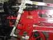
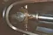

# Крейцкопф
> 2019.05.12 [🚀](../index/index.md) [despace](index.md) → [SGM](sc.md)

[TOC]

---

> <small>**Крейцкопф** — русскоязычный термин. **Crosshead** — англоязычный эквивалент.</small>

**Крейцкопф** (нем. *Kreuzkopf*), **ползун** — деталь кривошипно‑ползунного механизма, совершающая возвратно‑поступательное движение по неподвижным направляющим.

## Назначение
Крейцкопф предназначен для соединения поршня и шатуна в крейцкопфном кривошипно‑шатунном механизме. При таком сочленении поршень жёстко связан с крейцкопфом с помощью штокa. Такое сочленение позволяет разгрузить поршень от нормальной силы, так как её действие в таком случае переносится на крейцкопф. Такая схема соединения позволяет создать вторую рабочую полость в цилиндре под поршнем. При этом шток проходит через уплотнение (сальник) в нижней крышке цилиндра, который обеспечивает необходимую герметичность.

| | |
|:--|:--|
|||

 

## Docs & links (TRANSLATEME ALREADY)
|Navigation|
|:--|
|**[FAQ](faq.md)**【**[SCS](scs.md)**·КК, **[SC (OE+SGM)](sc.md)**·КА】**[CON](contact.md)·[Pers](person.md)**·Контакт, **[Ctrl](control.md)**·Упр., **[Doc](doc.md)**·Док., **[Drawing](drawing.md)**·Чертёж, **[EF](ef.md)**·ВВФ, **[Error](error.md)**·Ошибки, **[Event](event.md)**·События, **[FS](fs.md)**·ТЭО, **[HF&E](hfe.md)**·Эрго., **[KT](kt.md)**·КТ, **[N&B](nnb.md)**·БНО, **[Project](project.md)**·Проект, **[QM](qm.md)**·БКНР, **[R&D](rnd.md)**·НИОКР, **[SI](si.md)**·СИ, **[Test](test.md)**·ЭО, **[TRL](trl.md)**·УГТ, **[Way](way.md)**·Пути|
|*Sections & pages*|
|**【[Structures, gears, materials (SGM)](sc.md)】**  [Гермоконтейнер](гермоконтейнер.md)・ [Датчик](sensor.md)・ [Задел](margin.md)・ [Изделие](unit.md)・ [Испарение материалов](matc.md)・ [Кавитация](cavitation.md)・ [КЗУ](cinu.md) (ВБУ КТ)・ [КХГ](cgs.md)・ [Контейнеры для транспортировки](ship_contain.md)・ [Крейцкопф](crosshead.md)・ [Номинал](nominal.md)・ [ПУС](lag.md)・ [ПНА, ПОНА, ПСНА](devd.md)・ [Резерв](reserve.md)・ [Слайс](слайс.md)・ [ТСП](tsp.md)・ [Типичные формы КА](sc.md)・ [Толкатель](толкатель.md)・ [Унификация](commonality.md)|

   1. Docs: …
   1. <http://ru.wikipedia.org/wiki/Крейцкопф>

