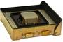

# CSS
> 2019.05.12 [🚀](../index/index.md) [despace](index.md) → **[СД](sensor.md)**

[TOC]

---

> <small>**Coarse Sun Sensors (CSS)** — англоязычный термин, не имеющий аналога в русском языке. **Грубый солнечный датчик** — дословный перевод с английского на русский.</small>

**Coarse Sun Sensors (CSS)**, *грубый солнечный датчик* — аналоговый солнечный датчик, предназначенный для: 1) построения постоянной солнечной ориентации (ПСО) после отделения от [РБ](lv.md); 2) построения и поддержания ПСО, где при работе [научной аппаратуры](oe.md) ПСО используется в качестве рабочей ориентации; 3) построения и поддержания ПСО в нештатных ситуациях (НШС), когда парирование НШС в режиме инерциальной ориентации невозможно.

Описание:

   - **Разработчик и изготовитель:** [Bradford Engineering](zz_bradford_eng.md). Разработано в 1970‑х годах покупное изделие

| |
|:--|
||

<small>

|*Characteristic*|*[Value](si.md)*|
|:--|:--|
|Диапазон °, ≥|± 90° × ± 90°, линейная зона ± 12° × ±12°|
|Исполнение|Моноблок|
|Режим готовности| |
|Точность|1.0 ‑ 1.5° (3σ)|
|Частота обновл., Гц| |
|**Etc:**|• • •|
|[Reliability](qm.md)/[lifetime](lifetime.md)| |
|Dimensions, L×W×H, mm|110 × 110 × 30|
|Interfaces|4 дублированных аналоговых сигнала|
|Mass, ㎏|0.225 (203 ‑ 248) ㎏|
|[Voltage](voltage.md), V| |
|Overload, g| |
|[Rad.resist](ion_rad.md), ㏉ (㎭)| |
|Resource, h (y)| |
|[Lifetime](lifetime.md), h (y)|131 400 (15)|
|[Thermal range](tcs.md), ℃|от −80 до +120 ℃|
|Consumption, W|0|

</small>

 

## Примечания
   1. …

## Применяемость
   1. КА «Ямал» (ЕКА, 1975 г)
   1. [LRO](lunar_reconnaissance_orbiter.md)

 

## Docs & links (TRANSLATEME ALREADY)
|Navigation|
|:--|
|**[FAQ](faq.md)**, **[Cable](cable.md)**·БКС, **[Camera](cam.md)**·Камера, **[Comms](comms.md)**·Радио, **[CON](contact.md)·[Pers](person.md)**·Контакт, **[Control](control.md)**·Упр., **[Doc](doc.md)**·Док., **[Doppler](doppler.md)**·ИСР, **[DS](ds.md)**·ЗУ, **[EB](eb.md)**·ХИТ, **[ECO](ecology.md)**·Экол., **[EF](ef.md)**·ВВФ, **[ElC](elc.md)**·ЭКБ, **[EMC](emc.md)**·ЭМС, **[Error](error.md)**·Ошибки, **[Event](event.md)**·События, **[FS](fs.md)**·ТЭО, **[Fuel](fuel.md)**·Топливо, **[GNC](gnc.md)**·БКУ, **[GS](scs.md)**·НС, **[HF&E](hfe.md)**·Эрго., **[IU](iu.md)**·Гиро., **[KT](kt.md)**·КТЕХ, **[LAG](lag.md)**·ПУC, **[LES](les.md)**·САСП, **[LS](ls.md)**·СЖО, **[LV](lv.md)**·РН, **[MCC](mcc.md)**·ЦУП, **[Model](model.md)**·Модель, **[MSC](sc.md)**·ПКА, **[N&B](nnb.md)**·БНО, **[NR](nr.md)**·ЯР, **[OBC](obc.md)**·ЦВМ, **[OE](oe.md)**·БА, **[Pat.](патент.md)**·Патент, **[Proj.](project.md)**·Проект, **[PS](ps.md)**·ДУ, **[QM](qm.md)**·БКНР, **[R&D](rnd.md)**·НИОКР, **[Robot](robotics.md)**·Робот, **[Rover](rover.md)**·Ровер, **[RTG](rtg.md)**·РИТЭГ, **[SARC](sarc.md)**·ПСК, **[SE](se.md)**·СЭ, **[Sens.](sensor.md)**·Датч., **[SC](sc.md)**·КА, **[SCS](scs.md)**·КК, **[SGM](sgm.md)**·КММ, **[SI](si.md)**·СИ, **[Soft](soft.md)**·ПО, **[SP](sp.md)**·БС, **[Spaceport](spaceport.md)**·Космодр., **[SPS](sps.md)**·СЭС, **[SSS](sss.md)**·ГЗУ, **[TCS](tcs.md)**·СОТР, **[Test](test.md)**·ЭО, **[Timeline](timeline.md)**·ЦГМ, **[TMS](tms.md)**·ТМС, **[TOR](tor.md)**·ТЗ, **[TRL](trl.md)**·УГТ|
|*Sections & pages*|
|**`Солнечный датчик (СД):`**  [ПЗр](fov.md)  • • •  (КА) **Европа:** [FSS](fss_jo.md) (650)・ [FSS](fss.md) (50 ‑ 375)・ [CSS](css.md) (275)・ [CoSS](coss.md) (15 ‑ 24)  ▮  **РФ:** [ТДС](tds.md) (2 300)・ [347К](347k.md) (700)・ [ОСД](osd.md) (650)・ [СДП-1](sdp_1.md) (400)・ [SX-SUNR-01](sx_sunr_01.md) (40)  *(Кубсаты) **США:** [MSS](mss_sm.md) (0.036)・ [CSS](css_sm.md) (0.02)*|

   1. Docs:
      - [Описание от 28.07.2017 ❐](f/sensor/c/css_laspace-css-be-p-0001_issue_1.0.djvu)
      - [CSS, ТО ❐](f/sensor/c/css_datasheet.djvu) (2017)
   1. Notable interwikies — …
   1. <http://bradford-space.com/products/aocs/css/>
