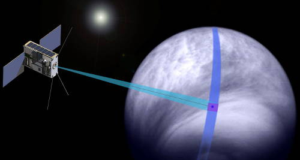

# Cubesat UV Experiment
> 2019.12.08 **[🚀](../index/index.md) [despace](index.md)** → [Venus](venus.md), **[Project](project.md)**

[TOC]

---

> <small>*Terms:* **Cubesat UV Experiment (CUVE)** — English term with no analogues in Russian. **Русский** — rough Russian equivalent.</small>

**CubeSat UV Experiment (CUVE)** is a space mission concept to study the atmospheric processes of the planet Venus with a small satellite. Specifically, the orbiter mission would study an enigmatic ultraviolet light absorber of unknown composition situated within the planet’s uppermost cloud layer that absorbs about half the solar radiation downwelling in the planet’s atmosphere.

The mission concept is still in its early formulation stage, started in 2017. The Principal Investigator is [Valeria Cottini](zz_cottini1.md), at the University of Maryland in College Park.

 

|*Type*|*[Param.](si.md)*|
|:--|:--|
|**Mission:**|• • •|
|Cost| … or … kg of [gold](sc_price.md) in … prices |
|[CML](cml.md) / [TRL](trl.md)| CML: 2, TRL: <mark>TBD</mark> |
|Development| … ‑ … |
|Duration| … |
|Launch| …, …, … |
|Operator| NASA |
|Programme| … |
|Similar to| • Proposed: …  • Current: …  • Past: … |
|Target| Characterize Venus’ unknown UV absorber(s) to understand the planet’s radiative and thermal balance, atmospheric dynamics, and chemistry of its upper clouds |
|[Type](sc.md)| Orbiter spacecraft |
|**Spacecraft:**|• • •|
|Comms| … |
|Composition| … |
|Contractor| … |
|[ID](spaceid.md)| NSSDC ID (COSPAR ID): <mark>TBD</mark>, SCN: <mark>TBD</mark> |
|Manufacturer| … |
|Mass| 180 ([minisatellite](sc.md), [EVN‑070](venus.md)) |
|Orbit / Site| Elliptic polar orbit, I = 90 ° |
|Power| … |
|Payload| UV mapping spectrometer, UV multispectral imager |

 

**Projected** targets & investigations:

   - **T** — technical; **C** — contact research; **D** — distant research; **F** — fly‑by; **H** — manned; **S** — soil sample return; **X** — technology demonstration
   - **Sections of measurement and observation:**
      - Atmospheric/climate — **Ac** composition, **Ai** imaging, **Am** mapping, **Ap** pressure, **As** samples, **At** temperature, **Aw** wind speed/direction.
      - General — **Gi** planet’s interactions with outer space.
      - Soil/surface — **Sc** composition, **Si** imaging, **Sm** mapping, **Ss** samples.

<small>

|*EVN‑XXX*|*T*|*EN*|*Section of m&o*|*D*|*C*|*F*|*H*|*S*|
|:--|:--|:--|:--|:--|:--|:--|:--|:--|
|EVN‑005|T|Exploration: from Venusian orbit.|  |D||F|||
|EVN‑008||Atmosphere: nightglows.|  |D|||||
|EVN‑011||Atmosphere: common circulation model.|  |D|||||
|EVN‑018||Atmosphere: clouds, their chemistry.|  |D||F|||
|EVN‑019||Atmosphere: energetic balance.|  |D|||||
|EVN‑035||Atmosphere: nature of the UV‑absorber.|  |D|||||
|EVN‑070|T|Exploration with [satellites](sc.md): minisatellites.|  |D||F|||

</small>

 

## Mission
<mark>TBD</mark>

 

## Science goals & payload
Characterize Venus’ unknown UV absorber(s) ([EVN‑035](venus.md)) to understand the planet’s radiative and thermal balance ([EVN‑019](venus.md)), atmospheric dynamics ([EVN‑011](venus.md)), and chemistry of its upper clouds ([EVN‑018](venus.md)):

   - SO₂ and SO absorption (190 ‑ 320 nm) and correlation with the “unknown” UV absorber
   - Nature of the “unknown” UV absorber (range 320 ‑ 490 nm) dayside
   - Atmospheric dynamics at the cloud tops from wind tracking (190 ‑ 490 nm)
   - UV absorber distribution
   - UV Nightglow: NO (190 ‑ 300 nm), CO (205 ‑ 240 nm), O₂ (400 ‑ 500 nm) ([EVN‑008](venus.md))

The existence of an “unknown UV absorber” in the upper atmosphere of Venus has been known for decades, since at least Pioneer Venus Orbiter, but it has been difficult to move beyond the label. The UV absorber in the upper clouds absorbs almost half of the solar energy received by the planet. Because of its amazing absorbing power, knowing its nature is very important to understand the overall radiative and thermal balance of the planet and the atmospheric dynamics. CUVE would be able to investigate the UV absorber and its temporal and spatial variations, the atmospheric dynamics and the energy balance, thus complementing current and future Venus missions. It would provide great science return at lower cost, either launched independently or riding along with another Venus’s mission or a mission to a different target.

This concept will address the nature of the UV-absorber (range 0.32 — 0.49 µm) and its temporal and spatial variations, abundances and distributions of SO₂ and SO at and above Venus’s cloud tops and their correlation with the UV absorber (range 0.19 — 0.32 µm), atmospheric dynamics at the cloud tops using wind tracking (0.19 — 0.49 µm), structure of upper clouds and night side airglow (NO, CO, O₂).

   1. UV spectrometer 190 — 380 nm, 0.2 nm spectral resolution  will observe Venus’ dayside UV albedo spectrum (solar light scattered back from the clouds) to resolve the SO and SO 2 bands and retrieve the composition of the UV-blue absorber and observe Venus’ nightside to detect nightglow emissions.
   1. UV multispectral imager 320 — 570 nm, 4 nm spectral resolution will add contextual information and capture the UV contrast features to derive the absorber distribution and the clouds top structure and dynamics. The analysis, correlation and comparison of measurements with models will determine the origin of the UV absorber and further enhance our understanding of the physics and chemistry of Venus’ atmosphere.

 

## Spacecraft
<mark>TBD</mark>

   - **CUVE** is a **12U** high‑altitude orbiter on an **elliptical orbit around Venus**
   - It will perform mostly nadir dayside observations, and some limb nightside observations
   - CUVE is a targeted mission, with a dedicated science payload and a compact spacecraft bus capable of interplanetary flight independently or as a ride-share with another mission to Venus or to a different target
   - In order to increase launch opportunities CUVE technical requirements are based on reaching Venus as secondary payload of a planetary mission, including missions that are not targeting Venus or of a LEO/MEO/GEO mission
   - **Launch opportunities:** Rideshare/hitchhiker missions associated with NF4, Discovery, Ocean Worlds, VenusBridge, EnVision, Venera-D
   - It will have a minimum science phase of 6 months.

**Impact:**

   - CUVE will produce the first broad spectral range (190 — 570 nm) and high spectral resolution (0.2 nm) UV spectrum of Venus from space.
   - CUVE, with its high spectral resolution spectrometer, broad spectral range covering all possible UV absorbers and its contextual imager, will be an excellent platform to study Venus’ atmospheric properties at the top of its clouds where the UV absorption drives the planet’s energy balance.
   - CUVE would complement past, current and future Venus missions, and provide great science return at lower cost.

 

## Community, library, links

**PEOPLE:**

   1. [Valeria Cottini](zz_cottini1.md) (UMD) — **[Principal investigator](principal_investigator.md)**
   1. Shahid Aslam (NASA/GSFC)
   1. Emiliano D'Aversa (INAF-IAPS)
   1. [Lori Glaze](zz_glaze1.md) (NASA/GSFC)
   1. Nicolas Gorius (CUA)
   1. Tilak Hewagama (UMD)
   1. [Nikolay Ignatiev](zz_ignatiev1.md) (IKI RAN)
   1. Giuseppe Piccioni (INAF-IAPS)

**COMMUNITY:**

<mark>TBD</mark>

 

## Docs & links
|…°·•¹²³±×÷≤≥≈≠ ‑ −— ⎆✉ ❐“”’«»✔→✘☐☑├┕┆ 1 lb = 0.453592 kg; 1 g = 9.80665 m/s²|
|:--|
|<small>**[FAQ](faq.md)**, **[Cable](cable.md)**·БКС, **[Camera](camera.md)**·Камера, **[Comms](comms.md)**·Радиосв., **[Contact](contact.md)**·Контакт, **[Control](control.md)**·Управ., **[Doc](doc.md)**·Док., **[Doppler](doppler.md)**·ИСР, **[DS](ds.md)**·ЗУ, **[EB](eb.md)**·ХИТ, **[ECO](ecology.md)**·Экол., **[EF](ef.md)**·ВВФ, **[ElC](elc.md)**·ЭКБ, **[EMC](emc.md)**·ЭМС, **[Errors](error.md)**·Ошибки, **[Events](event.md)**·События, **[FS](fs.md)**·ТЭО, **[Fuel](fuel.md)**·Топливо, **[GNC](gnc.md)**·БКУ, **[GS](scs.md)**·НС, **[HF&E](hfe.md)**·Эргоном., **[IMU](imu.md)**·Гироскоп, **[Incubator](incubator.md)**·Инкуб., **[KT](kt.md)**·КТЕХ, **[LAG](lag.md)**·ПУC, **[LES](les.md)**·САСП, **[LS](ls.md)**·СЖО, **[LV](lv.md)**·РН, **[MAG](mag.md)**·Магнитом., **[MCC](mcc.md)**·ЦУП, **[Model](model.md)**·Модель, **[MSC](sc.md)**·ПКА, **[N&B](nnb.md)**·БНО, **[NR](nr.md)**·ЯР, **[OBC](obc.md)**·ЦВМ, **[OE](oe.md)**·БА, **[Patent](патент.md)**·Патент, **[Project](project.md)**·Проект, **[PS](ps.md)**·ДУ, **[QA](quality.md)**·QA, **[R&D](rnd.md)**·НИОКР, **[RAMS](rams.md)**·НиБ, **[Risk](risk.md)**·Риск, **[Robot](robotics.md)**·Робот, **[Rover](rover.md)**·Планетоход, **[RTG](rtg.md)**·РИТЭГ, **[RW](rw.md)**·ДМ, **[SARC](sarc.md)**·ПСК, **[Sensor](sensor.md)**·Датчик, **[SC](sc.md)**·КА, **[SCS](scs.md)**·КК, **[SGM](sgm.md)**·КММ, **[SI](si.md)**·СИ, **[Soft](soft.md)**·ПО, **[SP](sp.md)**·БС, **[Spaceport](spaceport.md)**·Космодром, **[SPS](sps.md)**·СЭС, **[SSS](sss.md)**·ГЗУ, **[TCS](tcs.md)**·СОТР, **[Test](test.md)**·ЭО, **[Timeline](timeline.md)**·Циклограмма, **[TMS](tms.md)**·ТМС, **[TOR](tor.md)**·ТЗ, **[TRL](trl.md)**·УГТ</small>|
|*Sections & pages*|
|**··•  •··**  <mark>NOCAT</mark> |

   1. Docs:
      - [2017, CubeSat symposium ❐](f/project/c/cuve/2017_cubsatsymposiumgsfc_cottini_cuve_talk_26sept.pdf)
      - [2017, EPSC ❐](f/project/c/cuve/2017_epsc.pdf)
   1. Notable interwikies — …
   1. <https://en.wikipedia.org/wiki/CubeSat_UV_Experiment>
