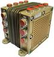

# ЦВМ-12
> 2019.05.12 ┊ **🚀 [despace](index.md)** → **[ЦВМ](obc.md)**

[TOC]

---

**ЦВМ‑12** — цифровая вычислительная машина ([компьютер](obc.md)), предназначенная для использования в составе [КА](sc.md).  
*Разработчик:* [НТЦ Модуль](zz_ntc_module.md). Разработано в 2004 году. покупное изделие.
   - **Предшественник:** 
   - **Преемник:** 

<small>

|*Характеристика*|*[Значение](si.md) <small>()</small>*|
|:--|:--|
|[УГТ](trl.md)|9  |
| Быстродействие, MHz  |50  |
| Время восстановления работоспособности, с  | <small>… (с момента фиксирования отказа аппаратурой автоматической реконфигурации)</small>  |
|Исполнение| Моноблок из 2 полукомплектов.  |
| Команды, датчики, входы  |… — команд управления;  … — релейных матричных команд управления;  … — ТМ‑датчиков;  … — входов прерываний от контактных датчиков;  … — входов прерываний от импульсных датчиков  |
| Объём, кбайт  |4 096 — ОЗУ (с кодом Хэмминга);  8 192 — ЭППЗУ (с кодом Хэмминга);  … — защищённой памяти  |
| Разрядность данных  |64  |
| Тип процессора  |R4000 (MIPS)  |
|  **`Прочее`**  ||v
|Dimensions, L×W×H, mm|   |
|Интерфейсы|   |
|Mass, kg| 2.2  |
|[Voltage](voltage.md), V| 27  |
|Overload, g|   |
|[Rad.resist](ion_rad.md), Gy (rad)|   |
|Resource, h (y)|   |
|[Lifetime](lifetime.md), h (y)|  |
|[Тепловой режим](tcs.md), °C|   |
|Consumption, W| 20  |

</small>

 

## Примечания
   1. …

## Применяемость
   1. …

## Опыт использования
…

 

## Docs & links (TRANSLATEME ALREADY)
|…°·•¹²³±×÷≤≥≈≠ ‑ −— ⎆✉ ❐“”’«»✔→✘☐☑├┕┆ 1 lb = 0.453592 kg; 1 g = 9.80665 m/s²|
|:--|
|<small>**[FAQ](faq.md)**, **[Cable](cable.md)**·БКС, **[Camera](camera.md)**·Камера, **[Comms](comms.md)**·Радиосв., **[Contact](contact.md)**·Контакт, **[Control](control.md)**·Управ., **[Doc](doc.md)**·Док., **[Doppler](doppler.md)**·ИСР, **[DS](ds.md)**·ЗУ, **[EB](eb.md)**·ХИТ, **[ECO](ecology.md)**·Экол., **[EF](ef.md)**·ВВФ, **[ElC](elc.md)**·ЭКБ, **[EMC](emc.md)**·ЭМС, **[Errors](error.md)**·Ошибки, **[Events](event.md)**·События, **[FS](fs.md)**·ТЭО, **[Fuel](fuel.md)**·Топливо, **[GNC](gnc.md)**·БКУ, **[GS](scs.md)**·НС, **[HF&E](hfe.md)**·Эргоном., **[IMU](imu.md)**·Гироскоп, **[Incubator](incubator.md)**·Инкуб., **[KT](kt.md)**·КТЕХ, **[LAG](lag.md)**·ПУC, **[LES](les.md)**·САСП, **[LS](ls.md)**·СЖО, **[LV](lv.md)**·РН, **[MAG](mag.md)**·Магнитом., **[MCC](mcc.md)**·ЦУП, **[Model](model.md)**·Модель, **[MSC](sc.md)**·ПКА, **[N&B](nnb.md)**·БНО, **[NR](nr.md)**·ЯР, **[OBC](obc.md)**·ЦВМ, **[OE](oe.md)**·БА, **[Patent](патент.md)**·Патент, **[Project](project.md)**·Проект, **[PS](ps.md)**·ДУ, **[QA](quality.md)**·QA, **[R&D](rnd.md)**·НИОКР, **[RAMS](rams.md)**·НиБ, **[Risk](risk.md)**·Риск, **[Robot](robotics.md)**·Робот, **[Rover](rover.md)**·Планетоход, **[RTG](rtg.md)**·РИТЭГ, **[RW](rw.md)**·ДМ, **[SARC](sarc.md)**·ПСК, **[Sensor](sensor.md)**·Датчик, **[SC](sc.md)**·КА, **[SCS](scs.md)**·КК, **[SGM](sgm.md)**·КММ, **[SI](si.md)**·СИ, **[Soft](soft.md)**·ПО, **[SP](sp.md)**·БС, **[Spaceport](spaceport.md)**·Космодром, **[SPS](sps.md)**·СЭС, **[SSS](sss.md)**·ГЗУ, **[TCS](tcs.md)**·СОТР, **[Test](test.md)**·ЭО, **[Timeline](timeline.md)**·Циклограмма, **[TMS](tms.md)**·ТМС, **[TOR](tor.md)**·ТЗ, **[TRL](trl.md)**·УГТ</small>|
|*Sections & pages*|
|**`Цифровая вычислительная машина (ЦВМ):`**  …  • • •  **РФ:** [МПК-003](mpk_003.md) (9) ┊ [БИВК-МР](bivk_mr.md) (8) ┊ [МАРС 4](mars_4.md) (8) ┊ [БИВК-Р](bivk_r.md) (7.1) ┊ [МАРС 7](mars_7.md) (6) ┊ [МПК-002](mpk2.md) (3.9) ┊ [ЦВМ-12](cvm_12.md) (2.2) ┊ [БКУ_SXPA](bku_sxpa.md) (0.35) ┊ [БИВК-МН](бивк‑мн.md) () *([ЦВМ22](cvm22.md) (2.1))*|

**Docs:**

   1. 3D‑модель <mark>TBD</mark>
   1. Чертёж <mark>TBD</mark>
   1. [Брошюра от НТЦ «Модуль» ❐](f/cpu/t/cvm-12_doc1.djvu)

**Links:**

   1. Notable interwikies — …
   1. <https://www.module.ru/catalog/space/central_naya_vichislitel_naya_mashina_cvm12/>

