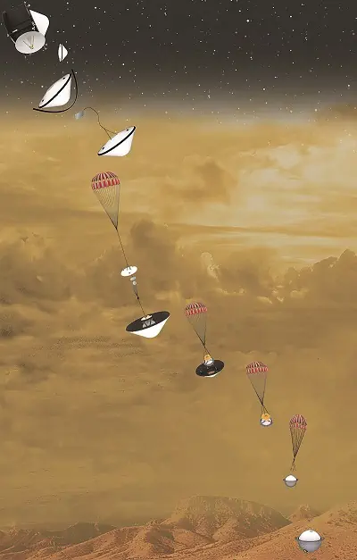

# DAVINCI
> 2020.02.18 [🚀](../index/index.md) [despace](index.md) → [Venus](venus.md), **[Project](project.md)**

**Table of contents:**

[TOC]

---

> <small>**DAVINCI (Deep Atmosphere Venus Investigation of Noble gases, Chemistry, and Imaging), DAVINCI+ (Deep Atmosphere Venus Investigation of Noble gases, Chemistry, and Imaging Plus)** — EN term. **ДАВИНЧИ** — rough RU analogue.</small>

**DAVINCI (Deep Atmosphere Venus Investigation of Noble gases, Chemistry, and Imaging)** is a proposed mission concept for an atmospheric probe to Venus. 

 

|*Type*|*[Param.](si.md)*|
|:-|:-|
|**【Mission】**|• • •|
|Cost|$450M or 10 051 ㎏ of [gold](sc_price.md) in 2019 prices|
|Development|2019 —  …|
|Duration|…|
|Launch|…|
|Operator|NASA Goddard Space Flight Center|
|Programme|Discovery Program|
|Similar to|・Proposed: …  ・Current: …  ・Past: [Pioneer-Venus-2](pioneer_venus_2.md), [VeGa 1, VeGa 2](vega_1_2.md)|
|Target|Designed to address by targeting noble gases, trace gases, and their isotopes, as well as temperature, pressure, winds, and imaging at Venus|
|[Type](sc.md)|Atmospheric spacecraft|
|**【Spacecraft】**|• • •|
|Comms|…|
|Composition|Atmospheric probe|
|Contractor|…|
|[ID](spaceid.md)|NSSDC ID (COSPAR ID): <mark>TBD</mark>, SCN: <mark>TBD</mark>|
|Manufacturer|…|
|Mass|…|
|Orbit / Site|…|
|Payload|Venus Analytic Laboratory, Mass Spectrometer, Tunable Laser Spectrometer, Atmospheric Structure Investigation, Descent Imager|
|Power|…|

Achieved targets & investigations:

   - **T** — technical; **C** — contact research; **D** — distant research; **F** — fly‑by; **H** — manned; **S** — soil sample return; **X** — technology demonstration
   - **Sections of measurement and observation:**
      - Atmospheric/climate — **Ac** composition, **Ai** imaging, **Am** mapping, **Ap** pressure, **As** samples, **At** temperature, **Aw** wind speed/direction.
      - General — **Gi** planet’s interactions with outer space.
      - Soil/surface — **Sc** composition, **Si** imaging, **Sm** mapping, **Ss** samples.

<small>

|*EVN‑XXX*|*T*|*EN*|*Section of m&o*|*D*|*C*|*F*|*H*|*S*|
|:-|:-|:-|:-|:-|:-|:-|:-|:-|
|EVN‑003|T|Exploration: from inside of atmosphere.| |D|C| | | |
|EVN‑014| |Atmosphere: composition.| |D| | |F| |
|EVN‑027| |The causes why Venus evolved in a planet so different from Earth.| |D|C|F| | |
|EVN‑042| |History & causes of the planet’s volcanic & tectonic evolution.| |D| | | | |
|EVN‑050| |Causes of the water loss.| |D| | | | |
|EVN‑052| |Role of water (fluids) in planetary geology.| |D|C|F| | |
|EVN‑055|T|Atmosphere: sample obtaining & analysis.| | |C| | | |
|EVN‑085|T|Surface: tessera investigations, remote| |D| |F| | |
|EVN‑093|T|Atmosphere/surface imaging.| |D| |F| | |
|EVN‑095| |Climate: history & causes of changes.| |D| | | | |

</small>

 

## Mission
DAVINCI would study the chemical composition of Venus’ ([EVN‑014](venus.md)) atmosphere during descent ([EVN‑003](venus.md)). The DAVINCI probe would travel through the Venus atmosphere, sampling the air ([EVN‑055](venus.md)), and returning measurements down to the surface. These measurements are important to understanding the origin of the Venus atmosphere, how it has evolved, and how and why it is different from Earth ([EVN‑027](venus.md)) and Mars. DAVINCI’s measurements would reveal the history of water ([EVN‑052](venus.md)) on Venus and the chemical processes at work in the unexplored lower atmosphere. Before it reaches the surface, the DAVINCI probe would take the photos of the planet’s ridged terrain − «tesserae» ([EVN‑093](venus.md), [EVN‑085](venus.md)) to explore its origin and tectonic, volcanic, and weathering history ([EVN‑042](venus.md), [EVN‑095](venus.md)).

DAVINCI would explore how Venus’s atmosphere formed and then changed over time, including what happened to its water ([EVN‑027](venus.md), [EVN‑050](venus.md)). The findings would help understand why Venus and Earth took such different paths as they matured.

DAVINCI’s in situ measurements would answer multiple questions regarding Venus’s atmospheric composition.

It is part of the Discovery Program, and it was one of the finalists for Discovery 13 and 14. In the selection, the Lucy and Psyche spacecraft were selected as the next missions. The total allocated budget for the winners was $450M. On February 13, 2020, it joined the Discovery 15 and 16 finalists, becoming DAVINCI+.

 

## Science goals & payload
   1. Atmospheric origin and evolution: Understand the origin of the Venus atmosphere, how it has evolved, and how and why it is different from the atmospheres of Earth and Mars.
   1. Atmospheric composition and surface interaction: Understand the history of water on Venus and the chemical processes at work in the lower Venus atmosphere.
   1. Surface properties: Provide insights into tessera origins and their tectonic, volcanic, and weathering history.

|*Instrument*|*Description*|
|:-|:-|
|Venus Analytic Laboratory (VAL)|Instruments would provide high‑fidelity synergistic measurements throughout the probe’s descent, particularly in the upper clouds and the unexplored near‑surface environment.|
|Venus Mass Spectrometer (VMS)|Would provide the first comprehensive in situ surveys of noble and trace gases at Venus, and has the capability to discover new gas species in the Venusian atmosphere.|
|Venus Tunable Laser Spectrometer (VTLS)|Would provide the first highly sensitive in situ measurements of targeted trace gases and associated isotope ratios at Venus, addressing key science questions about chemical processes in the upper clouds and the near‑surface environment.|
|Venus Atmospheric Structure Investigation (VASI)|Would provide measurements of the structure and dynamics of Venus’ atmosphere during entry and descent, providing context for chemistry measurements and enabling reconstruction of the probe’s descent.|
|Venus Descent Imager (VenDI)|Would provide high‑contrast images of the tessera terrain at the descent location.|

 

## Spacecraft

<mark>TBD</mark>

 

## Community, library, links

**PEOPLE:**

   1. James B. Garvin − The DAVINCI Principal Investigator (NASA’s Goddard Space Flight Center).

**COMMUNITY:**

<mark>TBD</mark>

 

## Docs & links
|Navigation|
|:-|
|**[FAQ](faq.md)**【**[SCS](scs.md)**·КК, **[SC (OE+SGM)](sc.md)**·КА】**[CON](contact.md)·[Pers](person.md)**·Контакт, **[Ctrl](control.md)**·Упр., **[Doc](doc.md)**·Док., **[Drawing](drawing.md)**·Чертёж, **[EF](ef.md)**·ВВФ, **[Error](error.md)**·Ошибки, **[Event](event.md)**·Событ., **[FS](fs.md)**·ТЭО, **[HF&E](hfe.md)**·Эрго., **[KT](kt.md)**·КТ, **[N&B](nnb.md)**·БНО, **[Project](project.md)**·Проект, **[QM](qm.md)**·БКНР, **[R&D](rnd.md)**·НИОКР, **[SI](si.md)**·СИ, **[Test](test.md)**·ЭО, **[TRL](trl.md)**·УГТ|
|*Sections & pages*|
|**【】**  <mark>NOCAT</mark>|

   1. Docs: …
   1. <https://en.wikipedia.org/wiki/DAVINCI>
