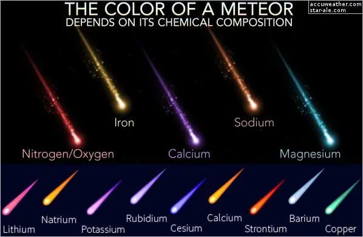

# Астрономический объект
> 2019.05.12 [🚀](../../index/index.md) [despace](index.md) → [EF](ef.md), [Space](index.md)
> *Navigation:*
> **[FAQ](faq.md)**【**[SCS](scs.md)**·КК, **[SC (OE+SGM)](sc.md)**·КА】**[CON](contact.md)·[Pers](person.md)**·Контакт, **[Ctrl](control.md)**·Упр., **[Doc](doc.md)**·Док., **[Drawing](drawing.md)**·Чертёж, **[EF](ef.md)**·ВВФ, **[Error](error.md)**·Ошибки, **[Event](event.md)**·Событ., **[FS](fs.md)**·ТЭО, **[HF&E](hfe.md)**·Эрго., **[KT](kt.md)**·КТ, **[N&B](nnb.md)**·БНО, **[Project](project.md)**·Проект, **[QM](qm.md)**·БКНР, **[R&D](rnd.md)**·НИОКР, **[SI](si.md)**·СИ, **[Test](test.md)**·ЭО, **[TRL](trl.md)**·УГТ

**Table of contents:**

[TOC]

---

> <small>**Астрономический объект (АОБ)** — русскоязычный термин. **Astronomical object** — англоязычный эквивалент.</small>

**Астрономический объект (АОБ)** или **Небесное тело** — естественное физическое тело, ассоциация, или структура, которую современная наука определяет как расположенную в наблюдаемой Вселенной. Термин «астрономический объект» нередко используется наравне с термином «тело». Как правило, «небесное тело» представляет собой обособленную, единую, связанную гравитацией структуру (а иногда и электромагнетизмом). Например: астероиды, спутники, планеты и звёзды. «Астрономические объекты» — гравитационно связанные структуры из нескольких тел, представленные звёздными скоплениями, туманностями и галактиками. Любопытно, что комета может описываться как тело — относительно ядра, состоящего из льда и пыли, и как объект — относительно ядра с комой и хвостом.

**По возрастанию:**

   1. **Космическая пыль** образуется в космосе частицами размером от нескольких молекул до 0.0000002 м. 60 тонн космической пыли каждый день оседает на Земле и ~40 000 тонн космического материала скапливается за год.
   1. **Метеор** *(др.-греч. μετέωρος, «небесный»), «падающая звезда»* — явление, возникающее при сгорании в атмосфере Земли мелких метеорных тел (например, осколков комет или астероидов). Аналогичное явление большей интенсивности (ярче звёздной величины −4) — **болид**.
   1. **Метеороид** — небесное тело, промежуточное по размеру между космической пылью и астероидом.
      - **Метеороид** — природный твёрдый объект размером 0.00001 ‑ 1 м, перемещающийся в межпланетном пространстве. Метеороиды могут быть как первичными объектами, так и производными фрагментами небесных тел большего размера (не только астероидов).
      - **Микрометеороид** — метеороид размером 0.00001 ‑ 0.002 м.
   1. **Метеорит** — тело космического происхождения, упавшее на поверхность крупного небесного объекта. Большинство найденных метеоритов имеют массу от нескольких граммов до нескольких килограммов. В сутки на Землю падает 5 ‑ 6 тонн метеоритов (2 000 тонн в год).
   1. **Астероид** (устар. синоним — **малая планета**) — небольшое небесное тело Солнечной системы, движущееся по орбите вокруг Солнца. Астероиды меньше планет по массе и размерам, имеют неправильную форму и не имеют атмосферы, хотя могут иметь спутники. Астероид — тело с ⌀ 30+ м, меньшего размера — **метеороид**.
   1. **Комета** *(др.-греч. κομήτης, komḗtēs — волосатый, косматый)* — небольшое небесное тело, обращающееся вокруг Солнца по вытянутой орбите в виде конического сечения. При приближении к Солнцу комета образует кому и иногда хвост из газа и пыли.
   1. **Планетезималь** *(англ. planet — планета и infinitesimal — бесконечно малая)* — небесное тело на орбите вокруг протозвезды, образующееся в результате постепенного приращения более мелких тел, состоящих из частиц пыли протопланетного диска. Непрерывно притягивая к себе новый материал и накапливая массу, планетезимали формируют более крупное тело. Отдельные слагающие его фрагменты, взаимно притягиваясь, начинают уплотняться. Уплотняющееся вещество увеличивает температуру в центре. Возросшая температура плавит его, образуется протопланета.
   1. **Планета** — небесное тело, вращающееся по орбите вокруг звезды или её остатков, достаточно массивное, чтобы стать округлым под действием собственной гравитации, но недостаточно массивное для начала термоядерной реакции, и сумевшее очистить окрестности своей орбиты от планетезималей.
   1. **Звезда** — массивный газовый шар, излучающий свет и удерживаемый в состоянии равновесия силами собственной гравитации и внутренним давлением, в недрах которого происходят (происходили) реакции термоядерного синтеза. Спектральные классы: **O** — 30 000+ K голубой, **B** — 10 000 ‑ 30 000 K бело‑голубой, **A** — 7 400 ‑ 10 000 K белый, **F** — 6 000 ‑ 7 400 K жёлто‑белый, **G** — 5 000 ‑ 6 000 K  жёлтый, **K** — 3 800 ‑ 5 000 K оранжевый, **M** — 2 500 ‑ 3 800 K красный. Для запоминания основной последовательности существует мнемоническая фраза: **O**h **B**e **A** **F**ine **G**irl (**G**uy), **K**iss **M**e, и на русском: **О**дин **Б**ритый **А**нгличанин **Ф**иники **Ж**евал **К**ак **М**орковь. Ближайшая к [Земле](earth.md) звезда — [Солнце](sun.md) — типичный представитель класса G2V.
      - **VII** — белые, жёлтые карлики
      - **VI** — субкарлики
      - **V** — звёзды главной последовательности (карлики); самый многочисленный класс — 90 % всех звёзд
      - **IV** — субгиганты
      - **III** — гиганты
      - **II** — яркие гиганты
      - **I** — сверхгиганты; выделяют несколько подклассов:
         - **Ib** — сверхгиганты низкой светимости
         - **Iab** — нормальные сверхгиганты
         - **Ia** — яркие сверхгиганты
         - **0**, **Ia-0** или **Ia+** — ярчайшие сверхгиганты или гипергиганты

## Average environments & conditions

【**Table.** Суммарный метеорный поток за 1 усреднённый год на орбите Земли】  
Расчёт потока произведен на сферу, диаметральное сечение (или площадь большого круга) которой равно 1 m². Для площадки 1 m² эту величину нужно делить на 4. Указаны спорадические и принадлежащие сезонным потокам метеорные частицы в совокупности. Метеорные частицы в подавляющем большинстве вращаются вокруг Солнца в плоскости эклиптики в прямом (как планеты) направлении. Метеорная обстановка не зависит от высоты. Разница связана только с разницей в скорости КА на различных орбитах. Если на НОО добавить техногенные частицы, то картина, конечно, изменится в сторону резкого увеличения до 2 000, в основном на 600 ‑ 900 ㎞.

|*Высота, км*|*0.000001 г*|*0.00001 г*|*0.0001 г*|*0.001 г*|*0.01 г*|
|:-|:-|:-|:-|:-|:-|
|100|5.02|2.00|0.126|0.00800|0.000511|
|200|4.99|1.98|0.125|0.00795|0.000508|
|300|4.96|1.97|0.125|0.00791|0.000505|
|400|4.94|1.96|0.124|0.00786|0.000502|
|500|4.91|1.95|0.123|0.00782|0.000500|
|600|4.88|1.94|0.123|0.00778|0.000497|
|700|4.86|1.93|0.122|0.00774|0.000495|
|800|4.84|1.92|0.121|0.00770|0.000492|
|900|4.81|1.91|0.121|0.00767|0.000490|
|1 000|4.79|1.90|0.120|0.00763|0.000488|
|1 500|4.68|1.86|0.118|0.00746|0.000477|
|2 000|4.59|1.82|0.115|0.00731|0.000468|
|3 000|4.43|1.76|0.111|0.00707|0.000452|
|5 000|4.21|1.67|0.106|0.00671|0.000430|
|10 000|3.89|1.54|0.0976|0.00620|0.000397|
|25 000|3.54|1.41|0.0890|0.00565|0.000363|
|50 000|3.38|1.34|0.0848|0.00539|0.000347|
|100 000|3.28|1.30|0.0824|0.00524|0.000337|

 

## Docs & links (TRANSLATEME ALREADY)
|*Sections & pages*|
|:-|
|**【[Space](index.md)】**  [Apparent magnitude](app_mag.md)・ [Astro.object](aob.md)・ [Blue Marble](earth.md)・ [Cosmic rays](ion_rad.md)・ [Ecliptic](ecliptic.md)・ [Escape velocity](esc_vel.md)・ [Health](health.md)・ [Hill sphere](hill_sphere.md)・ [Information](info.md)・ [Lagrangian points](l_points.md)・ [Near space](near_space.md)・ [Pale Blue Dot](earth.md)・ [Parallax](parallax.md)・ [Point Nemo](earth.md)・ [Silver Snoopy award](silver_snoopy_award.md)・ [Solar constant](solar_const.md)・ [Terminator](terminator.md)・ [Time](time.md)・ [Wormhole](wormhole.md) ┊ ··•·· **Solar system:** [Ariel](ariel.md)・ [Callisto](callisto.md)・ [Ceres](ceres.md)・ [Deimos](deimos.md)・ [Earth](earth.md)・ [Enceladus](enceladus.md)・ [Eris](eris.md)・ [Europa](europa.md)・ [Ganymede](ganymede.md)・ [Haumea](haumea.md)・ [Iapetus](iapetus.md)・ [Io](io.md)・ [Jupiter](jupiter.md)・ [Makemake](makemake.md)・ [Mars](mars.md)・ [Mercury](mercury.md)・ [Moon](moon.md)・ [Neptune](neptune.md)・ [Nereid](nereid.md)・ [Nibiru](nibiru.md)・ [Oberon](oberon.md)・ [Phobos](phobos.md)・ [Pluto](pluto.md)・ [Proteus](proteus.md)・ [Rhea](rhea.md)・ [Saturn](saturn.md)・ [Sedna](sedna.md)・ [Solar day](solar_day.md)・ [Sun](sun.md)・ [Titan](titan.md)・ [Titania](titania.md)・ [Triton](triton.md)・ [Umbriel](umbriel.md)・ [Uranus](uranus.md)・ [Venus](venus.md)|
|**【[External factors (EF)](ef.md)】**  [Astro.object](aob.md)・ [Atmosphere](atmosphere.md)・ [Atmosphere of Earth](earth.md)・ [Cosmic rays](ion_rad.md)・ [EMI](emi.md)・ [Grav.waves](gravwave.md)・ [Ion.radiation](ion_rad.md)・ [Radio frequency](comms.md)・ [Solar phenomena](solar_ph.md)・ [Space debris](sdeb.md)・ [Standart conditions](sctp.md)・ [Time](time.md)・ [VA radiation belts](ion_rad.md)|

   1. Docs: …
   1. <https://en.wikipedia.org/wiki/Asteroid>
   1. <https://en.wikipedia.org/wiki/Astronomical_object>
   1. <https://en.wikipedia.org/wiki/Star>
   1. <https://en.wikipedia.org/wiki/Comet>
   1. <https://en.wikipedia.org/wiki/Meteor>
   1. <https://en.wikipedia.org/wiki/Meteoroid>
