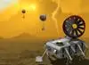
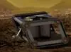

# AREE
> 2019.05.12 [🚀](../../index/index.md) [despace](index.md) → **[Rover](robot.md)**
> *Navigation:*
> **[FAQ](faq.md)**【**[SCS](scs.md)**·КК, **[SC (OE+SGM)](sc.md)**·КА】**[CON](contact.md)·[Pers](person.md)**·Контакт, **[Ctrl](control.md)**·Упр., **[Doc](doc.md)**·Док., **[Drawing](drawing.md)**·Чертёж, **[EF](ef.md)**·ВВФ, **[Error](error.md)**·Ошибки, **[Event](event.md)**·Событ., **[FS](fs.md)**·ТЭО, **[HF&E](hfe.md)**·Эрго., **[KT](kt.md)**·КТ, **[N&B](nnb.md)**·БНО, **[Project](project.md)**·Проект, **[QM](qm.md)**·БКНР, **[R&D](rnd.md)**·НИОКР, **[SI](si.md)**·СИ, **[Test](test.md)**·ЭО, **[TRL](trl.md)**·УГТ

**Table of contents:**

[TOC]

---

> <small>**Automaton Rover for Extreme Environments (AREE)** — EN term. **Вездеход‑автоматон для экстремальных условий (AREE)** — literal RU translation.</small>

**Automaton Rover for Extreme Environments (AREE)** — проект планетохода от NASA для условий Венеры.

|*1st variant of AREE*|*2nd variant of AREE*|
|:-|:-|
|||

## Characteristic
|*Characteristic*|*[Value](si.md)*|
|:-|:-|
|Communication [rate](comms.md), bit/s| |
|Mass (payload), ㎏| |
|Readiness state| |
|Speed of movement, m/s| |
|[Storage](ds.md) volume, bit| |
|**【Etc.】**|• • •|
|Consumption, W| |
|Dimensions, ㎜| |
|[Ext. factors](ef.md)| |
|[Lifetime](lifetime.md)/Resource, h(y)| |
|Mass, ㎏| |
|[Overload](vibration.md), Grms| |
|[Rad.resist](ion_rad.md), ㏉ (㎭)| |
|[Reliability](qm.md)| |
|[Thermal](tcs.md), ℃|… ‑ 462|
|[TRL](trl.md)| |
|[Voltage](sps.md), V| |

## Notes

   - 2020.02.18 NASA started a competition concerning mechanical obstacles sensor.
      - <https://www.jpl.nasa.gov/news/news.php?:feature=7604>
      - <https://www.herox.com/VenusRover>
   - 2017 NASA’s Jet Propulsion Laboratory began seriously studying how AREE would operate.
   - 2015 The project was first proposed.

 

## Docs & links (TRANSLATEME ALREADY)
|*Sections & pages*|
|:-|
|**【[Rover](robot.md)】**  **Mars:** … ┆ **Moon:** … ┆ **Venus:** [AREE](aree.md), [Zephyr](zephyr.md)|

   1. Docs: …
   1. <https://www.nasa.gov/feature/automaton-rover-for-extreme-environments-aree>
   1. <https://en.wikipedia.org/wiki/Automaton_Rover_for_Extreme_Environments>
   1. 2017.04.10 [В НАСА одобрили очередные «безумные» проекты по колонизации космоса ⎆](https://ria.ru/20170410/1491926649.html) — [archived ❐](f/archive/20170410_1.pdf) 2019.02.15
   1. 2017.08.30 [Хабр: JPL NASA разрабатывает заводной вездеход для изучения Венеры ⎆](https://habr.com/ru/post/406309/) — [archived ❐](f/archive/20170830_1.7z) 2019.02.15
