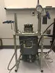

# AVEC
> 2020.01.23 [🚀](../../index/index.md) [despace](index.md) → [JHU APL](contact/jhuapl.md), [Venus](venus.md), **[Test](test.md)**  
> *Navigation:*  
> **[FAQ](faq.md)**【**[SCS](scs.md)**·КК, **[SC (OE+SGM)](sc.md)**·КА】**[CON](contact.md)·[Pers](person.md)**·Контакт, **[Ctrl](control.md)**·Упр., **[Doc](doc.md)**·Док., **[Drawing](drawing.md)**·Чертёж, **[EF](ef.md)**·ВВФ, **[Error](error.md)**·Ошибки, **[Event](event.md)**·Событ., **[FS](fs.md)**·ТЭО, **[HF&E](hfe.md)**·Эрго., **[KT](kt.md)**·КТ, **[N&B](nnb.md)**·БНО, **[Project](project.md)**·Проект, **[QM](qm.md)**·БКНР, **[R&D](rnd.md)**·НИОКР, **[SI](si.md)**·СИ, **[Test](test.md)**·ЭО, **[TRL](trl.md)**·УГТ

**Table of contents:**

[TOC]

---

> <small>**APL’s Venus Environment Chamber (AVEC)** — англоязычный термин, не имеющий аналога в русском языке. **Камера условий на Венере Лаборатории прикладной физики (АВЕК)** — дословный перевод с английского на русский.</small>

**APL’s Venus Environment Chamber (AVEC)** — камера, имитирующая условия атмосферы [Венеры](venus.md). Расположена в [JHU APL](contact/jhuapl.md).

|*AVEC*|
|:-|
||

## Описание
| |*AVEC*|
|:-|:-|
|**Газовых потоков**| |
|**Давление**|10 ㎫ (98.6 атм) номинал,  27+ ㎫ (267+ атм) макс.|
|**Масса**| |
|**Объём**|0.7 л (0.0007 m³, 60 × 230 ㎜)|
|**Температура**|470 ℃ номинал,  500+ ℃ макс.|

   - Возможность подавать внутрь заданную газовую смесь.
   - Доступна для интернационального использования. Контакт в JHU APL — [Noam Izenberg](person.md).
   - Длительность испытания не более недели.

 

## Docs & links (TRANSLATEME ALREADY)
|*Sections & pages*|
|:-|
|**【[Test](test.md)】**  [JTAG](jtag.md)・ [Proto fligt model](pfm.md)・ [Безэховая камера](ach.md)・ [Валидация](vnv.md)・ [Класс чистоты](clean_lvl.md)・ [КПЭО](ctpr.md)・ [Перечень методик испытаний](list_tp.md)・ [Программа и методика испытаний](pmot.md)・ [Опытный образец](pilot_sample.md)・ [Циклограмма](obc.md)・ [Штатный образец](flight_unit.md)・ [ЭО](test.md)・ [Экспериментально‑теоретический метод](etetm.md)|

   1. Docs:
      - [Презентация с LPSC2019 ❐](f/tests/avec_doc01.pdf)
   1. <…>
