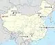

# Chinese Deep Space Network
> 2019.05.12 [🚀](../../index/index.md) [despace](index.md) → [CNSA](contact/cnsa.md), **[НС](scs.md)**  
> *Navigation:*  
> **[FAQ](faq.md)**【**[SCS](scs.md)**·КК, **[SC (OE+SGM)](sc.md)**·КА】**[CON](contact.md)·[Pers](person.md)**·Контакт, **[Ctrl](control.md)**·Упр., **[Doc](doc.md)**·Док., **[Drawing](drawing.md)**·Чертёж, **[EF](ef.md)**·ВВФ, **[Error](error.md)**·Ошибки, **[Event](event.md)**·Событ., **[FS](fs.md)**·ТЭО, **[HF&E](hfe.md)**·Эрго., **[KT](kt.md)**·КТ, **[N&B](nnb.md)**·БНО, **[Project](project.md)**·Проект, **[QM](qm.md)**·БКНР, **[R&D](rnd.md)**·НИОКР, **[SI](si.md)**·СИ, **[Test](test.md)**·ЭО, **[TRL](trl.md)**·УГТ

**Table of contents:**

[TOC]

---

> <small>**Chinese Deep Space Network (CDSN)** — англоязычный термин, не имеющий аналога в русском языке. **Китайская сеть дальней космической связи** — дословный перевод с английского на русский.</small>

The **Chinese Deep Space Network (CDSN)** is a network of large antennas and communication facilities that supports the lunar and interplanetary spacecraft missions of China. It is managed by the China Satellite Launch and Tracking Control General (CLTC).

| |
|:-|
||

As of 2007, the network consisted of:

   - Ground control stations in Kashgar and Qingdao (in the Shandong province).
   - 18 meter antennas in Qingdao and Kashgar. [Bands](comms.md): <mark>TBD</mark>
   - A 50-meter antenna at Miyun (~116°E), near Beijing. [Bands](comms.md): <mark>TBD</mark>
   - A 40-meter antenna in Yunnan (~101°E). [Bands](comms.md): <mark>TBD</mark>

Planned improvements by 2012, to support Chang'e 3 and Chang'e 4, include:

   - Upgrades to the ground facilities at Kashgar and Qingdao, and a deep-space ground control station at Jiamusi.
   - A new 35-meter antenna at the Kashgar station. [Bands](comms.md): <mark>TBD</mark>
   - A 64-meter antenna in Jiamusi. (~130°E) [Bands](comms.md): <mark>TBD</mark>

As of 2017, China was constructing an additional ground station in South America, in the Neuquen province of Argentina (~70°W), with a 50 million-dollar investment. The facility, a part of China’s Lunar Exploration Program. It was inaugurated in October 2017. The station is seen by some as a symbol of China’s increased role in South America’s politics and economy.

 

## Docs & links (TRANSLATEME ALREADY)
|*Sections & pages*|
|:-|
|**`Наземная станция (НС):`**  …    [CDSN](cdsn.md)・ [DSN](dsn.md)・ [ESTRACK](estrack.md)・ [IDSN](idsn.md)・ [SSC_GGSN](ssc_ggsn.md)・ [UDSC](udsc.md)|

   1. Docs: …
   1. <https://en.wikipedia.org/wiki/Chinese_Deep_Space_Network>

