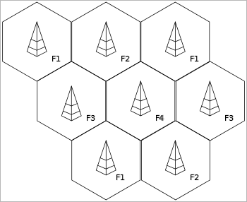
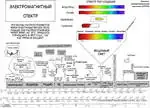
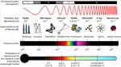

# Communications
> 2019.05.12 [🚀](../../index/index.md) [despace](index.md) → [Comms](comms.md), [OE](sc.md)
> *Navigation:*
> **[FAQ](faq.md)**【**[SCS](scs.md)**·КК, **[SC (OE+SGM)](sc.md)**·КА】**[CON](contact.md)·[Pers](person.md)**·Контакт, **[Ctrl](control.md)**·Упр., **[Doc](doc.md)**·Док., **[Drawing](drawing.md)**·Чертёж, **[EF](ef.md)**·ВВФ, **[Error](error.md)**·Ошибки, **[Event](event.md)**·Событ., **[FS](fs.md)**·ТЭО, **[HF&E](hfe.md)**·Эрго., **[KT](kt.md)**·КТ, **[N&B](nnb.md)**·БНО, **[Project](project.md)**·Проект, **[QM](qm.md)**·БКНР, **[R&D](rnd.md)**·НИОКР, **[SI](si.md)**·СИ, **[Test](test.md)**·ЭО, **[TRL](trl.md)**·УГТ

**Table of contents:**

[TOC]

---

> <small>**Communications, Radiolink** — EN term. **Радиосвязь** — RU analogue.</small>

**Radio communication** — a type of telecommunication, wireless communication, in which the carrier of the signal is radio waves, i.e. electromagnetic waves freely propagating in space:

   - **Antenna-feeder system (AFS)** — see AFS.
   - **Antenna-feeder device (AFD)** — a set of technical means designed to receive & emit radio waves in a given direction.
   - **Onboard radio complex (ORC)** — a set of technical means intended for the implementation of radio communications. Includes receiving & transmitting equipment & AFD.

*Radio communication (DBK & AFS).* A part of a [spacecraft](sc.md).

| |*Company*|*Transmitters/receivers (mass, ㎏)*|
|:-|:-|:-|
|**RU**|[MOKB Mars](contact/mars_mokb.md)| |
| |[NPO IT](contact/npoit.md)|[PRIZYV-3](comms_lst.md) (0.17)・ [PRIZYV-1](comms_lst.md) (0.075)|
| |[LAV](contact/lav.md)|[BRK](brk_lav.md) (12)|
| |[NPP Sait](contact/sait_ltd.md)|[RU PNI](ру_пни.md) ()・ [HSXBDT](comms_lst.md) (1.8)・ [CSXBT](comms_lst.md) (0.38)|
| |[RKS](contact/rss.md)|[BA KIS](ба_кис.md) (21)|
|•|• • • • • • • • •|• • •|
|**US**|[Space Micro](space_micro.md)| |

【**Table.** Manufacturers】

| | |
|:-|:-|
|**AE**|…|
|**AU**|…|
|**CA**|・[C-CORE](contact/c_core.md) — from radio beacons & ice measurement radars to sat transponders & space‑qualified hardware  ・[Calian AT](contact/calian_at.md) — frequency planning, sat resource management, satellite modulators  ・[MDA](contact/mda.md) — manufacturing & testing antennas & electronics  ・[SpaceBridge Inc.](contact/spacebridge.md) — broadcast modems for GEO & NGSO satellite constellations  ・[Telesat](contact/telesat.md) — satellite communications & integration services, satellite operator|
|**CN**|…|
|**EU**|…|
|**IL**|…|
|**IN**|…|
|**JP**|・[Meisei](contact/meisei.md) — transmitters  ・[Mitsubishi](contact/mitsubishi.md) — telemetry & beacon transmitters, power & low noise amplifiers, receiver & ♁↗ 🚀↘ converters  ・[NEC](contact/nec.md) — low noise & solid state power amplifiers (LNA, SSPA), converters (CONV), receivers (RCVR), & modulators (MOD), command receivers (CMDRX), telemetry & beacon transmitters (TLMTX, BCNTX), GPS receivers (GPSR), & multiuse interface modules (MIM), antennas/spaceborne radars, transponders|
|**KR**|・[Satrec Initiative](contact/satreci.md)|
|**RU**|・[AvantSpace](contact/avantspace.md)  ・[IRZ](contact/irz.md), [NII Guskova](нии_гуськова.md) — LNA, PE  ・[RADIS](contact/radis.md)|
|**SA**|…|
|**SG**|…|
|**US**|…|
|**VN**|…|

TMP:

   1. <http://www.spacemicro.com/products/rf-and-microwave.html>
   1. Микроволновые системы <http://Mwsystems.ru>
   1. Глобальные системы <http://global-s.world/>

## Receiver noise temperature

| |*Temp.*|*Station*|
|:-|:-|:-|
|**On Earth**|50|Green Bank Telescope (GBT), Latitude: 38.433°N, Longitude: 79.84°W, ESA|
| |60|Sardinia Radio Telescope (SRT), Latitude: 39.493°N, Longitude: 9.245°E, ESA|
|**In space**|200|Space, Venus & Mars (average)|
| |300|Near the Earth (average)|
| |400|Surface of Venus (average)|
| |450|Space, min.|
| |500|Space, max.|

## Radiolink

[General radiolink calculation ❐](f/comms/radiolink_calc_full.zip)

### Frequency modulation

**Frequency modulation (FM)** is the encoding of information in a carrier wave by varying the instantaneous frequency of the wave. The technology is used in telecommunications, radio broadcasting, signal processing, and computing.

【**Table.** Passband modulation】

|*Section*|*Description*|
|:-|:-|
|**Analog modulation**|AM・ FM・ PM・ QAM・ SM・ SSB|
|**Digital modulation**|ASK・ APSK・ CPM・ FSK・ MFSK・ MSK・ OOK・ PPM・ PSK・ QAM・ SC-FDE・ TCM・ WDM|
|**Hierarchical modulation**|QAM・ WDM|
|**Spread spectrum**|CSS・ DSSS・ FHSS・ THSS|

### Frequency reuse

**Frequency reuse (FR)** — technique for using a specified range of frequencies more than once in the same radio system so that the total capacity of the system is increased without increasing its allocated bandwidth. Frequency reuse schemes require sufficient isolation among the signals that use the same frequencies so that mutual interference among them is controlled at an acceptable level. For satellites, frequency reuse can be achieved by using **orthogonal polarization** states for transmission and/or by using satellite antenna **(spot) beams** that serve separate, non-overlapping geographic regions.

  
*This image shows an example of frequency reuse in cellular networks (in this case 4 frequencies are used). The image is an idealised representation with perfectly hexagonal cells. Eight separate cells are shown packed one next to the other. The first cell on the top left uses frequency 1. The cells which are next to it then use frequency 2 & 3. Beyond those cells, another cell again uses frequency 1. This pattern with the same frequency never being reused by direct neighbours repeats across the diagram. The frequency reuse pattern shown is typical example for a digital cellular system (i.e. GSM). For earlier analog systems a higher reuse pattern (7 or greater) is more usual.*

## Диапазоны частот
> <small>**Диапазон частот** — русскоязычный термин. **Radio frequency (RF)** — англоязычный эквивалент.</small>

**Диапазон частот** — полоса излучаемых источником частот, которой зачастую присвоено условное наименование, важное понятие радиотехники, а также физико‑технических дисциплин в целом.

Это понятие имеет общий характер, то есть можно говорить или о диапазоне частот какого‑либо конкретного излучателя (природного или искусственного происхождения), или о диапазоне, выделенном какой‑то радиослужбе, или, например, об обобщённой разбивке всей полосы радиочастот. Диапазоны описываются регламентом радиосвязи.

| | |
|:-|:-|
|||

### Типовые диапазоны
**Таблица.** Диапазоны частот для радиокомплексов, применяемых на КА.

|*Обозн.*|*Частоты, ㎓  【Длина волны, ㎝】*|*Примечания*|
|:-|:-|:-|:-|
|**УКВ, VHF**, *very high frequ&shy;ency*|0.05 ‑ 0.33 【90 ‑ 600】|Ультракороткие волны.  ・УКВ по регламенту допустим для связи КА‑КА.  ・121.5, 243 ㎒ — сигнал бедствия, вещание запрещено.  ・406 - 406.1 ㎒ — для радиопеленгации|
|**ДМВ, UHF**, *ultra high frequ&shy;ency*|0.3 ‑ 3 【10 ‑ 100】|Дециметровые волны.  ・1 420.405 75 ㎒, 21.1 ㎝ — нейтральный водород.|
|**L**, *Long*|1 ‑ 2 【15 ‑ 30】| |
|**S**, *Short*|2 ‑ 4 【7.5 ‑ 15】|2 ㎓ по регламенту допустимо для связи КА‑КА:  ・2 025 ‑ 2 100 ㎒ Земля‑космос, космос‑космос;  ・2 110 ‑ 2 120 ㎒ дальний космос;  ・2 200 ‑ 2 290 ㎒ Земля‑космос, космос‑космос;  ・2 290 ‑ 2 300 ㎒ дальний космос|
|**C**, *Comp&shy;romise*|4 ‑ 8 【3.75 ‑ 7.5】| |
|**X** |8 ‑ 12 【2.5 ‑ 3.75】|Управление оружием, ракетами, морские радары, погода, картографирование среднего разрешения; в США 10 525 ± 25 ㎒ используется в РЛС аэропортов.  ・Для связи КА-Земля разрешена полоса в 10 ㎒;  ・8 400 ‑ 8 450 ㎒ для дальнего космоса;  ・8 450 ‑ 8 500 ㎒ для ближнего космоса.|
|**Ku**, *under K*|12 ‑ 18 【1.67 ‑ 2.5】| |
|**K**, нем. *kurz* «короткий»|18 ‑ 27 【1.11 ‑ 1.67】|Использование ограничено из‑за сильного поглощения водяным паром, поэтому используются Ku и Ka.|
|**Ka**, *above K*|27 ‑ 40 【0.75 ‑ 1.11】| |
|**V**|40 ‑ 75 【0.04 ‑ 0.075】|Мед. аппараты для физиотерапии и диагностики|
|**W**|75 ‑ 110 【0.027 ‑ 0.04】|Сенсоры в автоматических транспортных средствах, исследование погоды|
|**Види&shy;мое  излу&shy;чение**|385k ‑ 790k 【…】| |
|・|・|・|
|**4G**| | |
|**5G**|0.694 ‑ 0.79, 3.4 ‑ 3.8, 4.8 ‑ 4.99, 24.25 ‑ 27.5, 37 ‑ 43.5| |
|**Wi‑Fi**| | |

**Сверхвысокие частоты (СВЧ)** — этот термин может означать:

   - диапазон частот микроволнового излучения — 300 ‑ 300 000 ㎒;
   - диапазон частот сантиметровых волн — 3 000 ‑ 30 000 ㎒.

**Ви́димое излуче́ние** — электромагнитные волны, воспринимаемые человеческим глазом. Чувствительность человеческого глаза к электромагнитному излучению зависит от длины волны (частоты) излучения, при этом максимум чувствительности приходится на 555 нм (540 ㎔), в зелёной части спектра. Поскольку при удалении от точки максимума чувствительность спадает до нуля постепенно, указать точные границы спектрального диапазона видимого излучения невозможно. Обычно в качестве коротковолновой границы принимают участок 380 ‑ 400 нм (790 ‑ 750 ㎔), а в качестве длинноволновой — 760 ‑ 780 нм (395 ‑ 385 ㎔). Электромагнитное излучение с такими длинами волн также называется видимым светом, или просто светом (в узком смысле этого слова).

Не всем цветам, которые различает человеческий глаз, соответствует какое‑либо монохроматическое излучение. Такие оттенки, как розовый, бежевый или пурпурный образуются только в результате смешения нескольких монохроматических излучений с различными длинами волн.

Видимое излучение также попадает в «оптическое окно», область спектра электромагнитного излучения, практически не поглощаемого земной атмосферой. Чистый воздух рассеивает синий свет сильнее, чем свет с бо́льшими длинами волн (в красную сторону спектра), поэтому полуденное небо выглядит голубым.

Многие виды животных способны видеть излучение, не видимое человеку, т.е. не входящее в видимый диапазон. Например, пчёлы и многие насекомые видят свет в ультрафиолетовом диапазоне, что помогает им находить нектар на цветах. Растения, опыляемые насекомыми, оказываются в более выгодном положении с точки зрения продолжения рода, если они ярки именно в ультрафиолетовом спектре. Птицы также способны видеть ультрафиолетовое излучение (300 ‑ 400 нм), а некоторые виды имеют даже метки на оперении для привлечения партнёра, видимые только в ультрафиолете.

Считается, что определённые цвета находятся в определённых пределах длин волн. Это иллюстрирует нижеприведённая таблица.

**Таблица.** Длины световых волн

|*Название цвета*|*Длина волны, нм*|
|:-|:-|
|Фиолетовый (сине‑фиолетовый)|390 ‑ 440|
|Синий|440 ‑ 480|
|Голубой (сине‑зелёный)|480 ‑ 510|
|Зелёный|510 ‑ 550|
|Жёлто‑зелёный|550 ‑ 575|
|Жёлтый|575 ‑ 585|
|Оранжевый|585 ‑ 620|
|Красный|620 ‑ 770|

### Скорость
Скорость передачи информации с КА на Землю определяется частотой и шириной выделенной полосы; мощность передатчика влияет только на чёткость приёма сигнала. См. также [Битрейт](bitrate.md).

|*Дальность*|*Диапазон*|*Скорость,  кбит/с (Мбит/с)*|*Антенна*|*Примечание*|
|:-|:-|:-|:-|:-|
|**Луна**|X|4 096 (4)|CНА|Полоса 10 ㎒|
| |X|10 240 (10)|ОНА|Полоса 10 ㎒|
| |X|19 350 (18.9)|ОНА|Полоса 10 ㎒|
| |Ka|102 400 (100)|ОНА| |
| | | | | |
|**Венера**|X|32 ‑ 256|ОНА|Полоса 10 ㎒|
| |X|64 ‑ 512|ОНА|Полоса 10 ㎒|
| |Ka|26 624 (26)|ОНА| |
| |ЛКС|56 320 (55)| | |

### Регламент радиосвязи
> <small>**Регламент радиосвязи (РР)** — русскоязычный термин. **ITU Radio Regulations (RR)** — англоязычный эквивалент.</small>

**Регламент радиосвязи (РР)** — основной документ Международного союза электросвязи, определяющий порядок использования любого радиоустройства, которое работает на территории любой из стран‑членов Международного союза электросвязи.

**Основные задачи:**

   - Регламент радиосвязи является сводом правил эксплуатации устройств, излучающих электромагнитные волны в радиодиапазоне. Каждое из таких устройств является потенциальным источником помех для радиоприёма, поэтому существует необходимость точного определения параметров и порядка работы радиоприёмных и радиопередающих устройств для их одновременной работы в различных регионах.
   - Регламент радиосвязи включает в себя классификацию радиоустройств по сфере их применения, порядок распределения участков радиодиапазона, отведённых для различных видов коммуникации (радиосвязь, радиовещание, телевидение, радионавигация, радиолокация и т.д.), а также нормы параметров устройств, излучающих или принимающих радиоволны, условия использования радиочастот отдельными радиослужбами в различных районах мира, правила закрепления рабочих частот за радиостанциями и т.п.

 

## Docs & links
|*Sections & pages*|
|:-|
|**`Бортовая аппаратура (БА):`**  [PDD](pdd.md)・ [Антенна](antenna.md)・ [АПС](hns.md)・ [БУ](eas.md)・ [ЗУ](ds.md)・ [Изделие](unit.md)・ [КЛЧ](clean_lvl.md)・ [ПЗР](fov.md)・ [ПО](soft.md)・ [Прототип](prototype.md)・ [Радиосвязь](comms.md)・ [СКЭ](elmsys.md)・ [ССИТД](tsdcs.md)・ [СИТ](etedp.md)・ [УГТ](trl.md)・ [ЭКБ](elc.md)・ [EMC](emc.md)|
|**【[Communications](comms.md)】**  [CCSDS](ccsds.md)・ [Антенна](antenna.md)・ [АФУ](afdev.md)・ [Битрейт](bitrate.md)・ [ВОЛП](ofts.md)・ [ДНА](дна.md)・ [Диапазоны частот](comms.md)・ [Зрение](view.md)・ [Интерферометр](interferometer.md)・ [Информация](info.md)・ [КНД](directivity.md)・ [Код Рида‑Соломона](rsco.md)・ [КПДА](antenna.md)・ [КСВ](swr.md)・ [КУ](ку.md)・ [ЛКС, АОЛС, FSO](fso.md)・ [Несущий сигнал](carrwave.md)・ [ПНА, ПОНА, ПСНА](devd.md)・ [Помехи](emi.md) (EMI, RFI)・ [Последняя миля](last_mile.md)・ [Регламент радиосвязи](comms.md)・ [СИТ](etedp.md)・ [Фидер](feeder.md)  • • •  **РФ:** [БА КИС](ба_кис.md) (21)・ [БРК](brk_lav.md) (12)・ [РУ ПНИ](ру_пни.md) ()・ [HSXBDT](comms_lst.md) (1.8)・ [CSXBT](comms_lst.md) (0.38)・ [ПРИЗЫВ-3](comms_lst.md) (0.17) *([ПРИЗЫВ-1](comms_lst.md) (0.075))*|

   1. Docs:
      - [General radiolink calculation ❐](f/comms/radiolink_calc_full.zip)
      - [РР. Статьи. ❐](f/comms/reglament_radiosvyazi_articles_2012.djvu) (Издание 2012 года)
      - [РР. Рекомендации РФ ❐](f/comms/rr_ru.doc) и укороченная [версия ❐](f/comms/rr_ru_reduced.doc) для космоса
      - [РР. Рекомендации для Марса, Луны, Венеры ❐](f/comms/rr_rec_sfcg_22_1r2.docx)
   1. <https://ru.wikipedia.org/wiki/Система_передачи_информации_космического_аппарата>
   1. <https://ru.wikipedia.org/wiki/Радиосвязь>
   1. <http://www.radioscanner.ru/>
   1. <https://www.gartner.com/en/information-technology/glossary/frequency-reuse>
   1. <https://en.wikipedia.org/wiki/Cellular_network>
   1. <https://en.wikipedia.org/wiki/Visible_spectrum>
   1. <https://en.wikipedia.org/wiki/Radio_wave>
   1. <https://en.wikipedia.org/wiki/Radar>
   1. <https://en.wikipedia.org/wiki/X_band>
   1. <https://en.wikipedia.org/wiki/Tetrachromacy>
   1. <https://en.wikipedia.org/wiki/Hydrogen_line>
   1. <https://en.wikipedia.org/wiki/ITU_Radio_Regulations>
   1. <https://en.wikipedia.org/wiki/Frequency_modulation>
   1. <http://www.itu.int/>
   1. 2017.07.14 <https://geektimes.ru/post/291095/>
