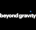

# Beyond Gravity
> 2022.03.28 [🚀](../../../index/index.md) [despace](../index.md) → [Contact](../contact.md)

||<mark>noemail</mark>, +41 44 553 07 00, Fax: …;  *Schaffhauserstrasse 580, 8052 Zürich, Switzerland*  【<https://www.beyondgravity.com/>・ [Instagram ⎆](https://www.instagram.com/beyond_gravity_space)・ [LinkedIn ⎆](https://www.linkedin.com/company/beyondgravity/)・ [Twitter ⎆](https://twitter.com/BeyondGravity_S)・ [Wikipedia ⎆](https://en.wikipedia.org/wiki/RUAG_Space)】|
|:-|:-|
|**Mission**|…|
|**Vision**|…|
|**Values**|・**Curious.** Progress demands we get past the obvious & open our minds to new possibilities. We are born with an insatiable curiosity leading to breakthrough inventions in history. Why — that’s the most important question to understand the need of our counterpart & look at the world from their eyes. Our future requires that we maintain that same sense of wonder & keep our curiosity alive. Being curious means active listening, continous learning, not settling for the first solution. In the face of uncertainty, we explore & fill gaps in our knowledge. Every day brings opportunity to try something new & we seize it.  ・**Passionate.** We love what we do & we have a lot of fun doing what we do, in the coolest industry there is. We are not working on tasks or are motivated by a carrot. We are literally working on missions & our motivation comes from within, a unique desire to tackle challenges & produce value.  ・**Together.** At Beyond Gravity we can only win together: with our colleagues across the globe, our customers, suppliers & partners. Each role is important, diversity leads to broader solutions & with combined strenghts we achieve more. In a team we need to rely on each other, have trust & take responsibility. Last but not least, working together is fun!|
|**Business**|SC / LV elecronics & components|
|**[MGMT](../mgmt.md)**|・CEO — André Wall|

**Beyond Gravity**, headquartered in Zurich, Switzerland, is the first startup to combine agility, speed & innovation with decades of experience & proven quality. Beyond Gravity is the preferred supplier of structures for all types of launch vehicles & a leader in selected satellite products & for constellations in the New Space sector.

Around 1 700 employees at 12 locations in 6 countries (Switzerland, Sweden, Austria, Germany, USA & Finland) generated a revenue of around CHF 319 million (2021).

Beyond Gravity encompasses the former space activities of the RUAG Group. This started its activities in 1999 & consisted of four former Swiss defense companies. In 2009, RUAG Space acquired the space activities of Saab Space, Austrian Aerospace as well as Oerlikon Space AG (formerly Contraves Space). To date, all shares in the company are owned by the Swiss Confederation.

 

…
