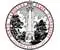

# NCSU
> 2019.08.08 [🚀](../../../index/index.md) [despace](../index.md) → [Contact](../contact.md)

||<newstips@ncsu.edu>, +1(919)515-20-11, Fax: …;  *Campus Box 7001, A Holladay Hall, Raleigh, NC, 27695, USA*  【<https://www.ncsu.edu/>・ [Facebook ⎆](https://www.facebook.com/ncstate)・ [Instagram ⎆](https://www.instagram.com/ncstate)・ [LinkedIn ⎆](https://www.linkedin.com/edu/north-carolina‑state-university-18786)・ [Twitter ⎆](https://twitter.com/ncstate)・ [Wikipedia ⎆](https://en.wikipedia.org/wiki/North_Carolina_State_University)】|
|:-|:-|
|**Mission**|…|
|**Vision**|…|
|**Values**|…|
|**Business**|…|
|**[MGMT](../mgmt.md)**|…|

**Университет штата Северная Каролина** (официально Университет штата Северная Каролина в Роли (англ. North Carolina State University at Raleigh), сокращение англ. NCSU) — государственный исследовательский университет в г. Роли, Северная Каролина, США. Один из ведущих технических вузов США. Входит в систему Университета Северной Каролины. Наряду с Университетом Дьюка и Университетом Северной Каролины в Чапел‑Хилл является одним из углов «исследовательского треугольника». Университет был основан 7 марта 1887 года как Северо‑Каролинский колледж сельского хозяйства и механических искусств.

 

…

