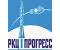

# РКЦ «Прогресс»
> 2019.08.06 [🚀](../../../index/index.md) [despace](../index.md) → [Contact](../contact.md)

||<mail@samspace.ru>, +7(846)228-94-65, Fax: +7(846)992-65-18;  *Россия, 443009, Россия, Самара, ул. Земеца, 18*  【<http://www.samspace.ru/>・ [Wikipedia ⎆](https://en.wikipedia.org/wiki/Progress_Rocket_Space_Centre)】|
|:-|:-|
|**Mission**|…|
|**Vision**|…|
|**Values**|…|
|**Business**|…|
|**[MGMT](../mgmt.md)**|…|

**АО «РКЦ «Прогресс»** — ведущее российское предприятие и один из лидеров мировой космической отрасли по разработке, производству и эксплуатации ракет‑носителей среднего класса. Ракеты‑носители, созданные на предприятии, используются для запуска пилотируемых и транспортных кораблей на Международную космическую станцию, а также запусков зарубежных полезных нагрузок. Благодаря высокому уровню надежности самарские ракеты‑носители получили признание на мировом уровне.

   - **Ракеты‑носители в эксплуатации**
      - Ракета‑носитель «Союз‑2»
      - Ракета‑носитель «Союз‑2-1В»
      - Ракета‑носитель «Союз‑СТ»
      - Ракета‑носитель «Союз‑ФГ»
      - Ракета‑носитель «Союз‑У»
   - **Перспективные ракеты‑носители**
   - **Бывшие в эксплуатации ракеты‑носители**
      - Ракеты‑носители семейства Р-7
      - Ракета‑носитель «Молния»
      - Ракета‑носитель «Союз»
      - Ракета‑носитель «Восход»
      - Ракета‑носитель «Восток»

 

…
