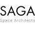

# SAGA Space Architects
> 2022.01.28 [🚀](../../../index/index.md) [despace](../index.md) → [Contact](../contact.md)

||<studio@saga.dk>, <mark>noworkphone</mark>, Fax: …;  *SAGA Studio ApS, Bådehavnsgade 38 port 1, 2450 Copenhagen, Denmark*  【<https://saga.dk/>・ [Facebook ⎆](https://www.facebook.com/sagaspacearchitects)・ [Instagram ⎆](https://instagram.com/saga_space_architects)・ [LinkedIn ⎆](https://www.linkedin.com/company/saga-space-architects/)】|
|:-|:-|
|**Mission**|…|
|**Vision**|Space habitation & extra-terrestrial living is vital for human development. If we stop exploring we stagnate. We approach exploration from a human perspective, where mental well-being & social sustainability is part of the life-support equation.|
|**Values**|…|
|**Business**|Space architectures|
|**[MGMT](../mgmt.md)**|・CTO — Simon D.H. Kristensen|

**SAGA Space Architects** is a Denmark company aimed for design architecture for outer space with a focus on wellbeing inspired by the natural environment & human needs from an evolutionary point of view. Also we make technology driven architecture, here for planet Earth, using state of the art tools & methods learned from working with space.

 

…
