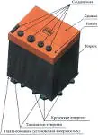

# Electric battery (a list)
> 2019.05.12 [🚀](../../index/index.md) [despace](index.md) → [EB](eb.md)  
> *Navigation:*  
> **[FAQ](faq.md)**【**[SCS](scs.md)**·КК, **[SC (OE+SGM)](sc.md)**·КА】**[CON](contact.md)·[Pers](person.md)**·Контакт, **[Ctrl](control.md)**·Упр., **[Doc](doc.md)**·Док., **[Drawing](drawing.md)**·Чертёж, **[EF](ef.md)**·ВВФ, **[Error](error.md)**·Ошибки, **[Event](event.md)**·Событ., **[FS](fs.md)**·ТЭО, **[HF&E](hfe.md)**·Эрго., **[KT](kt.md)**·КТ, **[N&B](nnb.md)**·БНО, **[Project](project.md)**·Проект, **[QM](qm.md)**·БКНР, **[R&D](rnd.md)**·НИОКР, **[SI](si.md)**·СИ, **[Test](test.md)**·ЭО, **[TRL](trl.md)**·УГТ

**Table of contents:**

[TOC]

---

A list of [Electric batteries](eb.md).

## Current

 

### 8LI-70 (RU, 70 A·h)
**8LI-70** *(ru. 8ЛИ‑70)* — Li‑Ion electric battery by [Saturn](пао_сатурн.md). Designed in …

|*Characteristics*|*[Value](si.md)  (8LI-70)*|
|:-|:-|
|Composition| |
|Consumption, W| |
|Dimensions, ㎜|268×232×270|
|[Interfaces](interface.md)| |
|[Lifetime](lifetime.md)/Resource, h(y)|10 / …|
|Mass, ㎏|18.8|
|[Overload](vibration.md), Grms| |
|[Rad.resist](ion_rad.md), ㏉ (㎭)| |
|[Reliability](qm.md) per [lifetime](lifetime.md)|0.999|
|[Thermal range](tcs.md), ℃|+5 ‑ +49; (–10 ‑ +10 for storage, –50 ‑ +50 for transport.)|
|[TRL](trl.md)| |
|[Voltage](sps.md), V|26.5 ‑ 33.6|
|**【Specific】**|• • •|
|Capacity (nominal), A·h (W·h)|70 / 2 020|
|Capacity at the EoL, A·h| |
|Capacity at the BoL, A·h| |
|Current (charge), A, ≤|20|
|Current (discharge), A, ≤|35|
|Degradation function| |
|Heat dissipation, W, ≤| |
|Number of batteries|8|
|Resource in cycles (depth of discharge,%)| 100|
|Self‑discharge,%/day, ≤|1|
|Specific energy, A·h/㎏ (W·h/㎏)|3.72 (101)|
|Voltage of each battery, V|2.7 ‑ 4.15|
| ||

**Notes:**

   1. Not recommended for use due to the fact that in comparison with analogs (e.g., [8S8P](eb_lst.md)) there are: ➀ high mass (18.8 vs 11.7 ㎏); ➁ necessity of external element‑wise alignment; ➂ has a sequential connection scheme (if 1 bank fails, the entire EB stops functioning).
   1. **Applicability:** [Luna‑27](луна_27.md)

 

### 8S8P (EU, 30 A·h)

**8S8P VES16** — Li‑Ion electric battery by [Saft](contact/saft.md). Designed in 2014.

|*Characteristics*|*[Value](si.md)  (8S8P)*|
|:-|:-|
|Composition| |
|Consumption, W| |
|Dimensions, ㎜|340×198×166|
|[Interfaces](interface.md)| |
|[Lifetime](lifetime.md)/Resource, h(y)|… (10) / …|
|Mass, ㎏|11.6|
|[Overload](vibration.md), Grms| |
|[Rad.resist](ion_rad.md), ㏉ (㎭)| |
|[Reliability](qm.md) per [lifetime](lifetime.md)| |
|[Thermal range](tcs.md), ℃|−5 ‑ +50 (−20 ‑ +10 for storage)|
|[TRL](trl.md)|9 (TeLEOS-1 in 2015)|
|[Voltage](sps.md), V|21.6 ‑ 32.8|
|**【Specific】**|• • •|
|Capacity (nominal), A·h (W·h)|30 (865)|
|Capacity at the BoL, A·h| |
|Capacity at the EoL, A·h| |
|Current (charge), A, ≤|20|
|Current (discharge), A, ≤|35|
|Degradation function| |
|Heat dissipation, W, ≤| |
|Number of batteries|24|
|Resource in cycles (depth of discharge,%)|  |
|Self‑discharge,%/day, ≤|0.005|
|Specific energy, A·h/㎏ (W·h/㎏)|2.58 (74)|
|Voltage of each battery, V| |

**Notes:**

   1. [Sketch ❐](f/sps/ves16_8s8p_gp24717_2017.pdf)
   1. [SAFT VES16 solution gor small GEO ❐](f/sps/ves16_e3sconf_espc2017_06004.pdf)
   1. [A fragment from book «Lithium‑Ion Batteries: Advances and Applications» ❐](f/sps/ves16_libaa_fragment.pdf)
   1. **Applicability:** [ExoMars‑2020](экзомарс_2020.md)・TeLEOS-1・[Luna‑25](луна_25.md)

 

### 12LI-120 (RU, 120 A·h)
**12LI-120** *(ru. 12ЛИ‑120)* — Li‑Ion electric battery by [Saturn](пао_сатурн.md). Designed in …

|*Characteristics*|*[Value](si.md)  (12LI-120)*|
|:-|:-|
|Composition| |
|Consumption, W| |
|Dimensions, ㎜|396×386×245|
|[Interfaces](interface.md)| |
|[Lifetime](lifetime.md)/Resource, h(y)|… (3) / 37 670|
|Mass, ㎏|45 (41.86‑44.54)|
|[Overload](vibration.md), Grms| |
|[Rad.resist](ion_rad.md), ㏉ (㎭)| |
|[Reliability](qm.md) per [lifetime](lifetime.md)|0.9995|
|[Thermal range](tcs.md), ℃|0 ‑ +49 (–40 ‑ +50 for transport.)|
|[TRL](trl.md)| |
|[Voltage](sps.md), V|33 ‑ 50|
|**【Specific】**|• • •|
|Capacity (nominal), A·h (W·h)|120 / 4 000|
|Capacity at the EoL, A·h|105 (84 in the next 4 y)|
|Capacity at the BoL, A·h|120|
|Current (charge), A, ≤|20|
|Current (discharge), A, ≤| |
|Degradation function|linear|
|Heat dissipation, W, ≤|120 (43 average loop)|
|Number of batteries|12|
|Resource in cycles (depth of discharge,%)| 13 100 (up to 30)|
|Self‑discharge,%/day, ≤|0.5|
|Specific energy, A·h/㎏ (W·h/㎏)|2.666 (88)|
|Voltage of each battery, V|2.7 ‑ 4.15|

**Notes:**

   1. …
   1. **Applicability:** [Luna‑26](луна_26.md)

 

## Archive

 

## Docs & links
|*Sections & pages*|
|:-|
|**【[Chemical source of electricity (CSE), Electric battery (EB)](eb.md)】**  [Charge efficiency](charge_eff.md)  • • •  **EU:** [8S8P](eb_lst.md) (30)  ▮  **RU:** [8LI-70](eb_lst.md) (70)・ [12LI-120](eb_lst.md) (120)|

   1. Docs:
   1. <…>
