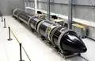
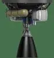

# Electron
> 2019.05.20 [🚀](../../index/index.md) [despace](index.md) → [LV](lv.md)  
> *Navigation:*  
> **[FAQ](faq.md)**【**[SCS](scs.md)**·КК, **[SC (OE+SGM)](sc.md)**·КА】**[CON](contact.md)·[Pers](person.md)**·Контакт, **[Ctrl](control.md)**·Упр., **[Doc](doc.md)**·Док., **[Drawing](drawing.md)**·Чертёж, **[EF](ef.md)**·ВВФ, **[Error](error.md)**·Ошибки, **[Event](event.md)**·Событ., **[FS](fs.md)**·ТЭО, **[HF&E](hfe.md)**·Эрго., **[KT](kt.md)**·КТ, **[N&B](nnb.md)**·БНО, **[Project](project.md)**·Проект, **[QM](qm.md)**·БКНР, **[R&D](rnd.md)**·НИОКР, **[SI](si.md)**·СИ, **[Test](test.md)**·ЭО, **[TRL](trl.md)**·УГТ

**Table of contents:**

[TOC]

---

> <small>**Electron** — англоязычный термин, не имеющий аналога в русском языке. **Электрон** — дословный перевод с английского на русский.</small>

**«Электрон»** (англ. **Electron**) — новозеландская одноразовая жидкостная [ракета‑носитель](lv.md) сверхлёгкого класса, разработанная новозеландским подразделением частной аэрокосмической компании [Rocket Lab](contact/rocket_lab.md) (США).

|*Version*|*Description*|*Activity*|
|:-|:-|:-|
|Electron|Базовый вариант.|**Активен** (2017 ‑ …)|

 

## Electron
**«Электрон»** (англ. **Electron**) — новозеландская одноразовая жидкостная [ракета‑носитель](lv.md) сверхлёгкого класса, разработанная новозеландским подразделением частной аэрокосмической компании [Rocket Lab](contact/rocket_lab.md) (США).  
Electron позволяет вывести полезную нагрузку массой до 150 ㎏ на ССО 500 ㎞ (до 250 ㎏ на НОО). Основные элементы РН, несущий корпус и баки ступеней выполнены из [углепластика](cfrp.md) и производятся Rocket Lab. Применение композиционных материалов позволило существенно снизить вес конструкции. РН оборудована композитным ГО длиной 2.5 м, диаметром 1.2 м и массой около 50 ㎏.

|*Characteristic*|*[Value](si.md)*|
|:-|:-|
|Активность|**Активен** (2017‑…)|
|[Аналоги](analogue.md)|**Kuaizhou** (Китай) ┊ **LauncherOne** (США) ┊ **Pegasus** (США) ┊ **Super Strypi** (США) ┊ **Vector‑H** (США)|
|Длина/диаметр|17 / 1.2 м|
|[Космодромы](spaceport.md)|[Rocket Lab LC1](spaceport.md)|
|Масса старт./сух.|12 550 / 1 250 ㎏|
|Разраб./изготов.|[Rocket Lab](contact/rocket_lab.md) (США) / [Rocket Lab](contact/rocket_lab.md) (США)|
|Ступени|2|
|[Fuel](ps.md)|[O + Kerosene](o_plus.md)|
| ||

**Выводимые массы.**

|*Космодром*|*РН*|<small>*Масса,  [НОО](nnb.md), т*</small>|<small>*Масса,  [ГСО](nnb.md), т*</small>|<small>*Масса к  [Луне](moon.md), т*</small>|<small>*Масса к  [Венере](venus.md), т*</small>|<small>*Масса к  [Марсу](mars.md), т*</small>|*Примечания*|
|:-|:-|:-|:-|:-|:-|:-|:-|
|[Rocket Lab LC1](spaceport.md)|Electron|0.25|—|—|—|—|Пуск — $ 6 млн (2019 г);  ПН 1.99 % от ст.массы|

<small>Примечания:  **1)** Указана масса для наихудших условий старта.  **2)** В скобках указана масса для наилучших условий старта.</small>

|*РН в сравнении  с человеком*|*В сборочном  помещении*|*Двигатель  «Резерфорд»*|
|:-|:-|:-|
||||

 

## Архивные

…

 

## Docs & links (TRANSLATEME ALREADY)
|*Sections & pages*|
|:-|
|**【[Launch vehicle (LV)](lv.md)】**  [ICBM](icbm.md)・ [Integrated payload unit](lv.md)・ [Non‑rocket spacelaunch](nrs.md)・ [Throw weight](throw_weight.md) • • •  **China:** [Long March](long_march.md) ┊ **EU:** [Arian](arian.md), [Vega](vega.md) ┊ **India:** [GSLV](gslv.md), [PSLV](pslv.md) ┊ **Israel:** [Shavit](shavit.md) ┊ **Japan:** [Epsilon](epsilon.md), [H2](h2.md), [H3](h3.md) ┊ **Korea N.:** [Unha](unha.md) ┊ **Korea S.:** *([Naro‑1](naro_1.md))* ┊ **RF,CIF:** [Angara](angara.md), [Proton](proton.md), [Soyuz](soyuz.md), [Yenisei](yenisei.md), [Zenit](zenit.md) *([Energia](energia.md), [Korona](korona.md), [N‑1](n_1.md), [R‑1](r_7.md))* ┊ **USA:** [Antares](antares.md), [Atlas](atlas.md), [BFR](bfr.md), [Delta](delta.md), [Electron](electron.md), [Falcon](falcon.md), [Firefly Alpha](firefly_alpha.md), [LauncherOne](launcherone.md), [New Armstrong](new_armstrong.md), [New Glenn](new_glenn.md), [Minotaur](minotaur.md), [Pegasus](pegasus.md), [Shuttle](shuttle.md), [SLS](sls.md), [Vulcan](vulcan.md) *([Saturn](saturn_lv.md), [Sea Dragon](sea_dragon.md))*|

   1. Docs: …
   1. <https://en.wikipedia.org/wiki/Electron_(rocket)>
   1. <https://en.wikipedia.org/wiki/LauncherOne>
   1. <https://en.wikipedia.org/wiki/Kuaizhou>
   1. <https://en.wikipedia.org/wiki/Northrop_Grumman_Pegasus>
   1. <https://en.wikipedia.org/wiki/Rocket_Lab_Electron>
   1. <https://en.wikipedia.org/wiki/Comparison_of_orbital_launch_systems>
   1. 2016.09.26 [Rocket Lab Opens Private Orbital Launch Site in New Zealand ⎆](https://www.space.com/34195-rocket-lab-opens-private-launch-site-new-zealand.html)
