# Engines (a list)
> 2019.05.12 [🚀](../../index/index.md) [despace](index.md) → [PS](ps.md)
> *Navigation:*
> **[FAQ](faq.md)**【**[SCS](scs.md)**·КК, **[SC (OE+SGM)](sc.md)**·КА】**[CON](contact.md)·[Pers](person.md)**·Контакт, **[Ctrl](control.md)**·Упр., **[Doc](doc.md)**·Док., **[Drawing](drawing.md)**·Чертёж, **[EF](ef.md)**·ВВФ, **[Error](error.md)**·Ошибки, **[Event](event.md)**·Событ., **[FS](fs.md)**·ТЭО, **[HF&E](hfe.md)**·Эрго., **[KT](kt.md)**·КТ, **[N&B](nnb.md)**·БНО, **[Project](project.md)**·Проект, **[QM](qm.md)**·БКНР, **[R&D](rnd.md)**·НИОКР, **[SI](si.md)**·СИ, **[Test](test.md)**·ЭО, **[TRL](trl.md)**·УГТ

**Table of contents:**

[TOC]

---

A list of [Engines](ps.md).

## Current

 

### 1NMHT   ［EU・1comp.］
**1NMHT** — 1‑component [engine](ps.md) by [OPC LAM](contact/opc_lam.md). Designed in 1996.

|*[Characteristics](si.md)*|*1NMHT*|
|:-|:-|
|Composition| |
|Consumption, W| |
|Dimensions, ㎜| |
|[Interfaces](interface.md)| |
|[Lifetime](lifetime.md)/Resource, h(y)|… / …|
|Mass, ㎏|0.29 w/ valve|
|[Overload](vibration.md), Grms| |
|[Rad.resist](ion_rad.md), ㏉ (㎭)| |
|[Reliability](qm.md) per [lifetime](lifetime.md)| |
|[Thermal range](tcs.md), ℃| |
|[TRL](trl.md)|9|
|[Voltage](sps.md), V| |
|**【Specific】**|• • •|
|[Fuel](ps.md) (+ combustion products)|[Hydrazine](hydrazine.md) (H₂, N₂)|
|Fuel — components’ mass ratio|—|
|Fuel — consumption, ㎏/s, ≤|0.000.163.098 ‑ … ‑ 0.000.502.827|
|Fuel — resource, ㎏, ≥|67|
|Press. — comb. chamber, ㎫ (㍴)| |
|Press. — eng. entrance, ㎫ (㍴)|0.56 ‑ 2.24 (5.5 ‑ 22)|
|Press. — nozzle cut, ㎫ (㍴)| |
|Temper. — comb. chamber, К (℃)| |
|Temper. — nozzle cut, К (℃)| |
|Thrust, N (㎏f)|0.32 ‑ 1 ‑ 1.1 (0.032 ‑ 0.1 ‑ 0.112)|
|Thrust — duration of 1 thrust, s|… ‑ 43 200|
|Thrust — [Ing](ing.md), N·s (㎏f·s), ≤| |
|Thrust — [Isp](ps.md), s (N·s/㎏), ≥|200 ‑ … ‑ 223 (1 962 ‑ … ‑ 2 190)|
|Thrust — switch. frequency, ㎐, ≤| |
|Thrust — torch angle, °| |
|Thrust — total pulses, ≥|59 000|
|Thrust — total thrust, N (㎏f), ≥|135 000 (13 760)|
|Thrust — total thrust, s (h), ≥|180 000|
|[Turbopump](turbopump.md) rate, rpm|—|
| |[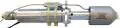](f/ps/0/1nmht_pic1.webp)|

**Notes:**

   1. Specs’re for nominal vacuum continuous thrust starting from the 2nd second after energizing the solenoid valves.
   1. [Products brochures ❐](f/contact/o/opc_lam_brochures.7z)
   1. <http://www.space-propulsion.com/spacecraft-propulsion/hydrazine-thrusters/1n-hydrazine-thruster.html> — [archived ❐](f/ps/0/1nmht_site.pdf) 2019.02.21
   1. **Applicability** — CSO-3 (…)・ CSO-2 (…)・ CSO-1 (2016)・ Sentinel 2B (2016)・ Sentinel 5P (2016)・ SEOSAT (Ingenio) (2015)・ Sentinel 2A (2015)・ SEOSAR (Paz) (2015)・ Taranis (2015)・ AstroTerra 2 (2014)・ KRS (2014)・ Jason-3 (2013)・ Vietnam-1 (2013)・ AstroTerra 1 (2012)・ Pleiades HR2 (2012)・ Elisa-1 (2011)・ Elisa-2 (2011)・ Elisa-3 (2011)・ Elisa-4 (2011)・ Pleiades HR1 (2011)・ SSOT (2011)・ Alsat 2A (2010)・ Alsat 2B (2010)・ CosmoSkymed-4 (2010)・ TANDEM-X (2010)

 

### 11D428A-16   ［RU・2comp.］
**11D428A-16** (ru. **11Д428А-16**) — 2‑component [engine](ps.md) by [NIIMASH](contact/niimash.md).

|*[Characteristics](si.md)*|*11D428A-16*|*11D428AF-16*|
|:-|:-|:-|
|Composition| | |
|Consumption, W| | |
|Dimensions, ㎜|290 × … **⁽¹⁾**|372 × 158 **⁽¹⁾**|
|[Interfaces](interface.md)| | |
|[Lifetime](lifetime.md)/Resource, h(y)|… / …|… / …|
|Mass, ㎏|1.5 **⁽¹⁾**|1.9 **⁽¹⁾**|
|[Overload](vibration.md), Grms| | |
|[Rad.resist](ion_rad.md), ㏉ (㎭)| | |
|[Reliability](qm.md) per [lifetime](lifetime.md)| | |
|[Thermal range](tcs.md), ℃| | |
|[TRL](trl.md)|9 **⁽¹ ²⁾**|9 **⁽¹ ²⁾**|
|[Voltage](sps.md), V| | |
|**【Specific】**|• • •|• • •|
|[Fuel](ps.md) (+ combustion products)|[NTO+UDMH](nto_plus.md) **⁽¹⁾** (H₂, H₂O, CO, CO₂, N₂)|[NTO+UDMH](nto_plus.md) **⁽¹⁾** (H₂, H₂O, CO, CO₂, N₂)|
|Fuel — components’ mass ratio|1.85 ± 0.15 **⁽¹⁾**|1.85 ± 0.05 **⁽¹⁾**|
|Fuel — consumption, ㎏/s, ≤|0.045.287|0.041.139|
|Fuel — resource, ㎏, ≥|2 250|2 042|
|Press. — comb. chamber, ㎫ (㍴)| | |
|Press. — eng. entrance, ㎫ (㍴)|0.98 ‑ 1.86 (9.8 ‑ 18.6) **⁽¹⁾**|1.37 ‑ 1.57 (13.7 ‑ 15.7) **⁽¹⁾**|
|Press. — nozzle cut, ㎫ (㍴)| | |
|Temper. — comb. chamber, К (℃)| | |
|Temper. — nozzle cut, К (℃)| | |
|Thrust, N (㎏f)|129.16 (13.1) **⁽¹⁾**|123.5 (12.5) **⁽¹⁾**|
|Thrust — duration of 1 thrust, s|0.03 ‑ 2 000 **⁽¹⁾**|0.03 ‑ 2 000 **⁽¹⁾**|
|Thrust — [Ing](ing.md), N·s (㎏f·s), ≤| | |
|Thrust — [Isp](ps.md), s (N·s/㎏), ≥|290 (2 852) **⁽¹⁾**|306 (3 002) **⁽¹⁾**|
|Thrust — switch. frequency, ㎐, ≤| | |
|Thrust — torch angle, °| | |
|Thrust — total pulses, ≥|500 000 **⁽¹⁾**|500 000 **⁽¹⁾**|
|Thrust — total thrust, N (㎏f), ≥|6 458 000|6 175 000|
|Thrust — total thrust, s (h), ≥|50 000|50 000 **⁽¹⁾**|
|[Turbopump](turbopump.md) rate, rpm|—|—|

**Notes:**

   1. Specs’re for nominal vacuum continuous thrust starting from the 0.5nd second after energizing the solenoid valves.
   1. **[1]** — see [NIIMASH](contact/niimash.md) site, 2016 y.
   1. **Applicability:**
      - **17D428A-16** — Orbital manned station Salyut・ Orbital manned station Mir・ Soyuz-TM・ Progress-M・ Service module Zvezda at the International Space Station Astrophysical Observatory Gamma
      - **17D428AF-16** — Fobos-Grunt, PS of the returning module

 

### 11D457   ［RU・2comp.］
**11D457** (ru. **11Д457**) — 2‑component [engine](ps.md) by [NIIMASH](contact/niimash.md).

|*[Characteristics](si.md)*|*11D457*|*11D457F*|
|:-|:-|:-|
|Composition| | |
|Consumption, W| | |
|Dimensions, ㎜|236 × … **⁽¹⁾**|257 × 68 **⁽²⁾**|
|[Interfaces](interface.md)| | |
|[Lifetime](lifetime.md)/Resource, h(y)|… / …|1 825 (5) **⁽²⁾** / …|
|Mass, ㎏|1.2 **⁽¹⁾**|1.2 **⁽²⁾**|
|[Overload](vibration.md), Grms| | |
|[Rad.resist](ion_rad.md), ㏉ (㎭)| | |
|[Reliability](qm.md) per [lifetime](lifetime.md)| | |
|[Thermal range](tcs.md), ℃| | |
|[TRL](trl.md)|9 **⁽¹ ²⁾**|9 **⁽¹ ²⁾**|
|[Voltage](sps.md), V| | |
|**【Specific】**|• • •|• • •|• • •|
|[Fuel](ps.md) (+ combustion products)|[NTO+UDMH](nto_plus.md) **⁽¹ ²⁾** (H₂, H₂O, CO, CO₂, N₂)|[NTO+UDMH](nto_plus.md) **⁽¹ ²⁾** (H₂, H₂O, CO, CO₂, N₂)|
|Fuel — components’ mass ratio|1.85 ± 0.15 **⁽¹ ²⁾**| |
|Fuel — consumption, ㎏/s, ≤|0.021.655|0.019.001|
|Fuel — resource, ㎏, ≥| |109|
|Press. — comb. chamber, ㎫ (㍴)| | |
|Press. — eng. entrance, ㎫ (㍴)|1.05 ‑ 1.35 (10 ‑ 13) **⁽¹⁾**|1.18 (12) **⁽²⁾**|
|Press. — nozzle cut, ㎫ (㍴)| | |
|Temper. — comb. chamber, К (℃)| | |
|Temper. — nozzle cut, К (℃)| | |
|Thrust, N (㎏f)|53.9 (5.5) **⁽¹⁾**|54 (5.5) **⁽²⁾**|± 6.9 **⁽²⁾**|
|Thrust — duration of 1 thrust, s|0.03 ‑ 300 **⁽¹⁾**|0.03 ‑ 2 000 **⁽²⁾**|
|Thrust — [Ing](ing.md), N·s (㎏f·s), ≤| |2.45 (0.25) **⁽²⁾**|
|Thrust — [Isp](ps.md), s (N·s/㎏), ≥|253 (2 489) **⁽¹⁾**|290 (2 842) **⁽²⁾**|
|Thrust — switch. frequency, ㎐, ≤| |8 **⁽²⁾**|
|Thrust — torch angle, °| | |
|Thrust — total pulses, ≥|100 000 **⁽¹⁾**|100 000 **⁽²⁾**|
|Thrust — total thrust, N (㎏f), ≥| |310 000 (31 600)|
|Thrust — total thrust, s (h), ≥| |5 750 **⁽²⁾**|
|[Turbopump](turbopump.md) rate, rpm|—|—|

**Notes:**

   1. Specs’re for nominal vacuum continuous thrust starting from the 2nd second after energizing the solenoid valves.
   1. **[1]** — see Specification & [NIIMASH](contact/niimash.md) site, 2016 y.
   1. **Applicability:**
      - **11D457** — manned station “Yantar”・ SC “Neman”・ SC “Sapphire”・ SC “Kobalt-M”・ SC “Orlets”・ SC “Kometa”・ SC “Don”・ SC “Lotos”・ SC “Resurs-Dk”
      - **11D457F** — [Luna‑26](луна_26.md)・ [Spektr-M](спектр_м.md)

 

### 11D458   ［RU・2comp.］
**11D458** (ru. **11Д458**) — 2‑component [engine](ps.md) by [NIIMASH](contact/niimash.md).

|*[Characteristics](si.md)*|*11D458*|*11D458M*|*11D458F*|
|:-|:-|:-|:-|
|Composition| | | |
|Consumption, W| | | |
|Dimensions, ㎜|370 × … **⁽¹⁾**|470 × 192 **⁽¹⁾**|465 × 202 **⁽²⁾**|
|[Interfaces](interface.md)| | | |
|[Lifetime](lifetime.md)/Resource, h(y)|… / …|… / …|1 825 (5) **⁽²⁾** / …|
|Mass, ㎏|2.5 **⁽¹⁾**|3 **⁽¹⁾**|3 **⁽²⁾**|
|[Overload](vibration.md), Grms| | | |
|[Rad.resist](ion_rad.md), ㏉ (㎭)| | | |
|[Reliability](qm.md) per [lifetime](lifetime.md)| | | |
|[Thermal range](tcs.md), ℃| | | |
|[TRL](trl.md)|9 **⁽¹ ²⁾**|9 **⁽¹ ²⁾**|9 **⁽¹ ²⁾**|
|[Voltage](sps.md), V| | | |
|**【Specific】**|• • •|• • •|• • •|
|[Fuel](ps.md) (+ combustion products)|[NTO+UDMH](nto_plus.md) **⁽¹ ²⁾**  (H₂, H₂O, CO, CO₂, N₂)|[NTO+UDMH](nto_plus.md) **⁽¹ ²⁾**  (H₂, H₂O, CO, CO₂, N₂)|[NTO+UDMH](nto_plus.md) **⁽¹ ²⁾**  (H₂, H₂O, CO, CO₂, N₂)|
|Fuel — components’ mass ratio|1.85 ± 0.15 **⁽¹ ²⁾**|1.85 ± 0.15 **⁽¹ ²⁾**|1.85 ± 0.15 **⁽¹ ²⁾**|
|Fuel — consumption, ㎏/s, ≤|0.158.704|0.132.433|0.128.091|
|Fuel — resource, ㎏, ≥| |132 **⁽¹⁾**; 509 **⁽³⁾**|350 **⁽²⁾**|
|Press. — comb. chamber, ㎫ (㍴)| | | |
|Press. — eng. entrance, ㎫ (㍴)|0.98 ‑ 1.96 (9.8 ‑ 19.6) **⁽¹⁾**|1.27 ‑ 1.97 (12.7 ‑ 19.7) **⁽¹⁾**|1.13 ‑ 1.23 (11.3 ‑ 12.3) **⁽²⁾**|
|Press. — nozzle cut, ㎫ (㍴)| | | |
|Temper. — comb. chamber, К (℃)| | | |
|Temper. — nozzle cut, К (℃)| | | |
|Thrust, N (㎏f)|392 (39.9) **⁽¹⁾**|392.4 (39.9) **⁽¹⁾**|382 (39) **⁽²⁾**|± 10 **⁽²⁾**|
|Thrust — duration of 1 thrust, s|0.1 ‑ 3 000 **⁽¹⁾**|0.05 ‑ 1 000 **⁽¹⁾**; 0.05 ‑ 1 500 **⁽³⁾**|0.05 ‑ 2 000 **⁽²⁾**|
|Thrust — [Ing](ing.md), N·s (㎏f·s), ≤| | |9.41 (0.96) **⁽²⁾**|
|Thrust — [Isp](ps.md), s (N·s/㎏), ≥|252 (2 470) **⁽¹⁾**|302 (2 963) **⁽¹⁾**|304 (2 979) **⁽²⁾**|
|Thrust — switch. frequency, ㎐, ≤| | |8 **⁽²⁾**|
|Thrust — torch angle, °| | | |
|Thrust — total pulses, ≥|33 000 **⁽¹⁾**|10 000 **⁽¹⁾**|10 000 **⁽²⁾**|
|Thrust — total thrust, N (㎏f), ≥| |392 000 (40 000)  1 569 600 (160 000)|1 044 000 (106 400)|
|Thrust — total thrust, s (h), ≥| |1 000 **⁽¹⁾**; 4 000 **⁽³⁾**|2 750 **⁽²⁾**|
|[Turbopump](turbopump.md) rate, rpm|—|—|—|

**Notes:**

   1. Specs’re for nominal vacuum continuous thrust starting from the 0.5nd second after energizing the solenoid valves.
   1. **[1,2,3]** — see Specification & [NIIMASH](contact/niimash.md) site, 2016 y.
   1. **Applicability:**
      - **11Д458** — [Briz](бриз.md)・ Orbital manned station “Almaz”・ Orbital station “Mir”・ FGB “Zarya” (ISS)
      - **11Д458М** — [Briz](бриз.md)・ [Luna‑26](луна_26.md)
      - **11Д458Ф** — [Spektr-M](спектр_м.md)

 

### 14D30   ［RU・2comp.］
**11D30** (ru. **14Д30**) — 2‑component [engine](ps.md) by [KBHM](contact/kbhm.md)

|*[Characteristics](si.md)*|*14D30*|
|:-|:-|
|Composition| |
|Consumption, W| |
|Dimensions, ㎜|948 × 1 150 **⁽¹⁾**|
|[Interfaces](interface.md)| |
|[Lifetime](lifetime.md)/Resource, h(y)|… / …|
|Mass, ㎏|95 **⁽¹⁾**|
|[Overload](vibration.md), Grms| |
|[Rad.resist](ion_rad.md), ㏉ (㎭)| |
|[Reliability](qm.md) per [lifetime](lifetime.md)| |
|[Thermal range](tcs.md), ℃| |
|[TRL](trl.md)|9 **⁽¹⁾**|
|[Voltage](sps.md), V| |
|**【Specific】**|• • •|
|[Fuel](ps.md) (+ combustion products)|[NTO+UDMH](nto_plus.md) **⁽¹⁾** (H₂, H₂O, CO, CO₂, N₂)|
|Fuel — components’ mass ratio|2.0 **⁽¹⁾**|
|Fuel — consumption, ㎏/s, ≤|6.085|
|Fuel — resource, ㎏, ≥|19 470|
|Press. — comb. chamber, ㎫ (㍴)|10 (100) **⁽¹⁾**|
|Press. — eng. entrance, ㎫ (㍴)| |
|Press. — nozzle cut, ㎫ (㍴)| |
|Temper. — comb. chamber, К (℃)| |
|Temper. — nozzle cut, К (℃)| |
|Thrust, N (㎏f)|19 620 (2 000) **⁽¹⁾**|
|Thrust — duration of 1 thrust, s|… ‑ 2 500 **⁽¹⁾**|
|Thrust — [Ing](ing.md), N·s (㎏f·s), ≤| |
|Thrust — [Isp](ps.md), s (N·s/㎏), ≥|328.6 (3 224) **⁽¹⁾**|
|Thrust — switch. frequency, ㎐, ≤|1 pulse/2.6 s **⁽¹⁾**|
|Thrust — torch angle, °| |
|Thrust — total pulses, ≥|8 **⁽¹⁾**|
|Thrust — total thrust, N (㎏f), ≥|62 700 000 (6 400 000)|
|Thrust — total thrust, s (h), ≥|3 200 **⁽¹⁾**|
|[Turbopump](turbopump.md) rate, rpm|—|

**Notes:**

   1. Specs’re for nominal vacuum continuous thrust starting from the 2nd second after energizing the solenoid valves.
   1. **[1]** — see [KBHM](contact/kbhm.md) site, 2016 y.
   1. **Applicability** — [Briz](бриз.md)

 

### 17D16   ［RU・2comp.］
**17D16** (ru. **17Д16**) — 2‑component [engine](ps.md) by [NIIMASH](contact/niimash.md).

|*[Characteristics](si.md)*|*17D16*|
|:-|:-|
|Composition| |
|Consumption, W| |
|Dimensions, ㎜|360 × 88 **⁽¹⁾**|
|[Interfaces](interface.md)| |
|[Lifetime](lifetime.md)/Resource, h(y)|… / …|
|Mass, ㎏|7 **⁽¹⁾**|
|[Overload](vibration.md), Grms| |
|[Rad.resist](ion_rad.md), ㏉ (㎭)| |
|[Reliability](qm.md) per [lifetime](lifetime.md)| |
|[Thermal range](tcs.md), ℃| |
|[TRL](trl.md)|9 **⁽¹⁾**|
|[Voltage](sps.md), V| |
|**【Specific】**|• • •|
|[Fuel](ps.md) (+ combustion products)|[O+Kerosene](o_plus.md) **⁽¹⁾** ()|
|Fuel — components’ mass ratio| |
|Fuel — consumption, ㎏/s, ≤|0.077.826|
|Fuel — resource, ㎏, ≥|355|
|Press. — comb. chamber, ㎫ (㍴)| |
|Press. — eng. entrance, ㎫ (㍴)|2.45 ‑ 5.88 (24.5 ‑ 58.8) **⁽¹⁾**|
|Press. — nozzle cut, ㎫ (㍴)| |
|Temper. — comb. chamber, К (℃)| |
|Temper. — nozzle cut, К (℃)| |
|Thrust, N (㎏f)|196.2 (20) **⁽¹⁾**|
|Thrust — duration of 1 thrust, s|0.06 ‑ 180 **⁽¹⁾**|
|Thrust — [Ing](ing.md), N·s (㎏f·s), ≤| |
|Thrust — [Isp](ps.md), s (N·s/㎏), ≥|257 (2 521) **⁽¹⁾**|
|Thrust — switch. frequency, ㎐, ≤| |
|Thrust — torch angle, °| |
|Thrust — total pulses, ≥|40 000 **⁽¹⁾**|
|Thrust — total thrust, N (㎏f), ≥|902 500 (92 000)|
|Thrust — total thrust, s (h), ≥|4 600 **⁽²⁾**|
|[Turbopump](turbopump.md) rate, rpm|—|

**Notes:**

   1. Specs’re for nominal vacuum continuous thrust starting from the 0.5nd second after energizing the solenoid valves.
   1. [Описание двигателя ❐](f/ps/0/17d16_doc_20180130.pdf) (2018 год)
   1. **[1]** — see [NIIMASH](contact/niimash.md) site, 2016 y.
   1. **[2]** — see engine description from 2018 y.
   1. **Applicability** — “Buran”, the engine designed to control the orientation in space at the command of the control system.

 

### 17D58E   ［RU・2comp.］
**17D58E** (ru. **17Д58Э**) — 2‑component [engine](ps.md) by [NIIMASH](contact/niimash.md).

|*[Characteristics](si.md)*|*17D58E*|*17D58EF*|
|:-|:-|:-|
|Composition| | |
|Consumption, W| | |
|Dimensions, ㎜|137 × 43|137 × 43 **⁽¹⁾**|
|[Interfaces](interface.md)| | |
|[Lifetime](lifetime.md)/Resource, h(y)|5 475 (15) **⁽²⁾** / …|… / …|
|Mass, ㎏|0.5 **⁽²⁾**|0.55 **⁽¹⁾**|
|[Overload](vibration.md), Grms| | |
|[Rad.resist](ion_rad.md), ㏉ (㎭)| | |
|[Reliability](qm.md) per [lifetime](lifetime.md)| | |
|[Thermal range](tcs.md), ℃| | |
|[TRL](trl.md)|9 **⁽¹ ²⁾**|9 **⁽¹ ²⁾**|
|[Voltage](sps.md), V| | |
|**【Specific】**|• • •|• • •|
|[Fuel](ps.md) (+ combustion products)|[NTO+UDMH](nto_plus.md) **⁽¹ ²⁾** (H₂, H₂O, CO, CO₂, N₂)|[NTO+UDMH](nto_plus.md) **⁽¹ ²⁾** (H₂, H₂O, CO, CO₂, N₂)|
|Fuel — components’ mass ratio|1.85 ± 0.2 **⁽¹ ²⁾**|1.85 ± 0.2 **⁽¹ ²⁾**|
|Fuel — consumption, ㎏/s, ≤|0.004.966.628|0.004.881.204|
|Fuel — resource, ㎏, ≥|893| |
|Press. — comb. chamber, ㎫ (㍴)| | |
|Press. — eng. entrance, ㎫ (㍴)|1.47 (15) **⁽²⁾**|1.13 ‑ 3 (11.3 ‑ 30) **⁽¹⁾**|
|Press. — nozzle cut, ㎫ (㍴)| | |
|Temper. — comb. chamber, К (℃)| | |
|Temper. — nozzle cut, К (℃)| | |
|Thrust, N (㎏f)|13.35 ± 10 (1.36) **⁽²⁾**|12.45 (1.26) **⁽¹⁾**|
|Thrust — duration of 1 thrust, s|0.03 ‑ 10 000 **⁽²⁾**|0.03 ‑ 10 000 **⁽¹⁾**|
|Thrust — [Ing](ing.md), N·s (㎏f·s), ≤|0.32| |
|Thrust — [Isp](ps.md), s (N·s/㎏), ≥|274 (2 688) **⁽²⁾**|260 (2 550) **⁽¹⁾**|
|Thrust — switch. frequency, ㎐, ≤|10 **⁽²⁾**| |
|Thrust — torch angle, °| | |
|Thrust — total pulses, ≥|450 000 **⁽²⁾**|450 000 **⁽¹⁾**|
|Thrust — total thrust, N (㎏f), ≥|2 400 000 (244 950)| |
|Thrust — total thrust, s (h), ≥|180 000 **⁽²⁾**| |
|[Turbopump](turbopump.md) rate, rpm|—|—|

**Notes:**

   1. Specs’re for nominal vacuum continuous thrust starting from the 0.5nd second after energizing the solenoid valves.
   1. **[1]** — see [NIIMASH](contact/niimash.md) site, 2016 y.
   1. **[2]** — see 17Д58Э.000.00 ТУ11, 1984 y.
   1. **Applicability:**
      - **17D458E** — Almaz・ Mir (modules “Kvant”, “Kristall”, “Spectrum”, “Nature”)・ FGB “Zarya” (ISS)
      - **17D458EF** — [Luna‑26](луна_26.md)・ [Spektr-M](спектр_м.md)・ [Fobos-Grunt](фобос_грунт.md)

 

### 20NMHT   ［EU・1comp.］
**20NMHT** — 1‑component [engine](ps.md) by [OPC LAM](contact/opc_lam.md). Designed in 1982.

|*[Characteristics](si.md)*|*20NMHT*|
|:-|:-|
|Composition| |
|Consumption, W| |
|Dimensions, ㎜|195 × ⌀33|
|[Interfaces](interface.md)| |
|[Lifetime](lifetime.md)/Resource, h(y)|… / …|
|Mass, ㎏|0.65 w/ 1.5m flying leads |
|[Overload](vibration.md), Grms|16.2|
|[Rad.resist](ion_rad.md), ㏉ (㎭)| |
|[Reliability](qm.md) per [lifetime](lifetime.md)| |
|[Thermal range](tcs.md), ℃| |
|[TRL](trl.md)|9|
|[Voltage](sps.md), V| |
|**【Specific】**|• • •|
|[Fuel](ps.md) (+ combustion products)|[Hydrazine](hydrazine.md) (H₂, N₂)|
|Fuel — components’ mass ratio|—|
|Fuel — consumption, ㎏/s, ≤|0.003.627.480 ‑ 0.010.902.805|
|Fuel — resource, ㎏, ≥|290|
|Press. — comb. chamber, ㎫ (㍴)| |
|Press. — eng. entrance, ㎫ (㍴)|0.56 ‑ 2.44 (5.5 ‑ 24)|
|Press. — nozzle cut, ㎫ (㍴)| |
|Temper. — comb. chamber, К (℃)| |
|Temper. — nozzle cut, К (℃)| |
|Thrust, N (㎏f)|7.9 ‑ 24.6 (0.8 ‑ 2.5)|
|Thrust — duration of 1 thrust, s|… ‑ 5 400|
|Thrust — [Ing](ing.md), N·s (㎏f·s), ≤| |
|Thrust — [Isp](ps.md), s (N·s/㎏), ≥|222 ‑ 230 (2 177 ‑ 2 250)|
|Thrust — switch. frequency, ㎐, ≤| |
|Thrust — torch angle, °| |
|Thrust — total pulses, ≥|93 130|
|Thrust — total thrust, N (㎏f), ≥|517 000 (52 700)|
|Thrust — total thrust, s (h), ≥|37 800|
|[Turbopump](turbopump.md) rate, rpm|—|
| |[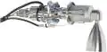](f/ps/0/20nmht_pic1.webp)|

**Notes:**

   1. Specs’re for nominal vacuum continuous thrust starting from the 2nd second after energizing the solenoid valves.
   1. [Products brochures ❐](f/contact/o/opc_lam_brochures.7z)
   1. <http://www.space-propulsion.com/spacecraft-propulsion/hydrazine-thrusters/20n-hydrazine-thruster.html> — [archived ❐](f/ps/0/20nmht_site.pdf) 2019.02.21
   1. **Applicability** — NGSAR (2018 ‑ 2019)・ Herschel (2009)・ Planck (2009)・ METOP 1-3 (2006‑2018)・ Integral (2002)

 

### 255U.487   ［RU・2comp.］
**255U.487** (ru. **255У.487**) — 2‑component [engine](ps.md) by [KBHM](contact/kbhm.md)

|*[Characteristics](si.md)*|*255U.487*|*DMT-600*|
|:-|:-|:-|
|Composition| | |
|Consumption, W|24.3|24.3|
|Dimensions, ㎜|416 × 148 **⁽¹⁾**| |
|[Interfaces](interface.md)| | |
|[Lifetime](lifetime.md)/Resource, h(y)|30 **⁽¹⁾** / …|… / …|
|Mass, ㎏|3.6 **⁽¹⁾**|4.2 **⁽²⁾**|
|[Overload](vibration.md), Grms| | |
|[Rad.resist](ion_rad.md), ㏉ (㎭)| | |
|[Reliability](qm.md) per [lifetime](lifetime.md)| | |
|[Thermal range](tcs.md), ℃| | |
|[TRL](trl.md)|6 **⁽¹⁾**|3 **⁽²⁾**|
|[Voltage](sps.md), V| | |
|**【Specific】**|• • •|• • •|
|[Fuel](ps.md) (+ combustion products)|[NTO+UDMH](nto_plus.md) **⁽¹ ²⁾** (H₂, H₂O, CO, CO₂, N₂)|[NTO+UDMH](nto_plus.md) **⁽¹ ²⁾** (H₂, H₂O, CO, CO₂, N₂)|
|Fuel — components’ mass ratio|1.8169 ± 0.066 **⁽¹⁾**|1.85 **⁽²⁾**|
|Fuel — consumption, ㎏/s, ≤|0.202.825|0.200.534|
|Fuel — resource, ㎏, ≥|20|1 000|
|Press. — comb. chamber, ㎫ (㍴)|1.177 (12.0) **⁽¹⁾**|0.9 (9) **⁽²⁾**|
|Press. — eng. entrance, ㎫ (㍴)|1.96 (20) **⁽¹⁾**|1.7 (17) **⁽²⁾**|
|Press. — nozzle cut, ㎫ (㍴)|0.00167 (0.0119) **⁽¹⁾**| |
|Temper. — comb. chamber, К (℃)|3 000 (2 700) **⁽¹⁾**| |
|Temper. — nozzle cut, К (℃)|840 (560) **⁽¹⁾**| |
|Thrust, N (㎏f)|603±16 (61.44±1.65) **⁽¹⁾**|600 (61) **⁽²⁾**|
|Thrust — duration of 1 thrust, s|0.2 ‑ 50 **⁽¹⁾**|0.05 ‑ 1 500 **⁽²⁾**|
|Thrust — [Ing](ing.md), N·s (㎏f·s), ≤|17±4.6 (1.735±0.473) **⁽¹⁾**| |
|Thrust — [Isp](ps.md), s (N·s/㎏), ≥|303±2.2 (2 973) **⁽¹⁾**|305 (2 992) **⁽²⁾**|
|Thrust — switch. frequency, ㎐, ≤|3 **⁽¹⁾**| |
|Thrust — torch angle, °| | |
|Thrust — total pulses, ≥|100 **⁽¹⁾**|6 000 **⁽²⁾**|
|Thrust — total thrust, N (㎏f), ≥|60 300 (6 150)|300 000 (30 580)|
|Thrust — total thrust, s (h), ≥|100 **⁽¹⁾**|5 000 **⁽²⁾**|
|[Turbopump](turbopump.md) rate, rpm|—|—|

**Notes:**

   1. Specs’re for nominal vacuum continuous thrust starting from the 2nd second after energizing the solenoid valves.
   1. **[1]** — see 255У.487.00‑0 ТУ‑5, 2015 y.
   1. **[2]** — see [KBHM](contact/kbhm.md) site, 2016 y.
   1. The content of dissolved helium in the fuel is ≤ 0.03 g/l. Work poorly with [CINU](cinu.md).
   1. The angular deviation of the nozzle axis relative to the base longitudinal axis is ≤ 5 " (angular), & ≤ 0.5 ㎜ (linear).
   1. The purity of the fuel supplied to the engine is not lower than [class 5](clean_lvl.md).
   1. **Applicability** — [Luna‑25](луна_25.md)

 

### 255U.530   ［RU・2comp.］
**255U.530** (ru. **255У.530**) — 2‑component [engine](ps.md) by [KBHM](contact/kbhm.md).

|*[Characteristics](si.md)*|*255У.530.00-0*|
|:-|:-|
|Composition| |
|Consumption, W|24.3|
|Dimensions, ㎜|416 × 148|
|[Interfaces](interface.md)| |
|[Lifetime](lifetime.md)/Resource, h(y)|26 280 (3) / …|
|Mass, ㎏|3.6|
|[Overload](vibration.md), Grms| |
|[Rad.resist](ion_rad.md), ㏉ (㎭)| |
|[Reliability](qm.md) per [lifetime](lifetime.md)| |
|[Thermal range](tcs.md), ℃| |
|[TRL](trl.md)|4|
|[Voltage](sps.md), V| |
|**【Specific】**|• • •|
|[Fuel](ps.md) (+ combustion products)|[NTO+UDMH](nto_plus.md) (H₂, H₂O, CO, CO₂, N₂)|
|Fuel — components’ mass ratio|1.8169 ± 0.066|
|Fuel — consumption, ㎏/s, ≤|0.202.825|
|Fuel — resource, ㎏, ≥|20|
|Press. — comb. chamber, ㎫ (㍴)|1.177 (12.0)|
|Press. — eng. entrance, ㎫ (㍴)|1.96 (20)|
|Press. — nozzle cut, ㎫ (㍴)|0.00167 (0.0119)|
|Temper. — comb. chamber, К (℃)|3 000 (2 700)|
|Temper. — nozzle cut, К (℃)|840 (560)|
|Thrust, N (㎏f)|588±49 (60±5)|
|Thrust — duration of 1 thrust, s|0.2 ‑ 70|
|Thrust — [Ing](ing.md), N·s (㎏f·s), ≤|17±4.6 (1.735±0.473)|
|Thrust — [Isp](ps.md), s (N·s/㎏), ≥|303±2.2 (2 973)|
|Thrust — switch. frequency, ㎐, ≤|3|
|Thrust — torch angle, °| |
|Thrust — total pulses, ≥|200|
|Thrust — total thrust, N (㎏f), ≥|120 600 (12 290)|
|Thrust — total thrust, s (h), ≥|200|
|[Turbopump](turbopump.md) rate, rpm|—|

**Notes:**

   1. Specs’re for nominal vacuum continuous thrust starting from the 0.13st second after energizing the solenoid valves.
   1. Designed for the needs of the [Luna-27](luna_27.md) based on the engine [255U.487](engine_lst.md).
   1. The content of dissolved helium in the fuel is ≤ 0.03 g/l. Work poorly with [CINU](cinu.md).
   1. The angular deviation of the nozzle axis relative to the base longitudinal axis is ≤ 5 " (angular), & ≤ 0.5 ㎜ (linear).
   1. The purity of the fuel supplied to the engine is not lower than [class 5](clean_lvl.md).
   1. **Applicability** — [Luna‑27](луна_27.md)

 

### 400NMHT   ［EU・1comp.］
**400NMHT** — 1‑component [engine](ps.md) by [OPC LAM](contact/opc_lam.md). Designed in 1996.

|*[Characteristics](si.md)*|*400NMHT*|
|:-|:-|
|Composition| |
|Consumption, W| |
|Dimensions, ㎜|325 × ⌀67|
|[Interfaces](interface.md)| |
|[Lifetime](lifetime.md)/Resource, h(y)|… / …|
|Mass, ㎏|2.7 or 3.8|
|[Overload](vibration.md), Grms|16.2|
|[Rad.resist](ion_rad.md), ㏉ (㎭)| |
|[Reliability](qm.md) per [lifetime](lifetime.md)| |
|[Thermal range](tcs.md), ℃| |
|[TRL](trl.md)|9|
|[Voltage](sps.md), V| |
|**【Specific】**|• • •|
|[Fuel](ps.md) (+ combustion products)|[Hydrazine](hydrazine.md) (H₂, N₂)|
|Fuel — components’ mass ratio|—|
|Fuel — consumption, ㎏/s, ≤|0.057.700 ‑ 0.194.606|
|Fuel — resource, ㎏, ≥|300|
|Press. — comb. chamber, ㎫ (㍴)| |
|Press. — eng. entrance, ㎫ (㍴)|0.56 ‑ 2.65 (5.5 ‑ 26)|
|Press. — nozzle cut, ㎫ (㍴)| |
|Temper. — comb. chamber, К (℃)| |
|Temper. — nozzle cut, К (℃)| |
|Thrust, N (㎏f)|120 ‑ 420 (12.2 ‑ 42.8)|
|Thrust — duration of 1 thrust, s|… ‑ 450|
|Thrust — [Ing](ing.md), N·s (㎏f·s), ≤| |
|Thrust — [Isp](ps.md), s (N·s/㎏), ≥|212 ‑ 220 (2 080 ‑ 2 160)|
|Thrust — switch. frequency, ㎐, ≤| |
|Thrust — torch angle, °| |
|Thrust — total pulses, ≥|3 900|
|Thrust — total thrust, N (㎏f), ≥|188 000|
|Thrust — total thrust, s (h), ≥|850|
|[Turbopump](turbopump.md) rate, rpm|—|
| |[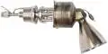](f/ps/0/400nmht_pic1.webp)|

**Notes:**

   1. Specs’re for nominal vacuum continuous thrust starting from the 2nd second after energizing the solenoid valves.
   1. [Products brochures ❐](f/contact/o/opc_lam_brochures.7z)
   1. <http://www.space-propulsion.com/spacecraft-propulsion/hydrazine-thrusters/400n-hydrazine-thruster.html> — [archived ❐](f/ps/0/400nmht_site.pdf) 2019.02.21
   1. **Applicability** — Ariane 5 G, GS & ES versions for the roll & attitude control・ ExoMars-2016 DM

 

### AMBR   ［US・2comp.］
**AMBR** (Advanced material bipropellant rocket) — 2‑component [engine](ps.md) by [Aerojet Rocketdyne](aerojet_rocketdyne.md). Designed in 2012. Successor of [HiPAT](hipat.md).

|*[Characteristics](si.md)*|*AMBR*|
|:-|:-|
|Composition| |
|Consumption, W| |
|Dimensions, ㎜| |
|[Interfaces](interface.md)| |
|[Lifetime](lifetime.md)/Resource, h(y)|3 ‑ 10 / …|
|Mass, ㎏|5.4|
|[Overload](vibration.md), Grms| |
|[Rad.resist](ion_rad.md), ㏉ (㎭)| |
|[Reliability](qm.md) per [lifetime](lifetime.md)| |
|[Thermal range](tcs.md), ℃| |
|[TRL](trl.md)|9|
|[Voltage](sps.md), V| |
|**【Specific】**|• • •|
|[Fuel](ps.md) (+ combustion products)|[NTO+Hydrazine](nto_plus.md) (H₂, H₂O, NH₃, N₂)|
|Fuel — components’ mass ratio|1.2|
|Fuel — consumption, ㎏/s, ≤|0.202.960|
|Fuel — resource, ㎏, ≥| |
|Press. — comb. chamber, ㎫ (㍴)|1.89 (18.54)|
|Press. — eng. entrance, ㎫ (㍴)|2.75 (27)|
|Press. — nozzle cut, ㎫ (㍴)| |
|Temper. — comb. chamber, К (℃)|2 473 (2 200)|
|Temper. — nozzle cut, К (℃)| |
|Thrust, N (㎏f)|667 (68)|
|Thrust — duration of 1 thrust, s|… ‑ 3 600|
|Thrust — [Ing](ing.md), N·s (㎏f·s), ≤| |
|Thrust — [Isp](ps.md), s (N·s/㎏), ≥|335 (3 285)|
|Thrust — switch. frequency, ㎐, ≤| |
|Thrust — torch angle, °| |
|Thrust — total pulses, ≥| |
|Thrust — total thrust, N (㎏f), ≥| |
|Thrust — total thrust, s (h), ≥| |
|[Turbopump](turbopump.md) rate, rpm|—|

**Notes:**

   1. Specs’re for nominal vacuum continuous thrust starting from the 2nd second after energizing the solenoid valves.
   1. [Presentation of NASA, 2009 ❐](f/ps/a/ambr_presentation1.pdf)
   1. <http://www.rocket.com/propulsion-systems/bipropellant-rockets>
   1. [https://www.researchgate.net/publication/277533096](https://www.researchgate.net/publication/277533096_Performance_Results_for_the_Advanced_Materials_Bipropellant_Rocket_AMBR_Engine)
   1. **Applicability** — …

 

### BE-3   ［US・2comp.］
**BE-3** — 2‑component [engine](ps.md) by [Blue Origin](blue_origin.md).

|*[Characteristics](si.md)*|*BE-3*|*BE-3U*|
|:-|:-|:-|
|Composition| | |
|Consumption, W| | |
|Dimensions, ㎜| | |
|[Interfaces](interface.md)| | |
|[Lifetime](lifetime.md)/Resource, h(y)|… / …|… / …|
|Mass, ㎏| | |
|[Overload](vibration.md), Grms| | |
|[Rad.resist](ion_rad.md), ㏉ (㎭)| | |
|[Reliability](qm.md) per [lifetime](lifetime.md)| | |
|[Thermal range](tcs.md), ℃| | |
|[TRL](trl.md)|9|6|
|[Voltage](sps.md), V| | |
|**【Specific】**|• • •|• • •|
|[Fuel](ps.md) (+ combustion products)|[O+H](o_plus.md) (H₂, H₂O)|[O+H](o_plus.md) (H₂, H₂O)|
|Fuel — components’ mass ratio| | |
|Fuel — consumption, ㎏/s, ≤| | |
|Fuel — resource, ㎏, ≥| | |
|Press. — comb. chamber, ㎫ (㍴)| | |
|Press. — eng. entrance, ㎫ (㍴)| | |
|Press. — nozzle cut, ㎫ (㍴)| | |
|Temper. — comb. chamber, К (℃)| | |
|Temper. — nozzle cut, К (℃)| | |
|Thrust, N (㎏f)|93 100 ‑ 490 000 (9 490 ‑ 49 950)|670 000 (68 300)|
|Thrust — duration of 1 thrust, s|… ‑ … | |
|Thrust — [Ing](ing.md), N·s (㎏f·s), ≤| | |
|Thrust — [Isp](ps.md), s (N·s/㎏), ≥| | |
|Thrust — switch. frequency, ㎐, ≤| | |
|Thrust — torch angle, °| | |
|Thrust — total pulses, ≥| | |
|Thrust — total thrust, N (㎏f), ≥| | |
|Thrust — total thrust, s (h), ≥| | |
|[Turbopump](turbopump.md) rate, rpm| | |

**Notes:**

   1. Specs’re for nominal vacuum continuous thrust starting from the 2nd second after energizing the solenoid valves.
   1. <https://en.wikipedia.org/wiki/BE-3>
   1. There are 2 variations: **BE-3** — basic version; **BE-3U** — for upper stages operating in vacuum.
   1. **Applicability:**
      - **BE-3** — [New Shepard](new_shepard.md) (from 2015)・ LV [New Glenn](new_glenn.md)・ LV [Vulcan](vulcan.md) (from 2020)
      - **BE-3U** — …

 

### BE-4   ［US・2comp.］
**BE‑4** — 2‑component [engine](ps.md) by [Blue Origin](blue_origin.md).

|*[Characteristics](si.md)*|*BE-4*|
|:-|:-|
|Composition| |
|Consumption, W| |
|Dimensions, ㎜| |
|[Interfaces](interface.md)| |
|[Lifetime](lifetime.md)/Resource, h(y)|… / …|
|Mass, ㎏| |
|[Overload](vibration.md), Grms| |
|[Rad.resist](ion_rad.md), ㏉ (㎭)| |
|[Reliability](qm.md) per [lifetime](lifetime.md)| |
|[Thermal range](tcs.md), ℃| |
|[TRL](trl.md)|6|
|[Voltage](sps.md), V| |
|**【Specific】**|• • •|
|[Fuel](ps.md) (+ combustion products)|[O+Methane](o_plus.md) (H₂, H₂O, CO, CO₂)|
|Fuel — components’ mass ratio| |
|Fuel — consumption, ㎏/s, ≤| |
|Fuel — resource, ㎏, ≥| |
|Press. — comb. chamber, ㎫ (㍴)|13.4 (1.36)|
|Press. — eng. entrance, ㎫ (㍴)| |
|Press. — nozzle cut, ㎫ (㍴)| |
|Temper. — comb. chamber, К (℃)| |
|Temper. — nozzle cut, К (℃)| |
|Thrust, N (㎏f)|1 200 000 ‑ 2 400 000 (122 320 ‑ 244 650) **⁽¹⁾**|
|Thrust — duration of 1 thrust, s|… ‑ … |
|Thrust — [Ing](ing.md), N·s (㎏f·s), ≤| |
|Thrust — [Isp](ps.md), s (N·s/㎏), ≥| |
|Thrust — switch. frequency, ㎐, ≤| |
|Thrust — torch angle, °| |
|Thrust — total pulses, ≥|25|
|Thrust — total thrust, N (㎏f), ≥| |
|Thrust — total thrust, s (h), ≥| |
|[Turbopump](turbopump.md) rate, rpm| |
|[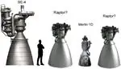](f/ps/be4_m1d_raptor_comparison1.webp)  **Comparison  [BE‑4](engine_lst.md), [Raptor](engine_lst.md), Merlin 1D**| |

**Notes:**

   1. Specs’re for nominal vacuum continuous thrust starting from the 2nd second after energizing the solenoid valves.
   1. <https://en.wikipedia.org/wiki/BE-4>
   1. **[1]** — на уровне моря.
   1. Has a drive, deviates by ±5°.
   1. **Applicability** — РН [New Glenn](new_glenn.md)・ РН [Vulcan](vulcan.md) (с 2020 года)

 

### BE-7   ［US・2comp.］
**BE-7** — 2‑component [engine](ps.md) by [Blue Origin](blue_origin.md).

|*[Characteristics](si.md)*|*BE-7*|
|:-|:-|
|Composition| |
|Consumption, W| |
|Dimensions, ㎜| |
|[Interfaces](interface.md)| |
|[Lifetime](lifetime.md)/Resource, h(y)|… / …|
|Mass, ㎏| |
|[Overload](vibration.md), Grms| |
|[Rad.resist](ion_rad.md), ㏉ (㎭)| |
|[Reliability](qm.md) per [lifetime](lifetime.md)| |
|[Thermal range](tcs.md), ℃| |
|[TRL](trl.md)|3|
|[Voltage](sps.md), V| |
|**【Specific】**|• • •|
|[Fuel](ps.md) (+ combustion products)|[O+H](o_plus.md) (H₂, H₂O)|
|Fuel — components’ mass ratio| |
|Fuel — consumption, ㎏/s, ≤| |
|Fuel — resource, ㎏, ≥| |
|Press. — comb. chamber, ㎫ (㍴)| |
|Press. — eng. entrance, ㎫ (㍴)| |
|Press. — nozzle cut, ㎫ (㍴)| |
|Temper. — comb. chamber, К (℃)| |
|Temper. — nozzle cut, К (℃)| |
|Thrust, N (㎏f)|40 000 (4 100)|
|Thrust — duration of 1 thrust, s|… ‑ … |
|Thrust — [Ing](ing.md), N·s (㎏f·s), ≤| |
|Thrust — [Isp](ps.md), s (N·s/㎏), ≥| |
|Thrust — switch. frequency, ㎐, ≤| |
|Thrust — torch angle, °| |
|Thrust — total pulses, ≥| |
|Thrust — total thrust, N (㎏f), ≥| |
|Thrust — total thrust, s (h), ≥| |
|[Turbopump](turbopump.md) rate, rpm| |
| |[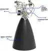](f/ps/b/be7_pic1.webp)  |

**Notes:**

   1. Specs’re for nominal vacuum continuous thrust starting from the 2nd second after energizing the solenoid valves.
   1. <https://www.blueorigin.com/engines/be-7>
   1. **Applicability** — [Blue Moon](blue_moon.md) (from 2024)

 

### BT-4   ［JP・2comp.］
**BT-4** — 2‑component [engine](ps.md) by [IHI](contact/ihi.md). Designed in 2007.

|*[Characteristics](si.md)*|*BT-4*|
|:-|:-|
|Composition| |
|Consumption, W| |
|Dimensions, ㎜|80 × …|
|[Interfaces](interface.md)| |
|[Lifetime](lifetime.md)/Resource, h(y)|… / …|
|Mass, ㎏|4|
|[Overload](vibration.md), Grms| |
|[Rad.resist](ion_rad.md), ㏉ (㎭)| |
|[Reliability](qm.md) per [lifetime](lifetime.md)| |
|[Thermal range](tcs.md), ℃| |
|[TRL](trl.md)|9|
|[Voltage](sps.md), V| |
|**【Specific】**|• • •|
|[Fuel](ps.md) (+ combustion products)|[NTO+Hydrazine](nto_plus.md) (H₂, H₂O, NH₃, N₂)|
|Fuel — components’ mass ratio|1.69|
|Fuel — consumption, ㎏/s, ≤|0.079.638 ‑ 0.159.276|
|Fuel — resource, ㎏, ≥| |
|Press. — comb. chamber, ㎫ (㍴)|13.4 (1.36)|
|Press. — eng. entrance, ㎫ (㍴)| |
|Press. — nozzle cut, ㎫ (㍴)| |
|Temper. — comb. chamber, К (℃)| |
|Temper. — nozzle cut, К (℃)| |
|Thrust, N (㎏f)|250 ‑ 500 (25.4 ‑ 51) **⁽¹⁾**|
|Thrust — duration of 1 thrust, s|… ‑ … |
|Thrust — [Ing](ing.md), N·s (㎏f·s), ≤| |
|Thrust — [Isp](ps.md), s (N·s/㎏), ≥|320 ± 5 (3 140 ± 49)|
|Thrust — switch. frequency, ㎐, ≤| |
|Thrust — torch angle, °| |
|Thrust — total pulses, ≥|25|
|Thrust — total thrust, N (㎏f), ≥| |
|Thrust — total thrust, s (h), ≥| |
|[Turbopump](turbopump.md) rate, rpm| |

**Notes:**

   1. Specs’re for nominal vacuum continuous thrust starting from the 2nd second after energizing the solenoid valves.
   1. <https://en.wikipedia.org/wiki/BT-4_(rocket_engine)>
   1. **[1]** — in vacuum.
   1. BT-4 is a family that has been used as Liquid Apogee Engine, orbital maneuvering engine & as a thruster. Variations:
       - **BT-4 (Cygnus)** — Used mainly as thruster, it burns MMH/N₂O₄ with a thrust of 450 N. It weighs 4 ㎏ & is 65 ㎝ tall.
       - **BT-4 (450N)** — Used mainly as LAE, it burns Hydrazine/N₂O₄ in a 1.69 O/F ratio. It has a thrust of 450 N, a specific impulse of 329 s (3.23 ㎞/s) & an input pressure of 1.62 ㎫. As of 2014, it had a demonstrated life of 32 850 s.
       - **BT-4 (500N)** — Used mainly as LAE, it burns Hydrazine/N₂O₄ with a thrust of 500 N, a specific impulse of 329 s (3.23 ㎞/s). It weights 4 ㎏ & is 80 ㎝ tall.
       - **490N MON Thruster** — Burns MMH/MON-3 with a 478 N nominal thrust, a specific impulse of 316 s (3.10 ㎞/s) & an inlet pressure of 1.72 ㎫ (249 psi). As of 2014, it had a demonstrated life of 15 000 s.
       - **HBT-5** — Developed for the HTV to crew-rated standards, it burns MMH/MON-3, & has a thrust of 500 N. Used in HTV-3 & since HTV-5 onward.
       - **SELENE OME** — Based on the DRTS Liquid Apogee Engine, the SELENE Orbital Maneuvering Engine burned a Hydrazine/MON-3 mixture. It had a thrust of 547 ± 54 N & a specific impulse of 319.8 ± 5.1 s (3.136 ± 0.050 ㎞/s) with an input pressure of 1.77 ㎫ (257 psi).
   1. **Applicability** — Lunar-A (cancelled)・ Some geostationary communications satellite based on the Lockheed Martin A2100 & GEOStar-2 satellite buses.

 

### DMT-500   ［RU・2comp.］
**DMT-500** (ru. **ДМТ-500**) — 2‑component [engine](ps.md) by [KBHM](contact/kbhm.md).

|*[Characteristics](si.md)*|*DMT-500*|
|:-|:-|
|Composition| |
|Consumption, W|24.3|
|Dimensions, ㎜| |
|[Interfaces](interface.md)| |
|[Lifetime](lifetime.md)/Resource, h(y)|… / …|
|Mass, ㎏|3.6 **⁽¹⁾**|
|[Overload](vibration.md), Grms| |
|[Rad.resist](ion_rad.md), ㏉ (㎭)| |
|[Reliability](qm.md) per [lifetime](lifetime.md)| |
|[Thermal range](tcs.md), ℃| |
|[TRL](trl.md)|9 **⁽¹⁾**|
|[Voltage](sps.md), V| |
|**【Specific】**|• • •|
|[Fuel](ps.md) (+ combustion products)|[NTO+UDMH](nto_plus.md) **⁽¹⁾** (H₂, H₂O, CO, CO₂, N₂)|
|Fuel — components’ mass ratio|1.85 **⁽¹⁾**|
|Fuel — consumption, ㎏/s, ≤|0.164.419|
|Fuel — resource, ㎏, ≥|1 645|
|Press. — comb. chamber, ㎫ (㍴)|0.9 (9) **⁽¹⁾**|
|Press. — eng. entrance, ㎫ (㍴)|1.6 (16) **⁽¹⁾**|
|Press. — nozzle cut, ㎫ (㍴)| |
|Temper. — comb. chamber, К (℃)| |
|Temper. — nozzle cut, К (℃)| |
|Thrust, N (㎏f)|500 (51) **⁽¹⁾**|
|Thrust — duration of 1 thrust, s|0.05 ‑ 3 500 **⁽¹⁾**|
|Thrust — [Ing](ing.md), N·s (㎏f·s), ≤| |
|Thrust — [Isp](ps.md), s (N·s/㎏), ≥|310 (3 041) **⁽¹⁾**|
|Thrust — switch. frequency, ㎐, ≤| |
|Thrust — torch angle, °| |
|Thrust — total pulses, ≥|20 **⁽¹⁾**|
|Thrust — total thrust, N (㎏f), ≥|5 000 000 (509 600)|
|Thrust — total thrust, s (h), ≥|10 000 **⁽¹⁾**|
|[Turbopump](turbopump.md) rate, rpm|—|

**Notes:**

   1. Specs’re for nominal vacuum continuous thrust starting from the 2nd second after energizing the solenoid valves.
   1. **[1]** — see [KBHM](contact/kbhm.md) site, 2016 y.
   1. They put forward requirements for fuel degassing. They work poorly with [CINU](cinu.md).
   1. **Applicability** — …

 

### DMT-1000   ［RU・2comp.］
**DMT-1000** (ru. **ДМТ-1000**) — 2‑component [engine](ps.md) by [KBHM](contact/kbhm.md)

|*[Characteristics](si.md)*|*DMT-1000*|
|:-|:-|
|Composition| |
|Consumption, W|24.3|
|Dimensions, ㎜| |
|[Interfaces](interface.md)| |
|[Lifetime](lifetime.md)/Resource, h(y)|… / …|
|Mass, ㎏|2 **⁽¹⁾**|
|[Overload](vibration.md), Grms| |
|[Rad.resist](ion_rad.md), ㏉ (㎭)| |
|[Reliability](qm.md) per [lifetime](lifetime.md)| |
|[Thermal range](tcs.md), ℃| |
|[TRL](trl.md)|9 **⁽¹⁾**|
|[Voltage](sps.md), V| |
|**【Specific】**|• • •|
|[Fuel](ps.md) (+ combustion products)|[NTO+UDMH](nto_plus.md) **⁽¹⁾** (H₂, H₂O, CO, CO₂, N₂)|
|Fuel — components’ mass ratio|1.85 **⁽¹⁾**|
|Fuel — consumption, ㎏/s, ≤|0.362.844|
|Fuel — resource, ㎏, ≥|10|
|Press. — comb. chamber, ㎫ (㍴)|4 (40) **⁽¹⁾**|
|Press. — eng. entrance, ㎫ (㍴)|7 (70) **⁽¹⁾**|
|Press. — nozzle cut, ㎫ (㍴)| |
|Temper. — comb. chamber, К (℃)| |
|Temper. — nozzle cut, К (℃)| |
|Thrust, N (㎏f)|1 000 (102) **⁽¹⁾**|
|Thrust — duration of 1 thrust, s|0.035 ‑ 3 **⁽¹⁾**|
|Thrust — [Ing](ing.md), N·s (㎏f·s), ≤| |
|Thrust — [Isp](ps.md), s (N·s/㎏), ≥|281 (2 756) **⁽¹⁾**|
|Thrust — switch. frequency, ㎐, ≤| |
|Thrust — torch angle, °| |
|Thrust — total pulses, ≥|1 000 **⁽¹⁾**|
|Thrust — total thrust, N (㎏f), ≥|30 000 (3 050)|
|Thrust — total thrust, s (h), ≥|30 **⁽¹⁾**|
|[Turbopump](turbopump.md) rate, rpm|—|

**Notes:**

   1. Specs’re for nominal vacuum continuous thrust starting from the 2nd second after energizing the solenoid valves.
   1. **[1]** — see [KBHM](contact/kbhm.md) site, 2016 y.
   1. They put forward requirements for fuel degassing. They work poorly with [CINU](cinu.md).
   1. **Applicability** — …

 

### DMT-2200   ［RU・2comp.］
**DMT-2200** (ru. **ДМТ-2200**) — 2‑component [engine](ps.md) by [KBHM](contact/kbhm.md).

|*[Characteristics](si.md)*|*DMT-2200*|
|:-|:-|
|Composition| |
|Consumption, W|10.8|
|Dimensions, ㎜| |
|[Interfaces](interface.md)| |
|[Lifetime](lifetime.md)/Resource, h(y)|… / …|
|Mass, ㎏|6.5 **⁽¹⁾**|
|[Overload](vibration.md), Grms| |
|[Rad.resist](ion_rad.md), ㏉ (㎭)| |
|[Reliability](qm.md) per [lifetime](lifetime.md)| |
|[Thermal range](tcs.md), ℃| |
|[TRL](trl.md)|9 **⁽¹⁾**|
|[Voltage](sps.md), V| |
|**【Specific】**|• • •|
|[Fuel](ps.md) (+ combustion products)|[NTO+UDMH](nto_plus.md) **⁽¹⁾** (H₂, H₂O, CO, CO₂, N₂)|
|Fuel — components’ mass ratio|1.95 **⁽¹⁾**|
|Fuel — consumption, ㎏/s, ≤|0.752.005|
|Fuel — resource, ㎏, ≥|157|
|Press. — comb. chamber, ㎫ (㍴)|1.8 (18) **⁽¹⁾**|
|Press. — eng. entrance, ㎫ (㍴)|2.45 (24.5) **⁽¹⁾**|
|Press. — nozzle cut, ㎫ (㍴)| |
|Temper. — comb. chamber, К (℃)| |
|Temper. — nozzle cut, К (℃)| |
|Thrust, N (㎏f)|2 250 (229) **⁽¹⁾**|
|Thrust — duration of 1 thrust, s|0.05 ‑ 210 **⁽¹⁾**|
|Thrust — [Ing](ing.md), N·s (㎏f·s), ≤| |
|Thrust — [Isp](ps.md), s (N·s/㎏), ≥|305 (2 992) **⁽¹⁾**|
|Thrust — switch. frequency, ㎐, ≤| |
|Thrust — torch angle, °| |
|Thrust — total pulses, ≥|500 **⁽¹⁾**|
|Thrust — total thrust, N (㎏f), ≥|472 500 (48 150)|
|Thrust — total thrust, s (h), ≥|210 **⁽¹⁾**|
|[Turbopump](turbopump.md) rate, rpm|—|

**Notes:**

   1. Specs’re for nominal vacuum continuous thrust starting from the 2nd second after energizing the solenoid valves.
   1. **[1]** — see [KBHM](contact/kbhm.md) site, 2016 y.
   1. They put forward requirements for fuel degassing. They work poorly with [CINU](cinu.md).
   1. **Applicability** — …

 

### DOC-10   ［RU・1comp.］
**DOC-10** (ru. **ДОК-10**) — 1‑component [engine](ps.md) by [KBHM](contact/kbhm.md)

|*[Characteristics](si.md)*|*DOC-10*|
|:-|:-|
|Composition| |
|Consumption, W|7.9|
|Dimensions, ㎜| |
|[Interfaces](interface.md)| |
|[Lifetime](lifetime.md)/Resource, h(y)|… / …|
|Mass, ㎏|0.6 **⁽¹⁾**|
|[Overload](vibration.md), Grms| |
|[Rad.resist](ion_rad.md), ㏉ (㎭)| |
|[Reliability](qm.md) per [lifetime](lifetime.md)| |
|[Thermal range](tcs.md), ℃| |
|[TRL](trl.md)| |
|[Voltage](sps.md), V| |
|**【Specific】**|• • •|
|[Fuel](ps.md) (+ combustion products)|[Hydrazine](hydrazine.md) **⁽¹⁾** (H₂, N₂)|
|Fuel — components’ mass ratio|—|
|Fuel — consumption, ㎏/s, ≤|0.004.451.388|
|Fuel — resource, ㎏, ≥|6.5|
|Press. — comb. chamber, ㎫ (㍴)|1.0 (10) **⁽¹⁾**|
|Press. — eng. entrance, ㎫ (㍴)|1.5 (15) **⁽¹⁾**|
|Press. — nozzle cut, ㎫ (㍴)| |
|Temper. — comb. chamber, К (℃)| |
|Temper. — nozzle cut, К (℃)| |
|Thrust, N (㎏f)|10 (1) **⁽¹⁾**|
|Thrust — duration of 1 thrust, s|0.05 ‑ 600 **⁽¹⁾**|
|Thrust — [Ing](ing.md), N·s (㎏f·s), ≤| |
|Thrust — [Isp](ps.md), s (N·s/㎏), ≥|229 (2 250) **⁽¹⁾**|
|Thrust — switch. frequency, ㎐, ≤| |
|Thrust — torch angle, °| |
|Thrust — total pulses, ≥|4 000 **⁽¹⁾**|
|Thrust — total thrust, N (㎏f), ≥|15 000 (1 530)|
|Thrust — total thrust, s (h), ≥|1 500 **⁽¹⁾**|
|[Turbopump](turbopump.md) rate, rpm|—|

**Notes:**

   1. Specs’re for nominal vacuum continuous thrust starting from the 2nd second after energizing the solenoid valves.
   1. **[1]** — see [KBHM](contact/kbhm.md) site, 2016 y.
   1. **Applicability** — …

 

### DOC-50   ［RU・1comp.］
**DOC-50** (ru. **ДОК-50**) — 1‑component [engine](ps.md) by [KBHM](contact/kbhm.md)

|*[Characteristics](si.md)*|*DOC-50*|
|:-|:-|
|Composition| |
|Consumption, W|16.2|
|Dimensions, ㎜| |
|[Interfaces](interface.md)| |
|[Lifetime](lifetime.md)/Resource, h(y)|… / …|
|Mass, ㎏|1.1 **⁽¹⁾**|
|[Overload](vibration.md), Grms| |
|[Rad.resist](ion_rad.md), ㏉ (㎭)| |
|[Reliability](qm.md) per [lifetime](lifetime.md)| |
|[Thermal range](tcs.md), ℃| |
|[TRL](trl.md)| |
|[Voltage](sps.md), V| |
|**【Specific】**|• • •|
|[Fuel](ps.md) (+ combustion products)|[Hydrazine](hydrazine.md) **⁽¹⁾** (H₂, N₂)|
|Fuel — components’ mass ratio|—|
|Fuel — consumption, ㎏/s, ≤|0.022.256|
|Fuel — resource, ㎏, ≥|33|
|Press. — comb. chamber, ㎫ (㍴)|0.8 (8) **⁽¹⁾**|
|Press. — eng. entrance, ㎫ (㍴)|1.5 (15) **⁽¹⁾**|
|Press. — nozzle cut, ㎫ (㍴)| |
|Temper. — comb. chamber, К (℃)| |
|Temper. — nozzle cut, К (℃)| |
|Thrust, N (㎏f)|50 (5.1) **⁽¹⁾**|
|Thrust — duration of 1 thrust, s|0.05 ‑ 600 **⁽¹⁾**|
|Thrust — [Ing](ing.md), N·s (㎏f·s), ≤| |
|Thrust — [Isp](ps.md), s (N·s/㎏), ≥|229 (2 250) **⁽¹⁾**|
|Thrust — switch. frequency, ㎐, ≤| |
|Thrust — torch angle, °| |
|Thrust — total pulses, ≥|4 000 **⁽¹⁾**|
|Thrust — total thrust, N (㎏f), ≥|75 000 (7 600)|
|Thrust — total thrust, s (h), ≥|1 500 **⁽¹⁾**|
|[Turbopump](turbopump.md) rate, rpm|—|

**Notes:**

   1. Specs’re for nominal vacuum continuous thrust starting from the 2nd second after energizing the solenoid valves.
   1. **[1]** — see [KBHM](contact/kbhm.md) site, 2016 y.
   1. **Applicability** — …

 

### DOT-5   ［RU・1comp.］
**DOT-5** (ru. **ДОТ-5**) — 1‑component [engine](ps.md) by [KBHM](contact/kbhm.md)

|*[Characteristics](si.md)*|*DOT-5*|
|:-|:-|
|Composition| |
|Consumption, W|15.8|
|Dimensions, ㎜| |
|[Interfaces](interface.md)| |
|[Lifetime](lifetime.md)/Resource, h(y)|… / …|
|Mass, ㎏|0.9 **⁽¹⁾**|
|[Overload](vibration.md), Grms| |
|[Rad.resist](ion_rad.md), ㏉ (㎭)| |
|[Reliability](qm.md) per [lifetime](lifetime.md)| |
|[Thermal range](tcs.md), ℃| |
|[TRL](trl.md)| |
|[Voltage](sps.md), V| |
|**【Specific】**|• • •|
|[Fuel](ps.md) (+ combustion products)|[Hydrazine](hydrazine.md) **⁽¹⁾** (H₂, N₂)|
|Fuel — components’ mass ratio|—|
|Fuel — consumption, ㎏/s, ≤|0.002.216.017|
|Fuel — resource, ㎏, ≥|260|
|Press. — comb. chamber, ㎫ (㍴)|0.38 (3.8) **⁽¹⁾**|
|Press. — eng. entrance, ㎫ (㍴)|1.2 (12) **⁽¹⁾**|
|Press. — nozzle cut, ㎫ (㍴)| |
|Temper. — comb. chamber, К (℃)| |
|Temper. — nozzle cut, К (℃)| |
|Thrust, N (㎏f)|5 (0.5) **⁽¹⁾**|
|Thrust — duration of 1 thrust, s|0.05 ‑ 8 000 **⁽¹⁾**|
|Thrust — [Ing](ing.md), N·s (㎏f·s), ≤| |
|Thrust — [Isp](ps.md), s (N·s/㎏), ≥|230 (2 255) **⁽¹⁾**|
|Thrust — switch. frequency, ㎐, ≤| |
|Thrust — torch angle, °| |
|Thrust — total pulses, ≥|55 000 **⁽¹⁾**|
|Thrust — total thrust, N (㎏f), ≥|600 000 (61 150)|
|Thrust — total thrust, s (h), ≥|120 000 **⁽¹⁾**|
|[Turbopump](turbopump.md) rate, rpm|—|

**Notes:**

   1. Specs’re for nominal vacuum continuous thrust starting from the 2nd second after energizing the solenoid valves.
   1. **[1]** — see [KBHM](contact/kbhm.md) site, 2016 y.
   1. **Applicability** — …

 

### DOT-25   ［RU・1comp.］
**DOT-25** (ru. **ДОТ-25**) — 1‑component [engine](ps.md) by [KBHM](contact/kbhm.md)

|*[Characteristics](si.md)*|*DOT-25*|
|:-|:-|
|Composition| |
|Consumption, W|7.9|
|Dimensions, ㎜| |
|[Interfaces](interface.md)| |
|[Lifetime](lifetime.md)/Resource, h(y)|… / …|
|Mass, ㎏|1.3 **⁽¹⁾**|
|[Overload](vibration.md), Grms| |
|[Rad.resist](ion_rad.md), ㏉ (㎭)| |
|[Reliability](qm.md) per [lifetime](lifetime.md)| |
|[Thermal range](tcs.md), ℃| |
|[TRL](trl.md)| |
|[Voltage](sps.md), V| |
|**【Specific】**|• • •|
|[Fuel](ps.md) (+ combustion products)|[Hydrazine](hydrazine.md) **⁽¹⁾** (H₂, N₂)|
|Fuel — components’ mass ratio|—|
|Fuel — consumption, ㎏/s, ≤|0.010.890|
|Fuel — resource, ㎏, ≥|267|
|Press. — comb. chamber, ㎫ (㍴)|0.45 (4.5) **⁽¹⁾**|
|Press. — eng. entrance, ㎫ (㍴)|1.5 (15) **⁽¹⁾**|
|Press. — nozzle cut, ㎫ (㍴)| |
|Temper. — comb. chamber, К (℃)| |
|Temper. — nozzle cut, К (℃)| |
|Thrust, N (㎏f)|25 (2.5) **⁽¹⁾**|
|Thrust — duration of 1 thrust, s|0.05 ‑ 6 000 **⁽¹⁾**|
|Thrust — [Ing](ing.md), N·s (㎏f·s), ≤| |
|Thrust — [Isp](ps.md), s (N·s/㎏), ≥|234 (2 300) **⁽¹⁾**|
|Thrust — switch. frequency, ㎐, ≤| |
|Thrust — torch angle, °| |
|Thrust — total pulses, ≥|6 000 **⁽¹⁾**|
|Thrust — total thrust, N (㎏f), ≥|625 000 (63 700)|
|Thrust — total thrust, s (h), ≥|25 000 **⁽¹⁾**|
|[Turbopump](turbopump.md) rate, rpm|—|

**Notes:**

   1. Specs’re for nominal vacuum continuous thrust starting from the 2nd second after energizing the solenoid valves.
   1. **[1]** — see [KBHM](contact/kbhm.md) site, 2016 y.
   1. **Applicability** — …

 

### Draco   ［US・2comp.］
**Draco** — a family of 2-component [engines](ps.md) by [SpaceX](contact/spacex.md).

|*[Characteristics](si.md)*|*Draco*|*SuperDraco*|
|:-|:-|:-|
|Composition| | |
|Consumption, W| | |
|Dimensions, ㎜|14 000 × …| |
|[Interfaces](interface.md)| | |
|[Lifetime](lifetime.md)/Resource, h(y)|… / …|… / …|
|Mass, ㎏| | |
|[Overload](vibration.md), Grms| | |
|[Rad.resist](ion_rad.md), ㏉ (㎭)| | |
|[Reliability](qm.md) per [lifetime](lifetime.md)| | |
|[Thermal range](tcs.md), ℃| | |
|[TRL](trl.md)|9|6|
|[Voltage](sps.md), V| | |
|**【Specific】**|• • •|• • •|
|[Fuel](ps.md) (+ combustion products)|[NTO+MMH](nto_plus.md) ()|[NTO+MMH](nto_plus.md) ()|
|Fuel — components’ mass ratio| | |
|Fuel — consumption, ㎏/s, ≤|0.135.915|30.148|
|Fuel — resource, ㎏, ≥| |1 388|
|Press. — comb. chamber, ㎫ (㍴)| |6.9 (67.7)|
|Press. — eng. entrance, ㎫ (㍴)| | |
|Press. — nozzle cut, ㎫ (㍴)| | |
|Temper. — comb. chamber, К (℃)| | |
|Temper. — nozzle cut, К (℃)| | |
|Thrust, N (㎏f)|400 (40.7)|71 000 (7 237)|20 ‑ 100 %|
|Thrust — duration of 1 thrust, s|… ‑ … | |
|Thrust — [Ing](ing.md), N·s (㎏f·s), ≤| | |
|Thrust — [Isp](ps.md), s (N·s/㎏), ≥|300 (2 943)|240 (2 355)|
|Thrust — switch. frequency, ㎐, ≤| | |
|Thrust — torch angle, °| | |
|Thrust — total pulses, ≥| | |
|Thrust — total thrust, N (㎏f), ≥| |1 770 000 (180 900)|
|Thrust — total thrust, s (h), ≥| |25|
|[Turbopump](turbopump.md) rate, rpm| | |

**Notes:**

   1. Specs’re for nominal vacuum continuous thrust starting from the 2nd second after energizing the solenoid valves.
   1. <https://en.wikipedia.org/wiki/Draco_(rocket_engine_family)>
   1. <https://en.wikipedia.org/wiki/SpaceX_rocket_engines>
   1. <https://en.wikipedia.org/wiki/SuperDraco>
   1. There are 2 variations: **Draco**; **SuperDraco** uses 3D printing, the combustion chamber is created from [inconel](nickel.md).
   1. **Applicability:**
      - **Draco** — [Dragon](dragon.md)・ [Dragon V2](dragon.md)・ [Falcon v.1.0](falcon.md), 2nd stage (2010‑2013)
      - **SuperDraco** — [Dragon V2](dragon.md)

 

### GT-50   ［RU・el.］
**GT-50** — electric ion [engine](ps.md) by [Avantspace](contact/avantspace.md).

|*[Characteristics](si.md)*|*GT-50*|*GT-50*|
|:-|:-|:-|
|Composition|engine, tanks, structures (in fact, entire PS)|engine, tanks, structures (in fact, entire PS)|
|Consumption, W|180|240|
|Dimensions, ㎜|100 × 200 × 300|100 × 200 × 300|
|[Interfaces](interface.md)| | |
|[Lifetime](lifetime.md)/Resource, h(y)|20 000 (2.28) / …|20 000 (2.28) / …|
|Mass, ㎏|8 **⁽²⁾**|8 **⁽²⁾**|
|[Overload](vibration.md), Grms| | |
|[Rad.resist](ion_rad.md), ㏉ (㎭)| | |
|[Reliability](qm.md) per [lifetime](lifetime.md)| | |
|[Thermal range](tcs.md), ℃| | |
|[TRL](trl.md)|4|4|
|[Voltage](sps.md), V| | |
|**【Specific】**|• • •|• • •|
|[Fuel](ps.md) (+ combustion products)|[Xenon](xenon.md)|[Xenon](xenon.md)|
|Fuel — components’ mass ratio| | |
|Fuel — consumption, ㎏/s, ≤|0.000.000.254.841|0.000.000.356.778|
|Fuel — resource, ㎏, ≥| | |
|Press. — comb. chamber, ㎫ (㍴)| | |
|Press. — eng. entrance, ㎫ (㍴)| | |
|Press. — nozzle cut, ㎫ (㍴)| | |
|Temper. — comb. chamber, К (℃)| | |
|Temper. — nozzle cut, К (℃)| | |
|Thrust, N (㎏f)|0.005 (0.0005)|0.007 (0.0007)|
|Thrust — duration of 1 thrust, s|… ‑ … | |
|Thrust — [Ing](ing.md), N·s (㎏f·s), ≤| | |
|Thrust — [Isp](ps.md), s (N·s/㎏), ≥|2 000 (19 600)|2 000 (19 600)|
|Thrust — switch. frequency, ㎐, ≤| | |
|Thrust — torch angle, °| | |
|Thrust — total pulses, ≥| | |
|Thrust — total thrust, N (㎏f), ≥| | |
|Thrust — total thrust, s (h), ≥| | |
|[Turbopump](turbopump.md) rate, rpm|—|—|
|[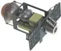](f/ps/g/gt_50_pic02.webp) [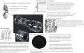](f/ps/g/gt_50_pic03.webp)|[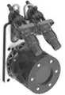](f/ps/g/gt_50_pic01.webp)||

**Notes:**

   1. Specs’re for nominal vacuum continuous thrust starting from the 2nd second after energizing the solenoid valves.
   1. [A bunch of presentations](f/ps/g/gt_50_doc01.pdf)
   1. <http://www.avantspace.com/>
   1. <https://habr.com/ru/post/484364/>
   1. **[1]** — see site [Avantspace](contact/avantspace.md), 2020 y.
   1. **Applicability** — …

 

### HiPAT   ［US・2comp.］
**HiPAT** (High performance liquid apogee thruster) — 2‑component [engine](ps.md) by [Aerojet Rocketdyne](aerojet_rocketdyne.md).

|*[Characteristics](si.md)*|*HiPAT or HiPAT DM*|
|:-|:-|
|Composition| |
|Consumption, W|46 (for 28 W)|
|Dimensions, ㎜|720 × 360|
|[Interfaces](interface.md)| |
|[Lifetime](lifetime.md)/Resource, h(y)|… / …|
|Mass, ㎏|5.2 (300:1 nozzle) or 5.44 (375:1 nozzle)|
|[Overload](vibration.md), Grms| |
|[Rad.resist](ion_rad.md), ㏉ (㎭)| |
|[Reliability](qm.md) per [lifetime](lifetime.md)| |
|[Thermal range](tcs.md), ℃| |
|[TRL](trl.md)|9|
|[Voltage](sps.md), V| |
|**【Specific】**|• • •|
|[Fuel](ps.md) (+ combustion products)|[NTO+MMH](nto_plus.md) (HiPAT); [NTO+Hydrazine](nto_plus.md) (H₂, H₂O, NH₃, N₂) (HiPAT DM)|
|Fuel — components’ mass ratio|1.0|
|Fuel — consumption, ㎏/s, ≤|0.141.755 or 0.140.439|
|Fuel — resource, ㎏, ≥|6 530|
|Press. — comb. chamber, ㎫ (㍴)|0.96 (9.4)|
|Press. — eng. entrance, ㎫ (㍴)|0.91 ‑ 2.81 (8.9 ‑ 27.6)|
|Press. — nozzle cut, ㎫ (㍴)| |
|Temper. — comb. chamber, К (℃)| |
|Temper. — nozzle cut, К (℃)| |
|Thrust, N (㎏f)|445 (45)|
|Thrust — duration of 1 thrust, s|… ‑ 3 600|
|Thrust — [Ing](ing.md), N·s (㎏f·s), ≤| |
|Thrust — [Isp](ps.md), s (N·s/㎏), ≥|320 (3 140) (300:1 nozzle) or 323 (3 170) (375:1 nozzle)|
|Thrust — switch. frequency, ㎐, ≤| |
|Thrust — torch angle, °| |
|Thrust — total pulses, ≥|500|
|Thrust — total thrust, N (㎏f), ≥|20 616 500 (2 102 300)|
|Thrust — total thrust, s (h), ≥|46 330|
|[Turbopump](turbopump.md) rate, rpm|—|
| |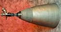|

**Notes:**

   1. Specs’re for nominal vacuum continuous thrust starting from the 2nd second after energizing the solenoid valves.
   1. [Promo specs ❐](f/ps/h/hipat_spec1.webp)
   1. <http://www.astronautix.com/h/hipat.html>
   1. <http://www.rocket.com/propulsion-systems/bipropellant-rockets>
   1. **Applicability** — …

 

### IHI 22N   ［JP・2comp.］
**IHI 22N** — 2‑component [engine](ps.md) by [IHI](contact/ihi.md). Designed in ….

|*[Characteristics](si.md)*|*IHI 22N*|
|:-|:-|
|Composition| |
|Consumption, W| |
|Dimensions, ㎜| |
|[Interfaces](interface.md)| |
|[Lifetime](lifetime.md)/Resource, h(y)|… / …|
|Mass, ㎏| |
|[Overload](vibration.md), Grms| |
|[Rad.resist](ion_rad.md), ㏉ (㎭)| |
|[Reliability](qm.md) per [lifetime](lifetime.md)| |
|[Thermal range](tcs.md), ℃| |
|[TRL](trl.md)|9|
|[Voltage](sps.md), V| |
|**【Specific】**|• • •|
|[Fuel](ps.md) (+ combustion products)|[NTO+Hydrazine](nto_plus.md) (H₂, H₂O, NH₃, N₂)|
|Fuel — components’ mass ratio| |
|Fuel — consumption, ㎏/s, ≤|0.007.429.292|
|Fuel — resource, ㎏, ≥|583|
|Press. — comb. chamber, ㎫ (㍴)| |
|Press. — eng. entrance, ㎫ (㍴)|1.69 (16.579)|
|Press. — nozzle cut, ㎫ (㍴)| |
|Temper. — comb. chamber, К (℃)| |
|Temper. — nozzle cut, К (℃)| |
|Thrust, N (㎏f)|21.5 (2.19)|
|Thrust — duration of 1 thrust, s|… ‑ … |
|Thrust — [Ing](ing.md), N·s (㎏f·s), ≤| |
|Thrust — [Isp](ps.md), s (N·s/㎏), ≥|295 (2 894)|
|Thrust — switch. frequency, ㎐, ≤| |
|Thrust — torch angle, °| |
|Thrust — total pulses, ≥| |
|Thrust — total thrust, N (㎏f), ≥|1 687 190 (171 985)|
|Thrust — total thrust, s (h), ≥|78 500|
|[Turbopump](turbopump.md) rate, rpm|—|
| |[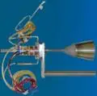](f/ps/i/ihi_22n.webp)|

**Notes:**

   1. Specs’re for nominal vacuum continuous thrust starting from the …nd second after energizing the solenoid valves.
   1. **Applicability** — …

 

### IHI 120N   ［JP・2comp.］
**IHI 120N** — 2‑component [engine](ps.md) by [IHI](contact/ihi.md). Designed in ….

|*[Characteristics](si.md)*|*IHI 120N*|
|:-|:-|
|Composition| |
|Consumption, W| |
|Dimensions, ㎜| |
|[Interfaces](interface.md)| |
|[Lifetime](lifetime.md)/Resource, h(y)|… / …|
|Mass, ㎏| |
|[Overload](vibration.md), Grms| |
|[Rad.resist](ion_rad.md), ㏉ (㎭)| |
|[Reliability](qm.md) per [lifetime](lifetime.md)| |
|[Thermal range](tcs.md), ℃| |
|[TRL](trl.md)|9|
|[Voltage](sps.md), V| |
|**【Specific】**|• • •|
|[Fuel](ps.md) (+ combustion products)|MON3+MMH ()|
|Fuel — components’ mass ratio| |
|Fuel — consumption, ㎏/s, ≤|0.046.129|
|Fuel — resource, ㎏, ≥|446|
|Press. — comb. chamber, ㎫ (㍴)| |
|Press. — eng. entrance, ㎫ (㍴)|2.05 (20.11)|
|Press. — nozzle cut, ㎫ (㍴)| |
|Temper. — comb. chamber, К (℃)| |
|Temper. — nozzle cut, К (℃)| |
|Thrust, N (㎏f)|124.4 (12.68)|
|Thrust — duration of 1 thrust, s|… ‑ … |
|Thrust — [Ing](ing.md), N·s (㎏f·s), ≤| |
|Thrust — [Isp](ps.md), s (N·s/㎏), ≥|274.9 (2 695)|
|Thrust — switch. frequency, ㎐, ≤| |
|Thrust — torch angle, °| |
|Thrust — total pulses, ≥| |
|Thrust — total thrust, N (㎏f), ≥|1 202 700 (122 600)|
|Thrust — total thrust, s (h), ≥|9 668|
|[Turbopump](turbopump.md) rate, rpm|—|
| |[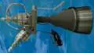](f/ps/i/ihi_120n.webp)|

**Notes:**

   1. Specs’re for nominal vacuum continuous thrust starting from the …nd second after energizing the solenoid valves.
   1. **Applicability** — …

 

### IHI 450N   ［JP・2comp.］
**IHI 450N** — 2‑component [engine](ps.md) by [IHI](contact/ihi.md). Designed in ….

|*[Characteristics](si.md)*|*IHI 450N*|
|:-|:-|
|Composition| |
|Consumption, W| |
|Dimensions, ㎜| |
|[Interfaces](interface.md)| |
|[Lifetime](lifetime.md)/Resource, h(y)|… / …|
|Mass, ㎏| |
|[Overload](vibration.md), Grms| |
|[Rad.resist](ion_rad.md), ㏉ (㎭)| |
|[Reliability](qm.md) per [lifetime](lifetime.md)| |
|[Thermal range](tcs.md), ℃| |
|[TRL](trl.md)|9|
|[Voltage](sps.md), V| |
|**【Specific】**|• • •|
|[Fuel](ps.md) (+ combustion products)|[NTO+Hydrazine](nto_plus.md) (H₂, H₂O, NH₃, N₂)|
|Fuel — components’ mass ratio| |
|Fuel — consumption, ㎏/s, ≤|0.139.427|
|Fuel — resource, ㎏, ≥|4 580|
|Press. — comb. chamber, ㎫ (㍴)| |
|Press. — eng. entrance, ㎫ (㍴)|O — 1.62 (15.9), F — 1.69 (16.6)|
|Press. — nozzle cut, ㎫ (㍴)| |
|Temper. — comb. chamber, К (℃)| |
|Temper. — nozzle cut, К (℃)| |
|Thrust, N (㎏f)|450 (45.87)|
|Thrust — duration of 1 thrust, s|… ‑ … |
|Thrust — [Ing](ing.md), N·s (㎏f·s), ≤| |
|Thrust — [Isp](ps.md), s (N·s/㎏), ≥|329 (3 228)|
|Thrust — switch. frequency, ㎐, ≤| |
|Thrust — torch angle, °| |
|Thrust — total pulses, ≥| |
|Thrust — total thrust, N (㎏f), ≥|14 782 100 (1 506 835)|
|Thrust — total thrust, s (h), ≥|32 850|
|[Turbopump](turbopump.md) rate, rpm|—|
| |[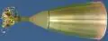](f/ps/i/ihi_450n.webp)|

**Notes:**

   1. Specs’re for nominal vacuum continuous thrust starting from the …nd second after energizing the solenoid valves.
   1. **Applicability** — …

 

### IHI 490N   ［JP・2comp.］
**IHI 490N** — 2‑component [engine](ps.md) by [IHI](contact/ihi.md). Designed in ….

|*[Characteristics](si.md)*|*IHI 490N*|
|:-|:-|
|Composition| |
|Consumption, W| |
|Dimensions, ㎜| |
|[Interfaces](interface.md)| |
|[Lifetime](lifetime.md)/Resource, h(y)|… / …|
|Mass, ㎏| |
|[Overload](vibration.md), Grms| |
|[Rad.resist](ion_rad.md), ㏉ (㎭)| |
|[Reliability](qm.md) per [lifetime](lifetime.md)| |
|[Thermal range](tcs.md), ℃| |
|[TRL](trl.md)|9|
|[Voltage](sps.md), V| |
|**【Specific】**|• • •|
|[Fuel](ps.md) (+ combustion products)|MON3+MMH ()|
|Fuel — components’ mass ratio| |
|Fuel — consumption, ㎏/s, ≤|0.158.066|
|Fuel — resource, ㎏, ≥|2 371|
|Press. — comb. chamber, ㎫ (㍴)| |
|Press. — eng. entrance, ㎫ (㍴)|1.72 (16.87)|
|Press. — nozzle cut, ㎫ (㍴)| |
|Temper. — comb. chamber, К (℃)| |
|Temper. — nozzle cut, К (℃)| |
|Thrust, N (㎏f)|478 ± … (49.95 ± …)|
|Thrust — duration of 1 thrust, s|… ‑ … |
|Thrust — [Ing](ing.md), N·s (㎏f·s), ≤| |
|Thrust — [Isp](ps.md), s (N·s/㎏), ≥|316 (3 100)|
|Thrust — switch. frequency, ㎐, ≤| |
|Thrust — torch angle, °| |
|Thrust — total pulses, ≥| |
|Thrust — total thrust, N (㎏f), ≥|7 350 000 (749 235)|
|Thrust — total thrust, s (h), ≥|15 000|
|[Turbopump](turbopump.md) rate, rpm|—|
| |[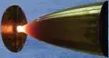](f/ps/i/ihi_490n.webp)|

**Notes:**

   1. Specs’re for nominal vacuum continuous thrust starting from the …nd second after energizing the solenoid valves.
   1. **Applicability** — …

 

### K10   ［RU・1comp.］
**K10** (ru. **К10**) — 1‑component [engine](ps.md) by [OKB Fakel](contact/edb_fakel.md).

|*[Characteristics](si.md)*|*K10*|
|:-|:-|
|Composition| |
|Consumption, W| |
|Dimensions, ㎜|137×130×44 **⁽¹⁾**|
|[Interfaces](interface.md)| |
|[Lifetime](lifetime.md)/Resource, h(y)|… / …|
|Mass, ㎏|0.2 **⁽¹⁾**|
|[Overload](vibration.md), Grms| |
|[Rad.resist](ion_rad.md), ㏉ (㎭)| |
|[Reliability](qm.md) per [lifetime](lifetime.md)| |
|[Thermal range](tcs.md), ℃| |
|[TRL](trl.md)|9 **⁽¹⁾**|
|[Voltage](sps.md), V| |
|**【Specific】**|• • •|
|[Fuel](ps.md) (+ combustion products)|[Hydrazine](hydrazine.md) **⁽¹⁾** (H₂, N₂)|
|Fuel — components’ mass ratio|—|
|Fuel — consumption, ㎏/s, ≤|0.000.046.334|
|Fuel — resource, ㎏, ≥|20 **⁽¹⁾**|
|Press. — comb. chamber, ㎫ (㍴)| |
|Press. — eng. entrance, ㎫ (㍴)|0.18 (1.8) **⁽¹⁾**|
|Press. — nozzle cut, ㎫ (㍴)| |
|Temper. — comb. chamber, К (℃)| |
|Temper. — nozzle cut, К (℃)| |
|Thrust, N (㎏f)|0.1 (0.01) **⁽¹⁾**|
|Thrust — duration of 1 thrust, s|… ‑ … |
|Thrust — [Ing](ing.md), N·s (㎏f·s), ≤| |
|Thrust — [Isp](ps.md), s (N·s/㎏), ≥|220 (2 156) **⁽¹⁾**|
|Thrust — switch. frequency, ㎐, ≤| |
|Thrust — torch angle, °| |
|Thrust — total pulses, ≥|70 000 **⁽¹⁾**|
|Thrust — total thrust, N (㎏f), ≥|44 000 (4 480)|
|Thrust — total thrust, s (h), ≥|440 000|
|[Turbopump](turbopump.md) rate, rpm|—|

**Notes:**

   1. Specs’re for nominal vacuum continuous thrust starting from the 4th second after energizing the solenoid valves.
   1. **[1]** — see [OKB Fakel](contact/edb_fakel.md) site, 2016 y.
   1. **Applicability** — …

 

### K50   ［RU・1comp.］
**K50** (ru. **К50**) — 1‑component [engine](ps.md) by [OKB Fakel](contact/edb_fakel.md).

|*[Characteristics](si.md)*|*К50-10.1*|
|:-|:-|
|Composition| |
|Consumption, W| |
|Dimensions, ㎜|112×70×38 **⁽¹⁾**|
|[Interfaces](interface.md)| |
|[Lifetime](lifetime.md)/Resource, h(y)|… / …|
|Mass, ㎏|0.46 **⁽¹⁾**|
|[Overload](vibration.md), Grms| |
|[Rad.resist](ion_rad.md), ㏉ (㎭)| |
|[Reliability](qm.md) per [lifetime](lifetime.md)| |
|[Thermal range](tcs.md), ℃| |
|[TRL](trl.md)|9 **⁽¹⁾**|
|[Voltage](sps.md), V| |
|**【Specific】**|• • •|
|[Fuel](ps.md) (+ combustion products)|[Hydrazine](hydrazine.md) **⁽¹⁾** (H₂, N₂)|
|Fuel — components’ mass ratio|—|
|Fuel — consumption, ㎏/s, ≤|0.000.250.208|
|Fuel — resource, ㎏, ≥|20 **⁽¹⁾**|
|Press. — comb. chamber, ㎫ (㍴)| |
|Press. — eng. entrance, ㎫ (㍴)|0.8 (8) **⁽¹⁾**|
|Press. — nozzle cut, ㎫ (㍴)| |
|Temper. — comb. chamber, К (℃)| |
|Temper. — nozzle cut, К (℃)| |
|Thrust, N (㎏f)|0.54 (0.05) **⁽¹⁾**|
|Thrust — duration of 1 thrust, s|… ‑ 10 800 **⁽¹⁾**|
|Thrust — [Ing](ing.md), N·s (㎏f·s), ≤| |
|Thrust — [Isp](ps.md), s (N·s/㎏), ≥|220 (2 158) **⁽¹⁾**|
|Thrust — switch. frequency, ㎐, ≤| |
|Thrust — torch angle, °| |
|Thrust — total pulses, ≥|130 000 **⁽¹⁾**|
|Thrust — total thrust, N (㎏f), ≥|47 500 (4 840)|
|Thrust — total thrust, s (h), ≥|88 000|
|[Turbopump](turbopump.md) rate, rpm|—|

**Notes:**

   1. Specs’re for nominal vacuum continuous thrust starting from the 4th second after energizing the solenoid valves.
   1. **[1]** — see [OKB Fakel](contact/edb_fakel.md) site, 2016 y.
   1. **Applicability** — [Arktika-M](арктика_м.md)・ [Elektro-M](электро_м.md)

 

### KVD1   ［RU・2comp.］
**KVD1** (ru. **КВД1**) — 2‑component [engine](ps.md) by [KBHM](contact/kbhm.md)

|*[Characteristics](si.md)*|*KVD1*|
|:-|:-|
|Composition| |
|Consumption, W| |
|Dimensions, ㎜|2 140 × 1 580 **⁽¹⁾**|
|[Interfaces](interface.md)| |
|[Lifetime](lifetime.md)/Resource, h(y)|… / …|
|Mass, ㎏|282 **⁽¹⁾**|
|[Overload](vibration.md), Grms| |
|[Rad.resist](ion_rad.md), ㏉ (㎭)| |
|[Reliability](qm.md) per [lifetime](lifetime.md)| |
|[Thermal range](tcs.md), ℃| |
|[TRL](trl.md)|9 **⁽¹⁾**|
|[Voltage](sps.md), V| |
|**【Specific】**|• • •|
|[Fuel](ps.md) (+ combustion products)|[O+H](o_plus.md) **⁽¹⁾** (H₂, H₂O)|
|Fuel — components’ mass ratio|6 **⁽¹⁾**|
|Fuel — consumption, ㎏/s, ≤|15.365|
|Fuel — resource, ㎏, ≥|12 300|
|Press. — comb. chamber, ㎫ (㍴)|5.7 (57) **⁽¹⁾**|
|Press. — eng. entrance, ㎫ (㍴)| |
|Press. — nozzle cut, ㎫ (㍴)| |
|Temper. — comb. chamber, К (℃)| |
|Temper. — nozzle cut, К (℃)| |
|Thrust, N (㎏f)|69 650 (7 100) **⁽¹⁾**|
|Thrust — duration of 1 thrust, s|… ‑ 600 **⁽¹⁾**|
|Thrust — [Ing](ing.md), N·s (㎏f·s), ≤| |
|Thrust — [Isp](ps.md), s (N·s/㎏), ≥|462 (4 533) **⁽¹⁾**|
|Thrust — switch. frequency, ㎐, ≤|1 pulse/7.5 s **⁽¹⁾**|
|Thrust — torch angle, °| |
|Thrust — total pulses, ≥|3 **⁽¹⁾**|
|Thrust — total thrust, N (㎏f), ≥|55 720 000 (5 670 000)|
|Thrust — total thrust, s (h), ≥|800 **⁽¹⁾**|
|[Turbopump](turbopump.md) rate, rpm|—|

**Notes:**

   1. Specs’re for nominal vacuum continuous thrust starting from the 2nd second after energizing the solenoid valves.
   1. <https://en.wikipedia.org/wiki/KVD-1>
   1. **[1]** — see [KBHM](contact/kbhm.md) site, 2016 y.
   1. **Applicability** — …

 

### LEROS   ［US・2comp.］
**LEROS** — 2‑component [engine](ps.md) by [Moog inc](contact/moog_inc.md). Manufacturing in UK. Classified as [HTAE](htae.md).

|*[Characteristics](si.md)*|*LEROS 1b*|*LEROS 1c*|*LEROS 2b*|*LEROS 4*|
|:-|:-|:-|:-|:-|
|Composition| | | | |
|Consumption, W| | | | |
|Dimensions, ㎜|540 × 289 **⁽¹⁾**|527 × 288 **⁽¹⁾**|671 × 334 **⁽¹⁾**|1 106 × 500 **⁽³⁾**|
|[Interfaces](interface.md)| | | | |
|[Lifetime](lifetime.md)/Resource, h(y)|… / …|… / …|… / …|… / …|
|Mass, ㎏|4.5 **⁽¹⁾**|4.3 **⁽¹⁾**|5.0 **⁽¹⁾**|6.5 **⁽³⁾**|
|[Overload](vibration.md), Grms| | | | |
|[Rad.resist](ion_rad.md), ㏉ (㎭)| | | | |
|[Reliability](qm.md) per [lifetime](lifetime.md)| | | | |
|[Thermal range](tcs.md), ℃| | | | |
|[TRL](trl.md)|9 **⁽¹⁾**|9 **⁽¹⁾**|9 **⁽¹⁾**|4 **⁽²⁾**|
|[Voltage](sps.md), V| | | | |
|**【Specific】**|• • •|• • •|• • •|• • •|
|[Fuel](ps.md) (+ combustion products)|[NTO+Hydrazine](nto_plus.md) **⁽¹⁾**  (H₂, H₂O, NH₃, N₂)|[NTO+Hydrazine](nto_plus.md) **⁽¹⁾**  (H₂, H₂O, NH₃, N₂)|[NTO+MMH](nto_plus.md) **⁽¹ ²⁾**  ()|[NTO+MMH](nto_plus.md) **⁽¹ ²⁾**  ()|
|Fuel — components’ mass ratio|0.8 ‑ 0.9 **⁽¹⁾**|0.78 ‑ 0.89 **⁽¹⁾**|1.43 ‑ 1.81 **⁽¹⁾**|1.5 ‑ 1.8 **⁽²⁾**|
|Fuel — consumption, ㎏/s, ≤|0.204.180|0.144.115|0.130.532|0.352.790|
|Fuel — resource, ㎏, ≥|4 180|4 480|3 900| |
|Press. — comb. chamber, ㎫ (㍴)| | | | |
|Press. — eng. entrance, ㎫ (㍴)|1.52 ‑ 2.03 (15‑20) **⁽¹⁾**|1.32 ‑ 2.03 (13 ‑ 20) **⁽¹⁾**|1.32 ‑ 1.73 (13 ‑ 17) **⁽¹⁾**|1.54 (15) **⁽²⁾**|
|Press. — nozzle cut, ㎫ (㍴)| | | | |
|Temper. — comb. chamber, К (℃)| | | | |
|Temper. — nozzle cut, К (℃)| | | | |
|Thrust, N (㎏f)|587 ‑ 635 ‑ 707  (59.8 ‑ 64.7 ‑ 72) **⁽¹⁾**|386 ‑ 458 ‑ 470  (39.3 ‑ 46.9 ‑ 49.7) **⁽¹⁾**|367 ‑ 407 ‑ 456  (37.4 ‑ 41.5 ‑ 46.4) **⁽¹⁾**|900 ‑ 1 100 ‑ 1 300  (91.7 ‑ 102 ‑ 132.5) **⁽¹⁾**|
|Thrust — duration of 1 thrust, s|… ‑ 2 520 **⁽¹⁾**|… ‑ 5 800 **⁽¹⁾**|… ‑ 4 000 **⁽¹⁾**| |
|Thrust — [Ing](ing.md), N·s (㎏f·s), ≤| | | | |
|Thrust — [Isp](ps.md), s (N·s/㎏), ≥|317 (3 110) **⁽¹⁾**|324 (3 178) **⁽¹⁾**|318 (3 118) **⁽¹⁾**|323 (3 118) **⁽²⁾**|
|Thrust — switch. frequency, ㎐, ≤| | | |17 ‑ 34 **⁽³⁾**|
|Thrust — torch angle, °| | | | |
|Thrust — total pulses, ≥|10 500 **⁽¹⁾**|10 500 **⁽¹⁾**|10 500 **⁽¹⁾**| |
|Thrust — total thrust, N (㎏f), ≥|13 000 000  (1 326 900)|14 198 000  (1 447 300)|12 169 000  (1 240 450)| |
|Thrust — total thrust, s (h), ≥|20 500 **⁽¹⁾**|31 000 **⁽¹⁾**|29 900 **⁽¹⁾**| |
|[Turbopump](turbopump.md) rate, rpm|—|—|—|—|

**Notes:**

   1. Specs’re for nominal vacuum continuous thrust starting from the 2nd second after energizing the solenoid valves.
   1. Docs: [Upper Stage Engines Rev 0913 ❐](f/ps/l/leros_upper_stage_engines_rev_0913.djvu)・ [An overview of LEROS 4, Space Propulsion 2014 Conference ❐](f/ps/l/leros_sp2014_2969298.djvu)・ [An overview of LEROS 4, Space Propulsion 2012 Conference ❐](f/ps/l/leros_sp2012_2394092_witherrata.djvu)
   1. <https://en.wikipedia.org/wiki/LEROS>
   1. **[1]** — see Upper Stage Engines Rev 0913, 2018 год.
   1. **[2]** — see An overview of LEROS 4, Space Propulsion 2014 Conference, 2014 год.
   1. **[3]** — see An overview of LEROS 4, Space Propulsion 2012 Conference, 2012 год.
   1. **Applicability** — A2100 platform (including GPS Ⅲ, GOES-R/S, & SBIRS)・ 702MP Platform (including Intelsat)・ Mercury MESSENGER・ Mars Global Surveyor・ Mars Climate Orbiter・ Mars Odyssey・ [Juno](juno.md)

 

### MD08   ［RU・gas］
**MD08** (ru. **МД08**) — gas [engine](ps.md) by [NIIMASH](contact/niimash.md).

|*[Characteristics](si.md)*|*MD08*|*MD08-02*|
|:-|:-|:-|
|Composition| | |
|Consumption, W|10.2|10.2|
|Dimensions, ㎜|93 × ⌀8 **⁽²⁾**|93 × ⌀8 **⁽²⁾**|
|[Interfaces](interface.md)| | |
|[Lifetime](lifetime.md)/Resource, h(y)|1 095 (3) **⁽²⁾** / …|1 095 (3)  **⁽²⁾** / …|
|Mass, ㎏|0.25 **⁽²⁾**|0.25 **⁽²⁾**|
|[Overload](vibration.md), Grms| | |
|[Rad.resist](ion_rad.md), ㏉ (㎭)| | |
|[Reliability](qm.md) per [lifetime](lifetime.md)|0.999|0.999|
|[Thermal range](tcs.md), ℃|−10 ‑ +50 for structures|−10 ‑ +50 for structures|
|[TRL](trl.md)|9 **⁽²⁾**|9 **⁽²⁾**|
|[Voltage](sps.md), V|27 (20 ‑ 34)|27 (20 ‑ 34)|
|**【Specific】**|• • •|• • •|
|[Fuel](ps.md) (+ combustion products)|[N](азот.md) ・ [He](гелий.md) **⁽²⁾**|[N](азот.md) ・ [He](гелий.md) **⁽²⁾**|
|Fuel — components’ mass ratio|—|—|
|Fuel — consumption, ㎏/s, ≤|0.001.143.647 ・ 0.000.442.128|0.001.143.647 ・ 0.000.442.128|
|Fuel — resource, ㎏, ≥|11.4 ・ 4.4|11.4 ・ 4.4|
|Press. — comb. chamber, ㎫ (㍴)| | |
|Press. — eng. entrance, ㎫ (㍴)|1.47 ‑ 1.96 (15 ‑ 20) **⁽²⁾**|1.47 ‑ 1.96 (15 ‑ 20) **⁽²⁾**|
|Press. — nozzle cut, ㎫ (㍴)| | |
|Temper. — comb. chamber, К (℃)| | |
|Temper. — nozzle cut, К (℃)| | |
|Thrust, N (㎏f)|0.819±0.0082 (0.083±0.00083) ・  0.733±0.0074 (0.074±0.00074) **⁽²⁾**|0.819±0.0082 (0.083±0.00083) ・  0.733±0.0074 (0.074±0.00074) **⁽²⁾**|
|Thrust — duration of 1 thrust, s|0.05 ‑ 100 **⁽²⁾**|0.05 ‑ 100 **⁽²⁾**|
|Thrust — [Ing](ing.md), N·s (㎏f·s), ≤| | |
|Thrust — [Isp](ps.md), s (N·s/㎏), ≥|73 (716) ・ 169 (1 658) **⁽²⁾**|73 (716) ・ 169 (1 658) **⁽²⁾**|
|Thrust — switch. frequency, ㎐, ≤|10 **⁽²⁾**|10 **⁽²⁾**|
|Thrust — torch angle, °| | |
|Thrust — total pulses, ≥|80 000 **⁽²⁾**|80 000 **⁽²⁾**|
|Thrust — total thrust, N (㎏f), ≥|8 190 (834) ・ 7 330 (747)|8 190 (834) ・ 7 330 (747)|
|Thrust — total thrust, s (h), ≥|10 000 **⁽²⁾**|10 000 **⁽²⁾**|
|[Turbopump](turbopump.md) rate, rpm|—|—|

**Notes:**

   1. Specs’re for nominal vacuum continuous thrust starting from the 0.02nd second after energizing the solenoid valves.
   1. **[1,2]** — see Specification & [NIIMASH](contact/niimash.md) site, 2016 y.
   1. **Applicability** — [Fobos‑Grunt](фобос_грунт.md) (MD08-02)

 

### MD5   ［RU・gas］
**MD5** (ru. **МД5**) — gas [engine](ps.md) by [NIIMASH](contact/niimash.md). Archived.

|*[Characteristics](si.md)*|*MD5*|
|:-|:-|
|Composition| |
|Consumption, W|1.35|
|Dimensions, ㎜|91 × ⌀20 **⁽¹⁾**|
|[Interfaces](interface.md)| |
|[Lifetime](lifetime.md)/Resource, h(y)|… / …|
|Mass, ㎏|0.35 **⁽¹⁾**|
|[Overload](vibration.md), Grms| |
|[Rad.resist](ion_rad.md), ㏉ (㎭)| |
|[Reliability](qm.md) per [lifetime](lifetime.md)| |
|[Thermal range](tcs.md), ℃| |
|[TRL](trl.md)|9 **⁽¹⁾**|
|[Voltage](sps.md), V|27 (20 ‑ 34)|
|**【Specific】**|• • •|
|[Fuel](ps.md) (+ combustion products)|[N](азот.md) ・ [Air](воздух.md) **⁽¹⁾** (N ・ Air)|
|Fuel — components’ mass ratio| |
|Fuel — consumption, ㎏/s, ≤|0.007.281.199|
|Fuel — resource, ㎏, ≥|214.79|
|Press. — comb. chamber, ㎫ (㍴)| |
|Press. — eng. entrance, ㎫ (㍴)|1.08 ‑ 1.57 (10 ‑ 15) **⁽¹⁾**|
|Press. — nozzle cut, ㎫ (㍴)| |
|Temper. — comb. chamber, К (℃)| |
|Temper. — nozzle cut, К (℃)| |
|Thrust, N (㎏f)|5 (0.5) **⁽¹⁾**|
|Thrust — duration of 1 thrust, s|0.012 ‑ 3 000 **⁽¹⁾**|
|Thrust — [Ing](ing.md), N·s (㎏f·s), ≤| |
|Thrust — [Isp](ps.md), s (N·s/㎏), ≥|70 (686) **⁽¹⁾**|
|Thrust — switch. frequency, ㎐, ≤| |
|Thrust — torch angle, °| |
|Thrust — total pulses, ≥|250 000 **⁽¹⁾**|
|Thrust — total thrust, N (㎏f), ≥|147 500 (15 030)|
|Thrust — total thrust, s (h), ≥|29 500 (8.2)|
|[Turbopump](turbopump.md) rate, rpm|—|

**Notes:**

   1. Specs’re for nominal vacuum continuous thrust starting from the 0.02nd second after energizing the solenoid valves.
   1. **[1]** — see [NIIMASH](contact/niimash.md) site, 2016 y.
   1. **Applicability** — …

 

### Merlin   ［US・2comp.］
**Merlin** — a family of 2‑components [engines](ps.md) by [SpaceX](contact/spacex.md).

|*[Characteristics](si.md)*|*Merlin 1A*|*Merlin 1B*|*Merlin 1C*|*Merlin 1C Vac*|
|:-|:-|:-|:-|:-|
|Composition| | | | |
|Consumption, W| | | | |
|Dimensions, ㎜| | |2 920 × …| |
|[Interfaces](interface.md)| | | | |
|[Lifetime](lifetime.md)/Resource, h(y)|… / …|… / …|… / …|… / …|
|Mass, ㎏| | |630| |
|[Overload](vibration.md), Grms| | | | |
|[Rad.resist](ion_rad.md), ㏉ (㎭)| | | | |
|[Reliability](qm.md) per [lifetime](lifetime.md)| | | | |
|[Thermal range](tcs.md), ℃| | | | |
|[TRL](trl.md)| | |9|9|
|[Voltage](sps.md), V| | | | |
|**【Specific】**|• • •|• • •|• • •|• • •|
|[Fuel](ps.md) (+ combustion products)|[O+Kerosene](o_plus.md)|[O+Kerosene](o_plus.md)|[O+Kerosene](o_plus.md)|[O+Kerosene](o_plus.md)|
|Fuel — components’ mass ratio|2.17|2.17|2.17|2.17|
|Fuel — consumption, ㎏/s, ≤| |141.318|160.425|122.205|
|Fuel — resource, ㎏, ≥| | |260 000|40 500|
|Press. — comb. chamber, ㎫ (㍴)| | |6.77 (66.4)| |
|Press. — eng. entrance, ㎫ (㍴)| | | | |
|Press. — nozzle cut, ㎫ (㍴)| | | | |
|Temper. — comb. chamber, К (℃)| | | | |
|Temper. — nozzle cut, К (℃)| | | | |
|Thrust, N (㎏f)|340 000 (34 658)|420 000 (42 813)|480 000 (49 930)|410 000 (41 896)|60 ‑ 100| |
|Thrust — duration of 1 thrust, s|… ‑ … | | | |
|Thrust — [Ing](ing.md), N·s (㎏f·s), ≤| | | | |
|Thrust — [Isp](ps.md), s (N·s/㎏), ≥| |303 (2 972)|305 (2 992)|342 (3 355)|
|Thrust — switch. frequency, ㎐, ≤| | | | |
|Thrust — torch angle, °| | | | |
|Thrust — total pulses, ≥| | | | |
|Thrust — total thrust, N (㎏f), ≥| | |778 080 000  (79 315 000)|135 700 000  (13 833 000)|
|Thrust — total thrust, s (h), ≥| | |1 620|330|
|[Turbopump](turbopump.md) rate, rpm|—|—|—|—|
|  **Comparison  [BE‑4](engine_lst.md), [Raptor](engine_lst.md), Merlin 1D**|[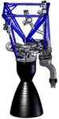](f/ps/m/merlin_1a_pic1.webp)| |[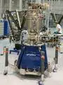](f/ps/m/merlin_1c_pic1.webp)|[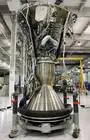](f/ps/m/merlin_1c_vac_pic1.webp)|

 

**Continue:**

|*[Characteristics](si.md)*|*Merlin 1D*|*Merlin 1D Vac*|
|:-|:-|:-|
|Composition| | |
|Consumption, W| | |
|Dimensions, ㎜|… × 1 000| |
|[Interfaces](interface.md)| | |
|[Lifetime](lifetime.md)/Resource, h(y)|… / …|… / …|
|Mass, ㎏|470|470|
|[Overload](vibration.md), Grms| | |
|[Rad.resist](ion_rad.md), ㏉ (㎭)| | |
|[Reliability](qm.md) per [lifetime](lifetime.md)| | |
|[Thermal range](tcs.md), ℃| | |
|[TRL](trl.md)|9|7|
|[Voltage](sps.md), V| | |
|**【Specific】**|• • •|• • •|
|[Fuel](ps.md) (+ combustion products)|[O+Kerosene](o_plus.md)|[O+Kerosene](o_plus.md)|
|Fuel — components’ mass ratio|2.34|2.36|
|Fuel — consumption, ㎏/s, ≤|119.833 ‑ 299.582|106.696 ‑ 273.588|
|Fuel — resource, ㎏, ≥| | |
|Press. — comb. chamber, ㎫ (㍴)|9.7 (95.2)| |
|Press. — eng. entrance, ㎫ (㍴)| | |
|Press. — nozzle cut, ㎫ (㍴)| | |
|Temper. — comb. chamber, К (℃)| | |
|Temper. — nozzle cut, К (℃)| | |
|Thrust, N (㎏f)|365 600 ‑ 914 000 (37 270 ‑ 93 170)|364 250 ‑ 934 000 (37 130 ‑ 95 208)|
|Thrust — duration of 1 thrust, s|… ‑ … | |
|Thrust — [Ing](ing.md), N·s (㎏f·s), ≤| | |
|Thrust — [Isp](ps.md), s (N·s/㎏), ≥|311 (3 051)|348 (3 413)|
|Thrust — switch. frequency, ㎐, ≤| | |
|Thrust — torch angle, °| | |
|Thrust — total pulses, ≥| | |
|Thrust — total thrust, N (㎏f), ≥| | |
|Thrust — total thrust, s (h), ≥| | |
|[Turbopump](turbopump.md) rate, rpm| | |
| || |

**Notes:**

   1. Specs’re for nominal vacuum continuous thrust starting from the 2nd second after energizing the solenoid valves.
   1. <https://en.wikipedia.org/wiki/Merlin_(rocket_engine_family)>
   1. 2014.10.05 [Хабр: Превосходство Маска. О магии «Мерлина» замолвим слово ⎆](https://habr.com/ru/post/236761/) — [archived ❐](f/archive/20141005_1.pdf) 2014.10.05
   1. 2014.11.21 [Why is the Merlin 1D specific impulse so low?: ⎆](https://www.reddit.com/r/spacex/comments/2my35n/why_is_the_merlin_1d_specific_impulse_so_low/) — [archived ❐](f/archive/20141121_1.pdf) 2014.11.21
   1. There are 6 variations: **Merlin 1A** — 2 pieces were made. **Merlin 1B** — it was a successor of 1A, 1 piece was made, but it never flew. **Merlin 1C**. **Merlin 1C Vac**. **Merlin 1D**. **Merlin 1D Vac**.
   1. **[1]** — …
   1. **Applicability:**
      - **Merlin 1A** — [Falcon 1](falcon.md) (2006 ‑ 2007)
      - **Merlin 1B** — [Falcon 1](falcon.md) (never)
      - **Merlin 1C** — [Falcon 1](falcon.md) (2008)・ [Falcon 9](falcon.md) (2010 ‑ 2013)
      - **Merlin 1C Vac** — [Falcon 9](falcon.md) (2010 ‑ 2013)
      - **Merlin 1D** — [Falcon 9 v.1.1](falcon.md) (2013 ‑ 2018)・ [Falcon Heavy](falcon.md) (2018 ‑ 2018)
      - **Merlin 1D Vac** — [Falcon 9 v.1.1](falcon.md) (2015 ‑ 2018)・ [Falcon Heavy](falcon.md) (2018 ‑ 2018)

 

### MT-2   ［JP・1comp.］
**MT-2** — 1‑component [engine](ps.md) by [IHI](contact/ihi.md). Designed in ….

|*[Characteristics](si.md)*|*IHI MT-2*|
|:-|:-|
|Composition| |
|Consumption, W| |
|Dimensions, ㎜| |
|[Interfaces](interface.md)| |
|[Lifetime](lifetime.md)/Resource, h(y)|… / …|
|Mass, ㎏| |
|[Overload](vibration.md), Grms| |
|[Rad.resist](ion_rad.md), ㏉ (㎭)| |
|[Reliability](qm.md) per [lifetime](lifetime.md)| |
|[Thermal range](tcs.md), ℃| |
|[TRL](trl.md)|9|
|[Voltage](sps.md), V| |
|**【Specific】**|• • •|
|[Fuel](ps.md) (+ combustion products)|[Hydrazine](hydrazine.md) (H₂, N₂)|
|Fuel — components’ mass ratio|—|
|Fuel — consumption, ㎏/s, ≤|0.003.349.351 ‑ 0.008.840.536|
|Fuel — resource, ㎏, ≥|115|
|Press. — comb. chamber, ㎫ (㍴)| |
|Press. — eng. entrance, ㎫ (㍴)|0.48 ‑ 2.76 (4.7 ‑ 27.1)|
|Press. — nozzle cut, ㎫ (㍴)| |
|Temper. — comb. chamber, К (℃)| |
|Temper. — nozzle cut, К (℃)| |
|Thrust, N (㎏f)|6.9 ‑ 19.6 (0.7034 ‑ 1.998)|
|Thrust — duration of 1 thrust, s|… ‑ … |
|Thrust — [Ing](ing.md), N·s (㎏f·s), ≤| |
|Thrust — [Isp](ps.md), s (N·s/㎏), ≥|210 ‑ 226 (2 060 ‑ 2 218)|
|Thrust — switch. frequency, ㎐, ≤| |
|Thrust — torch angle, °| |
|Thrust — total pulses, ≥|261 914|
|Thrust — total thrust, N (㎏f), ≥|237 000 ‑ 255 000|
|Thrust — total thrust, s (h), ≥|34 400 ‑ 13 000|
|[Turbopump](turbopump.md) rate, rpm|—|
| |[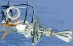](f/ps/i/ihi_mt2.webp)|

**Notes:**

   1. Specs’re for nominal vacuum continuous thrust starting from the …nd second after energizing the solenoid valves.
   1. **Applicability** — …

 

### MT-6   ［JP・1comp.］
**MT-6** — 1‑component [engine](ps.md) by [IHI](contact/ihi.md). Designed in ….

|*[Characteristics](si.md)*|*IHI MT-6*|
|:-|:-|
|Composition| (ITAR‑free)|
|Consumption, W| |
|Dimensions, ㎜| |
|[Interfaces](interface.md)| |
|[Lifetime](lifetime.md)/Resource, h(y)|… / …|
|Mass, ㎏| |
|[Overload](vibration.md), Grms| |
|[Rad.resist](ion_rad.md), ㏉ (㎭)| |
|[Reliability](qm.md) per [lifetime](lifetime.md)| |
|[Thermal range](tcs.md), ℃| |
|[TRL](trl.md)|9|
|[Voltage](sps.md), V| |
|**【Specific】**|• • •|
|[Fuel](ps.md) (+ combustion products)|[Hydrazine](hydrazine.md) (H₂, N₂)|
|Fuel — components’ mass ratio|—|
|Fuel — consumption, ㎏/s, ≤|0.010.904.866 ‑ 0.022.652.622|
|Fuel — resource, ㎏, ≥|120|
|Press. — comb. chamber, ㎫ (㍴)| |
|Press. — eng. entrance, ㎫ (㍴)|0.9 ‑ 2.76 (8.82 ‑ 27.1)|
|Press. — nozzle cut, ㎫ (㍴)| |
|Temper. — comb. chamber, К (℃)| |
|Temper. — nozzle cut, К (℃)| |
|Thrust, N (㎏f)|23 ‑ 50 (2.3445 ‑ 5.0968)|
|Thrust — duration of 1 thrust, s|… ‑ … |
|Thrust — [Ing](ing.md), N·s (㎏f·s), ≤| |
|Thrust — [Isp](ps.md), s (N·s/㎏), ≥|215 ‑ 225 (2 110 ‑ 2 208)|
|Thrust — switch. frequency, ㎐, ≤| |
|Thrust — torch angle, °| |
|Thrust — total pulses, ≥|14 800|
|Thrust — total thrust, N (㎏f), ≥|253 100 ‑ 265 000|
|Thrust — total thrust, s (h), ≥|11 000 ‑ 5 300|
|[Turbopump](turbopump.md) rate, rpm|—|
| |[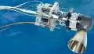](f/ps/i/ihi_mt6.webp)|

**Notes:**

   1. Specs’re for nominal vacuum continuous thrust starting from the …nd second after energizing the solenoid valves.
   1. **Applicability** — …

 

### MT-8A   ［JP・1comp.］
**MT-8A** — 1‑component [engine](ps.md) by [IHI](contact/ihi.md). Designed in ….

|*[Characteristics](si.md)*|*IHI MT-8A*|
|:-|:-|
|Composition| (ITAR‑free)|
|Consumption, W| |
|Dimensions, ㎜| |
|[Interfaces](interface.md)| |
|[Lifetime](lifetime.md)/Resource, h(y)|… / …|
|Mass, ㎏| |
|[Overload](vibration.md), Grms| |
|[Rad.resist](ion_rad.md), ㏉ (㎭)| |
|[Reliability](qm.md) per [lifetime](lifetime.md)| |
|[Thermal range](tcs.md), ℃| |
|[TRL](trl.md)|9|
|[Voltage](sps.md), V| |
|**【Specific】**|• • •|
|[Fuel](ps.md) (+ combustion products)|[Hydrazine](hydrazine.md) (H₂, N₂)|
|Fuel — components’ mass ratio|—|
|Fuel — consumption, ㎏/s, ≤|0.000.727.413 ‑ 0.002.560.005|
|Fuel — resource, ㎏, ≥|180|
|Press. — comb. chamber, ㎫ (㍴)| |
|Press. — eng. entrance, ㎫ (㍴)|0.55 ‑ 2.76 (5.4 ‑ 27.1)|
|Press. — nozzle cut, ㎫ (㍴)| |
|Temper. — comb. chamber, К (℃)| |
|Temper. — nozzle cut, К (℃)| |
|Thrust, N (㎏f)|1.47 ‑ 5.5 (0.1498 ‑ 0.5607)|
|Thrust — duration of 1 thrust, s|… ‑ … |
|Thrust — [Ing](ing.md), N·s (㎏f·s), ≤| |
|Thrust — [Isp](ps.md), s (N·s/㎏), ≥|206 ‑ 219 (2 020 ‑ 2 150)|
|Thrust — switch. frequency, ㎐, ≤| |
|Thrust — torch angle, °| |
|Thrust — total pulses, ≥|850 000|
|Thrust — total thrust, N (㎏f), ≥|364 000 ‑ 387 000|
|Thrust — total thrust, s (h), ≥|247 500 ‑ 70 500|
|[Turbopump](turbopump.md) rate, rpm|—|
| |[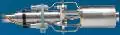](f/ps/i/ihi_mt8a.webp)|

**Notes:**

   1. Specs’re for nominal vacuum continuous thrust starting from the …nd second after energizing the solenoid valves.
   1. **Applicability** — …

 

### MT-9   ［JP・1comp.］
**MT-9** — 1‑component [engine](ps.md) by [IHI](contact/ihi.md). Designed in ….

|*[Characteristics](si.md)*|*IHI MT-9*|
|:-|:-|
|Composition| (ITAR‑free)|
|Consumption, W| |
|Dimensions, ㎜| |
|[Interfaces](interface.md)| |
|[Lifetime](lifetime.md)/Resource, h(y)|… / …|
|Mass, ㎏| |
|[Overload](vibration.md), Grms| |
|[Rad.resist](ion_rad.md), ㏉ (㎭)| |
|[Reliability](qm.md) per [lifetime](lifetime.md)| |
|[Thermal range](tcs.md), ℃| |
|[TRL](trl.md)|9|
|[Voltage](sps.md), V| |
|**【Specific】**|• • •|
|[Fuel](ps.md) (+ combustion products)|[Hydrazine](hydrazine.md) (H₂, N₂)|
|Fuel — components’ mass ratio|—|
|Fuel — consumption, ㎏/s, ≤|0.000.142.123 ‑ 0.000.535.760|
|Fuel — resource, ㎏, ≥|100|
|Press. — comb. chamber, ㎫ (㍴)| |
|Press. — eng. entrance, ㎫ (㍴)|0.55 ‑ 2.76 (5.4 ‑ 27.1)|
|Press. — nozzle cut, ㎫ (㍴)| |
|Temper. — comb. chamber, К (℃)| |
|Temper. — nozzle cut, К (℃)| |
|Thrust, N (㎏f)|0.29 ‑ 1.13 (0.0296 ‑ 0.1152)|
|Thrust — duration of 1 thrust, s|… ‑ … |
|Thrust — [Ing](ing.md), N·s (㎏f·s), ≤| |
|Thrust — [Isp](ps.md), s (N·s/㎏), ≥|208 ‑ 215 (2 040 ‑ 2 110)|
|Thrust — switch. frequency, ㎐, ≤| |
|Thrust — torch angle, °| |
|Thrust — total pulses, ≥|850 000|
|Thrust — total thrust, N (㎏f), ≥|204 000 ‑ 211 000|
|Thrust — total thrust, s (h), ≥|704 000 ‑ 187 000|
|[Turbopump](turbopump.md) rate, rpm|—|
| |[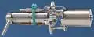](f/ps/i/ihi_mt9.webp)|

**Notes:**

   1. Specs’re for nominal vacuum continuous thrust starting from the …nd second after energizing the solenoid valves.
   1. **Applicability** — …

 

### Raptor   ［US・2comp.］
**Raptor** — a family of 2-component [engines](ps.md) by [SpaceX](contact/spacex.md).

|*[Characteristics](si.md)*|*ER40*|*ER200*|*Raptor 2017‑SL*|*Raptor 2017‑V*|
|:-|:-|:-|:-|:-|
|Composition| | | | |
|Consumption, W| | | | |
|Dimensions, ㎜|3 300 × 1 730|6 400 × 3 870|… × 1 300|… × 2 400|
|[Interfaces](interface.md)| | | | |
|[Lifetime](lifetime.md)/Resource, h(y)|… / …|… / …|… / …|… / …|
|Mass, ㎏|1 000|2 300| | |
|[Overload](vibration.md), Grms| | | | |
|[Rad.resist](ion_rad.md), ㏉ (㎭)| | | | |
|[Reliability](qm.md) per [lifetime](lifetime.md)| | | | |
|[Thermal range](tcs.md), ℃| | | | |
|[TRL](trl.md)|3|3|6|6|
|[Voltage](sps.md), V| | | | |
|**【Specific】**|• • •|• • •|• • •|• • •|
|[Fuel](ps.md) (+ combustion products)|[O+Methane](o_plus.md)  (H₂, H₂O, CO, CO₂)|[O+Methane](o_plus.md)  (H₂, H₂O, CO, CO₂)|[O+Methane](o_plus.md)  (H₂, H₂O, CO, CO₂)|[O+Methane](o_plus.md)  (H₂, H₂O, CO, CO₂)|
|Fuel — components’ mass ratio|3.5 ‑ 3.8|3.5 ‑ 3.8|3.5 ‑ 3.8|3.5 ‑ 3.8|
|Fuel — consumption, ㎏/s, ≤|922.5|934.08|486.82|516.58|
|Fuel — resource, ㎏, ≥| | | | |
|Press. — comb. chamber, ㎫ (㍴)|5.9 (57) - 30.6 (300)|5.9 (57) - 30.6 (300)| | |
|Press. — eng. entrance, ㎫ (㍴)| | | | |
|Press. — nozzle cut, ㎫ (㍴)|0.0735 (0.721)|0.09 (0.883)| | |
|Temper. — comb. chamber, К (℃)|3 250|3 250|3 250|3 250|
|Temper. — nozzle cut, К (℃)| | | | |
|Thrust, N (㎏f)|657 000 ‑ 3 285 000  (66 970 ‑ 334 860)|700 000 ‑ 3 500 000  (71 350 ‑ 356 770)|1 700 000  (173 290)|1 900 000  (193 680)|
|Thrust — duration of 1 thrust, s|… ‑ … | | | |
|Thrust — [Ing](ing.md), N·s (㎏f·s), ≤| | | | |
|Thrust — [Isp](ps.md), s (N·s/㎏), ≥|363 (3 561)|382 (3 747)|356 (3 492)|375 (3 678)|
|Thrust — switch. frequency, ㎐, ≤| | | | |
|Thrust — torch angle, °| | | | |
|Thrust — total pulses, ≥| | | | |
|Thrust — total thrust, N (㎏f), ≥| | | | |
|Thrust — total thrust, s (h), ≥| | | | |
|[Turbopump](turbopump.md) rate, rpm|—|—|—|—|
|  **Comparison  [BE‑4](engine_lst.md), [Raptor](engine_lst.md), Merlin 1D**| | | | |

**Notes:**

   1. Specs’re for nominal vacuum continuous thrust starting from the 2nd second after energizing the solenoid valves.
   1. <https://en.wikipedia.org/wiki/Raptor_(rocket_engine_family)>
   1. <https://en.wikipedia.org/wiki/SpaceX_rocket_engines>
   1. 2017.06.28 [Хабр: Подробный разбор ЖРД «Raptor» ⎆](https://geektimes.ru/post/290549/) — [archived ❐](f/archive/20170628_1.pdf) 2019.02.13
   1. 2017.10.18 [Всё, что известно о двигателях Раптор и даже больше ⎆](https://elonmusk.su/vse-chto-izvestno-o-dvigatelyakh-raptor-i-dazhe-bolshe/) — [archived ❐](f/archive/20171018_1.pdf) 2019.02.13
   1. It’s the successor to [Merlin](engine_lst.md). In contrast, it runs on the fuel [O + Methane](o_plus.md) & has a full‑flow closed cycle. For 2017 — the only full‑flow closed cycle engine in the world.
   1. There are 4 variations: **ER40** — basic version, works in both atmosphere & vacuum. **ER200** — ER40 version for vacuum operation. **Raptor2017‑SL** — development of 2017, works in both atmosphere & vacuum. **Raptor2017-V** — 2017 version for vacuum operation.
   1. **[1]** — …
   1. **Applicability** — [BFR](bfr.md)・ [ITC](itc.md)

|Raptor Engine Test Site, 2017.01.30  [Source 1 ⎆](https://www.reddit.com/r/engineteststands/comments/43lmbn/spacexs_raptor_test_stand_under_construction_at/), [Source 2 ⎆](http://pictures.jtbuice.com/SpaceX-2/McGregor-Flyover-1-30-2016/)|
|:-|
||

 

### R-1E   ［US・2comp.］
**R-1E** — 2‑component [engine](ps.md) by [Aerojet Rocketdyne](aerojet_rocketdyne.md). Designed in 1981.

|*[Characteristics](si.md)*|*R-1E*|
|:-|:-|
|Composition| |
|Consumption, W|36 (for 28 V)|
|Dimensions, ㎜| |
|[Interfaces](interface.md)| |
|[Lifetime](lifetime.md)/Resource, h(y)|… / …|
|Mass, ㎏|2|
|[Overload](vibration.md), Grms| |
|[Rad.resist](ion_rad.md), ㏉ (㎭)| |
|[Reliability](qm.md) per [lifetime](lifetime.md)| |
|[Thermal range](tcs.md), ℃| |
|[TRL](trl.md)|9|
|[Voltage](sps.md), V| |
|**【Specific】**|• • •|
|[Fuel](ps.md) (+ combustion products)|[NTO+MMH](nto_plus.md)|
|Fuel — components’ mass ratio| |
|Fuel — consumption, ㎏/s, ≤|0.040.410|
|Fuel — resource, ㎏, ≥|4 047|
|Press. — comb. chamber, ㎫ (㍴)|0.74 (7.3)|
|Press. — eng. entrance, ㎫ (㍴)|0.7 ‑ 2.81 (6.9 ‑ 27.6)|
|Press. — nozzle cut, ㎫ (㍴)| |
|Temper. — comb. chamber, К (℃)| |
|Temper. — nozzle cut, К (℃)| |
|Thrust, N (㎏f)|111 (11.3)|
|Thrust — duration of 1 thrust, s|… ‑ 100 180|
|Thrust — [Ing](ing.md), N·s (㎏f·s), ≤| |
|Thrust — [Isp](ps.md), s (N·s/㎏), ≥|280 (2 747)|
|Thrust — switch. frequency, ㎐, ≤| |
|Thrust — torch angle, °| |
|Thrust — total pulses, ≥|330 000|
|Thrust — total thrust, N (㎏f), ≥|11 120 000 (1 133 530)|
|Thrust — total thrust, s (h), ≥|100 180|
|[Turbopump](turbopump.md) rate, rpm|—|
| |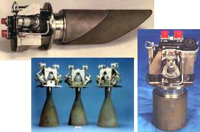|

**Notes:**

   1. Specs’re for nominal vacuum continuous thrust starting from the 2nd second after energizing the solenoid valves.
   1. [Promo specs ❐](f/ps/r/r-1e_spec1.webp)
   1. <http://www.astronautix.com/r/r-1eengine.html>
   1. <http://www.rocket.com/propulsion-systems/bipropellant-rockets>
   1. **Applicability** — Space Shuttle, Orbiter’s vernier attitude control & orbit adjust thruster

 

### R-4D   ［US・2comp.］
**R-4D** — 2‑component [engine](ps.md) by [Aerojet Rocketdyne](aerojet_rocketdyne.md). Designed in 1966.

|*[Characteristics](si.md)*|*R-4D*|
|:-|:-|
|Composition| |
|Consumption, W|46 (using 28 V)|
|Dimensions, ㎜|550 × 280|
|[Interfaces](interface.md)| |
|[Lifetime](lifetime.md)/Resource, h(y)|… / …|
|Mass, ㎏|3.4 (44:1 nozzle) or 3.76 (164:1 nozzle) or 4.31 (300:1 nozzle)|
|[Overload](vibration.md), Grms| |
|[Rad.resist](ion_rad.md), ㏉ (㎭)| |
|[Reliability](qm.md) per [lifetime](lifetime.md)| |
|[Thermal range](tcs.md), ℃| |
|[TRL](trl.md)|9|
|[Voltage](sps.md), V| |
|**【Specific】**|• • •|
|[Fuel](ps.md) (+ combustion products)|[NTO+MMH](nto_plus.md)|
|Fuel — components’ mass ratio|1.65 (1.0 ‑ 2.4)|
|Fuel — consumption, ㎏/s, ≤|0.160.093|
|Fuel — resource, ㎏, ≥|6 450|
|Press. — comb. chamber, ㎫ (㍴)|0.76 (7.45)|
|Press. — eng. entrance, ㎫ (㍴)|0.41 ‑ 2.93 (4 ‑ 28.74)|
|Press. — nozzle cut, ㎫ (㍴)| |
|Temper. — comb. chamber, К (℃)| |
|Temper. — nozzle cut, К (℃)| |
|Thrust, N (㎏f)|490 (50)|
|Thrust — duration of 1 thrust, s|… ‑ 3 600|
|Thrust — [Ing](ing.md), N·s (㎏f·s), ≤| |
|Thrust — [Isp](ps.md), s (N·s/㎏), ≥|312 (3 060)|
|Thrust — switch. frequency, ㎐, ≤| |
|Thrust — torch angle, °| |
|Thrust — total pulses, ≥|20 700|
|Thrust — total thrust, N (㎏f), ≥|20 016 000 (2 040 300)|
|Thrust — total thrust, s (h), ≥|40 850|
|[Turbopump](turbopump.md) rate, rpm|—|
| |[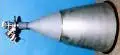](f/ps/r/r-4d_pic1.webp)|

**Notes:**

   1. Specs’re for nominal vacuum continuous thrust starting from the 2nd second after energizing the solenoid valves.
   1. [Promo specs ❐](f/ps/r/r-4d_spec1.webp)
   1. <https://en.wikipedia.org/wiki/R-4D>
   1. <http://www.astronautix.com/r/r-4d.html>
   1. **Applicability** — Apollo・ Cassini・ H-II Transfer Vehicle・ Orion・ Space Shuttle

 

### R-6   ［US・2comp.］
**R-6** — 2‑component [engine](ps.md) by [Aerojet Rocketdyne](aerojet_rocketdyne.md).

|*[Characteristics](si.md)*|*R-6*|
|:-|:-|
|Composition| |
|Consumption, W| |
|Dimensions, ㎜| |
|[Interfaces](interface.md)| |
|[Lifetime](lifetime.md)/Resource, h(y)|… / …|
|Mass, ㎏|0.45|
|[Overload](vibration.md), Grms| |
|[Rad.resist](ion_rad.md), ㏉ (㎭)| |
|[Reliability](qm.md) per [lifetime](lifetime.md)| |
|[Thermal range](tcs.md), ℃| |
|[TRL](trl.md)|9|
|[Voltage](sps.md), V| |
|**【Specific】**|• • •|
|[Fuel](ps.md) (+ combustion products)|[NTO+MMH](nto_plus.md)|
|Fuel — components’ mass ratio| |
|Fuel — consumption, ㎏/s, ≤| |
|Fuel — resource, ㎏, ≥| |
|Press. — comb. chamber, ㎫ (㍴)| |
|Press. — eng. entrance, ㎫ (㍴)| |
|Press. — nozzle cut, ㎫ (㍴)| |
|Temper. — comb. chamber, К (℃)| |
|Temper. — nozzle cut, К (℃)| |
|Thrust, N (㎏f)|22 (2.24)|
|Thrust — duration of 1 thrust, s|… ‑ … |
|Thrust — [Ing](ing.md), N·s (㎏f·s), ≤| |
|Thrust — [Isp](ps.md), s (N·s/㎏), ≥| |
|Thrust — switch. frequency, ㎐, ≤| |
|Thrust — torch angle, °| |
|Thrust — total pulses, ≥| |
|Thrust — total thrust, N (㎏f), ≥| |
|Thrust — total thrust, s (h), ≥| |
|[Turbopump](turbopump.md) rate, rpm|—|

**Notes:**

   1. Specs’re for nominal vacuum continuous thrust starting from the 2nd second after energizing the solenoid valves.
   1. <http://www.rocket.com/propulsion-systems/bipropellant-rockets>
   1. **Applicability** — …

 

### R-40   ［US・2comp.］
**R-40** — 2‑component [engine](ps.md) by [Aerojet Rocketdyne](aerojet_rocketdyne.md). Designed in 1981.

|*[Characteristics](si.md)*|*R-40A*|*R-40B*|
|:-|:-|:-|
|Composition| | |
|Consumption, W| |70 (for 28 V)|
|Dimensions, ㎜|1 040 × 520|710 × 400|
|[Interfaces](interface.md)| | |
|[Lifetime](lifetime.md)/Resource, h(y)|… / …|… / …|
|Mass, ㎏|10|6.8|
|[Overload](vibration.md), Grms| | |
|[Rad.resist](ion_rad.md), ㏉ (㎭)| | |
|[Reliability](qm.md) per [lifetime](lifetime.md)| | |
|[Thermal range](tcs.md), ℃| | |
|[TRL](trl.md)|9|9|
|[Voltage](sps.md), V| | |
|**【Specific】**|• • •|• • •|
|[Fuel](ps.md) (+ combustion products)|[NTO+MMH](nto_plus.md)|[NTO+MMH](nto_plus.md)|
|Fuel — components’ mass ratio|1.6| |
|Fuel — consumption, ㎏/s, ≤|1.037.356 ‑ 1.289.200 ‑ 1.778.230|1.391.628|
|Fuel — resource, ㎏, ≥|20 800|3 220|
|Press. — comb. chamber, ㎫ (㍴)|1.07 (10.5)|1.05 (10.34)|
|Press. — eng. entrance, ㎫ (㍴)| |1.05 ‑ 2.81 (10.3 ‑ 27.6)|
|Press. — nozzle cut, ㎫ (㍴)| | |
|Temper. — comb. chamber, К (℃)| | |
|Temper. — nozzle cut, К (℃)| | |
|Thrust, N (㎏f)|3 114 ‑ 3 870 ‑ 5 338 (317.4 ‑ 394.5 ‑ 544)|4 000 (407.7)|
|Thrust — duration of 1 thrust, s|… ‑ 500|… ‑ 23 000|
|Thrust — [Ing](ing.md), N·s (㎏f·s), ≤| | |
|Thrust — [Isp](ps.md), s (N·s/㎏), ≥|306 (3 000)|293 (2 875)|
|Thrust — switch. frequency, ㎐, ≤| | |
|Thrust — torch angle, °| |
|Thrust — total pulses, ≥| |50 000|
|Thrust — total thrust, N (㎏f), ≥|59 211 000 (6 035 700)|92 073 600 (9 385 000)|
|Thrust — total thrust, s (h), ≥|15 300|23 000|
|[Turbopump](turbopump.md) rate, rpm|—|—|
| | |[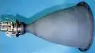](f/ps/r/r-40b_pic1.webp)|

**Notes:**

   1. Specs’re for nominal vacuum continuous thrust starting from the 2nd second after energizing the solenoid valves.
   1. [Промо‑спецификации ❐](f/ps/r/r-40_spec1.webp)
   1. <http://www.astronautix.com/r/r-40a.html>
   1. <http://www.astronautix.com/r/r-40b.html>
   1. <http://www.rocket.com/propulsion-systems/bipropellant-rockets>
   1. **Applicability** — Shuttle Orbiter orbit control (R-40A)

 

### R-42   ［US・2comp.］
**R-42** — 2‑component [engine](ps.md) by [Aerojet Rocketdyne](aerojet_rocketdyne.md).

|*[Characteristics](si.md)*|*R-42*|*R-42DM*|
|:-|:-|:-|
|Composition| | |
|Consumption, W|46 (for 28 V)|46 (for 28 V)|
|Dimensions, ㎜|790 × 390|790 × 390|
|[Interfaces](interface.md)| | |
|[Lifetime](lifetime.md)/Resource, h(y)|… / …|… / …|
|Mass, ㎏|4.53|4.53|
|[Overload](vibration.md), Grms| | |
|[Rad.resist](ion_rad.md), ㏉ (㎭)| | |
|[Reliability](qm.md) per [lifetime](lifetime.md)| | |
|[Thermal range](tcs.md), ℃| | |
|[TRL](trl.md)|9|9|
|[Voltage](sps.md), V| | |
|**【Specific】**|• • •|
|[Fuel](ps.md) (+ combustion products)|[NTO+MMH](nto_plus.md)|[NTO+Hydrazine](nto_plus.md) (H₂, H₂O, NH₃, N₂)|
|Fuel — components’ mass ratio| | |
|Fuel — consumption, ㎏/s, ≤|0.299.418|0.299.418|
|Fuel — resource, ㎏, ≥|8 100|8 100|
|Press. — comb. chamber, ㎫ (㍴)|0.72 (7.1)|0.72 (7.1)|
|Press. — eng. entrance, ㎫ (㍴)|0.7 ‑ 2.98 (6.9 ‑ 29.3)|0.7 ‑ 2.98 (6.9 ‑ 29.3)|
|Press. — nozzle cut, ㎫ (㍴)| | |
|Temper. — comb. chamber, К (℃)| | |
|Temper. — nozzle cut, К (℃)| | |
|Thrust, N (㎏f)|890 (90.7)|890 (90.7)|
|Thrust — duration of 1 thrust, s|… ‑ 3 940|… ‑ 3 940|
|Thrust — [Ing](ing.md), N·s (㎏f·s), ≤| | |
|Thrust — [Isp](ps.md), s (N·s/㎏), ≥|303 (2 970)|303 (2 970)|
|Thrust — switch. frequency, ㎐, ≤| | |
|Thrust — torch angle, °| | |
|Thrust — total pulses, ≥|134|134|
|Thrust — total thrust, N (㎏f), ≥|24 271 000 (2 474 100)|24 271 000 (2 474 100)|
|Thrust — total thrust, s (h), ≥|27 000|27 000|
|[Turbopump](turbopump.md) rate, rpm|—|—|
| |[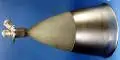](f/ps/r/r-42_pic1.webp)||

**Notes:**

   1. Specs’re for nominal vacuum continuous thrust starting from the 2nd second after energizing the solenoid valves.
   1. [Промо‑спецификации ❐](f/ps/r/r-42_spec1.webp)
   1. <http://www.astronautix.com/r/r-42.html>
   1. <http://www.rocket.com/propulsion-systems/bipropellant-rockets>
   1. **Applicability** — …

 

### RIT 2X   ［EU・el.］
**RIT 2X** — electric [engine](ps.md) by [OPC LAM](contact/opc_lam.md).

|*[Characteristics](si.md)*|*RIT 2X*|*RIT 2X*|*RIT 2X*|
|:-|:-|:-|:-|
|Composition| | | |
|Consumption, W|2 000 ‑ 2 500|4 000 ‑ 4 500|4 800 ‑ 5 300|
|Dimensions, ㎜|220 × ⌀330|220 × ⌀330|220 × ⌀330|
|[Interfaces](interface.md)| | | |
|[Lifetime](lifetime.md)/Resource, h(y)|… / …|… / …|… / …|
|Mass, ㎏|10|10|10|
|[Overload](vibration.md), Grms|8.1|8.1|8.1|
|[Rad.resist](ion_rad.md), ㏉ (㎭)| | | |
|[Reliability](qm.md) per [lifetime](lifetime.md)| | | |
|[Thermal range](tcs.md), ℃|−50 ‑ +190 for operation,  −60 ‑ +190 for storage|−50 ‑ +190 for operation,  −60 ‑ +190 for storage|−50 ‑ +190 for operation,  −60 ‑ +190 for storage|
|[TRL](trl.md)|9 **⁽¹⁾**|9 **⁽¹⁾**|9 **⁽¹⁾**|
|[Voltage](sps.md), V| | | |
|**【Specific】**|• • •|• • •|• • •|
|[Fuel](ps.md) (+ combustion products)|[Xenon](xenon.md)|[Xenon](xenon.md)|[Xenon](xenon.md)|
|Fuel — components’ mass ratio|—|—|—|
|Fuel — consumption, ㎏/s, ≤|0.000.002.098 ‑  0.000.002.562|0.000.004.664 ‑  0.000.004.980|0.000.008.238 ‑  0.000.007.969|
|Fuel — resource, ㎏, ≥|151.1 ‑ 184.53|335.83 ‑ 358.58|593.14 ‑ 573.81|
|Press. — comb. chamber, ㎫ (㍴)| | | |
|Press. — eng. entrance, ㎫ (㍴)| | | |
|Press. — nozzle cut, ㎫ (㍴)| | | |
|Temper. — comb. chamber, К (℃)| | | |
|Temper. — nozzle cut, К (℃)| | | |
|Thrust, N (㎏f)|0.070 ‑ 0.088  (0.0071 ‑ 0.0089)|0.151 ‑ 0.171  (0.0154 ‑ 0.0174)|0.198 ‑ 0.215  (0.0201 ‑ 0.0219)|
|Thrust — duration of 1 thrust, s|… ‑ … | | |
|Thrust — [Ing](ing.md), N·s (㎏f·s), ≤| | | |
|Thrust — [Isp](ps.md), s (N·s/㎏), ≥|3 400 ‑ 3 500  (33 350 ‑ 34 350)|3 300 ‑ 3 500  (32 350 ‑ 34 350)|2 450 ‑ 2 750  (24 400 ‑ 27 000)|
|Thrust — switch. frequency, ㎐, ≤| | | |
|Thrust — torch angle, °|25|25|25|
|Thrust — total pulses, ≥|10 000|10 000|10 000|
|Thrust — total thrust, N (㎏f), ≥|5 040 000 ‑ 6 335 000  (513 760 ‑ 645 870)|10 870 000 ‑ 12 310 000  (1 108 250 ‑ 1 255 000)|14 256 000 ‑ 15 480 000  (1 453 200 ‑ 1 577 982)|
|Thrust — total thrust, s (h), ≥|72 000 000 (20 000 h / 2.3 y)|72 000 000 (20 000 h / 2.3 y)|72 000 000 (20 000 h / 2.3 y)|
|[Turbopump](turbopump.md) rate, rpm|—|—|—|
| |[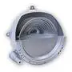](f/ps/r/rit_2x_ion_thruster.webp)|||

**Notes:**

   1. Specs’re for nominal vacuum continuous thrust starting from the 2nd second after energizing the solenoid valves.
   1. <http://www.space-propulsion.com/spacecraft-propulsion/propulsion-systems/electric-propulsion/index.html>
   1. **Applicability** — …

 

### RIT‑10   ［EU・el.］
**RIT 10 EVO** — electric [engine](ps.md) by [OPC LAM](contact/opc_lam.md).

|*[Characteristics](si.md)*|*RIT‑10*|*RIT‑10*|*RIT‑10*|
|:-|:-|:-|:-|
|Composition| | | |
|Consumption, W|145|435|760|
|Dimensions, ㎜|134 × ⌀186|134 × ⌀186|134 × ⌀186|
|[Interfaces](interface.md)| | | |
|[Lifetime](lifetime.md)/Resource, h(y)|… / …|… / …|… / …|
|Mass, ㎏|1.8|1.8|1.8|
|[Overload](vibration.md), Grms|22.9|22.9|22.9|
|[Rad.resist](ion_rad.md), ㏉ (㎭)| | | |
|[Reliability](qm.md) per [lifetime](lifetime.md)| | | |
|[Thermal range](tcs.md), ℃|−75 ‑ +140 for operation,  −85 ‑ +140 for storage|−75 ‑ +140 for operation,  −85 ‑ +140 for storage|−75 ‑ +140 for operation,  −85 ‑ +140 for storage|
|[TRL](trl.md)|9 **⁽¹⁾**|9 **⁽¹⁾**|9 **⁽¹⁾**|
|[Voltage](sps.md), V| | | |
|**【Specific】**|• • •|• • •|• • •|
|[Fuel](ps.md) (+ combustion products)|[Xenon](xenon.md)|[Xenon](xenon.md)|[Xenon](xenon.md)|
|Fuel — components’ mass ratio|—|—|—|
|Fuel — consumption, ㎏/s, ≤|0.000.000.268.254|0.000.000.509.683|0.000.000.796.381|
|Fuel — resource, ㎏, ≥|19.31|36.69|57.34|
|Press. — comb. chamber, ㎫ (㍴)| | | |
|Press. — eng. entrance, ㎫ (㍴)| | | |
|Press. — nozzle cut, ㎫ (㍴)| | | |
|Temper. — comb. chamber, К (℃)| | | |
|Temper. — nozzle cut, К (℃)| | | |
|Thrust, N (㎏f)|0.005 (0.0005)|0.015 (0.0015)|0.025 (0.0025)|
|Thrust — duration of 1 thrust, s|… ‑ … | | |
|Thrust — [Ing](ing.md), N·s (㎏f·s), ≤| | | |
|Thrust — [Isp](ps.md), s (N·s/㎏), ≥|1 900 (18 600)|3 000 (29 400)|3 200 (31 400)|
|Thrust — switch. frequency, ㎐, ≤| | | |
|Thrust — torch angle, °|15|15|15|
|Thrust — total pulses, ≥|10 000|10 000|10 000|
|Thrust — total thrust, N (㎏f), ≥|360 000 (36 700)|1 080 000 (110 100)|1 800 000 (184 000)|
|Thrust — total thrust, s (h), ≥|72 000 000 (20 000 h / 2.3 y)|72 000 000 (20 000 h / 2.3 y)|72 000 000 (20 000 h / 2.3 y)|
|[Turbopump](turbopump.md) rate, rpm|—|—|—|
| |[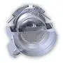](f/ps/r/rit_10_ion_thruster.webp)|||

**Notes:**

   1. Specs’re for nominal vacuum continuous thrust starting from the 2nd second after energizing the solenoid valves.
   1. <http://www.space-propulsion.com/spacecraft-propulsion/propulsion-systems/electric-propulsion/index.html>
   1. **Applicability** — …

 

### RIT µX   ［EU・el.］
**RIT µX** — electric [engine](ps.md) by [OPC LAM](contact/opc_lam.md).

|*[Characteristics](si.md)*|*RIT µX*|
|:-|:-|
|Composition| |
|Consumption, W|50|
|Dimensions, ㎜|76 × ⌀78|
|[Interfaces](interface.md)| |
|[Lifetime](lifetime.md)/Resource, h(y)|… / …|
|Mass, ㎏|0.44|
|[Overload](vibration.md), Grms|18.4|
|[Rad.resist](ion_rad.md), ㏉ (㎭)| |
|[Reliability](qm.md) per [lifetime](lifetime.md)| |
|[Thermal range](tcs.md), ℃|−40 ‑ +160 for operation, −60 ‑ +160 for storage|
|[TRL](trl.md)|9 **⁽¹⁾**|
|[Voltage](sps.md), V| |
|**【Specific】**|• • •|
|[Fuel](ps.md) (+ combustion products)|[Xenon](xenon.md)|
|Fuel — components’ mass ratio|—|
|Fuel — consumption, ㎏/s, ≤|0.000.000.016.989 ‑ 0.000.000.016.989|
|Fuel — resource, ㎏, ≥|1.223|
|Press. — comb. chamber, ㎫ (㍴)| |
|Press. — eng. entrance, ㎫ (㍴)| |
|Press. — nozzle cut, ㎫ (㍴)| |
|Temper. — comb. chamber, К (℃)| |
|Temper. — nozzle cut, К (℃)| |
|Thrust, N (㎏f)|0.00005 ‑ 0.0005 (0.00000509 ‑ 0.0000509)|
|Thrust — duration of 1 thrust, s|… ‑ … |
|Thrust — [Ing](ing.md), N·s (㎏f·s), ≤| |
|Thrust — [Isp](ps.md), s (N·s/㎏), ≥|300 ‑ 3 000 (2 943 ‑ 29 430)|
|Thrust — switch. frequency, ㎐, ≤| |
|Thrust — torch angle, °|17|
|Thrust — total pulses, ≥|10 000|
|Thrust — total thrust, N (㎏f), ≥|3 600 ‑ 36 000|
|Thrust — total thrust, s (h), ≥|72 000 000 (20 000 h / 2.3 y)|
|[Turbopump](turbopump.md) rate, rpm|—|
| |[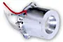](f/ps/r/rit_micro_ion_thruster.webp)|

**Notes:**

   1. Specs’re for nominal vacuum continuous thrust starting from the 2nd second after energizing the solenoid valves.
   1. <http://www.space-propulsion.com/spacecraft-propulsion/propulsion-systems/electric-propulsion/index.html>
   1. **Applicability** — …

 

### RS-25   ［US・2comp.］
**RS-25** or **SSME** (Space Shuttle Main Engine) — 2‑component [engine](ps.md) by [Aerojet Rocketdyne](aerojet_rocketdyne.md). Designed in 1972.

|*[Characteristics](si.md)*|*RS-25*|
|:-|:-|
|Composition| |
|Consumption, W| |
|Dimensions, ㎜|4 240 × 2 400|
|[Interfaces](interface.md)| |
|[Lifetime](lifetime.md)/Resource, h(y)|… / …|
|Mass, ㎏|3 390|
|[Overload](vibration.md), Grms| |
|[Rad.resist](ion_rad.md), ㏉ (㎭)| |
|[Reliability](qm.md) per [lifetime](lifetime.md)| |
|[Thermal range](tcs.md), ℃| |
|[TRL](trl.md)|9|
|[Voltage](sps.md), V| |
|**【Specific】**|• • •|
|[Fuel](ps.md) (+ combustion products)|[O+H](o_plus.md) (H₂, H₂O)|
|Fuel — components’ mass ratio| |
|Fuel — consumption, ㎏/s, ≤|493.5|
|Fuel — resource, ㎏, ≥| |
|Press. — comb. chamber, ㎫ (㍴)|18.9 (192.7)|
|Press. — eng. entrance, ㎫ (㍴)| |
|Press. — nozzle cut, ㎫ (㍴)| |
|Temper. — comb. chamber, К (℃)|3 573 (3 300)|
|Temper. — nozzle cut, К (℃)| |
|Thrust, N (㎏f)|1 192 250 ‑ 1 779 500 ‑ 1 939 650 (121 530 ‑ 181 400 ‑ 197 720) sea lvl;  1 462 600 ‑ 2 183 000 ‑ 2 379 500 (149 100 ‑ 222 600 ‑ 242 550) vacuum|
|Thrust — duration of 1 thrust, s|… ‑ … |
|Thrust — [Ing](ing.md), N·s (㎏f·s), ≤| |
|Thrust — [Isp](ps.md), s (N·s/㎏), ≥|363 (…) sea lvl; 453 (…) vacuum|
|Thrust — switch. frequency, ㎐, ≤| |
|Thrust — torch angle, °| |
|Thrust — total pulses, ≥| |
|Thrust — total thrust, N (㎏f), ≥| |
|Thrust — total thrust, s (h), ≥|520|
|[Turbopump](turbopump.md) rate, rpm| |
| |[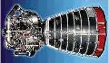](f/ps/r/rs-25.webp)|

**Notes:**

   1. Specs’re for nominal vacuum continuous thrust starting from the 2nd second after energizing the solenoid valves.
   1. <http://www.astronautix.com/s/ssme.html>
   1. <https://en.wikipedia.org/wiki/Space_Shuttle_main_engine>
   1. **Applicability** — …

 

### S10   ［EU・2comp.］
**S10** — 2‑component [engine](ps.md) by [OPC LAM](contact/opc_lam.md). Designed in 1975.

|*[Characteristics](si.md)*|*S10‑13*|*S10‑18*|*S10‑26*|
|:-|:-|:-|:-|
|Composition| | | |
|Consumption, W|24|24|24|
|Dimensions, ㎜| | | |
|[Interfaces](interface.md)| | | |
|[Lifetime](lifetime.md)/Resource, h(y)|… / …|… / …|… / …|
|Mass, ㎏|0.35 (SST) or 0.65 (DST)|0.35 (SST) or 0.65 (DST)|0.35 (SST) or 0.65 (DST)|
|[Overload](vibration.md), Grms| | | |
|[Rad.resist](ion_rad.md), ㏉ (㎭)| | | |
|[Reliability](qm.md) per [lifetime](lifetime.md)| | | |
|[Thermal range](tcs.md), ℃| | | |
|[TRL](trl.md)|9|9|9|
|[Voltage](sps.md), V| | | |
|**【Specific】**|• • •|• • •|• • •|
|[Fuel](ps.md) (+ combustion products)|[NTO (MON‑1, ‑3) + MMH](nto_plus.md)|[NTO (MON‑1, ‑3) + MMH](nto_plus.md)|[NTO (MON‑1, ‑3) + MMH](nto_plus.md)|
|Fuel — components’ mass ratio|1.65 (1.2 ‑ 2.1)|1.65 (1.2 ‑ 2.1)|1.65 (1.2 ‑ 2.1)|
|Fuel — consumption, ㎏/s, ≤|0.003.490 (0.0023 ‑ 0.0042)|0.003.490 (0.0023 ‑ 0.0042)|0.003.490 (0.0023 ‑ 0.0042)|
|Fuel — resource, ㎏, ≥|870|870|870|
|Press. — comb. chamber, ㎫ (㍴)|0.91 (9)|0.91 (9)|0.91 (9)|
|Press. — eng. entrance, ㎫ (㍴)|1.01 ‑ 2.34 (10 ‑ 23)|1.01 ‑ 2.34 (10 ‑ 23)|1.01 ‑ 2.34 (10 ‑ 23)|
|Press. — nozzle cut, ㎫ (㍴)| | | |
|Temper. — comb. chamber, К (℃)| | | |
|Temper. — nozzle cut, К (℃)| | | |
|Thrust, N (㎏f)|6 ‑ 10 ‑ 12.5 (0.6 ‑ 1 ‑ 1.27)|6 ‑ 10 ‑ 12.5 (0.6 ‑ 1 ‑ 1.27)|6 ‑ 10 ‑ 12.5 (0.6 ‑ 1 ‑ 1.27)|
|Thrust — duration of 1 thrust, s|… ‑ 28 800|… ‑ 28 800|… ‑ 28 800|
|Thrust — [Ing](ing.md), N·s (㎏f·s), ≤| | | |
|Thrust — [Isp](ps.md), s (N·s/㎏), ≥|292 (2 860)|292 (2 860)|292 (2 860)|
|Thrust — switch. frequency, ㎐, ≤| | | |
|Thrust — torch angle, °| | | |
|Thrust — total pulses, ≥|1 000 000|1 000 000|1 000 000|
|Thrust — total thrust, N (㎏f), ≥|2 484 000 (253 200)|2 484 000 (253 200)|2 484 000 (253 200)|
|Thrust — total thrust, s (h), ≥|248 400|248 400|248 400|
|[Turbopump](turbopump.md) rate, rpm|—|—|—|
| |[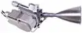](f/ps/s/s10-13_pic1.webp)|[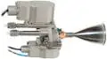](f/ps/s/s10-18_pic1.webp)|[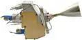](f/ps/s/s10-26_pic1.webp)|

**Notes:**

   1. Specs’re for nominal vacuum continuous thrust starting from the 2nd second after energizing the solenoid valves.
   1. [Products brochures ❐](f/contact/o/opc_lam_brochures.7z)
   1. <http://www.space-propulsion.com/spacecraft-propulsion/bipropellant-thrusters/10-bipropellant-thrusters.html> — [archived ❐](f/ps/s/s10_site.pdf) 2019.02.21
   1. Modifications:
      - **S10-13** w/ single seat, monostable, torque motor valve from a US supplier.
      - **S10-18** w/ dual seat valve, comprising an upstream latch valve & a downstream monostable valve from a US supplier.
      - **S10-26** w/ dual seat valve, comprising an upstream latch valve & a downstream monostable valve supplied by ArianeGroup, DE.
   1. **[1]** — see <mark>TBD</mark>
   1. **Applicability** — …

 

### S5.86   ［RU・2comp.］
**S5.86** (ru. **С5.86**, also **КМД** (кислородно‑метановый двигатель) — 2‑component [engine](ps.md) by [KBHM](contact/kbhm.md)

|*[Characteristics](si.md)*|*S5.86*|
|:-|:-|
|Composition| |
|Consumption, W| |
|Dimensions, ㎜| |
|[Interfaces](interface.md)| |
|[Lifetime](lifetime.md)/Resource, h(y)|… / …|
|Mass, ㎏| |
|[Overload](vibration.md), Grms| |
|[Rad.resist](ion_rad.md), ㏉ (㎭)| |
|[Reliability](qm.md) per [lifetime](lifetime.md)| |
|[Thermal range](tcs.md), ℃| |
|[TRL](trl.md)|5 **⁽¹⁾**|
|[Voltage](sps.md), V| |
|**【Specific】**|• • •|
|[Fuel](ps.md) (+ combustion products)|[O+Methane](o_plus.md) **⁽¹⁾** (H₂, H₂O, CO, CO₂)|
|Fuel — components’ mass ratio| |
|Fuel — consumption, ㎏/s, ≤|20.268|
|Fuel — resource, ㎏, ≥| |
|Press. — comb. chamber, ㎫ (㍴)| |
|Press. — eng. entrance, ㎫ (㍴)| |
|Press. — nozzle cut, ㎫ (㍴)| |
|Temper. — comb. chamber, К (℃)| |
|Temper. — nozzle cut, К (℃)| |
|Thrust, N (㎏f)|73 575 (7 500) **⁽¹⁾**|
|Thrust — duration of 1 thrust, s|… ‑ … |
|Thrust — [Ing](ing.md), N·s (㎏f·s), ≤| |
|Thrust — [Isp](ps.md), s (N·s/㎏), ≥|370 (3 630) **⁽¹⁾**|
|Thrust — switch. frequency, ㎐, ≤| |
|Thrust — torch angle, °| |
|Thrust — total pulses, ≥| |
|Thrust — total thrust, N (㎏f), ≥| |
|Thrust — total thrust, s (h), ≥| |
|[Turbopump](turbopump.md) rate, rpm|—|

**Notes:**

   1. Specs’re for nominal vacuum continuous thrust starting from the 2nd second after energizing the solenoid valves.
   1. **[1]** — see [KBHM](contact/kbhm.md) site, 2016 y.
   1. **Applicability** — …

 

### S5.92   ［RU・2comp.］
**S5.92** (ru. **С5.92**) — 2‑component [engine](ps.md) by [KBHM](contact/kbhm.md)

|*[Characteristics](si.md)*|*S5.92, high thrust*|*S5.92, low thrust*|
|:-|:-|:-|
|Composition| | |
|Consumption, W| | |
|Dimensions, ㎜|677 × 838 × 1028 **⁽¹⁾**|677 × 838 × 1028 **⁽¹⁾**|
|[Interfaces](interface.md)| | |
|[Lifetime](lifetime.md)/Resource, h(y)|300 **⁽¹⁾** / …|300 **⁽¹⁾** / …|
|Mass, ㎏|75 **⁽¹⁾**|75 **⁽¹⁾**|
|[Overload](vibration.md), Grms| | |
|[Rad.resist](ion_rad.md), ㏉ (㎭)| | |
|[Reliability](qm.md) per [lifetime](lifetime.md)| | |
|[Thermal range](tcs.md), ℃| | |
|[TRL](trl.md)|9 **⁽¹⁾**|9 **⁽¹⁾**|
|[Voltage](sps.md), V| | |
|**【Specific】**|• • •|• • •|
|[Fuel](ps.md) (+ combustion products)|[NTO+UDMH](nto_plus.md) **⁽¹⁾** (H₂, H₂O, CO, CO₂, N₂)|[NTO+UDMH](nto_plus.md) **⁽¹⁾** (H₂, H₂O, CO, CO₂, N₂)|
|Fuel — components’ mass ratio|1.95 ‑ 2.05|2 ‑ 2.1|
|Fuel — consumption, ㎏/s, ≤|6.115.960|4.430.322|
|Fuel — resource, ㎏, ≥|12 230|8 860|
|Press. — comb. chamber, ㎫ (㍴)|9.8 (98) **⁽¹⁾**|6.85 (58.5) **⁽¹⁾**|
|Press. — eng. entrance, ㎫ (㍴)|0.6 ‑ 0.8 (6 ‑ 8)|0.6 ‑ 0.8 (6 ‑ 8)|
|Press. — nozzle cut, ㎫ (㍴)| | |
|Temper. — comb. chamber, К (℃)| | |
|Temper. — nozzle cut, К (℃)| | |
|Thrust, N (㎏f)|19 620 (2 000) **⁽¹⁾**|13 734 (1 400) **⁽¹⁾**|
|Thrust — duration of 1 thrust, s|… ‑ … | |
|Thrust — [Ing](ing.md), N·s (㎏f·s), ≤| | |
|Thrust — [Isp](ps.md), s (N·s/㎏), ≥|327 (3 208) **⁽¹⁾**|316 (3 100) **⁽¹⁾**|
|Thrust — switch. frequency, ㎐, ≤|1 pulse/6 min **⁽¹⁾** (max pause 300 d)|1 pulse/6 min **⁽¹⁾** (max pause 300 d)|
|Thrust — torch angle, °| | |
|Thrust — total pulses, ≥|50 **⁽¹⁾**|50 **⁽¹⁾**|
|Thrust — total thrust, N (㎏f), ≥|39 200 000 (4 000 000)|27 400 000 (2 800 000)|
|Thrust — total thrust, s (h), ≥|2 000 **⁽¹⁾**|2 000 **⁽¹⁾**|
|[Turbopump](turbopump.md) rate, rpm|58 000|43 000|

**Notes:**

   1. Specs’re for nominal vacuum continuous thrust starting from the 2nd second after energizing the solenoid valves.
   1. **[1]** — see [KBHM](contact/kbhm.md) site, 2016 y.
   1. Turbopump consumes 4 ㎏ of fuel for the start, 5.5 — for the stop.
   1. **Applicability** — [Fregat](fregat.md) & MDU (regular main engine)・ [Fobos-Grunt](фобос_грунт.md) (as a part of MDU)

 

### S5.120   ［RU・2comp.］
**S5.120** (ru. **С5.120**) — 2‑component [engine](ps.md) by [KBHM](contact/kbhm.md)

|*[Characteristics](si.md)*|*S5.120*|
|:-|:-|
|Composition| |
|Consumption, W| |
|Dimensions, ㎜|820 × 440|
|[Interfaces](interface.md)| |
|[Lifetime](lifetime.md)/Resource, h(y)|… / …|
|Mass, ㎏|30 **⁽¹⁾**|
|[Overload](vibration.md), Grms| |
|[Rad.resist](ion_rad.md), ㏉ (㎭)| |
|[Reliability](qm.md) per [lifetime](lifetime.md)| |
|[Thermal range](tcs.md), ℃| |
|[TRL](trl.md)|9|
|[Voltage](sps.md), V| |
|**【Specific】**|• • •|
|[Fuel](ps.md) (+ combustion products)|[NTO+UDMH](nto_plus.md) (H₂, H₂O, CO, CO₂, N₂)|
|Fuel — components’ mass ratio| |
|Fuel — consumption, ㎏/s, ≤|1.967.213|
|Fuel — resource, ㎏, ≥| |
|Press. — comb. chamber, ㎫ (㍴)| |
|Press. — eng. entrance, ㎫ (㍴)| |
|Press. — nozzle cut, ㎫ (㍴)| |
|Temper. — comb. chamber, К (℃)| |
|Temper. — nozzle cut, К (℃)| |
|Thrust, N (㎏f)|5 886 (600)|
|Thrust — duration of 1 thrust, s|… ‑ … |
|Thrust — [Ing](ing.md), N·s (㎏f·s), ≤| |
|Thrust — [Isp](ps.md), s (N·s/㎏), ≥|305 (2 983)|
|Thrust — switch. frequency, ㎐, ≤| |
|Thrust — torch angle, °| |
|Thrust — total pulses, ≥|10|
|Thrust — total thrust, N (㎏f), ≥| |
|Thrust — total thrust, s (h), ≥| |
|[Turbopump](turbopump.md) rate, rpm|—|

**Notes:**

   1. Specs’re for nominal vacuum continuous thrust starting from the 2nd second after energizing the solenoid valves.
   1. <http://lpre.de/kbhm/index.htm>
   1. **[1]** — expert review.
   1. **Applicability** — «Аргон» («Zenith‑6U»)・ Upper-stage «Курьер» (1998 y)

 

### S5.140   ［RU・2comp.］
**S5.140** (ru. **С5.140**, also **ДМТ-6**) — 2‑component [engine](ps.md) by [KBHM](contact/kbhm.md)

|*[Characteristics](si.md)*|*S5.140*|*DMT-6*|
|:-|:-|:-|
|Composition| | |
|Consumption, W|15.8|15.8|
|Dimensions, ㎜|200 × 26.6 **⁽¹⁾**| |
|[Interfaces](interface.md)| | |
|[Lifetime](lifetime.md)/Resource, h(y)|60 **⁽¹⁾** / 87 600 (10)|… / 87 600 (10)|
|Mass, ㎏|0.95 **⁽¹⁾**|0.9 **⁽²⁾**|
|[Overload](vibration.md), Grms| | |
|[Rad.resist](ion_rad.md), ㏉ (㎭)| | |
|[Reliability](qm.md) per [lifetime](lifetime.md)| | |
|[Thermal range](tcs.md), ℃| | |
|[TRL](trl.md)|6 **⁽¹⁾**|3 **⁽²⁾**|
|[Voltage](sps.md), V|27±3|27±3|
|**【Specific】**|• • •|• • •|
|[Fuel](ps.md) (+ combustion products)|[NTO+UDMH](nto_plus.md) **⁽¹ ²⁾** (H₂, H₂O, CO, CO₂, N₂)|[NTO+UDMH](nto_plus.md) **⁽¹ ²⁾** (H₂, H₂O, CO, CO₂, N₂)|
|Fuel — components’ mass ratio|1.838 ± 0.097 **⁽¹⁾**|1.85 **⁽²⁾**|
|Fuel — consumption, ㎏/s, ≤|0.002.354.435|0.002.446.483|
|Fuel — resource, ㎏, ≥|11|48|
|Press. — comb. chamber, ㎫ (㍴)|0.647 (6.6) **⁽¹⁾**|0.62 (6.3) **⁽²⁾**|
|Press. — eng. entrance, ㎫ (㍴)|1.47 (15) **⁽¹⁾**|1.2 (12) **⁽²⁾**|
|Press. — nozzle cut, ㎫ (㍴)|0.000296 (0.00302) **⁽¹⁾**| |
|Temper. — comb. chamber, К (℃)|1 900 (1 700) **⁽¹⁾**| |
|Temper. — nozzle cut, К (℃)|600 (330) **⁽¹⁾**| |
|Thrust, N (㎏f)|6.19±0.143 (0.631±0.015) **⁽¹⁾**|6 (0.6) **⁽²⁾**|
|Thrust — duration of 1 thrust, s|0.045 ‑ 100 **⁽¹⁾**|0.045 ‑ 150 **⁽²⁾**|
|Thrust — [Ing](ing.md), N·s (㎏f·s), ≤|0.294 (0.03) **⁽¹⁾**| |
|Thrust — [Isp](ps.md), s (N·s/㎏), ≥|268.4±15.4 (2 633±151) **⁽¹⁾**|250 (2 452) **⁽²⁾**|
|Thrust — switch. frequency, ㎐, ≤|10.5 **⁽¹⁾**| |
|Thrust — torch angle, °| | |
|Thrust — total pulses, ≥|30 000 **⁽¹⁾**|300 000 **⁽²⁾**|
|Thrust — total thrust, N (㎏f), ≥|29 000|118 000|
|Thrust — total thrust, s (h), ≥|4 700 **⁽¹⁾**|20 000 **⁽²⁾**|
|[Turbopump](turbopump.md) rate, rpm|—|—|

**Notes:**

   1. Specs’re for nominal vacuum continuous thrust starting from the 2nd second after energizing the solenoid valves.
   1. **[1,2]** — see Specification & [KBHM](contact/kbhm.md) site, 2016 y.
   1. They put forward requirements for fuel degassing. They work poorly with [CINU](cinu.md).
   1. The angular deviation of the axis of the nozzle relative to the base longitudinal axis is ≤ 30 ".
   1. **Applicability** — [Luna‑25](луна_25.md)・ [Luna‑27](луна_27.md)

 

### S5.142   ［RU・2comp.］
**S5.142** (ru. **С5.142**) — 2‑component [engine](ps.md) by [KBHM](contact/kbhm.md)

|*[Characteristics](si.md)*|*S5.142*|*DST-25*|
|:-|:-|:-|
|Composition| | |
|Consumption, W|15.8|15.8|
|Dimensions, ㎜| | |
|[Interfaces](interface.md)| | |
|[Lifetime](lifetime.md)/Resource, h(y)|… / …|… / …|
|Mass, ㎏|0.9|0.9 **⁽¹⁾**|
|[Overload](vibration.md), Grms| | |
|[Rad.resist](ion_rad.md), ㏉ (㎭)| | |
|[Reliability](qm.md) per [lifetime](lifetime.md)| | |
|[Thermal range](tcs.md), ℃| | |
|[TRL](trl.md)|9 **⁽¹⁾**|9 **⁽¹⁾**|
|[Voltage](sps.md), V| | |
|**【Specific】**|• • •|• • •|
|[Fuel](ps.md) (+ combustion products)|[NTO+UDMH](nto_plus.md) **⁽¹⁾** (H₂, H₂O, CO, CO₂, N₂)|[NTO+UDMH](nto_plus.md) **⁽¹⁾** (H₂, H₂O, CO, CO₂, N₂)|
|Fuel — components’ mass ratio| |1.85 **⁽¹⁾**|
|Fuel — consumption, ㎏/s, ≤|0.008.762.988・ 0.008.324.838|0.008.973.309|
|Fuel — resource, ㎏, ≥|208|220|
|Press. — comb. chamber, ㎫ (㍴)|0.78 (8)|0.8 (8) **⁽¹⁾**|
|Press. — eng. entrance, ㎫ (㍴)|1.47 (15)|1.5 (10.5) **⁽¹⁾**|
|Press. — nozzle cut, ㎫ (㍴)| | |
|Temper. — comb. chamber, К (℃)|3 300 ‑ 3 800 (3 000 ‑ 3 500)|3 300 ‑ 3 800 (3 000 ‑ 3 500)|
|Temper. — nozzle cut, К (℃)| | |
|Thrust, N (㎏f)|24.5 (2.5)|25 (2.5) **⁽¹⁾**|
|Thrust — duration of 1 thrust, s|0.03 ‑ 4 000|0.03 ‑ 4 000 **⁽¹⁾**|
|Thrust — [Ing](ing.md), N·s (㎏f·s), ≤| | |
|Thrust — [Isp](ps.md), s (N·s/㎏), ≥|285 (2 803)・ 300 (2 943) **⁽²⁾**|284 (2 790) **⁽¹⁾**|
|Thrust — switch. frequency, ㎐, ≤| | |
|Thrust — torch angle, °| | |
|Thrust — total pulses, ≥|100 000|300 000 **⁽¹⁾**|
|Thrust — total thrust, N (㎏f), ≥|582 000・ 613 000|613 000|
|Thrust — total thrust, s (h), ≥|25 000|25 000 **⁽¹⁾**|
|[Turbopump](turbopump.md) rate, rpm|—|—|

**Notes:**

   1. Specs’re for nominal vacuum continuous thrust starting from the 2nd second after energizing the solenoid valves.
   1. **[1]** — see [KBHM](contact/kbhm.md) site, 2016 год.
   1. **[2]** — can be achieved by modernization by increasing the pressure by 10 atm.
   1. They put forward requirements for fuel degassing. They work poorly with [CINU](cinu.md).
   1. **Applicability** — Soyuz‑TMA

 

### S5.144   ［RU・2comp.］
**S5.144** (ru. **С5.144**) — 2‑component [engine](ps.md) by [KBHM](contact/kbhm.md)

|*[Characteristics](si.md)*|*S5.144*|*DST-100*|*DST-100A*|
|:-|:-|:-|:-|
|Composition| | | |
|Consumption, W|34.2|34.2|34.2|
|Dimensions, ㎜| | | |
|[Interfaces](interface.md)| | | |
|[Lifetime](lifetime.md)/Resource, h(y)|… / …|… / …|… / …|
|Mass, ㎏|1.5|1.1 **⁽¹⁾**|1.5 **⁽¹⁾**|
|[Overload](vibration.md), Grms| | | |
|[Rad.resist](ion_rad.md), ㏉ (㎭)| | | |
|[Reliability](qm.md) per [lifetime](lifetime.md)| | | |
|[Thermal range](tcs.md), ℃| | | |
|[TRL](trl.md)|9 **⁽¹⁾**|9 **⁽¹⁾**|9 **⁽¹⁾**|
|[Voltage](sps.md), V| | | |
|**【Specific】**|• • •|• • •|• • •|
|[Fuel](ps.md) (+ combustion products)|[NTO+UDMH](nto_plus.md) **⁽¹⁾**  (H₂, H₂O, CO, CO₂, N₂)|[NTO+UDMH](nto_plus.md) **⁽¹⁾**  (H₂, H₂O, CO, CO₂, N₂)|[NTO+UDMH](nto_plus.md) **⁽¹⁾**  (H₂, H₂O, CO, CO₂, N₂)|
|Fuel — components’ mass ratio|1.85 **⁽¹⁾**|1.85 **⁽¹⁾**|1.85 **⁽¹⁾**|
|Fuel — consumption, ㎏/s, ≤|0.033.141・ 0.032.259|0.036.968|0.033.557|
|Fuel — resource, ㎏, ≥|1 610|371|1 680|
|Press. — comb. chamber, ㎫ (㍴)|0.74 (7.5)|1.5 (15) **⁽¹⁾**|0.77 (7.7) **⁽¹⁾**|
|Press. — eng. entrance, ㎫ (㍴)|1.81 (18.5)|2.5 (25) **⁽¹⁾**|1.6 (16) **⁽¹⁾**|
|Press. — nozzle cut, ㎫ (㍴)| | | |
|Temper. — comb. chamber, К (℃)|3 300 ‑ 3 800 (3 000 ‑ 3 500)|3 300 ‑ 3 800 (3 000 ‑ 3 500)|3 300 ‑ 3 800 (3 000 ‑ 3 500)|
|Temper. — nozzle cut, К (℃)| | | |
|Thrust, N (㎏f)|98.1 (10.0)|100 (10.2) **⁽¹⁾**|100 (10.2) **⁽¹⁾**|
|Thrust — duration of 1 thrust, s|0.03 ‑ 2 500|0.05 ‑ 300 **⁽¹⁾**|0.05 ‑ 4 000 **⁽¹⁾**|
|Thrust — [Ing](ing.md), N·s (㎏f·s), ≤| | | |
|Thrust — [Isp](ps.md), s (N·s/㎏), ≥|302 (2 960)・ 310 (3 041) **⁽²⁾**|275 (2 705) **⁽¹⁾**|303 (2 980) **⁽¹⁾**|
|Thrust — switch. frequency, ㎐, ≤| | | |
|Thrust — torch angle, °| | | |
|Thrust — total pulses, ≥|450 000|10 000 **⁽¹⁾**|450 000 **⁽¹⁾**|
|Thrust — total thrust, N (㎏f), ≥|4 770 000・ 4 900 000|1 001 000|5 000 000|
|Thrust — total thrust, s (h), ≥|50 000|10 000 **⁽¹⁾**|50 000 **⁽¹⁾**|
|[Turbopump](turbopump.md) rate, rpm|—|—|—|

**Notes:**

   1. Specs’re for nominal vacuum continuous thrust starting from the 2nd second after energizing the solenoid valves.
   1. **[1]** — see [KBHM](contact/kbhm.md) site, 2016 y.
   1. **[2]** — can be achieved by modernization by increasing the pressure by 10 atm.
   1. They put forward requirements for fuel degassing. They work poorly with [CINU](cinu.md).
   1. **Applicability** — S5.144 — ISS in 2016 ‑ 2018.

 

### S5.145   ［RU・2comp.］
**S5.145** (ru. **С5.145**) — 2‑component [engine](ps.md) by [KBHM](contact/kbhm.md)

|*[Characteristics](si.md)*|*S5.145*|*DST-50*|
|:-|:-|:-|
|Composition| | |
|Consumption, W|15.8|15.8|
|Dimensions, ㎜|280 × 102.25 **⁽¹⁾**| |
|[Interfaces](interface.md)| | |
|[Lifetime](lifetime.md)/Resource, h(y)|60 **⁽¹⁾** / …|… / …|
|Mass, ㎏|1.3 **⁽¹⁾**|1.1 **⁽²⁾**|
|[Overload](vibration.md), Grms| | |
|[Rad.resist](ion_rad.md), ㏉ (㎭)| | |
|[Reliability](qm.md) per [lifetime](lifetime.md)| | |
|[Thermal range](tcs.md), ℃| | |
|[TRL](trl.md)|6 **⁽¹⁾**|3 **⁽²⁾**|
|[Voltage](sps.md), V| | |
|**【Specific】**|• • •|• • •|
|[Fuel](ps.md) (+ combustion products)|[NTO+UDMH](nto_plus.md) **⁽¹ ²⁾** (H₂, H₂O, CO, CO₂, N₂)|[NTO+UDMH](nto_plus.md) **⁽¹ ²⁾** (H₂, H₂O, CO, CO₂, N₂)|
|Fuel — components’ mass ratio|1.85 ± 0.05 **⁽¹ ²⁾**|1.85 ± 0.05 **⁽¹ ²⁾**|
|Fuel — consumption, ㎏/s, ≤|0.017.686|0.017.574|
|Fuel — resource, ㎏, ≥|177|439|
|Press. — comb. chamber, ㎫ (㍴)|0.775 (7.6) **⁽¹⁾**|0.75 (7.5) **⁽²⁾**|
|Press. — eng. entrance, ㎫ (㍴)|1.47 (15) **⁽¹⁾**|1.5 (15) **⁽²⁾**|
|Press. — nozzle cut, ㎫ (㍴)|0.000179 (0.00176) **⁽¹⁾**| |
|Temper. — comb. chamber, К (℃)|2 500 (2 300) **⁽¹⁾**| |
|Temper. — nozzle cut, К (℃)|600 (330) **⁽¹⁾**| |
|Thrust, N (㎏f)|52.9 (5.4) **⁽¹⁾**|50 (5.1) **⁽²⁾**|
|Thrust — duration of 1 thrust, s|0.045 ‑ 3 000 **⁽¹⁾**|0.03 ‑ 4 000 **⁽²⁾**|
|Thrust — [Ing](ing.md), N·s (㎏f·s), ≤|0.75 ‑ 2.34 (0.076 ‑ 0.239) **⁽¹⁾**| |
|Thrust — [Isp](ps.md), s (N·s/㎏), ≥|305±2 (2 991±15) **⁽¹⁾**|290 (2 845)|
|Thrust — switch. frequency, ㎐, ≤|10.5 **⁽¹⁾**| |
|Thrust — torch angle, °| | |
|Thrust — total pulses, ≥|20 000 **⁽¹⁾**|300 000 **⁽²⁾**|
|Thrust — total thrust, N (㎏f), ≥|530 000|1 250 000|
|Thrust — total thrust, s (h), ≥|10 000 **⁽¹⁾**|25 000|
|[Turbopump](turbopump.md) rate, rpm|—|—|

**Notes:**

   1. Specs’re for nominal vacuum continuous thrust starting from the 2nd second after energizing the solenoid valves.
   1. **[1,2]** — see Specification & [KBHM](contact/kbhm.md) site, 2016 y.
   1. They put forward requirements for fuel degassing. They work poorly with [CINU](cinu.md).
   1. The angular deviation of the axis of the nozzle relative to the base longitudinal axis is ≤ 30 ".
   1. **Applicability** — [Luna‑25](луна_25.md)・ [Luna‑27](луна_27.md)

 

### S5.146   ［RU・2comp.］
**S5.146** (ru. **С5.146**) — 2‑component [engine](ps.md) by [KBHM](contact/kbhm.md).

|*[Characteristics](si.md)*|*S5.146*|*DST-200*|*DST-200A*|
|:-|:-|:-|:-|
|Composition| | | |
|Consumption, W|34.2|21.6|34.2|
|Dimensions, ㎜| | | |
|[Interfaces](interface.md)| | | |
|[Lifetime](lifetime.md)/Resource, h(y)|… / …|… / …|… / …|
|Mass, ㎏|1.7|1.3 **⁽¹⁾**|1.7 **⁽¹⁾**|
|[Overload](vibration.md), Grms| | | |
|[Rad.resist](ion_rad.md), ㏉ (㎭)| | | |
|[Reliability](qm.md) per [lifetime](lifetime.md)| | | |
|[Thermal range](tcs.md), ℃| | | |
|[TRL](trl.md)|9 **⁽¹⁾**|9 **⁽¹⁾**|9 **⁽¹⁾**|
|[Voltage](sps.md), V| | | |
|**【Specific】**|• • •|• • •|
|[Fuel](ps.md) (+ combustion products)|[NTO+UDMH](nto_plus.md) **⁽¹⁾**  (H₂, H₂O, CO, CO₂, N₂)|[NTO+UDMH](nto_plus.md) **⁽¹⁾**  (H₂, H₂O, CO, CO₂, N₂)|[NTO+UDMH](nto_plus.md) **⁽¹⁾**  (H₂, H₂O, CO, CO₂, N₂)|
|Fuel — components’ mass ratio|1.85 **⁽¹⁾**|1.85 **⁽¹⁾**|1.85 **⁽¹⁾**|
|Fuel — consumption, ㎏/s, ≤|0.065.139・ 0.063.495|0.072.727|0.068.027|
|Fuel — resource, ㎏, ≥|1 270|364|682|
|Press. — comb. chamber, ㎫ (㍴)|0.74 (7.5)|1.5 (15) **⁽¹⁾**|0.7 (7) **⁽¹⁾**|
|Press. — eng. entrance, ㎫ (㍴)|1.81 (18.5)|2.5 (25) **⁽¹⁾**|1.6 (16) **⁽¹⁾**|
|Press. — nozzle cut, ㎫ (㍴)| | | |
|Temper. — comb. chamber, К (℃)|3 300 ‑ 3 800 (3 000 ‑ 3 500)|3 300 ‑ 3 800 (3 000 ‑ 3 500)|3 300 ‑ 3 800 (3 000 ‑ 3 500)|
|Temper. — nozzle cut, К (℃)| | | |
|Thrust, N (㎏f)|196.2 (20.0)|200 (20.4) **⁽¹⁾**|200 (20.4) **⁽¹⁾**|
|Thrust — duration of 1 thrust, s|0.03 ‑ 2 500|0.05 ‑ 300 **⁽¹⁾**|0.05 ‑ 4 000 **⁽¹⁾**|
|Thrust — [Ing](ing.md), N·s (㎏f·s), ≤| | | |
|Thrust — [Isp](ps.md), s (N·s/㎏), ≥|307 (3 012)・ 315 (3 090) **⁽²⁾**|280 (2 750) **⁽¹⁾**|299 (2 940) **⁽¹⁾**|
|Thrust — switch. frequency, ㎐, ≤| | | |
|Thrust — torch angle, °| | | |
|Thrust — total pulses, ≥|45 000|10 000 **⁽¹⁾**|100 000 **⁽¹⁾**|
|Thrust — total thrust, N (㎏f), ≥|3 830 000・ 3 930 000|1 000 000|2 000 000|
|Thrust — total thrust, s (h), ≥|20 000|5 000 **⁽¹⁾**|10 000 **⁽¹⁾**|
|[Turbopump](turbopump.md) rate, rpm|—|—|—|

**Notes:**

   1. Specs’re for nominal vacuum continuous thrust starting from the 2nd second after energizing the solenoid valves.
   1. **[1]** — see [KBHM](contact/kbhm.md) site, 2016 y.
   1. **[2]** — can be achieved by upgrading.
   1. They put forward requirements for fuel degassing. They work poorly with [CINU](cinu.md).
   1. **Applicability** — С5.146 — ISS in 2016 ‑ 2018 y.

 

### S5.154   ［RU・2comp.］
**S5.154** (ru. **С5.154, КТД** (корректирующе‑тормозной двигатель)) — 2‑component [engine](ps.md) by [KBHM](contact/kbhm.md)

|*[Characteristics](si.md)*|*S5.154*|
|:-|:-|
|Composition| |
|Consumption, W|130|
|Dimensions, ㎜|280×340×860 **⁽¹⁾**|
|[Interfaces](interface.md)| |
|[Lifetime](lifetime.md)/Resource, h(y)|720 (30 days) **⁽² ³⁾** / …|
|Mass, ㎏|54 **⁽²⁾**|
|[Overload](vibration.md), Grms|…, ↕10g, ↔5g|
|[Rad.resist](ion_rad.md), ㏉ (㎭)| |
|[Reliability](qm.md) per [lifetime](lifetime.md)| |
|[Thermal range](tcs.md), ℃|−50 ‑ +70 for structures, −5 ‑ +35 for structures w/ fuel, +5 ‑ +35 for fuel|
|[TRL](trl.md)|9 **⁽¹⁾**|
|[Voltage](sps.md), V|27±3|
|**【Specific】**|• • •|
|[Fuel](ps.md) (+ combustion products)|[NTO+UDMH](nto_plus.md) **⁽¹⁾** (H₂, H₂O, CO, CO₂, N₂)|
|Fuel — components’ mass ratio|1.886 ± 0.1 **⁽¹⁾**|
|Fuel — consumption, ㎏/s, ≤|1.254.638 - 1.505.438|
|Fuel — resource, ㎏, ≥|1 580|
|Press. — comb. chamber, ㎫ (㍴)|4.02 ‑ 4.78 (39.7 ‑ 47.2) |
|Press. — eng. entrance, ㎫ (㍴)|1.96 (20) **⁽¹⁾**|
|Press. — nozzle cut, ㎫ (㍴)|0.000742 (0.00728)|
|Temper. — comb. chamber, К (℃)|2 500 (2 300)|
|Temper. — nozzle cut, К (℃)|690 (420) **⁽¹⁾**|
|Thrust, N (㎏f)|3 922 - 4 706 (400 - 480) **⁽¹⁾**|
|Thrust — duration of 1 thrust, s|5 - 460 **⁽¹⁾**|
|Thrust — [Ing](ing.md), N·s (㎏f·s), ≤|1 961±392 (200±40) **⁽¹⁾**|
|Thrust — [Isp](ps.md), s (N·s/㎏), ≥|319±3 (3 126±29) **⁽¹⁾**|
|Thrust — switch. frequency, ㎐, ≤|1 pulse/15 s for landing **⁽¹⁾**; 1 pulse/9 000 s for flight **⁽¹⁾**|
|Thrust — torch angle, °| |
|Thrust — total pulses, ≥|10 **⁽¹ ³⁾**|
|Thrust — total thrust, N (㎏f), ≥|4 510 300 - 5 411 900 (459 765 - 551 671)|
|Thrust — total thrust, s (h), ≥|1 150 **⁽¹⁾**|
|[Turbopump](turbopump.md) rate, rpm|<mark>TBD</mark>|

**Notes:**

   1. Specs’re for nominal vacuum continuous thrust starting from the 3.5rd second after energizing the solenoid valves.
   1. **[1,2,4]** — see ТУ.
   1. **[3]** — requires clarification. Potentially, the values can be much higher.
   1. They put forward requirements for fuel degassing. They work poorly with [CINU](cinu.md).
   1. Turbopump consumes 1.1 ㎏ of fuel for the start, 1.7 — for the stop.
   1. **Applicability** — [Luna‑25](луна_25.md)

 

### S5.175   ［RU・2comp.］
**S5.175** (**С5.175, КТД** (корректирующе‑тормозной двигатель)) — 2‑component [engine](ps.md) by [KBHM](contact/kbhm.md)

|*[Characteristics](si.md)*|*S5.175*|
|:-|:-|
|Composition| |
|Consumption, W|130|
|Dimensions, ㎜|280×340×860 [1, 2]|
|[Interfaces](interface.md)| |
|[Lifetime](lifetime.md)/Resource, h(y)|720 (30 d) / …|
|Mass, ㎏|54|
|[Overload](vibration.md), Grms|…, ↕10g, ↔5g|
|[Rad.resist](ion_rad.md), ㏉ (㎭)| |
|[Reliability](qm.md) per [lifetime](lifetime.md)| |
|[Thermal range](tcs.md), ℃|−50 ‑ +70 for structures, −5 ‑ +35 for structures w/ fuel, +5 ‑ +35 for fuel|
|[TRL](trl.md)|9 **⁽¹⁾**|
|[Voltage](sps.md), V|27±3|
|**【Specific】**|• • •|
|[Fuel](ps.md) (+ combustion products)|[NTO+UDMH](nto_plus.md) **⁽¹⁾** (H₂, H₂O, CO, CO₂, N₂)|
|Fuel — components’ mass ratio|1.886 ± 0.1 **⁽¹⁾**|
|Fuel — consumption, ㎏/s, ≤|1.254.638 - 1.726.167|
|Fuel — resource, ㎏, ≥|1 580|
|Press. — comb. chamber, ㎫ (㍴)| |
|Press. — eng. entrance, ㎫ (㍴)|1.96 (20) **⁽¹⁾**|
|Press. — nozzle cut, ㎫ (㍴)|0.000742 (0.00728)|
|Temper. — comb. chamber, К (℃)|2 500 (2 300)|
|Temper. — nozzle cut, К (℃)|690 (420) **⁽¹⁾**|
|Thrust, N (㎏f)|3 922-5 396 (400-550) **⁽¹⁾**|
|Thrust — duration of 1 thrust, s|… ‑ 460 **⁽¹⁾**|
|Thrust — [Ing](ing.md), N·s (㎏f·s), ≤|1 961±392 (200±40) **⁽¹⁾**|
|Thrust — [Isp](ps.md), s (N·s/㎏), ≥|319±3 (3 126±29) **⁽¹⁾**|
|Thrust — switch. frequency, ㎐, ≤|1 pulse/15 s for landing **⁽¹⁾**; 1 pulse/9 000 s for flight **⁽¹⁾**|
|Thrust — torch angle, °| |
|Thrust — total pulses, ≥|10 **⁽¹ ²⁾**|
|Thrust — total thrust, N (㎏f), ≥|4 950 000|
|Thrust — total thrust, s (h), ≥|1 150 **⁽¹⁾**|
|[Turbopump](turbopump.md) rate, rpm|<mark>TBD</mark>|

**Notes:**

   1. Specs’re for nominal vacuum continuous thrust starting from the 3.5rd second after energizing the solenoid valves.
   1. **[1]** — see ТУ С5.154.0000‑0 ТУ‑6, 2015 y.
   1. **[2]** — requires clarification. Potentially, the values can be much higher.
   1. They put forward requirements for fuel degassing. They work poorly with [CINU](cinu.md).
   1. Designed for the needs of the [Luna-27](луна_27.md) based on the engine [С5.154](engine_lst.md).
   1. **Applicability** — [Luna‑27](луна_27.md)

 

### S200   ［EU・2comp.］
**S200** — 2‑component [engine](ps.md) by [OPC LAM](contact/opc_lam.md).

|*[Characteristics](si.md)*|*S200*|
|:-|:-|
|Composition| |
|Consumption, W|32|
|Dimensions, ㎜| |
|[Interfaces](interface.md)| |
|[Lifetime](lifetime.md)/Resource, h(y)|… / …|
|Mass, ㎏|1.9|
|[Overload](vibration.md), Grms| |
|[Rad.resist](ion_rad.md), ㏉ (㎭)| |
|[Reliability](qm.md) per [lifetime](lifetime.md)| |
|[Thermal range](tcs.md), ℃| |
|[TRL](trl.md)|9|
|[Voltage](sps.md), V| |
|**【Specific】**|• • •|
|[Fuel](ps.md) (+ combustion products)|MON-3 + [MMH](mmh.md) or [NTO + UDMH](nto_plus.md) (H₂, H₂O, CO, CO₂, N₂)|
|Fuel — components’ mass ratio|1.65 (1.2 ‑ 1.9)|
|Fuel — consumption, ㎏/s, ≤|0.067.957 ‑ 0.081.549 ‑ 0.101.936|
|Fuel — resource, ㎏, ≥|3 600|
|Press. — comb. chamber, ㎫ (㍴)|0.815 (8)|
|Press. — eng. entrance, ㎫ (㍴)|1.32 ‑ 2.45 (13 ‑ 24)|
|Press. — nozzle cut, ㎫ (㍴)| |
|Temper. — comb. chamber, К (℃)|1 420 (+1 150)|
|Temper. — nozzle cut, К (℃)|1 070 (800)|
|Thrust, N (㎏f)|180±15 ‑ 216±10 ‑ 270±15 (18.3±1.5 ‑ 22±1 ‑ 27.5±1.5)|
|Thrust — duration of 1 thrust, s|… ‑ 11 400|
|Thrust — [Ing](ing.md), N·s (㎏f·s), ≤| |
|Thrust — [Isp](ps.md), s (N·s/㎏), ≥|270 (2 650)|
|Thrust — switch. frequency, ㎐, ≤|5|
|Thrust — torch angle, °| |
|Thrust — total pulses, ≥|270 000|
|Thrust — total thrust, N (㎏f), ≥|10 040 000 (1 020 000)|
|Thrust — total thrust, s (h), ≥|46 500|
|[Turbopump](turbopump.md) rate, rpm|—|
| |[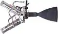](f/ps/s/s200_pic1.webp)|

**Notes:**

   1. Specs’re for nominal vacuum continuous thrust starting from the 2nd second after energizing the solenoid valves.
   1. [Products brochures ❐](f/contact/o/opc_lam_brochures.7z)
   1. <http://www.space-propulsion.com/spacecraft-propulsion/bipropellant-thrusters/200n-bipropellant-thrusters.html> — [archived ❐](f/ps/s/s200_site.pdf) 2019.02.21
   1. **Applicability** — …

 

### S400   ［EU・2comp.］
**S400** — 2‑component [engine](ps.md) by [OPC LAM](contact/opc_lam.md).

|*[Characteristics](si.md)*|*S400‑12*|*S400‑15*|
|:-|:-|:-|
|Composition| | |
|Consumption, W|35|35|
|Dimensions, ㎜|503 × 248|669 × 316|
|[Interfaces](interface.md)| | |
|[Lifetime](lifetime.md)/Resource, h(y)|… / …|… / …|
|Mass, ㎏|3.6|4.3|
|[Overload](vibration.md), Grms| | |
|[Rad.resist](ion_rad.md), ㏉ (㎭)| | |
|[Reliability](qm.md) per [lifetime](lifetime.md)| | |
|[Thermal range](tcs.md), ℃| | |
|[TRL](trl.md)|9|9|
|[Voltage](sps.md), V| | |
|**【Specific】**|• • •|• • •|
|[Fuel](ps.md) (+ combustion products)|[NTO (MON‑1, MON‑3) + MMH](nto_plus.md)|[NTO (MON‑1, MON‑3) + MMH](nto_plus.md)|
|Fuel — components’ mass ratio|1.65 (1.5 ‑ 1.8)|1.65 (1.5 ‑ 1.8)|
|Fuel — consumption, ㎏/s, ≤|0.108.989 ‑ 0.134.633 ‑ 0.141.044|0.107.970 ‑ 0.134.963 ‑ 0.139.726|
|Fuel — resource, ㎏, ≥|4 000|4 100|
|Press. — comb. chamber, ㎫ (㍴)|1.02 (10)|1.02 (10)|
|Press. — eng. entrance, ㎫ (㍴)|1.27 ‑ 1.88 (12.5 ‑ 18.5)|1.27 ‑ 1.88 (12.5 ‑ 18.5)|
|Press. — nozzle cut, ㎫ (㍴)| | |
|Temper. — comb. chamber, К (℃)| | |
|Temper. — nozzle cut, К (℃)| | |
|Thrust, N (㎏f)|340 ‑ 420 ‑ 440 (34.65 ‑ 42.8 ‑ 44.85)|340 ‑ 425 ‑ 440 (34.65 ‑ 43.3 ‑ 44.85)|
|Thrust — duration of 1 thrust, s|… ‑ 4 000|… ‑ 6 700|
|Thrust — [Ing](ing.md), N·s (㎏f·s), ≤| | |
|Thrust — [Isp](ps.md), s (N·s/㎏), ≥|318 (3 120)|321 (3 150)|
|Thrust — switch. frequency, ㎐, ≤| | |
|Thrust — torch angle, °| | |
|Thrust — total pulses, ≥|100|135|
|Thrust — total thrust, N (㎏f), ≥|12 550 000 (1 280 000)|13 000 000 (1 325 000)|
|Thrust — total thrust, s (h), ≥|29 900|30 600|
|[Turbopump](turbopump.md) rate, rpm|—|—|
| |[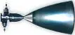](f/ps/s/s400-12_pic1.webp)|[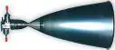](f/ps/s/s400-15_pic1.webp)|

**Notes:**

   1. Specs’re for nominal vacuum continuous thrust starting from the 2nd second after energizing the solenoid valves.
   1. [Products brochures ❐](f/contact/o/opc_lam_brochures.7z)
   1. <https://en.wikipedia.org/wiki/S400_(rocket_engine)>
   1. <http://www.space-propulsion.com/spacecraft-propulsion/apogee-motors/index.html>
   1. **[1]** — see <mark>TBD</mark>
   1. **Applicability** — Symphonie 1 (1974)・ Symphonie 2 (1975)・ TV-Sat 1 (1987)・ TDF-1 (1988)・ Galileo (1989)・ Tele X (1989)・ DFS Kopernikus 1 (1989)・ TV-Sat 2 (1989)・ DFS Kopernikus 2 (1989)・ TDF-2 (1990)・ Eutelsat 2-F1 (1990)・ Eutelsat 2-F2 (1991)・ Eutelsat 2-F3 (1991)・ Arabsat 1C (1992)・ Eutelsat 2-F4 (1992)・ DFS Kopernikus 3 (1992)・ Eutelsat 2-F5 (1994)・ Turksat 1A (1994)・ Turksat 1AR (1994)・ Turksat 1B (1994)・ HotBird 1 (1995)・ Amos 1 (1995)・ Arabsat 2A (1996)・ Turksat 1C (1996)・ Arabsat 2B (1996)・ Nahuel 1A (1997)・ Thaicom 3 (1997)・ Sirius 2 FM1 (1997)・ Sinosat (1998)・ Eutelsat W2 (1998)・ GE 5 (1998)・ Arabsat 3A (1999)・ Eutelsat W3 (1999)・ Hispasat 1C (2000)・ Eutelsat W4 (2000)・ Cluster FM 6・ FM 7 (2000)・ Cluster FM 5・ FM 8 (2000)・ Amsat P3D (2000)・ Eurasiasat (2001)・ Sicral (2001)・ Eurobird (2001)・ Artemis (2001)・ Atlantic Bird 2 (2001)・ Atlantic Bird 3 (2002)・ Atlantic Bird 1 (2002)・ HotBird 6 (2002)・ Meteosat SG 1 (2002)・ Hispasat 1D (2002)・ Eutelsat W5 (2002)・ Astra 1K (2002)・ Mars Express (2003)・ AMC 9 (2003)・ Amos 2 (2003)・ Apstar 6 (2005)・ AMC 12 (2005)・ AMC 13 (2005)・ MSG FM2 (2005)・ Syracruse 3A (2005)・ Venus Express (2005)・ HB7A・ APA2 (2006)・ Koreasat 5 (2006)・ Syracuse 3B FM2 (2006)・ THAICOM 5 (2006)・ Chinasat 6B (2007)・ Galaxy 17 (2007)・ Rascom RC1 (2007)・ Star One C1 (2007)・ Chinasat 9 (2008)・ CIEL 2 (2008)・ Star One C2 (2008)・ Turksat 3A (2008)・ Eutelsat W3A (2009)・ Eutelsat W7 (2009)・ Comsat-Bw 1 (2009)・ Palapa D (2009)・ SICRAL2 (1B) (2009)・ Thor-6 (2009)・ Eutelsat W3B (2010)・ Comsat-Bw 2 (2010)・ Nilesat 201 (2010)・ RASCOM QAF 1R (2010)・ Eutelsat W3C (2011)・ MSG FM3 (2011)・ Apstar 7A (2012)・ Apstar 7B (2012)・ Eutelsat W6A (2012)・ Alphasat (2013)・ MSG FM4 (2013)・ AMOS 4 (2013)・ ARSAT (2014)・ Athena Fidus (2014)・ MSG FM4 (2015)・ ARSAT 2 (2015)・ E8WB (2015)・ Türkmensat (2015)・ Sicral 2 (2015)・ Exomars Orbiter (2016)・ Amos 6 (LV failure)・ EDRS (2016)・ SGDC (2017)・ Koreasat 7 (2017)・ Koreasat 5A (2017)・ Telkom 3S (2017)・ Inmarsat HS3 (2018)・ KARI GK2A (2018)・ KARI GK2B ( )・ BS1 (2018)・ Quantum (2019)・ MTG I1 (2020)・ Egyptsat (2019)・ Yamal 601 (2019)・ MTG-S1 ()

 

### SPD-25   ［RU・el.］
**SPD-25** (ru. **СПД-25**, Стационарный плазменный двигатель) — electric [engine](ps.md) by [OKB Fakel](contact/edb_fakel.md).

|*[Characteristics](si.md)*|*SPD-25*|
|:-|:-|
|Composition| |
|Consumption, W|100 **⁽¹⁾**|
|Dimensions, ㎜| |
|[Interfaces](interface.md)| |
|[Lifetime](lifetime.md)/Resource, h(y)|… / …|
|Mass, ㎏|0.3 **⁽¹⁾**|
|[Overload](vibration.md), Grms| |
|[Rad.resist](ion_rad.md), ㏉ (㎭)| |
|[Reliability](qm.md) per [lifetime](lifetime.md)| |
|[Thermal range](tcs.md), ℃| |
|[TRL](trl.md)|4 **⁽¹⁾**|
|[Voltage](sps.md), V| |
|**【Specific】**|• • •|
|[Fuel](ps.md) (+ combustion products)|[Xenon](xenon.md)|
|Fuel — components’ mass ratio|—|
|Fuel — consumption, ㎏/s, ≤|0.000.000.891.946|
|Fuel — resource, ㎏, ≥|4.81|
|Press. — comb. chamber, ㎫ (㍴)| |
|Press. — eng. entrance, ㎫ (㍴)| |
|Press. — nozzle cut, ㎫ (㍴)| |
|Temper. — comb. chamber, К (℃)| |
|Temper. — nozzle cut, К (℃)| |
|Thrust, N (㎏f)|0.007 (0.0007) **⁽¹⁾**|
|Thrust — duration of 1 thrust, s|… ‑ … |
|Thrust — [Ing](ing.md), N·s (㎏f·s), ≤| |
|Thrust — [Isp](ps.md), s (N·s/㎏), ≥|800 (7 850) **⁽¹⁾**|
|Thrust — switch. frequency, ㎐, ≤| |
|Thrust — torch angle, °| |
|Thrust — total pulses, ≥| |
|Thrust — total thrust, N (㎏f), ≥|37 800 (3 850) **⁽¹⁾**|
|Thrust — total thrust, s (h), ≥|5 400 000 (1 500 h, 62 d) **⁽¹⁾**|
|[Turbopump](turbopump.md) rate, rpm|—|

**Notes:**

   1. Specs’re for nominal vacuum continuous thrust starting from the 2nd second after energizing the solenoid valves.
   1. **[1]** — see [OKB Fakel](contact/edb_fakel.md) site, 2016 y.
   1. **Applicability** — …

 

### SPD-50   ［RU・el.］
**SPD-50** (ru. **СПД-50**, Стационарный плазменный двигатель) — electric [engine](ps.md) by [OKB Fakel](contact/edb_fakel.md).

|*[Characteristics](si.md)*|*SPD-50*|
|:-|:-|
|Composition| |
|Consumption, W|220 **⁽¹⁾**|
|Dimensions, ㎜|160×120×91|
|[Interfaces](interface.md)| |
|[Lifetime](lifetime.md)/Resource, h(y)|… / …|
|Mass, ㎏|1.23 **⁽¹⁾**|
|[Overload](vibration.md), Grms| |
|[Rad.resist](ion_rad.md), ㏉ (㎭)| |
|[Reliability](qm.md) per [lifetime](lifetime.md)| |
|[Thermal range](tcs.md), ℃| |
|[TRL](trl.md)|9 **⁽¹⁾**|
|[Voltage](sps.md), V| |
|**【Specific】**|• • •|
|[Fuel](ps.md) (+ combustion products)|[Xenon](xenon.md)|
|Fuel — components’ mass ratio|—|
|Fuel — consumption, ㎏/s, ≤|0.000.001.659.436|
|Fuel — resource, ㎏, ≥|14.93|
|Press. — comb. chamber, ㎫ (㍴)| |
|Press. — eng. entrance, ㎫ (㍴)| |
|Press. — nozzle cut, ㎫ (㍴)| |
|Temper. — comb. chamber, К (℃)| |
|Temper. — nozzle cut, К (℃)| |
|Thrust, N (㎏f)|0.014 (0.0014) **⁽¹⁾**|
|Thrust — duration of 1 thrust, s|… ‑ … |
|Thrust — [Ing](ing.md), N·s (㎏f·s), ≤| |
|Thrust — [Isp](ps.md), s (N·s/㎏), ≥|860 (8 430) **⁽¹⁾**|
|Thrust — switch. frequency, ㎐, ≤| |
|Thrust — torch angle, °| |
|Thrust — total pulses, ≥| |
|Thrust — total thrust, N (㎏f), ≥|126 000 (12 840) **⁽¹⁾**|
|Thrust — total thrust, s (h), ≥|9 000 000 (2 500 h, 104 d) **⁽¹⁾**|
|[Turbopump](turbopump.md) rate, rpm|—|

**Notes:**

   1. Specs’re for nominal vacuum continuous thrust starting from the 2nd second after energizing the solenoid valves.
   1. **[1]** — see [OKB Fakel](contact/edb_fakel.md) site, 2016 y.
   1. **Applicability** — …

 

### SPD-70   ［RU・el.］
**SPD-70** (ru. **СПД-70**, Стационарный плазменный двигатель) — electric [engine](ps.md) by [OKB Fakel](contact/edb_fakel.md).

|*[Characteristics](si.md)*|*SPD-70*|
|:-|:-|
|Composition| |
|Consumption, W|660 **⁽¹⁾**|
|Dimensions, ㎜|198×146×98 **⁽¹⁾**|
|[Interfaces](interface.md)| |
|[Lifetime](lifetime.md)/Resource, h(y)|… / …|
|Mass, ㎏|2 **⁽¹⁾**|
|[Overload](vibration.md), Grms| |
|[Rad.resist](ion_rad.md), ㏉ (㎭)| |
|[Reliability](qm.md) per [lifetime](lifetime.md)| |
|[Thermal range](tcs.md), ℃| |
|[TRL](trl.md)|9 **⁽¹⁾**|
|[Voltage](sps.md), V| |
|**【Specific】**|• • •|
|[Fuel](ps.md) (+ combustion products)|[Xenon](xenon.md)|
|Fuel — components’ mass ratio|—|
|Fuel — consumption, ㎏/s, ≤|0.000.002.773.790|
|Fuel — resource, ㎏, ≥|30.95|
|Press. — comb. chamber, ㎫ (㍴)| |
|Press. — eng. entrance, ㎫ (㍴)| |
|Press. — nozzle cut, ㎫ (㍴)| |
|Temper. — comb. chamber, К (℃)| |
|Temper. — nozzle cut, К (℃)| |
|Thrust, N (㎏f)|0.04 (0.0041) **⁽¹⁾**|
|Thrust — duration of 1 thrust, s|… ‑ … |
|Thrust — [Ing](ing.md), N·s (㎏f·s), ≤| |
|Thrust — [Isp](ps.md), s (N·s/㎏), ≥|1 470 (14 420) **⁽¹⁾**|
|Thrust — switch. frequency, ㎐, ≤| |
|Thrust — torch angle, °| |
|Thrust — total pulses, ≥| |
|Thrust — total thrust, N (㎏f), ≥|446 400 (45 500)|
|Thrust — total thrust, s (h), ≥|11 160 000 (3 100 h, 129 d) **⁽¹⁾**|
|[Turbopump](turbopump.md) rate, rpm|—|

**Notes:**

   1. Specs’re for nominal vacuum continuous thrust starting from the 2nd second after energizing the solenoid valves.
   1. **[1]** — see [OKB Fakel](contact/edb_fakel.md) site, 2016 y.
   1. **Applicability** — …

 

### SPD-100   ［RU・el.］
**SPD-100** (ru. **СПД-100**, Стационарный плазменный двигатель) — electric [engine](ps.md) by [OKB Fakel](contact/edb_fakel.md).

|*[Characteristics](si.md)*|*SPD-100*|
|:-|:-|
|Composition| |
|Consumption, W|1 350 **⁽¹⁾**|
|Dimensions, ㎜| |
|[Interfaces](interface.md)| |
|[Lifetime](lifetime.md)/Resource, h(y)|3 650 (10) **⁽¹⁾** / …|
|Mass, ㎏|3.5 **⁽¹⁾**|
|[Overload](vibration.md), Grms| |
|[Rad.resist](ion_rad.md), ㏉ (㎭)| |
|[Reliability](qm.md) per [lifetime](lifetime.md)| |
|[Thermal range](tcs.md), ℃| |
|[TRL](trl.md)|9 **⁽¹⁾**|
|[Voltage](sps.md), V| |
|**【Specific】**|• • •|
|[Fuel](ps.md) (+ combustion products)|[Xenon](xenon.md)|
|Fuel — components’ mass ratio|—|
|Fuel — consumption, ㎏/s, ≤|0.000.005.640.502|
|Fuel — resource, ㎏, ≥|203.05|
|Press. — comb. chamber, ㎫ (㍴)| |
|Press. — eng. entrance, ㎫ (㍴)| |
|Press. — nozzle cut, ㎫ (㍴)| |
|Temper. — comb. chamber, К (℃)| |
|Temper. — nozzle cut, К (℃)| |
|Thrust, N (㎏f)|0.083 (0.0084) **⁽¹⁾**|
|Thrust — duration of 1 thrust, s|… ‑ … |
|Thrust — [Ing](ing.md), N·s (㎏f·s), ≤| |
|Thrust — [Isp](ps.md), s (N·s/㎏), ≥|1 500 (14 700) **⁽¹⁾**|
|Thrust — switch. frequency, ㎐, ≤| |
|Thrust — torch angle, °| |
|Thrust — total pulses, ≥| |
|Thrust — total thrust, N (㎏f), ≥|2 988 000 (304 580)|
|Thrust — total thrust, s (h), ≥|36 000 000 (10 000 h, 1.139 y) **⁽¹⁾**|
|[Turbopump](turbopump.md) rate, rpm|—|

**Notes:**

   1. Specs’re for nominal vacuum continuous thrust starting from the 2nd second after energizing the solenoid valves.
   1. **[1]** — see [OKB Fakel](contact/edb_fakel.md) site, 2016 y.
   1. **Applicability** — …

 

### SPD-140   ［RU・el.］
**SPD-140** (ru. **СПД-140**, Стационарный плазменный двигатель) — electric [engine](ps.md) by [OKB Fakel](contact/edb_fakel.md).

|*[Characteristics](si.md)*|*SPD-140*|*SPD-140D*|
|:-|:-|:-|
|Composition| | |
|Consumption, W|3 000 **⁽¹⁾**|4 500 **⁽²⁾**|
|Dimensions, ㎜| | |
|[Interfaces](interface.md)| | |
|[Lifetime](lifetime.md)/Resource, h(y)|… / …|3 650 (10) **⁽²⁾** / …|
|Mass, ㎏|8.4 **⁽¹⁾**|8.4 **⁽²⁾**|
|[Overload](vibration.md), Grms| | |
|[Rad.resist](ion_rad.md), ㏉ (㎭)| | |
|[Reliability](qm.md) per [lifetime](lifetime.md)| | |
|[Thermal range](tcs.md), ℃| | |
|[TRL](trl.md)|9 **⁽¹ ²⁾**|9 **⁽¹ ²⁾**|
|[Voltage](sps.md), V| | |
|**【Specific】**|• • •|• • •|
|[Fuel](ps.md) (+ combustion products)|[Xenon](xenon.md) **⁽¹ ²⁾**|[Xenon](xenon.md) **⁽¹ ²⁾**|
|Fuel — components’ mass ratio|—|—|
|Fuel — consumption, ㎏/s, ≤|0.000.011.710.596|0.000.017.701.599|
|Fuel — resource, ㎏, ≥|330.94|495.64|
|Press. — comb. chamber, ㎫ (㍴)| | |
|Press. — eng. entrance, ㎫ (㍴)| |
|Press. — nozzle cut, ㎫ (㍴)| | |
|Temper. — comb. chamber, К (℃)| | |
|Temper. — nozzle cut, К (℃)| | |
|Thrust, N (㎏f)|0.193 (0.0196) **⁽¹⁾**|0.29 (0.0295)|⁺ ⁵₋₁₅ **⁽²⁾**|
|Thrust — duration of 1 thrust, s|… ‑ … |60 ‑ 360 000 **⁽²⁾**|
|Thrust — [Ing](ing.md), N·s (㎏f·s), ≤| | |
|Thrust — [Isp](ps.md), s (N·s/㎏), ≥|1 680 (16 480) **⁽¹⁾**|1 670 (16 382) **⁽²⁾**|
|Thrust — switch. frequency, ㎐, ≤| |1 pulse/15 m **⁽²⁾**|
|Thrust — torch angle, °| | |
|Thrust — total pulses, ≥| |625 **⁽²⁾**|
|Thrust — total thrust, N (㎏f), ≥|5 450 000 (555 980)|8 120 000 (827 700) **⁽²⁾**|
|Thrust — total thrust, s (h), ≥|28 260 000 (7 850 h, 0.895 y) **⁽¹⁾**|28 000 000 (7 800 h, 0.89 y) **⁽²⁾**|
|[Turbopump](turbopump.md) rate, rpm|—|—|

**Notes:**

   1. Specs’re for nominal vacuum continuous thrust starting from the 2nd second after energizing the solenoid valves.
   1. **[1]** — see [OKB Fakel](contact/edb_fakel.md) site, 2016 y.
   1. **Applicability** — [Intergeliozond]([интергелиозонд.md) (SPD-140D)

 

### SPD-230   ［RU・el.］
**SPD-230** (ru. **СПД-230**, Стационарный плазменный двигатель) — electric [engine](ps.md) by [OKB Fakel](contact/edb_fakel.md).

|*[Characteristics](si.md)*|*SPD-230*|
|:-|:-|
|Composition| |
|Consumption, W|15 000 **⁽¹⁾**|
|Dimensions, ㎜| |
|[Interfaces](interface.md)| |
|[Lifetime](lifetime.md)/Resource, h(y)|… / …|
|Mass, ㎏|25 **⁽¹⁾**|
|[Overload](vibration.md), Grms| |
|[Rad.resist](ion_rad.md), ㏉ (㎭)| |
|[Reliability](qm.md) per [lifetime](lifetime.md)| |
|[Thermal range](tcs.md), ℃| |
|[TRL](trl.md)|3 **⁽¹⁾**|
|[Voltage](sps.md), V| |
|**【Specific】**|• • •|
|[Fuel](ps.md) (+ combustion products)|[Xenon](xenon.md)|
|Fuel — components’ mass ratio|—|
|Fuel — consumption, ㎏/s, ≤|0.000.029.637.180|
|Fuel — resource, ㎏, ≥| |
|Press. — comb. chamber, ㎫ (㍴)| |
|Press. — eng. entrance, ㎫ (㍴)| |
|Press. — nozzle cut, ㎫ (㍴)| |
|Temper. — comb. chamber, К (℃)| |
|Temper. — nozzle cut, К (℃)| |
|Thrust, N (㎏f)|0.785 (0.080) **⁽¹⁾**|
|Thrust — duration of 1 thrust, s|… ‑ … |
|Thrust — [Ing](ing.md), N·s (㎏f·s), ≤| |
|Thrust — [Isp](ps.md), s (N·s/㎏), ≥|2 700 (26 480) **⁽¹⁾**|
|Thrust — switch. frequency, ㎐, ≤| |
|Thrust — torch angle, °| |
|Thrust — total pulses, ≥| |
|Thrust — total thrust, N (㎏f), ≥| |
|Thrust — total thrust, s (h), ≥| |
|[Turbopump](turbopump.md) rate, rpm|—|

**Notes:**

   1. Specs’re for nominal vacuum continuous thrust starting from the 2nd second after energizing the solenoid valves.
   1. **[1]** — see [OKB Fakel](contact/edb_fakel.md) site, 2016 y.
   1. **Applicability** — …

 

### TK500M   ［RU・1comp.］
**TK500M** (ru. **ТК500М**) — 1‑component [engine](ps.md) by [OKB Fakel](contact/edb_fakel.md).

|*[Characteristics](si.md)*|*TK500M*|
|:-|:-|
|Composition| |
|Consumption, W| |
|Dimensions, ㎜|110×129×67 **⁽¹⁾**|
|[Interfaces](interface.md)| |
|[Lifetime](lifetime.md)/Resource, h(y)|3 650 (10) **⁽¹⁾** / …|
|Mass, ㎏|0.44 **⁽¹⁾**|
|[Overload](vibration.md), Grms| |
|[Rad.resist](ion_rad.md), ㏉ (㎭)| |
|[Reliability](qm.md) per [lifetime](lifetime.md)| |
|[Thermal range](tcs.md), ℃| |
|[TRL](trl.md)|9 **⁽¹⁾**|
|[Voltage](sps.md), V| |
|**【Specific】**|• • •|
|[Fuel](ps.md) (+ combustion products)|[Hydrazine](hydrazine.md) **⁽¹⁾** (H₂, N₂)|
|Fuel — components’ mass ratio|—|
|Fuel — consumption, ㎏/s, ≤|0.000.463.349 - 0.002.594.754|
|Fuel — resource, ㎏, ≥|200 **⁽¹⁾**|
|Press. — comb. chamber, ㎫ (㍴)|0.8 (8) **⁽¹⁾**|
|Press. — eng. entrance, ㎫ (㍴)| |
|Press. — nozzle cut, ㎫ (㍴)| |
|Temper. — comb. chamber, К (℃)| |
|Temper. — nozzle cut, К (℃)| |
|Thrust, N (㎏f)|1.0 - 5.6 (0.1 - 0.57) **⁽¹⁾**|
|Thrust — duration of 1 thrust, s|… ‑ 1 800 **⁽¹⁾**|
|Thrust — [Ing](ing.md), N·s (㎏f·s), ≤| |
|Thrust — [Isp](ps.md), s (N·s/㎏), ≥|220 (2 158) **⁽¹⁾**|
|Thrust — switch. frequency, ㎐, ≤|1 pulse/3.5 h **⁽¹⁾**|
|Thrust — torch angle, °| |
|Thrust — total pulses, ≥|60 000 **⁽¹⁾**|
|Thrust — total thrust, N (㎏f), ≥|432 000|
|Thrust — total thrust, s (h), ≥| |
|[Turbopump](turbopump.md) rate, rpm|—|

**Notes:**

   1. Specs’re for nominal vacuum continuous thrust starting from the 4th second after energizing the solenoid valves.
   1. **[1]** — see [OKB Fakel](contact/edb_fakel.md) site, 2016 y.
   1. **Applicability** — [Arktika-M](арктика_м.md)・ [Elektro-M](электро_м.md)

 

### WIT   ［JP・el］
**Water Ion Thruster (WIT)** — electric [engine](ps.md) by [Pale Blue Inc](contact/pale_blue_inc.md).

|*[Characteristics](si.md)*|*Water Ion Thruster*|
|:-|:-|
|Composition|engine, tanks, structures (in fact, the entire PS)|
|Consumption, W|30 ‑ 60|
|Dimensions, ㎜|… (0.7U)|
|[Interfaces](interface.md)|UART, RS422|
|[Lifetime](lifetime.md)/Resource, h(y)|… / …|
|Mass, ㎏|1.6 w/o tank, 0.2 for propellant|
|[Overload](vibration.md), Grms| |
|[Rad.resist](ion_rad.md), ㏉ (㎭)| |
|[Reliability](qm.md) per [lifetime](lifetime.md)| |
|[Thermal range](tcs.md), ℃|+4 ‑ +49 for operations, 0 ‑ +68 for storage|
|[TRL](trl.md)|8|
|[Voltage](sps.md), V|5 or 12|
|**【Specific】**|• • •|
|[Fuel](ps.md) (+ combustion products)|Water (O, H)|
|Fuel — components’ mass ratio|—|
|Fuel — consumption, ㎏/s, ≤|0.000.000.027.726 ‑ 0.000.000.032.223|
|Fuel — resource, ㎏, ≥|0.2 ‑ 0.35|
|Press. — comb. chamber, ㎫ (㍴)| |
|Press. — eng. entrance, ㎫ (㍴)| |
|Press. — nozzle cut, ㎫ (㍴)| |
|Temper. — comb. chamber, К (℃)| |
|Temper. — nozzle cut, К (℃)| |
|Thrust, N (㎏f)|0.000136 ‑ 0.000306 (0.0000138 ‑ 0.0000312)|
|Thrust — duration of 1 thrust, s|… ‑ … |
|Thrust — [Ing](ing.md), N·s (㎏f·s), ≤| |
|Thrust — [Isp](ps.md), s (N·s/㎏), ≥|500 ‑ 968 (4 905 ‑ 9 496)|
|Thrust — switch. frequency, ㎐, ≤| |
|Thrust — torch angle, °| |
|Thrust — total pulses, ≥| |
|Thrust — total thrust, N (㎏f), ≥|981 ‑ 3 323 (100 ‑ 339)|
|Thrust — total thrust, s (h), ≥|7 213 300 ‑ 10 859 500 (2 003 ‑ 3 016)|
|[Turbopump](turbopump.md) rate, rpm|—|
| |[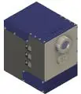](f/ps/w/water_it_pic1.webp)|

**Notes:**

   1. Specs’re for nominal vacuum continuous thrust starting from the …nd second after energizing the solenoid valves.
   1. [Datasheet ❐](f/ps/w/water_it_doc1.pdf)
   1. **Applicability** — …

 

### WRT   ［JP・el］
**Water Resistojet Thruster (WRT)** — electric [engine](ps.md) by [Pale Blue Inc](contact/pale_blue_inc.md).

|*[Characteristics](si.md)*|*Water Resistojet Thruster*|
|:-|:-|
|Composition|engine, tanks, structures (in fact, the entire PS)|
|Consumption, W|5 ‑ 20|
|Dimensions, ㎜|… (0.5U)|
|[Interfaces](interface.md)|UART, RS422|
|[Lifetime](lifetime.md)/Resource, h(y)|… / …|
|Mass, ㎏|0.8 w/o tank, 0.4 for propellant |
|[Overload](vibration.md), Grms| |
|[Rad.resist](ion_rad.md), ㏉ (㎭)| |
|[Reliability](qm.md) per [lifetime](lifetime.md)| |
|[Thermal range](tcs.md), ℃|+4 ‑ +49 for operations, 0 ‑ +68 for storage|
|[TRL](trl.md)|9|
|[Voltage](sps.md), V|5 or 8|
|**【Specific】**|• • •|
|[Fuel](ps.md) (+ combustion products)|Water (O, H)|
|Fuel — components’ mass ratio|—|
|Fuel — consumption, ㎏/s, ≤|0.000.001.456.239 ‑ … ‑ 0.000.004.077.471|
|Fuel — resource, ㎏, ≥|0.1 ‑ … ‑ 1.1|
|Press. — comb. chamber, ㎫ (㍴)| |
|Press. — eng. entrance, ㎫ (㍴)| |
|Press. — nozzle cut, ㎫ (㍴)|0.06|
|Temper. — comb. chamber, К (℃)| |
|Temper. — nozzle cut, К (℃)| |
|Thrust, N (㎏f)|0.001 ‑ 0.002 ‑ 0.004 (0.0001 ‑ 0.0002 ‑ 0.0004)|
|Thrust — duration of 1 thrust, s|… ‑ … |
|Thrust — [Ing](ing.md), N·s (㎏f·s), ≤| |
|Thrust — [Isp](ps.md), s (N·s/㎏), ≥|70 ‑ … ‑ 100 (687 ‑ … ‑ 981)|
|Thrust — switch. frequency, ㎐, ≤| |
|Thrust — torch angle, °| |
|Thrust — total pulses, ≥| |
|Thrust — total thrust, N (㎏f), ≥|68 ‑ … ‑ 1 080 (7 ‑ … ‑ 110)|
|Thrust — total thrust, s (h), ≥|67 500 ‑ … ‑ 270 000 (18.75 ‑ 75)|
|[Turbopump](turbopump.md) rate, rpm|—|
| |[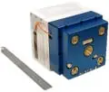](f/ps/w/water_rjt_pic1.webp)|

**Notes:**

   1. Specs’re for nominal vacuum continuous thrust starting from the …nd second after energizing the solenoid valves.
   1. [Datasheet ❐](f/ps/w/water_rjt_doc1.pdf)
   1. **Applicability** — …

 

## Archive

 

### BE-1   ［US・1comp.］
**BE-1** — 1‑component [engine](ps.md) by [Blue Origin](blue_origin.md).

|*[Characteristics](si.md)*|*BE-1*|
|:-|:-|
|Composition| |
|Consumption, W| |
|Dimensions, ㎜| |
|[Interfaces](interface.md)| |
|[Lifetime](lifetime.md)/Resource, h(y)|… / …|
|Mass, ㎏| |
|[Overload](vibration.md), Grms| |
|[Rad.resist](ion_rad.md), ㏉ (㎭)| |
|[Reliability](qm.md) per [lifetime](lifetime.md)| |
|[Thermal range](tcs.md), ℃| |
|[TRL](trl.md)| |
|[Voltage](sps.md), V| |
|**【Specific】**|• • •|
|[Fuel](ps.md) (+ combustion products)|[H peroxide](hydrogen.md) (H₂, H₂O, O)|
|Fuel — components’ mass ratio|—|
|Fuel — consumption, ㎏/s, ≤| |
|Fuel — resource, ㎏, ≥| |
|Press. — comb. chamber, ㎫ (㍴)| |
|Press. — eng. entrance, ㎫ (㍴)| |
|Press. — nozzle cut, ㎫ (㍴)| |
|Temper. — comb. chamber, К (℃)| |
|Temper. — nozzle cut, К (℃)| |
|Thrust, N (㎏f)|9 000 (920)|
|Thrust — duration of 1 thrust, s|… ‑ … |
|Thrust — [Ing](ing.md), N·s (㎏f·s), ≤| |
|Thrust — [Isp](ps.md), s (N·s/㎏), ≥| |
|Thrust — switch. frequency, ㎐, ≤| |
|Thrust — torch angle, °| |
|Thrust — total pulses, ≥| |
|Thrust — total thrust, N (㎏f), ≥| |
|Thrust — total thrust, s (h), ≥| |
|[Turbopump](turbopump.md) rate, rpm| |

**Notes:**

   1. Specs’re for nominal vacuum continuous thrust starting from the 2nd second after energizing the solenoid valves.
   1. <https://www.blueorigin.com/engines/>
   1. **Applicability** — …

 

### BE-2   ［US・2comp.］
**BE-7** — 2‑component [engine](ps.md) by [Blue Origin](blue_origin.md).

|*[Characteristics](si.md)*|*BE-2*|
|:-|:-|
|Composition| |
|Consumption, W| |
|Dimensions, ㎜| |
|[Interfaces](interface.md)| |
|[Lifetime](lifetime.md)/Resource, h(y)|… / …|
|Mass, ㎏| |
|[Overload](vibration.md), Grms| |
|[Rad.resist](ion_rad.md), ㏉ (㎭)| |
|[Reliability](qm.md) per [lifetime](lifetime.md)| |
|[Thermal range](tcs.md), ℃| |
|[TRL](trl.md)| |
|[Voltage](sps.md), V| |
|**【Specific】**|• • •|
|[Fuel](ps.md) (+ combustion products)|[H peroxide](hydrogen.md) + Kerosene|
|Fuel — components’ mass ratio| |
|Fuel — consumption, ㎏/s, ≤| |
|Fuel — resource, ㎏, ≥| |
|Press. — comb. chamber, ㎫ (㍴)| |
|Press. — eng. entrance, ㎫ (㍴)| |
|Press. — nozzle cut, ㎫ (㍴)| |
|Temper. — comb. chamber, К (℃)| |
|Temper. — nozzle cut, К (℃)| |
|Thrust, N (㎏f)|140 000 (14 300)|
|Thrust — duration of 1 thrust, s|… ‑ … |
|Thrust — [Ing](ing.md), N·s (㎏f·s), ≤| |
|Thrust — [Isp](ps.md), s (N·s/㎏), ≥| |
|Thrust — switch. frequency, ㎐, ≤| |
|Thrust — torch angle, °| |
|Thrust — total pulses, ≥| |
|Thrust — total thrust, N (㎏f), ≥| |
|Thrust — total thrust, s (h), ≥| |
|[Turbopump](turbopump.md) rate, rpm| |

**Notes:**

   1. Specs’re for nominal vacuum continuous thrust starting from the 2nd second after energizing the solenoid valves.
   1. <https://www.blueorigin.com/engines/>
   1. **Applicability** — …

 

### Kestrel   ［US・2comp.］
**Kestrel** — 2‑component [engine](ps.md) by [SpaceX](contact/spacex.md).

|*[Characteristics](si.md)*|*Kestrel*|
|:-|:-|
|Composition| |
|Consumption, W| |
|Dimensions, ㎜|0.7 × …|
|[Interfaces](interface.md)| |
|[Lifetime](lifetime.md)/Resource, h(y)|… / …|
|Mass, ㎏|52|
|[Overload](vibration.md), Grms| |
|[Rad.resist](ion_rad.md), ㏉ (㎭)| |
|[Reliability](qm.md) per [lifetime](lifetime.md)| |
|[Thermal range](tcs.md), ℃| |
|[TRL](trl.md)|9|
|[Voltage](sps.md), V| |
|**【Specific】**|• • •|
|[Fuel](ps.md) (+ combustion products)|[O+Kerosene](o_plus.md)|
|Fuel — components’ mass ratio| |
|Fuel — consumption, ㎏/s, ≤|9.871.382|
|Fuel — resource, ㎏, ≥|987|
|Press. — comb. chamber, ㎫ (㍴)|0.93 (9.12)|
|Press. — eng. entrance, ㎫ (㍴)| |
|Press. — nozzle cut, ㎫ (㍴)| |
|Temper. — comb. chamber, К (℃)| |
|Temper. — nozzle cut, К (℃)| |
|Thrust, N (㎏f)|30 700 (3 130)|
|Thrust — duration of 1 thrust, s|… ‑ … |
|Thrust — [Ing](ing.md), N·s (㎏f·s), ≤| |
|Thrust — [Isp](ps.md), s (N·s/㎏), ≥|317 (3 110)|
|Thrust — switch. frequency, ㎐, ≤| |
|Thrust — torch angle, °| |
|Thrust — total pulses, ≥| |
|Thrust — total thrust, N (㎏f), ≥|3 070 000 (312 900)|
|Thrust — total thrust, s (h), ≥|100|
|[Turbopump](turbopump.md) rate, rpm|—|
| |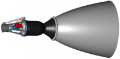|

**Notes:**

   1. Specs’re for nominal vacuum continuous thrust starting from the 2nd second after energizing the solenoid valves.
   1. <https://en.wikipedia.org/wiki/Kestrel_(rocket_engine)>
   1. <https://en.wikipedia.org/wiki/SpaceX_rocket_engines>
   1. Built on the basis of the engine [Merlin](engine_lst.md), but does not have [turbopump](turbopump.md). Has a drive.
   1. **Applicability** — [Falcon 1](falcon.md), 2nd stage (2006‑2009)

 

### RDMT3   ［RU・2comp.］
**RDMT3** (ru. **РДМТ3**) — 2‑component [engine](ps.md) by [NIIMASH](contact/niimash.md). Archived.

|*[Characteristics](si.md)*|*RDMT3*|
|:-|:-|
|Composition| |
|Consumption, W| |
|Dimensions, ㎜|137 × …|
|[Interfaces](interface.md)| |
|[Lifetime](lifetime.md)/Resource, h(y)|… / …|
|Mass, ㎏|0.31|
|[Overload](vibration.md), Grms| |
|[Rad.resist](ion_rad.md), ㏉ (㎭)| |
|[Reliability](qm.md) per [lifetime](lifetime.md)| |
|[Thermal range](tcs.md), ℃| |
|[TRL](trl.md)|4|
|[Voltage](sps.md), V| |
|**【Specific】**|• • •|
|[Fuel](ps.md) (+ combustion products)|[NTO+UDMH](nto_plus.md) (H₂, H₂O, CO, CO₂, N₂)|
|Fuel — components’ mass ratio|1.85±0.2|
|Fuel — consumption, ㎏/s, ≤|0.001.080.602|
|Fuel — resource, ㎏, ≥|0.63|
|Press. — comb. chamber, ㎫ (㍴)| |
|Press. — eng. entrance, ㎫ (㍴)|1.47 (14.4)|
|Press. — nozzle cut, ㎫ (㍴)| |
|Temper. — comb. chamber, К (℃)| |
|Temper. — nozzle cut, К (℃)| |
|Thrust, N (㎏f)|3 (0.3)|
|Thrust — duration of 1 thrust, s|0.02 ‑ 600|
|Thrust — [Ing](ing.md), N·s (㎏f·s), ≤| |
|Thrust — [Isp](ps.md), s (N·s/㎏), ≥|283 (2 776)|
|Thrust — switch. frequency, ㎐, ≤| |
|Thrust — torch angle, °| |
|Thrust — total pulses, ≥|450 000|
|Thrust — total thrust, N (㎏f), ≥|1 800 (183.4)|
|Thrust — total thrust, s (h), ≥|600|
|[Turbopump](turbopump.md) rate, rpm|—|

**Notes:**

   1. Specs’re for nominal vacuum continuous thrust starting from the 0.5nd second after energizing the solenoid valves.
   1. **Applicability** — …

 

### RDMT10   ［RU・2comp.］
**RDMT10** (ru. **РДМТ10**) — 2‑component [engine](ps.md) by [NIIMASH](contact/niimash.md). Archived.

|*[Characteristics](si.md)*|*RDMT10*|
|:-|:-|
|Composition| |
|Consumption, W| |
|Dimensions, ㎜|164 × …|
|[Interfaces](interface.md)| |
|[Lifetime](lifetime.md)/Resource, h(y)|… / …|
|Mass, ㎏|0.35|
|[Overload](vibration.md), Grms| |
|[Rad.resist](ion_rad.md), ㏉ (㎭)| |
|[Reliability](qm.md) per [lifetime](lifetime.md)| |
|[Thermal range](tcs.md), ℃| |
|[TRL](trl.md)|4|
|[Voltage](sps.md), V| |
|**【Specific】**|• • •|
|[Fuel](ps.md) (+ combustion products)|[NTO+UDMH](nto_plus.md) (H₂, H₂O, CO, CO₂, N₂)|
|Fuel — components’ mass ratio|1.85±0.2|
|Fuel — consumption, ㎏/s, ≤|0.004.146.581|
|Fuel — resource, ㎏, ≥|41.3|
|Press. — comb. chamber, ㎫ (㍴)| |
|Press. — eng. entrance, ㎫ (㍴)|1.47 (14.4)|
|Press. — nozzle cut, ㎫ (㍴)| |
|Temper. — comb. chamber, К (℃)| |
|Temper. — nozzle cut, К (℃)| |
|Thrust, N (㎏f)|12 (1.22)|
|Thrust — duration of 1 thrust, s|0.02 ‑ 10 000|
|Thrust — [Ing](ing.md), N·s (㎏f·s), ≤| |
|Thrust — [Isp](ps.md), s (N·s/㎏), ≥|295 (2 894)|
|Thrust — switch. frequency, ㎐, ≤| |
|Thrust — torch angle, °| |
|Thrust — total pulses, ≥|450 000|
|Thrust — total thrust, N (㎏f), ≥|120 000 (12 230е)|
|Thrust — total thrust, s (h), ≥|10 000|
|[Turbopump](turbopump.md) rate, rpm|—|

**Notes:**

   1. Specs’re for nominal vacuum continuous thrust starting from the 1st second after energizing the solenoid valves.
   1. **Applicability** — …

 

### RDMT50   ［RU・2comp.］
**RDMT50** (ru. **РДМТ50**) — 2‑component [engine](ps.md) by [NIIMASH](contact/niimash.md). Archived.

|*[Characteristics](si.md)*|*RDMT50M*|
|:-|:-|
|Composition| |
|Consumption, W| |
|Dimensions, ㎜|253 × …|
|[Interfaces](interface.md)| |
|[Lifetime](lifetime.md)/Resource, h(y)|… / …|
|Mass, ㎏|1.3|
|[Overload](vibration.md), Grms| |
|[Rad.resist](ion_rad.md), ㏉ (㎭)| |
|[Reliability](qm.md) per [lifetime](lifetime.md)| |
|[Thermal range](tcs.md), ℃| |
|[TRL](trl.md)|4|
|[Voltage](sps.md), V| |
|**【Specific】**|• • •|
|[Fuel](ps.md) (+ combustion products)|[NTO+UDMH](nto_plus.md) (H₂, H₂O, CO, CO₂, N₂)|
|Fuel — components’ mass ratio|1.85±0.2|
|Fuel — consumption, ㎏/s, ≤|0.018.980|
|Fuel — resource, ㎏, ≥| |
|Press. — comb. chamber, ㎫ (㍴)| |
|Press. — eng. entrance, ㎫ (㍴)|1.18 (11.5)|
|Press. — nozzle cut, ㎫ (㍴)| |
|Temper. — comb. chamber, К (℃)| |
|Temper. — nozzle cut, К (℃)| |
|Thrust, N (㎏f)|54 (5.5)|
|Thrust — duration of 1 thrust, s|0.03 ‑ 300|
|Thrust — [Ing](ing.md), N·s (㎏f·s), ≤| |
|Thrust — [Isp](ps.md), s (N·s/㎏), ≥|290 (2 845)|
|Thrust — switch. frequency, ㎐, ≤| |
|Thrust — torch angle, °| |
|Thrust — total pulses, ≥|100 000|
|Thrust — total thrust, N (㎏f), ≥| |
|Thrust — total thrust, s (h), ≥| |
|[Turbopump](turbopump.md) rate, rpm|—|

**Notes:**

   1. Specs’re for nominal vacuum continuous thrust starting from the 0.5nd second after energizing the solenoid valves.
   1. **Applicability** — …

 

### RDMT100   ［RU・2comp.］
**RDMT100 (ru. **РДМТ100**) — 2‑component [engine](ps.md) by [NIIMASH](contact/niimash.md). Archived.

|*[Characteristics](si.md)*|*RDMT100-OH*|
|:-|:-|
|Composition| |
|Consumption, W| |
|Dimensions, ㎜|270 × …|
|[Interfaces](interface.md)| |
|[Lifetime](lifetime.md)/Resource, h(y)|… / …|
|Mass, ㎏|1.2|
|[Overload](vibration.md), Grms| |
|[Rad.resist](ion_rad.md), ㏉ (㎭)| |
|[Reliability](qm.md) per [lifetime](lifetime.md)| |
|[Thermal range](tcs.md), ℃| |
|[TRL](trl.md)|4|
|[Voltage](sps.md), V| |
|**【Specific】**|• • •|
|[Fuel](ps.md) (+ combustion products)|[O+H](o_plus.md) (H₂, H₂O)|
|Fuel — components’ mass ratio|1.6 ‑ 1.7|
|Fuel — consumption, ㎏/s, ≤|0.026.968|
|Fuel — resource, ㎏, ≥| |
|Press. — comb. chamber, ㎫ (㍴)| |
|Press. — eng. entrance, ㎫ (㍴)|1.1 (10.8)|
|Press. — nozzle cut, ㎫ (㍴)| |
|Temper. — comb. chamber, К (℃)| |
|Temper. — nozzle cut, К (℃)| |
|Thrust, N (㎏f)|100 (10.2)|
|Thrust — duration of 1 thrust, s|0.01 ‑ 20|
|Thrust — [Ing](ing.md), N·s (㎏f·s), ≤| |
|Thrust — [Isp](ps.md), s (N·s/㎏), ≥|378 (3 708)|
|Thrust — switch. frequency, ㎐, ≤| |
|Thrust — torch angle, °| |
|Thrust — total pulses, ≥|100 000|
|Thrust — total thrust, N (㎏f), ≥| |
|Thrust — total thrust, s (h), ≥| |
|[Turbopump](turbopump.md) rate, rpm|—|

**Notes:**

   1. Specs’re for nominal vacuum continuous thrust starting from the 2nd second after energizing the solenoid valves.
   1. **Applicability** — …

 

### RDMT2600   ［RU・2comp.］
**RDMT2600** (ru. **РДМТ2600**) — 2‑component [engine](ps.md) by [NIIMASH](contact/niimash.md). Archived.

|*[Characteristics](si.md)*|*RDMT2600*|
|:-|:-|
|Composition| |
|Consumption, W| |
|Dimensions, ㎜|464 × …|
|[Interfaces](interface.md)| |
|[Lifetime](lifetime.md)/Resource, h(y)|… / …|
|Mass, ㎏|5|
|[Overload](vibration.md), Grms| |
|[Rad.resist](ion_rad.md), ㏉ (㎭)| |
|[Reliability](qm.md) per [lifetime](lifetime.md)| |
|[Thermal range](tcs.md), ℃| |
|[TRL](trl.md)|4|
|[Voltage](sps.md), V| |
|**【Specific】**|• • •|
|[Fuel](ps.md) (+ combustion products)|O₂ (gas) + ethyl alcohol (H₂, H₂O, CO, CO₂, N₂)|
|Fuel — components’ mass ratio|1.2|
|Fuel — consumption, ㎏/s, ≤|1|
|Fuel — resource, ㎏, ≥| |
|Press. — comb. chamber, ㎫ (㍴)| |
|Press. — eng. entrance, ㎫ (㍴)|4.5 ‑ 5.7 (44.1 ‑ 55.9)|
|Press. — nozzle cut, ㎫ (㍴)| |
|Temper. — comb. chamber, К (℃)| |
|Temper. — nozzle cut, К (℃)| |
|Thrust, N (㎏f)|2 600 (265)|
|Thrust — duration of 1 thrust, s|0.015 ‑ 15|
|Thrust — [Ing](ing.md), N·s (㎏f·s), ≤| |
|Thrust — [Isp](ps.md), s (N·s/㎏), ≥|265 (2 600)|
|Thrust — switch. frequency, ㎐, ≤| |
|Thrust — torch angle, °| |
|Thrust — total pulses, ≥|1 000|
|Thrust — total thrust, N (㎏f), ≥| |
|Thrust — total thrust, s (h), ≥| |
|[Turbopump](turbopump.md) rate, rpm|—|

**Notes:**

   1. Specs’re for nominal vacuum continuous thrust starting from the 2nd second after energizing the solenoid valves.
   1. **Applicability** — …

 

### S5.78   ［RU・2comp.］
**S5.78** (ru. **С5.78**) — 2‑component [engine](ps.md) by [KBHM](contact/kbhm.md). Archived.

|*[Characteristics](si.md)*|*S5.78*|
|:-|:-|
|Composition| | |
|Consumption, W| |
|Dimensions, ㎜| |
|[Interfaces](interface.md)| |
|[Lifetime](lifetime.md)/Resource, h(y)|… / …|
|Mass, ㎏|34.5 **⁽¹⁾**|
|[Overload](vibration.md), Grms| |
|[Rad.resist](ion_rad.md), ㏉ (㎭)| |
|[Reliability](qm.md) per [lifetime](lifetime.md)| |
|[Thermal range](tcs.md), ℃| |
|[TRL](trl.md)|9 **⁽¹⁾**|
|[Voltage](sps.md), V| |
|**【Specific】**|• • •|
|[Fuel](ps.md) (+ combustion products)|[NTO+Hydrazine](nto_plus.md) **⁽¹⁾** (H₂, H₂O, NH₃, N₂)|
|Fuel — components’ mass ratio|1 **⁽¹⁾**|
|Fuel — consumption, ㎏/s, ≤|0.001.512.605|
|Fuel — resource, ㎏, ≥|5 630|
|Press. — comb. chamber, ㎫ (㍴)|1.77 (17.4) **⁽¹⁾**|
|Press. — eng. entrance, ㎫ (㍴)|3.16 ‑ 4.48 (31 ‑ 44) **⁽¹⁾**|
|Press. — nozzle cut, ㎫ (㍴)|0.0087 (0.0853) **⁽¹⁾**|
|Temper. — comb. chamber, К (℃)| |
|Temper. — nozzle cut, К (℃)| |
|Thrust, N (㎏f)|6 000±10 (606.4) **⁽¹⁾**|
|Thrust — duration of 1 thrust, s|… ‑ … |
|Thrust — [Ing](ing.md), N·s (㎏f·s), ≤|1 982±392 (200±40) **⁽¹⁾**|
|Thrust — [Isp](ps.md), s (N·s/㎏), ≥|323 (3 170) **⁽¹⁾**|
|Thrust — switch. frequency, ㎐, ≤|0.66 **⁽¹⁾**|
|Thrust — torch angle, °| |
|Thrust — total pulses, ≥|9 **⁽¹⁾**|
|Thrust — total thrust, N (㎏f), ≥|17 840 000|
|Thrust — total thrust, s (h), ≥|3 000 **⁽¹⁾**|
|[Turbopump](turbopump.md) rate, rpm|39 500|

**Notes:**

   1. Specs’re for nominal vacuum continuous thrust starting from the 2nd second after energizing the solenoid valves.
   1. **[1]** — see document ФГ‑0000‑0ПЗ.5.
   1. Has a turbopump without afterburning the working fluid of the turbine.
   1. **Applicability** — [Fobos-Grunt](фобос_грунт.md)

 

## Template

 

### …   ［…・…comp.］
**…** — …‑component [engine](ps.md) by ….

|*[Characteristics](si.md)*|*…*|
|:-|:-|
|Composition| |
|Consumption, W| |
|Dimensions, ㎜| |
|[Interfaces](interface.md)| |
|[Lifetime](lifetime.md)/Resource, h(y)|… / …|
|Mass, ㎏| |
|[Overload](vibration.md), Grms| |
|[Rad.resist](ion_rad.md), ㏉ (㎭)| |
|[Reliability](qm.md) per [lifetime](lifetime.md)| |
|[Thermal range](tcs.md), ℃| |
|[TRL](trl.md)| |
|[Voltage](sps.md), V| |
|**【Specific】**|• • •|
|[Fuel](ps.md) (+ combustion products)| |
|Fuel — components’ mass ratio| |
|Fuel — consumption, ㎏/s, ≤| |
|Fuel — resource, ㎏, ≥| |
|Press. — comb. chamber, ㎫ (㍴)| |
|Press. — eng. entrance, ㎫ (㍴)| |
|Press. — nozzle cut, ㎫ (㍴)| |
|Temper. — comb. chamber, К (℃)| |
|Temper. — nozzle cut, К (℃)| |
|Thrust, N (㎏f)| |
|Thrust — duration of 1 thrust, s|… ‑ … |
|Thrust — [Ing](ing.md), N·s (㎏f·s), ≤| |
|Thrust — [Isp](ps.md), s (N·s/㎏), ≥| |
|Thrust — switch. frequency, ㎐, ≤| |
|Thrust — torch angle, °| |
|Thrust — total pulses, ≥| |
|Thrust — total thrust, N (㎏f), ≥| |
|Thrust — total thrust, s (h), ≥| |
|[Turbopump](turbopump.md) rate, rpm| |

**Notes:**

   1. Specs’re for nominal vacuum continuous thrust starting from the …nd second after energizing the solenoid valves.
   1. **Applicability** — …

 

## Docs & links
|Navigation|
|:-|
|**[FAQ](faq.md)**［**[SCS](scs.md)**·КК, **[SC (OE+SGM)](sc.md)**·КА］**[CON](contact.md)·[Pers](person.md)**·Контакт, **[Ctrl](control.md)**·Упр., **[Doc](doc.md)**·Док., **[EF](ef.md)**·ВВФ, **[Error](error.md)**·Ошибки, **[Event](event.md)**·События, **[FS](fs.md)**·ТЭО, **[HF&E](hfe.md)**·Эрго., **[KT](kt.md)**·КТ, **[Model](drawing.md)**·Модель, **[N&B](nnb.md)**·БНО, **[Project](project.md)**·Проект, **[QM](qm.md)**·БКНР, **[R&D](rnd.md)**·НИОКР, **[SI](si.md)**·СИ, **[Test](test.md)**·ЭО, **[TRL](trl.md)**·УГТ, **[Way](faq.md)**·Пути|
|*Sections & pages*|
|**`Двигательная установка (ДУ):`**  [HTAE](htae.md)・ [TALOS](talos.md)・ [Баки топливные](fuel_tank.md)・ [Варп‑двигатель](ps.md)・ [Газовый двигатель](ps.md)・ [Гибридный двигатель](гбрд.md)・ [Двигатель Бассарда](ps.md)・ [ЖРД](ps.md)・ [ИПТ](ing.md)・ [Ионный двигатель](иод.md)・ [Как считать топливо?](si.md)・ [КЗУ](cinu.md)・ [КХГ](cgs.md)・ [Номинал](nominal.md)・ [Мятый газ](exhsteam.md)・ [РДТТ](ps.md)・ [Сильфон](сильфон.md)・ [СОЗ](соз.md)・ [СОИС](соис.md)・ [Солнечный парус](солнечный_парус.md)・ [ТНА](turbopump.md)・ [Топливные мембраны](топливные_мембраны.md)・ [Топливные мешки](топливные_мешки.md)・ [Топливо](ps.md)・ [Тяговооружённость](ttwr.md)・ [ТЯРД](тярд.md)・ [УИ](ps.md)・ [Фотонный двигатель](фотонный_двигатель.md)・ [ЭРД](ps.md)・ [Эффект Оберта](oberth_eff.md)・ [ЯРД](ps.md)|

   1. Docs: [Basic calculator ❐](f/ps/calc_ps_general.ods)
   1. …
