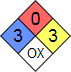

# Водород
> 2019.05.12 [🚀](../../index/index.md) [despace](index.md) → [Fuel](ps.md)
> *Navigation:*
> **[FAQ](faq.md)**【**[SCS](scs.md)**·КК, **[SC (OE+SGM)](sc.md)**·КА】**[CON](contact.md)·[Pers](person.md)**·Контакт, **[Ctrl](control.md)**·Упр., **[Doc](doc.md)**·Док., **[Drawing](drawing.md)**·Чертёж, **[EF](ef.md)**·ВВФ, **[Error](error.md)**·Ошибки, **[Event](event.md)**·Событ., **[FS](fs.md)**·ТЭО, **[HF&E](hfe.md)**·Эрго., **[KT](kt.md)**·КТ, **[N&B](nnb.md)**·БНО, **[Project](project.md)**·Проект, **[QM](qm.md)**·БКНР, **[R&D](rnd.md)**·НИОКР, **[SI](si.md)**·СИ, **[Test](test.md)**·ЭО, **[TRL](trl.md)**·УГТ

**Table of contents:**

[TOC]

---

## Перекись водорода
> <small>**Пероксид водорода** — русскоязычный термин. **Hydrogen peroxide** — англоязычный эквивалент.</small>

**Перокси́д водоро́да** *(перекись водорода)*, H₂O₂ — простейший представитель пероксидов. Бесцветная жидкость с «металлическим» вкусом, неограниченно растворимая в воде, спирте и эфире. Концентрированные водные растворы взрывоопасны. Хороший растворитель.

|*Characteristic*|*[Value](si.md) (incl. [comparison](matc.md))*|
|:-|:-|
|**Space sector**|Widely used. Применяется как ракетное топливо — окислитель или однокомпонентное (с разложением на катализаторе), в т.ч. для привода [турбонасосных агрегатов](turbopump.md). Является одним из двух (второй — [Гидразин](hydrazine.md)) однокомпонентных топлив, не считая газов, в космической технике.  ・В качестве **однокомпонентного топлива** применяется 70 ‑ 99 % раствор H₂O₂, который подаётся на катализатор (обычно, серебро или платина), разлагается на кислород и перегретый пар с температурой 500 ‑ 1 000 ℃ и с [удельным импульсом](ps.md) 161 ‑ 210 с.  ・В качестве **двухкомпонентного топлива** H₂O₂ применяется в качестве окислителя. Удельный импульс может достигать 350 s и выше (наибольший экспериментальный Isp в 365 s был достигнут на связке *перекись водорода + пентаборан*).|
|**Химические св‑ва**|・Хим. формула — H₂O₂  ・[Токсичность](nfpa_704.md) — второй класс (нетоксичен)  |
|**Физические св‑ва**|・Кинематическая вязкость — 1.245 ㎝²/с  (при 20 ℃)  ・Молярная масса — 34.01 г/моль  ・Плотность — 1 400 ㎏/m³  ・Состояние — жидкость  ・Энергия ионизации — 10.54 ± 0.01 эВ|
|**Термические св‑ва**|・Давление пара — 5 ± 1 мм.рт.ст.  ・Т. плавления — −0.432 ℃, кипения — 150.2 ℃  ・Энтальпия образования — −136.11 кДж/моль|
|**Топливо**|・Fuel — combustion products — H₂O, O₂  ・Temper. comb. chamber, К (℃) — 500 ‑ 1 000 ℃|

Оба атома кислорода находятся в промежуточной степени окисления −1, что и обусловливает способность пероксидов выступать как в роли окислителей, так и восстановителей. Наиболее характерны для них окислительные свойства. При взаимодействии с сильными окислителями H₂O₂ выступает в роли восстановителя, окисляясь до атомарного кислорода.

H₂O₂ — неустойчивое соединение, легко и постоянно разлагается. При этом внутри ёмкостей для хранения повышается давление.

Благодаря своим сильным окислительным свойствам H₂O₂ нашёл широкое применение в быту и в промышленности, где используется, например, как отбеливатель на текстильном производстве и при изготовлении бумаги. Используется в аналитической химии, в качестве пенообразователя при производстве пористых материалов, в производстве дезинфицирующих и отбеливающих средств. В промышленности H₂O₂ также находит своё применение в качестве катализатора, гидрирующего агента, как эпоксидирующий агент при эпоксидировании олефинов.

Несмотря на то, что H₂O₂ нетоксичен, его концентрированные растворы при попадании на кожу, слизистые оболочки и в дыхательные пути вызывают ожоги. В больших концентрациях недостаточно чистый H₂O₂ может быть взрывоопасен. Опасен при приёме внутрь концентрированных растворов. Вызывает выраженные деструктивные изменения, сходные с действиями щелочей. Летальная доза 30 %‑го раствора H₂O₂ (пергидроля) — 50 ‑ 100 мл.

 

## Docs & links (TRANSLATEME ALREADY)
|*Sections & pages*|
|:-|
|**【[Structures, gears, materials (SGM)](sc.md)】**  [Гермоконтейнер](гермоконтейнер.md)・ [Датчик](sensor.md)・ [Задел](margin.md)・ [Изделие](unit.md)・ [Испарение материалов](matc.md)・ [Кавитация](cavitation.md)・ [КЗУ](cinu.md) (ВБУ КТ)・ [КХГ](cgs.md)・ [Контейнеры для транспортировки](ship_contain.md)・ [Крейцкопф](crosshead.md)・ [Номинал](nominal.md)・ [ПУС](lag.md)・ [ПНА, ПОНА, ПСНА](devd.md)・ [Резерв](reserve.md)・ [Слайс](слайс.md)・ [ТСП](tsp.md)・ [Типичные формы КА](sc.md)・ [Толкатель](толкатель.md)・ [Унификация](commonality.md)|
|**`Топливо:`**  [Кавитация](cavitation.md)・ [Мятый газ](exhsteam.md)・ [Нейтрализация КРТ](нейтрализация_крт.md)|

   1. Docs:
      - [Выжимка из «Новости космонавтики 2014.12» ❐](f/fuel/20141201_novosti_kosmonavtiki_h2o2.djvu)
   1. <https://en.wikipedia.org/wiki/Hydrogen_peroxide>
   1. 1975.01.01 [Двигательные установки на перекиси водорода для небольших спутников ⎆](http://www.airbase.ru/modelling/rockets/res/trans/h2o2/whitehead.html) — [archived ❐](f/archive/19750101_1.pdf) …
   1. 2007.10.11 [Перекись водорода ⎆](http://mosgird.ru/204/11/002.htm) — [archived ❐](f/archive/20071011_1.pdf) …
