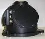
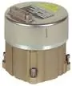
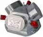

# IMU (a list)
> 2019.07.31 [🚀](../../index/index.md) [despace](index.md) → [Sensor](sensor.md)
> *Navigation:*
> **[FAQ](faq.md)**【**[SCS](scs.md)**·КК, **[SC (OE+SGM)](sc.md)**·КА】**[CON](contact.md)·[Pers](person.md)**·Контакт, **[Ctrl](control.md)**·Упр., **[Doc](doc.md)**·Док., **[Drawing](drawing.md)**·Чертёж, **[EF](ef.md)**·ВВФ, **[Error](error.md)**·Ошибки, **[Event](event.md)**·Событ., **[FS](fs.md)**·ТЭО, **[HF&E](hfe.md)**·Эрго., **[KT](kt.md)**·КТ, **[N&B](nnb.md)**·БНО, **[Project](project.md)**·Проект, **[QM](qm.md)**·БКНР, **[R&D](rnd.md)**·НИОКР, **[SI](si.md)**·СИ, **[Test](test.md)**·ЭО, **[TRL](trl.md)**·УГТ

**Table of contents:**

[TOC]

---

A list of [Inertial measurement units](sensor.md).

## Current

 

### Astrix 1090 (EU)
> <small>**Astrix 1090** — англоязычный термин, не имеющий аналога в русском языке. **Астрикс 1090** — дословный перевод с английского на русский.</small>

**Astrix 1090** — волоконно‑оптический [гироскоп](iu.md) (ВОГ) в составе [КА](sc.md), предназначенный для определения положения КА в инерциальной системе отсчёта.  
*Разработчик:* [ADS](contact/ads.md). Разработано в 2016 году компанией [Astrium](contact/astrium.md). Прибор прошёл сертификацию. Покупное изделие.

|*Characteristics*|*[Value](si.md)  (Astrix 1090)*|
|:-|:-|
|Composition|Single unit|
|Consumption, W|15|
|Dimensions, ㎜|261 × 171|
|[Interfaces](interface.md)|[МКО](mil_std_1553.md)|
|[Lifetime](lifetime.md)/Resource, h(y)|26 280 (3) / 131 400 (15)|
|Mass, ㎏|4.8 (1 прибор)|
|[Overload](vibration.md), Grms| |
|[Rad.resist](ion_rad.md), ㏉ (㎭)|1 000 (100 000)|
|[Reliability](qm.md) per [lifetime](lifetime.md)|0.98|
|[Thermal range](tcs.md), ℃|–25 ‑ +60|
|[TRL](trl.md)|9|
|[Voltage](sps.md), V| |
|**【Specific】**|• • •|
|Range of measurement of linear acceleration|± 200 ㎧²|
|Range of measurement of angular velocity|± 30 º/s|
|Impulse price (scale coefficient), ≤|—|
|<small>・in the accelerometers channel</small>|0.0001 ㎧|
|<small>・in the angle measurement channel</small>|0.03″|
|<small>・stability in the accelerometers channel</small>|0.005 % (3σ)|
|<small>・stability in the angle measurement channel</small>|0.01 % (3σ)|
|Instability of the angular position of sensitivity axes, ≤|—|
|<small>・in the accelerometers channel</small>|20.0″|
|<small>・in the angle measurement channel</small>|40.0″|
|Noise component in output information, ≤|—|
|<small>・in the accelerometers channel</small>|0.001 ㎧ (1σ)|
|<small>・in the angle measurement channel</small>|0.3″ (1σ)|
|Quantity|—|
|<small>・№ of accelerometers in the device</small>|3|
|<small>・№ of devices in GNC</small>|2|
|<small>・№ of gyroscopes in the device</small>|3|
|Random error component of the zero signal, ≤|—|
|<small>・from start to start in the accelerometers channel</small>|0.00049 ㎧² (3σ)|
|<small>・from start to start in the angle measurement channel</small>|0.15 º/h (3σ)|
|<small>・on startup after calibration in the accelerometers channel</small>|0.0002 ㎧² (3σ)|
|<small>・on startup after calibration in the angle measurement channel</small>|0.05 º/h|

**Notes:**

   1. Цена изготовления одного прибора: 2.5 млн €
   1. **Applicability:** КА [ЭкзоМарс‑2020](экзомарс_2020.md)

 

### BIB-FG (RU)
> <small>**БИБ‑ФГ** — русскоязычный термин, не имеющий аналога в английском языке. **BIB-FG** — дословный перевод с русского на английский.</small>

**БИБ‑ФГ** — волоконно‑оптический [гироскоп](iu.md) (ВОГ) в составе [КА](sc.md), предназначенный для определения положения КА в инерциальной системе отсчёта.

**Прибор БЫ2.529.001‑02.** Разработчик [НПО ИТ](contact/npoit.md). Разработан в 2009 году Активное использование. Лётная квалификация в составе КА «[Фобос‑Грунт](фобос_грунт.md)». Покупное изделие.

|*Characteristics*|*[Value](si.md)  (БИБ-ФГ)*|
|:-|:-|
|Composition|Single unit, sealed. Заполнен азотом с P = 30 ‑ 100 ㎩.|
|Consumption, W|11.5|
|Dimensions, ㎜|156 × 77.6|
|[Interfaces](interface.md)|[МКО](mil_std_1553.md)|
|[Lifetime](lifetime.md)/Resource, h(y)|0.9951 за 10 суток / 13 100 (1.5)|
|Mass, ㎏|1.35|
|[Overload](vibration.md), Grms| |
|[Rad.resist](ion_rad.md), ㏉ (㎭)|200 (20 000)|
|[Reliability](qm.md) per [lifetime](lifetime.md)|0.97 за 3 года; 0.9992 за 10 суток; 0.985 за 3 года в 2020 году|
|[Thermal range](tcs.md), ℃|–15 ‑ +50 (on); –40 ‑ +50 (off)|
|[TRL](trl.md)|9|
|[Voltage](sps.md), V|27 (23 ‑ 34)|
|**【Specific】**|• • •|
|Impulse price (scale coefficient), ≤|—|
|<small>・in the accelerometers channel</small>|0.005 ㎧|
|<small>・in the angle measurement channel</small>|0.5″|
|<small>・stability in the accelerometers channel</small>|0.05 %|
|<small>・stability in the angle measurement channel</small>|0.05 %|
|Instability of the angular position of sensitivity axes, ≤|—|
|<small>・in the accelerometers channel</small>|30″|
|<small>・in the angle measurement channel</small>|40″|
|Noise component in output information, ≤|—|
|<small>・in the accelerometers channel</small>|0.01 ㎧ (1σ)|
|<small>・in the angle measurement channel</small>|3″ (1σ)|
|Quantity|—|
|<small>・№ of accelerometers in the device</small>|3|
|<small>・№ of devices in GNC</small>|2|
|<small>・№ of gyroscopes in the device</small>|3|
|Random error component of the zero signal, ≤|—|
|<small>・from start to start in the accelerometers channel</small>|0.003 ㎧²|
|<small>・from start to start in the angle measurement channel</small>|3.0 º/h|
|<small>・on startup after calibration in the accelerometers channel</small>|0.001 ㎧²|
|<small>・on startup after calibration in the angle measurement channel</small>|0.2 º/h|
|Range of measurement of linear acceleration|± 10 ㎧²|
|Range of measurement of angular velocity|± 60 º/s|

**Notes:**

   1. Цена изготовления одного прибора: 4.5 млн р при централизованной поставке ЭРИ от заказчика.
   1. **Applicability:**
      - КА [Luna‑25](луна_25.md) <small>(снят на этапе НЭО, т.к. В 2017 году в ходе испытаний КА [Luna‑25](луна_25.md) выяснилось, что при посадке от вибраций погрешности измерений БИБ‑ФГ становятся больше, чем измеряемые им величины.)</small>
      - КА [Luna‑27](луна_27.md) <small>(снят на этапе РКД, т.к. В 2017 году в ходе испытаний КА [Luna‑25](луна_25.md) выяснилось, что при посадке от вибраций погрешности измерений БИБ‑ФГ становятся больше, чем измеряемые им величины.)</small>
      - КА [Фобос‑Грунт](фобос_грунт.md)

 

### BIB‑IG (RU)
> <small>**БИБ‑ИГ** — русскоязычный термин, не имеющий аналога в английском языке. **BIB‑IG** — дословный перевод с русского на английский.</small>

**БИБ‑ИГ** — шестиосный волоконно‑оптический [гироскоп](iu.md) (ВОГ) в составе [КА](sc.md), предназначенный для определения положения КА в инерциальной системе отсчёта.  
Разработчик [НПО ИТ](contact/npoit.md). Разработано в 2014 году в рамках ЭП КА «[Интергелиозонд](интергелиозонд.md)», но в дальнейшем использован не был.

|*Characteristics*|*[Value](si.md)  <small>(БИБ-ИГ)</small>*|
|:-|:-|
|Composition|Single unit|
|Consumption, W|20|
|Dimensions, ㎜|323 × 136|
|[Interfaces](interface.md)|[МКО](mil_std_1553.md)|
|[Lifetime](lifetime.md)/Resource, h(y)|… / 70 000 (8)|
|Mass, ㎏|3.6|
|[Overload](vibration.md), Grms| |
|[Rad.resist](ion_rad.md), ㏉ (㎭)|500 (50 000)|
|[Reliability](qm.md) per [lifetime](lifetime.md)|0.999 за 5 лет|
|[Thermal range](tcs.md), ℃|–50 ‑ +50|
|[TRL](trl.md)|2|
|[Voltage](sps.md), V| |
|**【Specific】**|• • •|
|Impulse price (scale coefficient), ≤|—|
|<small>・in the accelerometers channel</small>|0.0000012 ㎧|
|<small>・in the angle measurement channel</small>|0.001″|
|<small>・stability in the accelerometers channel</small>|0.01 %|
|<small>・stability in the angle measurement channel</small>|0.009 %|
|Instability of the angular position of sensitivity axes, ≤|—|
|<small>・in the accelerometers channel</small>|8.0″|
|<small>・in the angle measurement channel</small>|8.0″|
|Noise component in output information, ≤|—|
|<small>・in the accelerometers channel</small>|Оценка не проводилась|
|<small>・in the angle measurement channel</small>|0.09″ (3σ)|
|Quantity|—|
|<small>・№ of accelerometers in the device</small>|6|
|<small>・№ of gyroscopes in the device</small>|6|
|<small>・№ of devices in GNC</small>|1|
|Random error component of the zero signal, ≤|—|
|<small>・from start to start in the accelerometers channel</small>|0,0009 ㎧²|
|<small>・from start to start in the angle measurement channel</small>|0.15 º/h|
|<small>・on startup after calibration in the accelerometers channel</small>|0.0004 ㎧²|
|<small>・on startup after calibration in the angle measurement channel</small>|0.005 º/h|
|Range of measurement of linear acceleration|20 ㎧²|
|Range of measurement of angular velocity|40 º/s|

**Notes:**

   1. Цена изготовления одного прибора: 9 млн руб при централизованной поставке ЭРИ от заказчика
   1. **Applicability:** Прибор нигде не применяется.### BIUS-L (RU)
> <small>**БИУС‑Л** — русскоязычный термин, не имеющий аналога в английском языке. **BIUS-L** — дословный перевод с русского на английский.</small>

**БИУС‑Л** — волоконно‑оптический [гироскоп](iu.md) (ВОГ) в составе [КА](sc.md), предназначенный для определения положения КА в инерциальной системе отсчёта.  
Разработчик: [НПЦАП](contact/npcap.md). Разработано  

|*Characteristics*|*[Value](si.md)  (БИУС-Л)*|
|:-|:-|
|Composition|Single unit|
|Consumption, W|25 (при +5 ‑ +40 ℃);  40 (при –5 ‑ +5 ℃ и +40 ‑ +50 ℃)|
|Dimensions, ㎜|260 × 200|
|[Interfaces](interface.md)|[МКО](mil_std_1553.md)|
|[Lifetime](lifetime.md)/Resource, h(y)|… / …|
|Mass, ㎏|10 (1 прибор)|
|[Overload](vibration.md), Grms| |
|[Rad.resist](ion_rad.md), ㏉ (㎭)| |
|[Reliability](qm.md) per [lifetime](lifetime.md)| |
|[Thermal range](tcs.md), ℃|–20 ‑ +35 (on); –40 ‑ +50 (off)|
|[TRL](trl.md)|3|
|[Voltage](sps.md), V|27 (24 ‑ 32)|
|**【Specific】**|• • •|
|Impulse price (scale coefficient), ≤|—|
|<small>・in the accelerometers channel</small>|0.5 "/имп|
|<small>・in the angle measurement channel</small>| |
|<small>・stability in the accelerometers channel</small>| |
|<small>・stability in the angle measurement channel</small>| |
|Instability of the angular position of sensitivity axes, ≤|—|
|<small>・in the accelerometers channel</small>| |
|<small>・in the angle measurement channel</small>|40"|
|Noise component in output information, ≤|—|
|<small>・in the accelerometers channel</small>| |
|<small>・in the angle measurement channel</small>|2" (3σ)|
|Quantity|—|
|<small>・№ of accelerometers in the device</small>|3|
|<small>・№ of devices in GNC</small>|2|
|<small>・№ of gyroscopes in the device</small>|3|
|Random error component of the zero signal, ≤|—|
|<small>・from start to start in the accelerometers channel</small>| |
|<small>・from start to start in the angle measurement channel</small>|0.3 %|
|<small>・on startup after calibration in the accelerometers channel</small>| |
|<small>・on startup after calibration in the angle measurement channel</small>|0.05 %|
|Range of measurement of linear acceleration| |
|Range of measurement of angular velocity|± 80.0 º/s|

**Notes:**

   1. [Чертёж ❐](f/iu/b/bius-l_sketch1.pdf)・ [Инженерная записка ❐](f/iu/b/bius-l_iz_2018.djvu) (2018)
   1. **Applicability:** …

 

### BIUS-L (RU)
> <small>**БИУС‑Л** — русскоязычный термин, не имеющий аналога в английском языке. **BIUS-L** — дословный перевод с русского на английский.</small>

**БИУС‑Л** — волоконно‑оптический [гироскоп](iu.md) (ВОГ) в составе [КА](sc.md), предназначенный для определения положения КА в инерциальной системе отсчёта.  
Разработчик: [НПЦАП](contact/npcap.md). Разработано  

|*Characteristics*|*[Value](si.md)  (БИУС-Л)*|
|:-|:-|
|Composition|Single unit|
|Consumption, W|25 (при +5 ‑ +40 ℃);  40 (при –5 ‑ +5 ℃ и +40 ‑ +50 ℃)|
|Dimensions, ㎜|260 × 200|
|[Interfaces](interface.md)|[МКО](mil_std_1553.md)|
|[Lifetime](lifetime.md)/Resource, h(y)|… / …|
|Mass, ㎏|10 (1 прибор)|
|[Overload](vibration.md), Grms| |
|[Rad.resist](ion_rad.md), ㏉ (㎭)| |
|[Reliability](qm.md) per [lifetime](lifetime.md)| |
|[Thermal range](tcs.md), ℃|–20 ‑ +35 (on); –40 ‑ +50 (off)|
|[TRL](trl.md)|3|
|[Voltage](sps.md), V|27 (24 ‑ 32)|
|**【Specific】**|• • •|
|Impulse price (scale coefficient), ≤|—|
|<small>・in the accelerometers channel</small>|0.5 "/имп|
|<small>・in the angle measurement channel</small>| |
|<small>・stability in the accelerometers channel</small>| |
|<small>・stability in the angle measurement channel</small>| |
|Instability of the angular position of sensitivity axes, ≤|—|
|<small>・in the accelerometers channel</small>| |
|<small>・in the angle measurement channel</small>|40"|
|Noise component in output information, ≤|—|
|<small>・in the accelerometers channel</small>| |
|<small>・in the angle measurement channel</small>|2" (3σ)|
|Quantity|—|
|<small>・№ of accelerometers in the device</small>|3|
|<small>・№ of devices in GNC</small>|2|
|<small>・№ of gyroscopes in the device</small>|3|
|Random error component of the zero signal, ≤|—|
|<small>・from start to start in the accelerometers channel</small>| |
|<small>・from start to start in the angle measurement channel</small>|0.3 %|
|<small>・on startup after calibration in the accelerometers channel</small>| |
|<small>・on startup after calibration in the angle measurement channel</small>|0.05 %|
|Range of measurement of linear acceleration| |
|Range of measurement of angular velocity|± 80.0 º/s|

**Notes:**

   1. [Чертёж ❐](f/iu/b/bius-l_sketch1.pdf)・ [Инженерная записка ❐](f/iu/b/bius-l_iz_2018.djvu) (2018)
   1. **Applicability:** …

 

### BIUS‑M (RU)
> <small>**БИУС‑М** — русскоязычный термин, не имеющий аналога в английском языке. **BIUS‑M** — дословный перевод с русского на английский.</small>

**БИУС‑М** — волоконно‑оптический [гироскоп](iu.md) (ВОГ) в составе [КА](sc.md), предназначенный для определения положения КА в инерциальной системе отсчёта.

**Прибор ДКШГ.402138.031.** Разработчик [НПП Антарес](contact/npp_antares.md). Разработан в 2013 году, активное использование. Лётная квалификация в составе КА «Барс‑М» (запуск 27.02.2015). Покупное 

|*Characteristics*|*[Value](si.md)  (БИУС-М)*|
|:-|:-|
|Composition|Single unit|
|Consumption, W|15|
|Dimensions, ㎜|200 × 159|
|[Interfaces](interface.md)|[МКО](mil_std_1553.md)|
|[Lifetime](lifetime.md)/Resource, h(y)|… / 50 000 (5.7)|
|Mass, ㎏|5.3|
|[Overload](vibration.md), Grms| |
|[Rad.resist](ion_rad.md), ㏉ (㎭)|500 (50 000)|
|[Reliability](qm.md) per [lifetime](lifetime.md)|0.999 за 5 лет|
|[Thermal range](tcs.md), ℃|–10 ‑ +40|
|[TRL](trl.md)|9|
|[Voltage](sps.md), V| |
|**【Specific】**|• • •|
|Impulse price (scale coefficient), ≤|—|
|<small>・in the accelerometers channel</small>|0.000000306 ㎧|
|<small>・in the angle measurement channel</small>|0.0001″|
|<small>・stability in the accelerometers channel</small>|0.02 %|
|<small>・stability in the angle measurement channel</small>|0.001 % (3σ)|
|Instability of the angular position of sensitivity axes, ≤|—|
|<small>・in the accelerometers channel</small>|1.0″ (3σ)|
|<small>・in the angle measurement channel</small>|1.0″ (3σ)|
|Noise component in output information, ≤|—|
|<small>・in the accelerometers channel</small>|0.004 ㎧ (3σ)|
|<small>・in the angle measurement channel</small>|0.09″ (3σ)|
|Quantity|—|
|<small>・№ of accelerometers in the device</small>|3|
|<small>・№ of devices in GNC</small>|2|
|<small>・№ of gyroscopes in the device</small>|3|
|Random error component of the zero signal, ≤|—|
|<small>・from start to start in the accelerometers channel</small>|0.00049 ㎧² (3σ)|
|<small>・from start to start in the angle measurement channel</small>|0.018 º/h (3σ)|
|<small>・on startup after calibration in the accelerometers channel</small>|0.0003 ㎧² (3σ)|
|<small>・on startup after calibration in the angle measurement channel</small>|0.006 º/h|
|Range of measurement of linear acceleration|± 98 ㎧²|
|Range of measurement of angular velocity|± 20 º/s|

**Notes:**

   1. [Чертёж ❐](f/iu/b:bius_m_sketch.pdf)
   1. Цена изготовления одного прибора: 9 млн р при централизованной поставке ЭРИ от заказчика.
   1. В 2017 году поступили сообщения о не очень удачных ЛИ КА Барс‑М, в т.ч. по причине БИУС‑М.
   1. **Applicability:** Барс‑М・ [Luna‑26](луна_26.md)

 

### IUS VOA (RU)
> <small>**ИУС ВОА** — русскоязычный термин, не имеющий аналога в английском языке. **IUS VOA** — дословный перевод с русского на английский.</small>

**ИУС ВОА** — волоконно‑оптический [гироскоп](iu.md) (ВОГ) в составе [КА](sc.md), предназначенный для определения положения КА в инерциальной системе отсчёта. ИУС ВОА представляет собой четырёхосную (с неортогональным расположением осей чувствительности) отказоустойчивую систему измерения проекций абсолютной угловой скорости и линейного ускорения объекта на оси приборной системы координат.  
*Разработчик:* [НПП Антарес](contact/npp_antares.md). Разработано  

|*Characteristics*|*[Value](si.md)  (ИУС ВОА)*|
|:-|:-|
|Composition|Single unit|
|Consumption, W|21 ‑ 35|
|Dimensions, ㎜|380 × 350 × 300|
|[Interfaces](interface.md)|[МКО](mil_std_1553.md)|
|[Lifetime](lifetime.md)/Resource, h(y)|50 000 (5.7) / 50 000 (5.7)|
|Mass, ㎏|15.1|
|[Overload](vibration.md), Grms| |
|[Rad.resist](ion_rad.md), ㏉ (㎭)| |
|[Reliability](qm.md) per [lifetime](lifetime.md)|0.998|
|[Thermal range](tcs.md), ℃| |
|[TRL](trl.md)|9|
|[Voltage](sps.md), V|23 ‑ 32|
|**【Specific】**|• • •|
|Impulse price (scale coefficient), ≤|—|
|<small>・in the accelerometers channel</small>|0.02 %|
|<small>・in the angle measurement channel</small>|0.02 %|
|<small>・stability in the accelerometers channel</small>|0.005 °/s|
|<small>・stability in the angle measurement channel</small>|0.0003 °/s|
|Instability of the angular position of sensitivity axes, ≤|—|
|<small>・in the accelerometers channel</small>| |
|<small>・in the angle measurement channel</small>| |
|Noise component in output information, ≤|—|
|<small>・in the accelerometers channel</small>| |
|<small>・in the angle measurement channel</small>| |
|Quantity|—|
|<small>・№ of accelerometers in the device</small>| |
|<small>・№ of devices in GNC</small>| |
|<small>・№ of gyroscopes in the device</small>| |
|Random error component of the zero signal, ≤|—|
|<small>・from start to start in the accelerometers channel</small>|0.00049 ㎧²|
|<small>・from start to start in the angle measurement channel</small>|0.00005 °/s|
|<small>・on startup after calibration in the accelerometers channel</small>| |
|<small>・on startup after calibration in the angle measurement channel</small>| |
|Range of measurement of linear acceleration|± 98 ㎧²|
|Range of measurement of angular velocity|± 30 °/s|
| ||

**Notes:**

   1. <http://npp-antares.ru/index.php/equipment.html> — [archived ❐](f/iu/i/ius_voa_npp-antares_ru.djvu) 2018.03.26
   1. **Applicability:** Персона №1・ Лотос №1

 

### LN-200 (US)
> <small>**LN-200** — англоязычный термин, не имеющий аналога в русском языке. **ЛН-200** — дословный перевод с английского на русский.</small>

**LN‑200** — волоконно‑оптический [гироскоп](iu.md) (ВОГ) в составе [КА](sc.md), предназначенный для определения положения КА в инерциальной системе отсчёта.  
*Разработчик:* [Northrop Grumman](contact/northrop_grumman.md). Разработано в 1994 году 

|*Characteristics*|*[Value](si.md)  (LN‑200)*|*[Value](si.md)  (LN‑200c)*|*[Value](si.md)  (LN‑200s)*|
|:-|:-|:-|:-|
|Composition|Single unit, sealed|Single unit, sealed|Single unit, sealed|
|Consumption, W|12 ‑ 16|12|12|
|Dimensions, ㎜|89 × 85|89 × 85|89 × 85|
|[Interfaces](interface.md)|[RS-485](rs_xxx.md)|[RS-485](rs_xxx.md)|[RS-422](rs_xxx.md)/[485](rs_xxx.md)|
|[Lifetime](lifetime.md)/Resource, h(y)|… / 20 000 (2.3)|… / 20 000 (2.3)|… / 20 000 (2.3)|
|Mass, ㎏|0.75 ‑ 1.25|0.75|0.75|
|[Overload](vibration.md), Grms| | | |
|[Rad.resist](ion_rad.md), ㏉ (㎭)| | |100 (10 000)|
|[Reliability](qm.md) per [lifetime](lifetime.md)| | | |
|[Thermal range](tcs.md), ℃|–54 ‑ +71|–54 ‑ +71|–54 ‑ +71 (on);  –62 ‑ +85 (off)|
|[TRL](trl.md)|9|9|9|
|[Voltage](sps.md), V|+5, ± 15; +13 ‑ +35|+5, ± 15|+5, ± 15|
|**【Specific】**|• • •|• • •|• • •|
|Impulse price (scale coefficient), ≤|—|—|—|
|<small>・in the accelerometers channel</small>| | | |
|<small>・in the angle measurement channel</small>| | | |
|<small>・stability in the accelerometers channel</small>|0.0003 ‑ 0.005 % (1 σ)|0.001 ‑ 0.0003 %  (1 σ)|0.0003 %  (1 σ)|
|<small>・stability in the angle measurement channel</small>|0.0001 ‑ 0.0005 % (1 σ)|0.0001 % (1 σ)|0.0001 % (1 σ)|
|Instability of the angular position of sensitivity axes, ≤|—|—|—|
|<small>・in the accelerometers channel</small>| | |0.0057°|
|<small>・in the angle measurement channel</small>| | | |
|Noise component in output information, ≤|—|—|—|
|<small>・in the accelerometers channel</small>| |0.000035 ㎧²·㎐|0.000035 ㎧²·㎐|
|<small>・in the angle measurement channel</small>| | | |
|Quantity|—|—|—|
|<small>・№ of accelerometers in the device</small>| | | |
|<small>・№ of devices in GNC</small>| | | |
|<small>・№ of gyroscopes in the device</small>| | | |
|Random error component of the zero signal, ≤|—|—|—|
|<small>・from start to start in the accelerometers channel</small>|0.03 ㎧² (1 σ)|0.2 ‑ 0.0003 ㎧² (1 σ)| |
|<small>・from start to start in the angle measurement channel</small>|3 °/ч (1 σ)|1 ‑ 2 °/ч (1 σ)| |
|<small>・on startup after calibration in the accelerometers channel</small>|0.00003 ㎧² (1 σ)| |0.0003 ㎧² (1 σ)|
|<small>・on startup after calibration in the angle measurement channel</small>|1 °/ч (1 σ)|0.65 °/ч (1 σ)|1 °/ч (1 σ)|
|Range of measurement of linear acceleration|± 100 °/s²; ± 392 ㎧²|± 100 °/s²; ± 148 ㎧²|± 392 ㎧²|
|Range of measurement of angular velocity|± 11.4 °/s|± 490 °/s|± 1 °/s|
| ||

**Notes:**

   1. …
   1. **Applicability:** По состоянию на 2018.03.26 прибор LN‑200 применяется много где, выпущено более 30 000 LN‑200, например: [Falcon 9](falcon.md)・ [Dragon V1](dragon.md)

 

### MBINS (RU)
> <small>**МБИНС** — русскоязычный термин, не имеющий аналога в английском языке. **MBINS** — дословный перевод с русского на английский.</small>

**МБИНС** — волоконно‑оптический [гироскоп](iu.md) (ВОГ) в составе [КА](sc.md), предназначенный для определения положения КА в инерциальной системе отсчёта. По заявлению разработчика, не уступает [LN-200](imu_lst.md).  
*Разработчик:* [НПО ИТ](contact/npoit.md). Разработано

|*Characteristics*|*[Value](si.md)  (МБИНС)*|
|:-|:-|
|Composition|Single unit|
|Consumption, W| |
|Dimensions, ㎜| |
|[Interfaces](interface.md)|Манчестер‑2|
|[Lifetime](lifetime.md)/Resource, h(y)|50 000 ‑ 100 000 (5.7 ‑ 11.4) / …|
|Mass, ㎏|1.34|
|[Overload](vibration.md), Grms| |
|[Rad.resist](ion_rad.md), ㏉ (㎭)| |
|[Reliability](qm.md) per [lifetime](lifetime.md)| |
|[Thermal range](tcs.md), ℃| |
|[TRL](trl.md)| |
|[Voltage](sps.md), V| |
|**【Specific】**|• • •|
|Impulse price (scale coefficient), ≤|—|
|<small>・in the accelerometers channel</small>| |
|<small>・in the angle measurement channel</small>| |
|<small>・stability in the accelerometers channel</small>| |
|<small>・stability in the angle measurement channel</small>| |
|Instability of the angular position of sensitivity axes, ≤|—|
|<small>・in the accelerometers channel</small>| |
|<small>・in the angle measurement channel</small>| |
|Noise component in output information, ≤|—|
|<small>・in the accelerometers channel</small>| |
|<small>・in the angle measurement channel</small>| |
|Quantity|—|
|<small>・№ of accelerometers in the device</small>|3|
|<small>・№ of devices in GNC</small>| |
|<small>・№ of gyroscopes in the device</small>|3|
|Random error component of the zero signal, ≤|—|
|<small>・from start to start in the accelerometers channel</small>| |
|<small>・from start to start in the angle measurement channel</small>| |
|<small>・on startup after calibration in the accelerometers channel</small>| |
|<small>・on startup after calibration in the angle measurement channel</small>| |
|Range of measurement of linear acceleration| |
|Range of measurement of angular velocity| |
| ||

**Notes:**

   1. <http://www.npoit.ru/products/telemetricheskie-sistemy/miniatyurnaya-besplatformennaya-inertsialnaya-navigatsionnaya-sistema-mbins> — [archived ❐](f/iu/m/mbins_npoit_ru.djvu) 2018.03.26
   1. **Applicability:** …

 

## Archive

 

## Docs & links (TRANSLATEME ALREADY)
|*Sections & pages*|
|:-|
|**`Гироскоп:`**  … • • •  **Европа:** [Astrix 1090](imu_lst.md) (4.8)  ▮  **РФ:** [ИУС-ВОА](imu_lst.md) (15.1)・ [БИУС-Л](imu_lst.md) (10)・ [БИУС-М](imu_lst.md) (5.1)・ [БИБ-ФГ](imu_lst.md) (1.36)・ [МБИНС](imu_lst.md) (1.34) ··· *([БИБ-ИГ](imu_lst.md) (3.6))*  ▮  **США:** [LN-200](imu_lst.md) (1.25)|

   1. Docs:
      - [Брошюры от Northrop Grumman ❐](f/iu/l/ln-200_doc1.djvu)
   1. <http://www.northropgrumman.com/Capabilities/LN200FOG/Pages/default.aspx> — [archived ❐](f/iu/l/ln-200_northropgrumman_com.djvu) 2018.03.26
